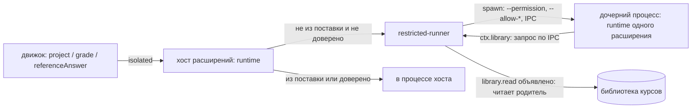

# Расширения

Расширение — каталог с манифестом `extension.json`, который добавляет приложению один или несколько вкладов (точек вклада): виды заданий, темы оформления, рендереры блоков кода в Markdown, правила оценки. Любой вид задания (SQL, выбор варианта, дальше — перетаскивание, сопоставление) — расширение: ядро движка знает только конверт «вид + spec + ответ → вердикт», содержимое видов ему непрозрачно. Расширение не из поставки изолировано: его код исполняется в ограниченном процессе с объявленными в манифесте `permissions`, а элементы интерфейса — в изолированной рамке (раздел «Права и изоляция»; пользователь может отключить расширение или доверить его). Решение и его причины — `docs/adr/0001-exercise-types-as-extensions.md`; форма расширения для авторов и принятый риск безопасности — `docs/adr/0002-authoring-simplicity-over-isolation.md`; что изоляция даёт и чего не даёт — `docs/adr/0003-isolation-of-third-party-extensions.md`.

## Что такое расширение

Каталог с манифестом `extension.json` и файлами вкладов. Расширение может вносить любую комбинацию из четырёх точек (`contributes.exerciseTypes`, `themes`, `markdownRenderers`, `gradePolicies`, раздел «Точки вклада»). Код для процесса расширений (`main`, ES-модуль `.mjs`) нужен только вкладам `exerciseTypes` и `gradePolicies`; у расширения из одних тем и рендереров содержимого `main` — `null`, и `src/main.ts` писать не нужно. Ниже — расширение с видом задания: JSON Schema для `spec` и ответа лежат в файлах или записаны прямо в манифесте, элемент ввода ответа (`renderer`) определяет custom element:

```
spirula.choice/
  extension.json
  main.mjs            # export default { activate(ctx), deactivate? }
  view.mjs            # определяет custom element ввода ответа
```

Минимальный манифест:

```json
{
  "id": "spirula.choice",
  "version": "1.0.0",
  "apiVersion": 1,
  "contributes": {
    "exerciseTypes": [
      {
        "id": "spirula.choice",
        "specSchema": { "type": "object", "required": ["options", "correct"] },
        "answerSchema": "./schema/answer.json"
      }
    ]
  }
}
```

Умолчания (`normalizeManifest`): `main` — `./main.mjs`; `renderer` — `./view.mjs`; `element` — `id` вида с точками, заменёнными на дефисы, и суффиксом `-answer` (`spirula.choice` → `spirula-choice-answer`). Явные значения важнее умолчаний. `specSchema` и `answerSchema` — либо путь к `.json` внутри каталога, либо непустая схема объектом. Формат один: после разбора манифест всегда нормализован.

Правила манифеста проверяет `parseManifest` (`packages/extension-host/src/manifest.ts`): `id` — `[a-z][a-z0-9-]*(.[a-z][a-z0-9-]*)*`; `id` вида равен `id` расширения или начинается с `<id>.`; `main` — `.mjs`, `renderer` — `.js` или `.mjs`; выведенный или явный `element` — допустимое имя тега (с дефисом); все пути относительные и внутри каталога; `apiVersion` — `1`. Неизвестные ключи `contributes` отклоняются: расширение с более новой точкой вклада не загрузится в старом приложении. Имя каталога равно `id`. Если файл по умолчанию (`main.mjs`, `view.mjs`) отсутствует, диагностика называет его и помечает как умолчание.

### Метаданные и совместимость

Необязательные поля манифеста: `name` (название, 1–80 символов), `description` (1–500), `author` (GitHub-логин), `platforms` (подмножество `darwin`, `linux`, `win32`, без повторов; нет ключа — любая платформа) и `minAppVersion` (semver `x.y.z`). Локально их можно не указывать; для публикации в каталог `name`, `description` и `author` обязательны (см. спеку `extension-install`). Нормализованный манифест и `ResolvedExtension` хранят `null` / `[]` вместо отсутствующих значений.

Совместимость проверяют `discoverExtensions` и `inspectExtensionDir` по `appVersion` и `platform` (по умолчанию `process.platform`). Расширение не загружается и получает состояние `invalid` с причиной `requires app >= X.Y.Z` или `not available on <platform>` (текст даёт `checkCompatibility` из `@spirula-app/extension-catalog`, его же используют выбор версии каталога и установщик). Версия приложения приходит из `EngineConfig.appVersion`; в несобранном приложении (режим разработки) она не задана, и `minAppVersion` не проверяется, пока не задан `SPIRULA_APP_VERSION=x.y.z`. `spirula-ext validate` версии приложения не знает и сообщает только об ошибках формы этих полей.

Типы и константы API — пакет `@spirula-app/extension-api`.

## Код расширения

Ниже — низкоуровневый API `ExtensionModule`. Писать расширение проще через SDK: `defineExtension` и `defineAnswerElement` (раздел «Как написать расширение»).

```ts
export default {
  activate(ctx) {
    ctx.registerExerciseType('spirula.choice', {
      project: ({ spec }) => ({ options: spec.options }), // публичный вид, без ключей ответов
      grade: ({ spec, answer, timeoutMs, authorMode }) => ({
        outcome: 'passed',
      }),
      referenceAnswer: ({ spec }) => spec.correct, // для проверки компилятором
    });
  },
};
```

`ctx` даёт `extensionId`, `logger`, `library` (`readText`/`stat` по библиотеке курсов) и `registerExerciseType`. Тип обязан быть объявлен в манифесте. Активация ленивая: по первому запросу к виду, отказ активации запоминается до перезапуска процесса.

`grade` возвращает `GradeResult`: `passed`, `failed` (вина ученика: `reason`, необязательно `feedback`, `detail` — только в режиме автора) или `error` (не вина ученика, попытка не тратится). Причины `failed`/`error` — открытые строки расширения; причины хоста (`timeout`, `resource_kill`, `worker_crash`, `internal`) порождает хост. Оценку FSRS считает ядро по `outcome` (`GradePolicy`); расширение её не выставляет.

## Элемент ввода ответа

Custom element (тег из `element`) в shadow DOM, определяется модулем `renderer`. Приложение выставляет свойства `view` (результат `project`), `value`, `disabled`, `verdict` и слушает события `spirula-answer-change` (`detail: { value, complete }`) и `spirula-answer-submit`. Кнопку «Проверить», подсказки и вердикт рисует приложение. Строки интерфейса приложения расширению недоступны: текст в элементе — данные задания или `aria-label` от приложения. Цвета берутся из CSS-переменных темы (`--v-theme-*`). Элемент не доверенного расширения исполняется в изолированной рамке, а не в окне приложения; контракт для автора тот же (раздел «Права и изоляция»).

## Процессы

```
renderer ── MessagePort ──► движок (utilityProcess «spirula-engine»)
                              │  ExerciseTypes: describe/validate (манифесты, Ajv)
                              │  project / grade / referenceAnswer — MessageChannelMain
                              ▼
                            хост расширений (utilityProcess «spirula-ext-host»)
                              │  runtime: activate, обработчики, воркеры (spirula.sql: fork)
```

- Канал движок ↔ хост расширений создаёт main (`host-link.ts`); при перезапуске любого процесса выдаётся новая пара портов.
- Клиент в движке (`createRemoteExerciseTypes`) держит дедлайн `timeoutMs + 2 с` на `grade`. Синхронный цикл в расширении не прервать, поэтому по дедлайну клиент отдаёт `error/timeout` и просит main перезапустить хост (`restart-ext-host`). Закрытие канала во время `grade` — `error/worker_crash`.
- Хост расширений перезапускается с backoff; после `MAX_CRASHES` падений за минуту перезапуск прекращается, приложение продолжает работать (карточки), вызовы видов получают `EXERCISE_TYPE_UNAVAILABLE`.

## Обнаружение

Два корня: расширения из поставки (`Resources/extensions`, в разработке — `<outRoot>/extensions`, read-only) и пользовательские (`<userData>/extensions`). Подкаталог с `extension.json` — расширение. Одинаковый `id` в обоих корнях — побеждает пользовательское (лог `info`). Повторный id вида, id темы или правила оценки, `element` или язык рендерера содержимого у разных расширений: первое выигрывает, второе пропускается целиком с предупреждением. Расширения подхватываются при запуске. «Настройки → Расширения» показывает каждое расширение, его вклады по точкам, заявленные разрешения, состояние изоляции и причину, по которой оно не загрузилось или было перекрыто. Отключённое пользователем расширение (переключатель «Включено») остаётся в списке с пометкой «Отключено» и не даёт ни видов заданий, ни тем, ни рендереров, ни правил оценки; расширения из поставки отключить нельзя.

Скрипт элемента отдаёт протокол `spirula-ext://<id>/<путь>`: только `.js`/`.mjs` внутри каталога расширения, пользовательский корень приоритетнее. CSP приложения содержит `script-src 'self' spirula-ext:`. Тот же протокол отдаёт страницу и загрузчик изолированной рамки (`__spirula/frame.html`, `__spirula/frame.js`).

## Авторинг

Упражнение объявляет вид в `engine.exercise`:

```yaml
engine:
  exercise:
    type: spirula.sql
    timeoutMs: 2000 # необязательно, по умолчанию 2000
    spec:
      fixture: fixtures/emp.sql
      expected: checks/join.csv
      reference: solutions/join.sql
```

Компилятор проверяет `spec` по схеме вида (`E_EXERCISE_SPEC`), сообщает о неизвестном виде (`W_UNKNOWN_EXERCISE_TYPE`) и прогоняет эталон: `referenceAnswer` → `grade` (`E_REFERENCE_FAILS`). CLI: `engine-cli validate <библиотека> --run-checks --extensions <каталог-корень>` (флаг повторяемый; без него проверки видов пропускаются, а `--run-checks` требует его).

Ответ ученика не попадает в журнал как есть: журнал хранит оценку и источник (`runner`); `spec` и ключи ответов в renderer не уходят — там только `task { type, timeoutMs, element, rendererUrl }` и `view` из `project`.

## Точки вклада

Манифест может содержать любые из четырёх ключей `contributes`; пропущенный ключ — пустой список. Неизвестный ключ отклоняется. Во всех точках с `id`: `id` равен id расширения или начинается с `<id расширения>.`. Каждый пример в этом разделе, помеченный строкой `Файл ...`, проверяется тестом `packages/extension-tools/test/docs-contributions.test.ts`.

### Виды заданий (`exerciseTypes`)

Что даёт ученику: новый способ отвечать на упражнение — свой элемент ввода и проверка кодом расширения (подробности — разделы выше и «Как написать расширение»). Упражнение выбирает вид в `engine.exercise.type`.

Файл `extension.json` (вид задания):

```json
{
  "id": "acme.echo",
  "version": "1.0.0",
  "apiVersion": 1,
  "contributes": {
    "exerciseTypes": [
      {
        "id": "acme.echo",
        "specSchema": {
          "type": "object",
          "required": ["expected"],
          "properties": { "expected": { "type": "string" } }
        },
        "answerSchema": { "type": "string" }
      }
    ]
  }
}
```

Код — `defineExtension({ exerciseTypes: { 'acme.echo': { project, grade, referenceAnswer? } } })`. Пользователь видит вид в экране упражнения (элемент ввода) и в «Настройки → Расширения». Нужен `main` и, если не задан иной, `view.mjs` с элементом.

### Темы (`themes`)

Что даёт ученику: плитка темы в «Настройки → Внешний вид» рядом с «Как в системе», «Светлая», «Тёмная». Тема — только данные, кода нет (`main` — `null`).

Файл `extension.json` (тема):

```json
{
  "id": "acme.midnight",
  "version": "1.0.0",
  "apiVersion": 1,
  "contributes": {
    "themes": [
      {
        "id": "acme.midnight",
        "label": "Полночь",
        "dark": true,
        "colors": {
          "background": "#101820",
          "surface": "#1B2733",
          "primary": "#FFB000",
          "on-primary": "#101820"
        },
        "variables": { "border-opacity": 0.2 }
      }
    ]
  }
}
```

Правила:

- `id` не из встроенных (`system`, `light`, `dark`); `label` — 1–60 символов; `dark` — тёмная ли тема (влияет на базовые цвета Vuetify).
- `colors` — непустой объект; значения — строго `#rrggbb` или `#rrggbbaa`. Разрешённые ключи (`THEME_COLOR_KEYS`): `background`, `surface`, `surface-bright`, `surface-light`, `surface-variant`, `on-background`, `on-surface`, `on-surface-variant`, `primary`, `on-primary`, `secondary`, `on-secondary`, `error`, `on-error`, `warning`, `on-warning`, `success`, `on-success`, `info`, `on-info`, `hero-start`, `hero-end`, `hero-contrast`. Любой другой ключ — ошибка манифеста.
- `variables` — необязательно. Разрешённые ключи (`THEME_VARIABLE_KEYS`): `border-color` (цвет `#rrggbb`/`#rrggbbaa`), `border-opacity`, `medium-emphasis-opacity`, `high-emphasis-opacity`, `disabled-opacity` (числа от 0 до 1).

### Рендереры содержимого (`markdownRenderers`)

Что даёт ученику: блоки кода ` ```<language> ` в тексте заданий и уроков выводит расширение (например, `spirula.math` рисует формулы из блоков ` ```math `). Без расширения такой блок остаётся обычным кодом.

Файл `extension.json` (рендерер содержимого):

```json
{
  "id": "acme.shout",
  "version": "1.0.0",
  "apiVersion": 1,
  "contributes": {
    "markdownRenderers": [{ "language": "shout" }]
  }
}
```

`language` — `[a-z][a-z0-9-]{0,31}`, один язык — одно расширение. `renderer` — путь к `.js`/`.mjs`, по умолчанию `./markdown.mjs` (в проекте `spirula-ext` — `src/markdown.ts`, браузерный бандл). Модуль — `export default` с методом `render(source, container, context)`; `defineMarkdownRenderer` задаёт эту форму:

Файл `src/markdown.ts` (рендерер содержимого):

```ts
import { defineMarkdownRenderer } from '@spirula-app/extension-sdk';

export default defineMarkdownRenderer((source, container) => {
  const pre = container.ownerDocument.createElement('pre');
  pre.textContent = source.toUpperCase();
  container.replaceChildren(pre);
});
```

`context` — `{ language, signal }`: по `signal` (структурный `AbortSignal`) отменяется вывод при уходе со страницы. Модуль загружается по `spirula-ext://`: у не доверенного расширения — в изолированной рамке (раздел «Права и изоляция»), у доверенного и из поставки — в окне приложения (общий JS-контекст, как у элементов ввода ответа). Если модуль не загрузился, не имеет `render()` или `render` бросил исключение, блок остаётся исходным текстом, под ним показывается заметка «Не удалось вывести блок…», страница работает дальше.

### Правила оценки (`gradePolicies`)

Что даёт ученику: в «Настройки → Обучение» (группа «Оценка», «Правило оценки») кроме встроенного `passAtN` появляется правило расширения. Оценка FSRS 1–5 за закрытую попытку считается выбранным правилом; выбор хранится в настройках.

Файл `extension.json` (правило оценки):

```json
{
  "id": "acme.policy",
  "version": "1.0.0",
  "apiVersion": 1,
  "contributes": {
    "gradePolicies": [{ "id": "acme.policy.generous", "label": "Щедрое" }]
  }
}
```

Файл `src/main.ts` (правило оценки):

```ts
import { defineExtension } from '@spirula-app/extension-sdk';

export default defineExtension({
  gradePolicies: {
    'acme.policy.generous': ({ verdicts, gaveUp }) => {
      if (gaveUp) return 1;
      return verdicts.some(({ outcome }) => outcome === 'passed') ? 5 : null;
    },
  },
});
```

Контракт:

- Вход — `GradePolicyInput`: `verdicts` (вердикты попытки по порядку: `{ outcome: 'passed' | 'failed' | 'error', reason? }`) и `gaveUp` («Сдаться»).
- Результат — целое 1–5 или `null` («правило оценки не ставит, нужна самооценка»); можно вернуть промис.
- `id` — не `passAtN` (занят встроенным правилом), `label` — 1–60 символов; правило в коде регистрируется под тем же `id` (`registerGradePolicy`, в SDK — ключ `gradePolicies` в `defineExtension`). Нужен `main`.
- Любой сбой правила — хост недоступен, исключение, дедлайн 2 с (`POLICY_DEADLINE_MS` в `packages/extension-host/src/client.ts`), результат вне 1–5 и не `null`, расширение пропало — даёт предупреждение в лог и оценку по `passAtN` (`resolveGradePolicy`); закрытие попытки не зависит от чужого кода. Если выбранное правило пропало, экран настроек показывает, что действует Pass@N.
- Проверить правило без приложения: `loadGradePolicy` из `@spirula-app/extension-sdk/testing`.

### Как добавить новую точку вклада

Для разработчиков платформы: точка — один модуль в `packages/extension-host/src/points/` (`ContributionPoint`: zod-схема записи, `normalize`, `check`, `resolve` файлов, `claims` для конфликтов, `needsMain`), который добавляется в список `CONTRIBUTION_POINTS` (`points/index.ts`); типы записи и ключ манифеста — в `@spirula-app/extension-api`. Если данные нужны окну приложения, добавьте поле в `ContributionsDto` и отдавайте его через порт `ExtensionRegistry.contributions()`; если нужен вызов кода расширения — метод в протоколе `protocol.ts`, регистрация в `ExtensionContext` и порт в `@spirula-app/engine`, как у `GradePolicies`.

## Права и изоляция

Расширение, которое поставили не мы, работает в рамках: его код исполняется в ограниченном процессе и получает только объявленные в манифесте возможности, а его элементы интерфейса живут в изолированной рамке и не видят окно приложения. Что это даёт и чего не даёт — `docs/adr/0003-isolation-of-third-party-extensions.md`; здесь — устройство и правила для авторов.

### Кто изолирован

Изолировано расширение, у которого происхождение не `bundled` и которому пользователь не выдал «Доверять» (`createExtensionPolicy`, `packages/extension-host/src/policy.ts`). Это пользовательские расширения и расширения из режима разработчика (`SPIRULA_DEV_EXTENSIONS`). Расширения из поставки не изолируются и не переключаются никогда, даже если их `id` попал в настройки, — поэтому `spirula.sql` может использовать воркеры и нативный модуль. Пользовательская копия с `id` расширения из поставки — обычное пользовательское расширение, изолированное.

Изоляция охватывает весь код расширения: `project`, `grade`, `referenceAnswer` и правила оценки исполняются в ограниченном процессе (запросы хосту несут флаг `isolated`, который движок вычисляет на каждый вызов), а элемент ввода ответа и рендерер содержимого — в рамке. Тема — данные, кода нет.

### Разрешения в манифесте

Манифест объявляет `permissions` — список из `EXTENSION_PERMISSIONS` (`@spirula-app/extension-api`). Дубли и неизвестные имена отклоняет `parseManifest`, `spirula-ext validate` печатает ошибку вида `permissions.0: …`. Без объявления у кода расширения нет ни одного разрешения. Разрешения применяются автоматически по объявленному, без запроса у пользователя; он видит их в «Настройки → Расширения» заранее.

Сопоставление «разрешение → возможность» — одна таблица, `packages/extension-host/src/permissions.ts`:

| Разрешение       | Что меняется в ограниченном процессе                                                                                                                    |
| ---------------- | ------------------------------------------------------------------------------------------------------------------------------------------------------- |
| `library.read`   | Флага Node нет: родитель отвечает на запросы прокси `ctx.library` (`readText`, `stat`). Без разрешения методы бросают `PermissionError`                 |
| `process.spawn`  | `--allow-child-process`: можно запускать процессы                                                                                                       |
| `worker.threads` | `--allow-worker`: можно создавать потоки                                                                                                                |
| `native.addons`  | `--allow-addons`: можно загружать нативные модули                                                                                                       |
| `network`        | Только объявляется и показывается пользователю; ничего не включает и не ограничивает: режим разрешений Node не умеет ограничивать сеть (см. «Пределы») |

Всегда, независимо от объявленного: `--permission` (до Node 22.13 — `--experimental-permission`), `--allow-fs-read=<каталог расширения>` и `--allow-fs-read=<каталог сборки дочернего процесса>` (оба — реальные пути, без символических ссылок), окружение из одной переменной `ELECTRON_RUN_AS_NODE=1` (переменных окружения приложения в процессе нет). Запись в файловую систему, чтение вне этих каталогов и всё, что не объявлено, даёт `ERR_ACCESS_DENIED` (или `PermissionError` у `ctx.library`) внутри расширения: вызов получает ошибку `handler-failed`, а проверка — вердикт `error`; движок, хост расширений и другие расширения продолжают работать.

Пример манифеста с разрешениями — вид задания, который читает файлы курса и запускает внешнюю программу:

Файл `extension.json` (вид задания с правами):

```json
{
  "id": "acme.lint",
  "version": "1.0.0",
  "apiVersion": 1,
  "permissions": ["library.read", "process.spawn"],
  "contributes": {
    "exerciseTypes": [
      {
        "id": "acme.lint",
        "specSchema": { "type": "object", "required": ["rules"] },
        "answerSchema": { "type": "string" }
      }
    ]
  }
}
```

### Как запускается ограниченный процесс

Код изолированного расширения исполняет `createRestrictedRunner` (`restricted-runner.ts`), а не хост расширений: рантайм хоста выбирает раннер по флагу `isolated` запроса и для расширений из поставки никогда не изолирует. Дочерний процесс — `process.execPath` с `ELECTRON_RUN_AS_NODE=1`, а не второй `utilityProcess`: флаг `--permission` через `utilityProcess.execArgv` в Electron 44 принимается, но не применяется (проверено экспериментом; см. «Пределы»). Вход процесса — `restricted/ext-restricted.mjs` (сборка `apps/desktop`, в упаковке — `extraResources`, вне asar: режим разрешений сверяет настоящие пути файлов).



- Процесс поднимается лениво, по первому запросу к расширению; один процесс обслуживает все его запросы. Сообщения `ready` ждём не дольше 10 с.
- Дедлайн вызова: `timeoutMs + 1500 мс` для `grade`, 10 с для остальных. По дедлайну процесс убивается (`SIGKILL`), вызов получает `handler-failed`, следующий запрос поднимает новый процесс. Так ограничен и синхронный цикл.
- Падение процесса: запросы в полёте получают `handler-failed`. Более 5 выходов за минуту — процесс перестаёт запускаться на минуту (`activation-failed`, в лог — `extension process keeps crashing`).
- `ctx.library` — прокси: запросы идут родителю по тому же IPC, родитель читает библиотеку сам (через порт, а не прямым доступом к файлам) и только если `library.read` объявлено; проверяет это и родитель, и дочерний процесс (ради понятной ошибки). Дать `--allow-fs-read=<корень библиотеки>` было бы хуже: это выдало бы чтение всего дерева, включая чужие курсы.
- Стандартный вывод и ошибки процесса попадают в лог хоста с `extensionId`.
- Режим меняется на лету: хост держит активации раздельно по режиму, смена режима освобождает активацию другого, перезапуск приложения не нужен.

### Изоляция интерфейса

Элемент ввода ответа и рендерер содержимого не доверенного расширения исполняются в `<iframe sandbox="allow-scripts">` без `allow-same-origin` (`IsolatedFrame.vue`, `ExerciseAnswer.vue`). У рамки непрозрачный origin: ни DOM приложения, ни `window.spirula`, ни его хранилище ей недоступны. Страницу рамки и её загрузчик отдаёт протокол `spirula-ext` (`spirula-ext://<id>/__spirula/frame.html`, `…/frame.js`; путь `__spirula/` в каталоге расширения не читается).

CSP страницы рамки (`FRAME_CSP`, `extension-assets.ts`): `default-src 'none'; script-src spirula-ext:; style-src 'unsafe-inline'; img-src data: blob:; font-src data:; connect-src 'none'; base-uri 'none'; form-action 'none'`. CSP окна приложения разрешает такие рамки через `frame-src spirula-ext:`.

Канал — только `postMessage`. Контракт сообщений описан в комментарии в начале [`frame-runtime.js`](../../apps/desktop/electron/main/shells/frame-runtime.js); сторона приложения — `apps/desktop/src/shared/lib/frame-bridge.ts`. Кратко:

- приложение → рамка (`{ spirula: 1, … }`): `init` (режим `answer` или `markdown`, адрес модуля), `props` (`view`, `value`, `disabled`, `verdict`), `theme`, `dispose`;
- рамка → приложение (`{ spirulaFrame: 1, … }`): `ready`, `answer-change`, `answer-submit`, `size`, `done`, `error`;
- порядок: приложение ждёт `ready`, затем шлёт `init`, `theme`, `props`; рамка принимает сообщения только от `window.parent`, приложение — только от `contentWindow` своей рамки и проверяет форму каждого сообщения (высота ограничена 4000 px, текст ошибки — 10 000 символов); модуль расширения рамка грузит только с `spirula-ext://<id>` самой рамки.

Что должен знать автор элемента ввода или рендерера:

- Тот же custom element и та же пара событий (`spirula-answer-change`, `spirula-answer-submit`), что и без изоляции: рантайм рамки создаёт элемент, выставляет свойства и пересылает события. Код менять не нужно, если он не обращается к окну приложения.
- Нет доступа к родительскому окну, `window.spirula` и хранилищу приложения, сети (`connect-src 'none'`); изображения — только `data:`/`blob:`, шрифты — `data:`, стили — встроенные, скрипты — только по `spirula-ext:`.
- Размер: рамка сообщает приложению высоту `body` через `ResizeObserver`; высота определяется содержимым (минимум 40 px у приложения), не задавайте её от высоты окна.
- Фокус и клавиатура: Tab входит в рамку и выходит из неё; Ctrl/⌘+Enter внутри рамки отправляет ответ (рантайм рамки шлёт `answer-submit`, повторная отправка от самого элемента в том же такте схлопывается).
- Тема: приложение передаёт вычисленные CSS-переменные `--v-*` и признак тёмной темы; используйте `rgb(var(--v-theme-on-surface))` и т. п., фон рамки прозрачный.

### Что видит пользователь

«Настройки → Расширения»: у каждого расширения не из поставки — заявленные разрешения (и пометка, что сеть не ограничивается), метка «Изолировано» или «Доверено» и два переключателя: «Включено» и «Доверять (без изоляции)». У расширений из поставки — «Встроенное», «Доверено» и нет переключателей. Состояние (отключено, доверено) хранится в `engine.db` и переживает перезапуск.

- Отключённое расширение не даёт ни видов заданий, ни тем, ни рендереров, ни правил оценки; в списке оно помечено «Отключено».
- «Доверять» снимает изоляцию кода и интерфейса: код исполняется в процессе хоста расширений, а элемент — в окне приложения (с доступом к `window.spirula`).
- Для кода изменение действует сразу, на новые проверки, без перезапуска приложения. Интерфейс, темы и рендереры читаются при загрузке окна: после переключения экран предлагает «Перезагрузить окно».

### Режим разработчика

Расширения из `SPIRULA_DEV_EXTENSIONS` изолированы так же, как пользовательские, и получают объявленные в манифесте разрешения автоматически, чтобы автор видел настоящее поведение. Если на время разработки нужна свобода (произвольные файлы, отладка), включите для расширения «Доверять» в «Настройки → Расширения» — переключатель есть и у расширения из разработки — и перезагрузите окно. Перед выпуском проверьте расширение без доверия: так его увидит пользователь.

### Пределы

Изоляция — ограничение ущерба, а не решение о доверии. Честно о том, чего она не даёт:

1. Режим разрешений Node — «ремень безопасности», а не граница безопасности против намеренно вредоносного кода: документация Node прямо говорит, что он не даёт гарантий при наличии вредоносного кода.
2. Сеть кода расширения не ограничивается: `network` — справочное разрешение, режим разрешений Node сеть не закрывает. Интерфейсу в рамке сеть, напротив, закрыта (`connect-src 'none'`).
3. Расход процессора и памяти ограничен только дедлайном вызова и убийством процесса, квот нет.
4. `--permission` применяется только потому, что дочерний процесс запускается как `ELECTRON_RUN_AS_NODE`; тот же флаг через `utilityProcess.execArgv` в Electron 44 молча игнорируется (проверено экспериментом). Поведение надо перепроверять при каждом обновлении Electron: стражи — сценарий смоука `isolated` и процессный тест `restricted.test.ts`.
5. CSP рамки `script-src spirula-ext:` допускает скрипты любого расширения (схема целиком, а не `spirula-ext://<свой id>`): рантайм рамки грузит только модуль своего расширения, но вредоносный модуль может сам вызвать `import()` чужого `spirula-ext://…/*.js`. Протокол отдаёт только `.js`/`.mjs`, поэтому данные и схемы чужих расширений так не прочитать.
6. Доверенные расширения и расширения из поставки не ограничены ничем.
7. Нет подписей, проверки издателей и обзора кода: пользователь сам решает, что поставить и кому доверять.

### Как проверить

- Unit (`packages/extension-host/test`): `permissions.test.ts` (флаги по разрешениям), `manifest.test.ts`, `policy.test.ts`, `runtime-isolation.test.ts` (выбор раннера по флагу `isolated`), `restricted-runner.test.ts` (ленивый запуск, дедлайн, цикл падений, прокси библиотеки). Мост и рантайм рамки — `apps/desktop/test/frame-bridge.test.ts`, `frame-runtime.test.ts`.
- Процессный: `packages/extension-host/test/restricted.test.ts` — настоящий дочерний процесс; «враждебное» расширение не может читать вне каталога, писать, запускать процессы и потоки; объявленные `process.spawn` и `library.read` работают; режим меняется на лету.
- e2e (`pnpm -F @spirula/desktop e2e`): `isolation-code.e2e.test.ts` (код в Electron, «Доверять» на лету), `isolation-ui.e2e.test.ts` (рамка `sandbox="allow-scripts"`, ввод, Ctrl+Enter, Tab, тема, рендерер содержимого, «Доверять»), `extension-settings.e2e.test.ts` (разрешения и метки, переключатели, отключение, доверие переживает перезапуск).
- Смоук `pnpm -F @spirula/desktop smoke`: сценарий `isolated` — упражнение «враждебного» расширения получает вердикт, в отчёте чтение `/etc/hosts`, запись, запуск процесса и поток запрещены, переменная `HOME` не видна.
- Документация: примеры этого раздела проверяет `packages/extension-tools/test/docs-contributions.test.ts`.

## Как написать расширение

Расширение — каталог с `extension.json`, кодом для процесса расширений (`main.mjs`) и, при необходимости, элементом ввода ответа (`view.mjs`). Писать его удобнее всего на TypeScript с [`@spirula-app/extension-sdk`](../../packages/extension-sdk/README.md), собирать — [`spirula-ext`](../../packages/extension-tools/README.md).

### Быстрый старт

Из корня репозитория:

```sh
pnpm create-extension ~/projects/acme-hello --local .
cd ~/projects/acme-hello
pnpm install
pnpm test
pnpm dev # spirula-ext build --watch
```

`--local <корень>` подключает `@spirula-app/extension-sdk` и `@spirula-app/extension-tools` как `link:<корень>/packages/...` (пакеты не опубликованы; без флага в `package.json` попадёт условное `^0.0.0`, и генератор напечатает предупреждение). Id по умолчанию — kebab-case имени каталога, задаётся флагом `--id`. Во втором терминале запустите приложение с каталогом сборки:

```sh
SPIRULA_DEV_EXTENSIONS=~/projects/acme-hello/dist-ext pnpm dev
```

Правка исходника пересобирает бандл, приложение перезапускает хосты и перезагружает окно (см. «Режим разработчика» ниже).

### Раскладка проекта

```
acme-hello/
  extension.json      # манифест
  src/main.ts         # defineExtension: код вида задания (utilityProcess)
  src/view.ts         # defineAnswerElement: элемент ввода ответа (окно)
  test/               # vitest: обработчик без приложения и элемент в happy-dom
  package.json  tsconfig.json  README.md  .gitignore
  dist-ext/acme.hello/  # результат сборки (extension.json, main.mjs, view.mjs)
```

Схемы `spec` и ответа можно писать объектами прямо в манифесте или путями к файлам в `schema/`; `main`, `renderer` и `element` по умолчанию — `./main.mjs`, `./view.mjs` и `<id без точек>-answer`.

### Минимальный манифест и код

Так выглядит проект, который создаёт генератор для id `acme.hello` (вид «text match»: ответ сравнивается с `spec.expected`).

`extension.json`:

```json
{
  "id": "acme.hello",
  "version": "0.1.0",
  "apiVersion": 1,
  "contributes": {
    "exerciseTypes": [
      {
        "id": "acme.hello",
        "specSchema": {
          "type": "object",
          "required": ["expected"],
          "additionalProperties": false,
          "properties": {
            "expected": { "type": "string", "minLength": 1 },
            "ignoreCase": { "type": "boolean" }
          }
        },
        "answerSchema": { "type": "string" }
      }
    ]
  }
}
```

`src/main.ts`:

```ts
import { defineExerciseType, defineExtension } from '@spirula-app/extension-sdk';

interface Spec {
  expected: string;
  ignoreCase?: boolean;
}

const matches = (answer: string, spec: Spec): boolean => {
  if (spec.ignoreCase === true) {
    return answer.toLowerCase() === spec.expected.toLowerCase();
  }
  return answer === spec.expected;
};

// схемы из extension.json уже проверили spec и ответ до вызова обработчиков
export default defineExtension({
  exerciseTypes: {
    'acme.hello': defineExerciseType<Spec, string, Record<string, never>>({
      project: () => ({}),
      grade: ({ spec, answer }) =>
        matches(answer, spec)
          ? { outcome: 'passed' }
          : { outcome: 'failed', reason: 'mismatch' },
      referenceAnswer: ({ spec }) => spec.expected,
    }),
  },
});
```

Элемент ввода `src/view.ts` — обычное поле `<input>` внутри shadow DOM (`defineAnswerElement('acme-hello-answer', mount)`); полный текст — в сгенерированном проекте.

### Шпаргалка по SDK

- `defineExtension({ exerciseTypes, activate?, deactivate? })` — готовый модуль расширения (`export default` в `main.ts`): виды из `exerciseTypes` регистрируются сами, при `deactivate` освобождаются.
- `defineExerciseType<Spec, Answer, View>({ project, grade, referenceAnswer? })` — типизированный обработчик. `project` отдаёт элементу публичный вид задания (без ключей ответа); `grade` возвращает `{ outcome: 'passed' }`, `{ outcome: 'failed', reason, detail? }` или `{ outcome: 'error', reason }`; `referenceAnswer` — эталон для проверки библиотеки компилятором. К моменту вызова `grade` `spec` и ответ уже проверены схемами из манифеста.
- `defineAnswerElement(tag, mount)` — определяет custom element с shadow DOM. `mount(api, props)` получает `api.root`, `api.label` (`aria-label` от приложения), `api.setAnswer(value, complete)` и `api.submit()`, возвращает `{ update(props), destroy?() }`; `props` — `view`, `value`, `disabled`, `verdict`.
- `@spirula-app/extension-sdk/testing`: `loadExerciseType(module, type)` запускает `project`/`grade`/`referenceAnswer` без приложения и проверяет форму результата; `createSchemaValidator(schema)` — проверка `spec` и ответа по своим схемам; `createMemoryLibrary(files)` — библиотека в памяти для видов, читающих файлы курса.

### Сборка и проверка

```sh
pnpm build     # spirula-ext build → dist-ext/<id>
pnpm validate  # spirula-ext validate dist-ext/<id>
pnpm test
```

`spirula-ext validate` разбирает манифест тем же кодом, что приложение (`inspectExtensionDir`), и завершается кодом 1 при проблеме. Подробности, дополнительные входы и внешние пакеты — в README `@spirula-app/extension-tools`.

### Режим разработчика

`SPIRULA_DEV_EXTENSIONS=<каталог>` добавляет корень расширений `dev` с наивысшим приоритетом. Для проекта это `<проект>/dist-ext`; `pnpm dev` (`spirula-ext build --watch`) пересобирает бандлы, приложение по правке файла перезапускает хосты и перезагружает окно. Манифест и схемы копируются один раз — после их правки перезапустите `pnpm dev`. Причины, по которым расширение не загрузилось, видны в «Настройки → Расширения». Расширение из разработки изолировано так же, как пользовательское, а объявленные `permissions` получает автоматически; чтобы снять изоляцию на время разработки, включите «Доверять» (раздел «Права и изоляция»).

### Установка вручную

Скопируйте `dist-ext/<id>` в `<userData>/extensions/` и перезапустите приложение. Совпадение id с расширением из поставки — побеждает пользовательское.

### Текущие ограничения

- Установки из приложения (по адресу, из архива, каталог) пока нет: расширение — каталог, установка — копирование.
- Код расширения не из поставки исполняется в ограниченном процессе: всё, что нужно сверх чтения собственных файлов, объявляйте в `permissions` манифеста — `library.read` (если код читает библиотеку курсов через `ctx.library`), `process.spawn` (дочерние процессы), `worker.threads` (потоки), `native.addons` (нативные модули), `network` (справочное: сеть не ограничивается). Без объявления вызов падает с `ERR_ACCESS_DENIED` или `PermissionError`, проверка — с вердиктом `error`. Подробности, пример манифеста и пределы — раздел «Права и изоляция».
- Точек вклада четыре (раздел «Точки вклада»); расширения подхватываются при запуске приложения.

## Расширения по умолчанию

`spirula.sql` (`packages/ext-sql`, раннер SQL из `@spirula-app/engine-sql-runner` в дочерних процессах, воркер `worker.mjs`) и `spirula.choice` (`packages/ext-choice`, один или несколько верных вариантов) — проекты `spirula-ext` (`extension.json`, `src/main.ts`, `src/view.ts`, `schema/`; у `ext-sql` ещё `spirula-ext.config.json` с воркером и внешним `better-sqlite3`): `pnpm -F <пакет> build` (`spirula-ext build`, `@spirula-app/extension-tools`) собирает тем же кодом, что и у сторонних авторов, каталог `dist-ext/<id>/`. Плагин Vite `spirula:extensions` (`apps/desktop/vite.config.ts`) собирает все `packages/ext-*` и копирует единственный каталог `dist-ext/<id>/` в `<outRoot>/extensions/<id>/` (имя каталога должно совпасть с `id` манифеста); упаковка кладёт его в `Resources/extensions` (`extraResources`).

`spirula.math` (`packages/ext-math`) — расширение без кода для процесса расширений: вклад `markdownRenderers` для языка `math` (блоки ` ```math `, формулы TeX рисует MathJax в SVG); собирается так же, как остальные.

## Границы

- Изоляция — ограничение ущерба, а не граница безопасности против злонамеренного кода: Node-процесс защищён режимом разрешений («ремень безопасности»), сеть кода не ограничивается, нет квот процессора и памяти, нет подписей и проверки издателей; доверенные расширения и расширения из поставки не ограничены (раздел «Права и изоляция», «Пределы»).
- Нет установки и скачивания: расширение = каталог, установка = копирование.
- Точек вклада четыре: `exerciseTypes`, `themes`, `markdownRenderers`, `gradePolicies`. Команды, панели, импорт/экспорт, планировщик и модель памяти расширениями не задаются.
- Изоляция реализована для расширений не из поставки (код — ограниченный процесс с `permissions`, интерфейс — рамка `sandbox="allow-scripts"`); вне её остаются расширения из поставки, доверенные расширения и всё перечисленное в пределах выше.
