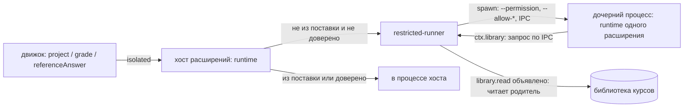
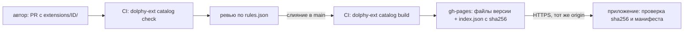

# Расширения

Расширение — каталог с манифестом `extension.json`, который добавляет приложению один или несколько вкладов (точек вклада): виды заданий, темы оформления, рендереры блоков кода в Markdown, правила оценки. Любой вид задания (SQL, выбор варианта, дальше — перетаскивание, сопоставление) — расширение: ядро движка знает только конверт «вид + spec + ответ → вердикт», содержимое видов ему непрозрачно. Расширение не из поставки изолировано: его код исполняется в ограниченном процессе с объявленными в манифесте `permissions`, а элементы интерфейса — в изолированной рамке (раздел «Права и изоляция»; пользователь может отключить расширение или доверить его). Решение и его причины — `docs/adr/0001-exercise-types-as-extensions.md`; форма расширения для авторов и принятый риск безопасности — `docs/adr/0002-authoring-simplicity-over-isolation.md`; что изоляция даёт и чего не даёт — `docs/adr/0003-isolation-of-third-party-extensions.md`.

Расширения можно ставить из каталога прямо в приложении («Настройки → Расширения → Каталог»): каталог — статический `index.json` и файлы версий на GitHub Pages, исходники и проверки лежат в репозитории `dolphy-app/dolphy-extensions`. Устройство, цепочка доверия и её пределы — раздел «Установка и каталог» и [ADR 0004](../adr/0004-extension-catalog.md).

## Что такое расширение

Каталог с манифестом `extension.json` и файлами вкладов. Расширение может вносить любую комбинацию из четырёх точек (`contributes.exerciseTypes`, `themes`, `markdownRenderers`, `gradePolicies`, раздел «Точки вклада»). Код для процесса расширений (`main`, ES-модуль `.mjs`) нужен только вкладам `exerciseTypes` и `gradePolicies`; у расширения из одних тем и рендереров содержимого `main` — `null`, и `src/main.ts` писать не нужно. Ниже — расширение с видом задания: JSON Schema для `spec` и ответа лежат в файлах или записаны прямо в манифесте, элемент ввода ответа (`renderer`) определяет custom element:

```
dolphy.choice/
  extension.json
  main.mjs            # export default { activate(ctx), deactivate? }
  view.mjs            # определяет custom element ввода ответа
```

Минимальный манифест:

```json
{
  "id": "dolphy.choice",
  "version": "1.0.0",
  "apiVersion": 1,
  "contributes": {
    "exerciseTypes": [
      {
        "id": "dolphy.choice",
        "specSchema": { "type": "object", "required": ["options", "correct"] },
        "answerSchema": "./schema/answer.json"
      }
    ]
  }
}
```

Умолчания (`normalizeManifest`): `main` — `./main.mjs`; `renderer` — `./view.mjs`; `element` — `id` вида с точками, заменёнными на дефисы, и суффиксом `-answer` (`dolphy.choice` → `dolphy-choice-answer`). Явные значения важнее умолчаний. `specSchema` и `answerSchema` — либо путь к `.json` внутри каталога, либо непустая схема объектом. Формат один: после разбора манифест всегда нормализован.

Правила манифеста проверяет `parseManifest` (`packages/extension-host/src/manifest.ts`): `id` — `[a-z][a-z0-9-]*(.[a-z][a-z0-9-]*)*`; `id` вида равен `id` расширения или начинается с `<id>.`; `main` — `.mjs`, `renderer` — `.js` или `.mjs`; выведенный или явный `element` — допустимое имя тега (с дефисом); все пути относительные и внутри каталога; `apiVersion` — `1`. Неизвестные ключи `contributes` отклоняются: расширение с более новой точкой вклада не загрузится в старом приложении. Имя каталога равно `id`. Если файл по умолчанию (`main.mjs`, `view.mjs`) отсутствует, диагностика называет его и помечает как умолчание.

### Метаданные и совместимость

Необязательные поля манифеста: `name` (название, 1–80 символов), `description` (1–500), `author` (GitHub-логин), `platforms` (подмножество `darwin`, `linux`, `win32`, без повторов; нет ключа — любая платформа) и `minAppVersion` (semver `x.y.z`). Локально их можно не указывать; для публикации в каталог `name`, `description` и `author` обязательны (проверка `dolphy-ext catalog check`, раздел «Установка и каталог»). Нормализованный манифест и `ResolvedExtension` хранят `null` / `[]` вместо отсутствующих значений.

Совместимость проверяют `discoverExtensions` и `inspectExtensionDir` по `appVersion` и `platform` (по умолчанию `process.platform`). Расширение не загружается и получает состояние `invalid` с причиной `requires app >= X.Y.Z` или `not available on <platform>` (текст даёт `checkCompatibility` из `@dolphy-app/extension-catalog`, его же используют выбор версии каталога и установщик). Версия приложения приходит из `EngineConfig.appVersion`; в несобранном приложении (режим разработки) она не задана, и `minAppVersion` не проверяется, пока не задан `DOLPHY_APP_VERSION=x.y.z`. `dolphy-ext validate` версии приложения не знает и сообщает только об ошибках формы этих полей.

Типы и константы API — пакет `@dolphy-app/extension-api`.

## Код расширения

Ниже — низкоуровневый API `ExtensionModule`. Писать расширение проще через SDK: `defineExtension` и `defineAnswerElement` (раздел «Как написать расширение»).

```ts
export default {
  activate(ctx) {
    ctx.registerExerciseType('dolphy.choice', {
      project: ({ spec }) => ({ options: spec.options }), // публичный вид, без ключей ответов
      grade: ({ spec, answer, timeoutMs, authorMode }) => ({
        outcome: 'passed',
      }),
      referenceAnswer: ({ spec }) => spec.correct, // для проверки компилятором
    });
  },
};
```

`ctx` даёт `extensionId`, `logger`, `library` (`readText`/`stat` по библиотеке курсов) и `registerExerciseType`. Тип обязан быть объявлен в манифесте. Активация ленивая: по первому запросу к виду, отказ активации запоминается до перезапуска процесса.

`grade` возвращает `GradeResult`: `passed`, `failed` (вина ученика: `reason`, необязательно `feedback`, `detail` — только в режиме автора) или `error` (не вина ученика, попытка не тратится). Причины `failed`/`error` — открытые строки расширения; причины хоста (`timeout`, `resource_kill`, `worker_crash`, `internal`) порождает хост. Оценку FSRS считает ядро по `outcome` (`GradePolicy`); расширение её не выставляет.

## Элемент ввода ответа

Custom element (тег из `element`) в shadow DOM, определяется модулем `renderer`. Приложение выставляет свойства `view` (результат `project`), `value`, `disabled`, `verdict` и слушает события `dolphy-answer-change` (`detail: { value, complete }`) и `dolphy-answer-submit`. Кнопку «Проверить», подсказки и вердикт рисует приложение. Строки интерфейса приложения расширению недоступны: текст в элементе — данные задания или `aria-label` от приложения. Цвета берутся из CSS-переменных темы (`--v-theme-*`). Элемент не доверенного расширения исполняется в изолированной рамке, а не в окне приложения; контракт для автора тот же (раздел «Права и изоляция»).

## Процессы

```
renderer ── MessagePort ──► движок (utilityProcess «dolphy-engine»)
                              │  ExerciseTypes: describe/validate (манифесты, Ajv)
                              │  project / grade / referenceAnswer — MessageChannelMain
                              ▼
                            хост расширений (utilityProcess «dolphy-ext-host»)
                              │  runtime: activate, обработчики, воркеры (dolphy.sql: fork)
```

- Канал движок ↔ хост расширений создаёт main (`host-link.ts`); при перезапуске любого процесса выдаётся новая пара портов.
- Клиент в движке (`createRemoteExerciseTypes`) держит дедлайн `timeoutMs + 2 с` на `grade`. Синхронный цикл в расширении не прервать, поэтому по дедлайну клиент отдаёт `error/timeout` и просит main перезапустить хост (`restart-ext-host`). Закрытие канала во время `grade` — `error/worker_crash`.
- Хост расширений перезапускается с backoff; после `MAX_CRASHES` падений за минуту перезапуск прекращается, приложение продолжает работать (карточки), вызовы видов получают `EXERCISE_TYPE_UNAVAILABLE`.
- Хост расширений сам расширения не ищет. Набор находит движок (`discoverExtensions`, изменяемый снимок `DiscoveryHolder`, общий у политики, каталога видов, реестра и установщика) и присылает его сообщением `replaceExtensions` по каналу: первым сообщением после каждого подключения порта (старт, перезапуск любой стороны) и после каждого применения изменений (`reload()`: установка, удаление, включение, доверие, правка в режиме разработчика). `ExtensionRuntime.replace` меняет каталог атомарно; вытесненные (удалённые или изменившиеся по версии, файлам `revision` или вкладам) расширения получают `deactivate()` после вызовов в полёте (не дольше `timeoutMs` вызова + 2 с), ограниченный процесс закрывается, следующий вызов получает свежий. Код в процессе хоста грузится с `?v=<n>` в URL: перезагружается входной модуль, его зависимости должны быть собраны в него. Событие `contributions-changed` движок публикует после подтверждения хоста; `ContributionsDto.generation` растёт при каждом применении и сбрасывается при запуске движка.

## Обнаружение

Два корня: расширения из поставки (`Resources/extensions`, в разработке — `<outRoot>/extensions`, read-only) и пользовательские (`<userData>/extensions`). Подкаталог с `extension.json` — расширение. Одинаковый `id` в обоих корнях — побеждает пользовательское (лог `info`). Повторный id вида, id темы или правила оценки, `element` или язык рендерера содержимого у разных расширений: первое выигрывает, второе пропускается целиком с предупреждением. Набор находится при запуске и перечитывается на лету при установке, удалении, включении, доверии и правке в режиме разработчика (раздел «Живое применение»). «Настройки → Расширения» показывает каждое расширение, его вклады по точкам, заявленные разрешения, состояние изоляции и причину, по которой оно не загрузилось или было перекрыто. Отключённое пользователем расширение (переключатель «Включено») остаётся в списке с пометкой «Отключено» и не даёт ни видов заданий, ни тем, ни рендереров, ни правил оценки; расширения из поставки отключить нельзя.

Имена подкаталогов, начинающиеся с точки, расширениями не считаются: `.staging`, `.trash` и `.catalog` — служебные каталоги установщика (раздел «Установка и каталог»). Если в каталоге расширения из пользовательского корня лежит `.dolphy-install.json`, расширение считается установленным из каталога: обнаружение читает файл, он нужен обновлениям и отзыву. Нет файла (расширение скопировано вручную) или он повреждён (предупреждение в логе) — расширение работает, но обновлений и отзыва не получает. Совместимость (`minAppVersion`, `platforms`) проверяется при обнаружении (раздел «Метаданные и совместимость»).

Скрипт элемента отдаёт протокол `dolphy-ext://<id>/<путь>`: только `.js`/`.mjs` внутри каталога расширения, пользовательский корень приоритетнее. CSP приложения содержит `script-src 'self' dolphy-ext:`. Тот же протокол отдаёт страницу и загрузчик изолированной рамки (`__dolphy/frame.html`, `__dolphy/frame.js`).

## Авторинг

Упражнение объявляет вид в `engine.exercise`:

```yaml
engine:
  exercise:
    type: dolphy.sql
    timeoutMs: 2000 # необязательно, по умолчанию 2000
    spec:
      fixture: fixtures/emp.sql
      expected: checks/join.csv
      reference: solutions/join.sql
```

Компилятор проверяет `spec` по схеме вида (`E_EXERCISE_SPEC`), сообщает о неизвестном виде (`W_UNKNOWN_EXERCISE_TYPE`) и прогоняет эталон: `referenceAnswer` → `grade` (`E_REFERENCE_FAILS`). CLI: `engine-cli validate <библиотека> --run-checks --extensions <каталог-корень>` (флаг повторяемый; без него проверки видов пропускаются, а `--run-checks` требует его).

Ответ ученика не попадает в журнал как есть: журнал хранит оценку и источник (`runner`); `spec` и ключи ответов в renderer не уходят — там только `task { type, timeoutMs, element, rendererUrl }` и `view` из `project`.

## Точки вклада

Манифест может содержать любые из четырёх ключей `contributes`; пропущенный ключ — пустой список. Неизвестный ключ отклоняется. Во всех точках с `id`: `id` равен id расширения или начинается с `<id расширения>.`. Каждый пример в этом разделе, помеченный строкой `Файл ...`, проверяется тестом `packages/extension-tools/test/docs-contributions.test.ts`.

### Виды заданий (`exerciseTypes`)

Что даёт ученику: новый способ отвечать на упражнение — свой элемент ввода и проверка кодом расширения (подробности — разделы выше и «Как написать расширение»). Упражнение выбирает вид в `engine.exercise.type`.

Файл `extension.json` (вид задания):

```json
{
  "id": "acme.echo",
  "version": "1.0.0",
  "apiVersion": 1,
  "contributes": {
    "exerciseTypes": [
      {
        "id": "acme.echo",
        "specSchema": {
          "type": "object",
          "required": ["expected"],
          "properties": { "expected": { "type": "string" } }
        },
        "answerSchema": { "type": "string" }
      }
    ]
  }
}
```

Код — `defineExtension({ exerciseTypes: { 'acme.echo': { project, grade, referenceAnswer? } } })`. Пользователь видит вид в экране упражнения (элемент ввода) и в «Настройки → Расширения». Нужен `main` и, если не задан иной, `view.mjs` с элементом.

### Темы (`themes`)

Что даёт ученику: плитка темы в «Настройки → Внешний вид» рядом с «Как в системе», «Светлая», «Тёмная». Тема — только данные, кода нет (`main` — `null`).

Файл `extension.json` (тема):

```json
{
  "id": "acme.midnight",
  "version": "1.0.0",
  "apiVersion": 1,
  "contributes": {
    "themes": [
      {
        "id": "acme.midnight",
        "label": "Полночь",
        "dark": true,
        "colors": {
          "background": "#101820",
          "surface": "#1B2733",
          "primary": "#FFB000",
          "on-primary": "#101820"
        },
        "variables": { "border-opacity": 0.2 }
      }
    ]
  }
}
```

Правила:

- `id` не из встроенных (`system`, `light`, `dark`); `label` — 1–60 символов; `dark` — тёмная ли тема (влияет на базовые цвета Vuetify).
- `colors` — непустой объект; значения — строго `#rrggbb` или `#rrggbbaa`. Разрешённые ключи (`THEME_COLOR_KEYS`): `background`, `surface`, `surface-bright`, `surface-light`, `surface-variant`, `on-background`, `on-surface`, `on-surface-variant`, `primary`, `on-primary`, `secondary`, `on-secondary`, `error`, `on-error`, `warning`, `on-warning`, `success`, `on-success`, `info`, `on-info`, `hero-start`, `hero-end`, `hero-contrast`. Любой другой ключ — ошибка манифеста.
- `variables` — необязательно. Разрешённые ключи (`THEME_VARIABLE_KEYS`): `border-color` (цвет `#rrggbb`/`#rrggbbaa`), `border-opacity`, `medium-emphasis-opacity`, `high-emphasis-opacity`, `disabled-opacity` (числа от 0 до 1).

### Рендереры содержимого (`markdownRenderers`)

Что даёт ученику: блоки кода ` ```<language> ` в тексте заданий и уроков выводит расширение (например, `dolphy.math` рисует формулы из блоков ` ```math `). Без расширения такой блок остаётся обычным кодом.

Файл `extension.json` (рендерер содержимого):

```json
{
  "id": "acme.shout",
  "version": "1.0.0",
  "apiVersion": 1,
  "contributes": {
    "markdownRenderers": [{ "language": "shout" }]
  }
}
```

`language` — `[a-z][a-z0-9-]{0,31}`, один язык — одно расширение. `renderer` — путь к `.js`/`.mjs`, по умолчанию `./markdown.mjs` (в проекте `dolphy-ext` — `src/markdown.ts`, браузерный бандл). Модуль — `export default` с методом `render(source, container, context)`; `defineMarkdownRenderer` задаёт эту форму:

Файл `src/markdown.ts` (рендерер содержимого):

```ts
import { defineMarkdownRenderer } from '@dolphy-app/extension-sdk';

export default defineMarkdownRenderer((source, container) => {
  const pre = container.ownerDocument.createElement('pre');
  pre.textContent = source.toUpperCase();
  container.replaceChildren(pre);
});
```

`context` — `{ language, signal }`: по `signal` (структурный `AbortSignal`) отменяется вывод при уходе со страницы. Модуль загружается по `dolphy-ext://`: у не доверенного расширения — в изолированной рамке (раздел «Права и изоляция»), у доверенного и из поставки — в окне приложения (общий JS-контекст, как у элементов ввода ответа). Если модуль не загрузился, не имеет `render()` или `render` бросил исключение, блок остаётся исходным текстом, под ним показывается заметка «Не удалось вывести блок…», страница работает дальше.

### Правила оценки (`gradePolicies`)

Что даёт ученику: в «Настройки → Обучение» (группа «Оценка», «Правило оценки») кроме встроенного `passAtN` появляется правило расширения. Оценка FSRS 1–5 за закрытую попытку считается выбранным правилом; выбор хранится в настройках.

Файл `extension.json` (правило оценки):

```json
{
  "id": "acme.policy",
  "version": "1.0.0",
  "apiVersion": 1,
  "contributes": {
    "gradePolicies": [{ "id": "acme.policy.generous", "label": "Щедрое" }]
  }
}
```

Файл `src/main.ts` (правило оценки):

```ts
import { defineExtension } from '@dolphy-app/extension-sdk';

export default defineExtension({
  gradePolicies: {
    'acme.policy.generous': ({ verdicts, gaveUp }) => {
      if (gaveUp) return 1;
      return verdicts.some(({ outcome }) => outcome === 'passed') ? 5 : null;
    },
  },
});
```

Контракт:

- Вход — `GradePolicyInput`: `verdicts` (вердикты попытки по порядку: `{ outcome: 'passed' | 'failed' | 'error', reason? }`) и `gaveUp` («Сдаться»).
- Результат — целое 1–5 или `null` («правило оценки не ставит, нужна самооценка»); можно вернуть промис.
- `id` — не `passAtN` (занят встроенным правилом), `label` — 1–60 символов; правило в коде регистрируется под тем же `id` (`registerGradePolicy`, в SDK — ключ `gradePolicies` в `defineExtension`). Нужен `main`.
- Любой сбой правила — хост недоступен, исключение, дедлайн 2 с (`POLICY_DEADLINE_MS` в `packages/extension-host/src/client.ts`), результат вне 1–5 и не `null`, расширение пропало — даёт предупреждение в лог и оценку по `passAtN` (`resolveGradePolicy`); закрытие попытки не зависит от чужого кода. Если выбранное правило пропало, экран настроек показывает, что действует Pass@N.
- Проверить правило без приложения: `loadGradePolicy` из `@dolphy-app/extension-sdk/testing`.

### Как добавить новую точку вклада

Для разработчиков платформы: точка — один модуль в `packages/extension-host/src/points/` (`ContributionPoint`: zod-схема записи, `normalize`, `check`, `resolve` файлов, `claims` для конфликтов, `needsMain`), который добавляется в список `CONTRIBUTION_POINTS` (`points/index.ts`); типы записи и ключ манифеста — в `@dolphy-app/extension-api`. Если данные нужны окну приложения, добавьте поле в `ContributionsDto` и отдавайте его через порт `ExtensionRegistry.contributions()`; если нужен вызов кода расширения — метод в протоколе `protocol.ts`, регистрация в `ExtensionContext` и порт в `@dolphy-app/engine`, как у `GradePolicies`.

## Права и изоляция

Расширение, которое поставили не мы, работает в рамках: его код исполняется в ограниченном процессе и получает только объявленные в манифесте возможности, а его элементы интерфейса живут в изолированной рамке и не видят окно приложения. Что это даёт и чего не даёт — `docs/adr/0003-isolation-of-third-party-extensions.md`; здесь — устройство и правила для авторов.

### Кто изолирован

Изолировано расширение, у которого происхождение не `bundled` и которому пользователь не выдал «Доверять» (`createExtensionPolicy`, `packages/extension-host/src/policy.ts`). Это пользовательские расширения и расширения из режима разработчика (`DOLPHY_DEV_EXTENSIONS`). Расширения из поставки не изолируются и не переключаются никогда, даже если их `id` попал в настройки, — поэтому `dolphy.sql` может использовать воркеры и нативный модуль. Пользовательская копия с `id` расширения из поставки — обычное пользовательское расширение, изолированное.

Изоляция охватывает весь код расширения: `project`, `grade`, `referenceAnswer` и правила оценки исполняются в ограниченном процессе (запросы хосту несут флаг `isolated`, который движок вычисляет на каждый вызов), а элемент ввода ответа и рендерер содержимого — в рамке. Тема — данные, кода нет.

### Разрешения в манифесте

Манифест объявляет `permissions` — список из `EXTENSION_PERMISSIONS` (`@dolphy-app/extension-api`). Дубли и неизвестные имена отклоняет `parseManifest`, `dolphy-ext validate` печатает ошибку вида `permissions.0: …`. Без объявления у кода расширения нет ни одного разрешения. Разрешения применяются автоматически по объявленному, без запроса у пользователя; он видит их в «Настройки → Расширения» заранее.

Сопоставление «разрешение → возможность» — одна таблица, `packages/extension-host/src/permissions.ts`:

| Разрешение       | Что меняется в ограниченном процессе                                                                                                                    |
| ---------------- | ------------------------------------------------------------------------------------------------------------------------------------------------------- |
| `library.read`   | Флага Node нет: родитель отвечает на запросы прокси `ctx.library` (`readText`, `stat`). Без разрешения методы бросают `PermissionError`                 |
| `process.spawn`  | `--allow-child-process`: можно запускать процессы                                                                                                       |
| `worker.threads` | `--allow-worker`: можно создавать потоки                                                                                                                |
| `native.addons`  | `--allow-addons`: можно загружать нативные модули                                                                                                       |
| `network`        | Только объявляется и показывается пользователю; ничего не включает и не ограничивает: режим разрешений Node не умеет ограничивать сеть (см. «Пределы») |

Всегда, независимо от объявленного: `--permission` (до Node 22.13 — `--experimental-permission`), `--allow-fs-read=<каталог расширения>` и `--allow-fs-read=<каталог сборки дочернего процесса>` (оба — реальные пути, без символических ссылок), окружение из одной переменной `ELECTRON_RUN_AS_NODE=1` (переменных окружения приложения в процессе нет). Запись в файловую систему, чтение вне этих каталогов и всё, что не объявлено, даёт `ERR_ACCESS_DENIED` (или `PermissionError` у `ctx.library`) внутри расширения: вызов получает ошибку `handler-failed`, а проверка — вердикт `error`; движок, хост расширений и другие расширения продолжают работать.

Пример манифеста с разрешениями — вид задания, который читает файлы курса и запускает внешнюю программу:

Файл `extension.json` (вид задания с правами):

```json
{
  "id": "acme.lint",
  "version": "1.0.0",
  "apiVersion": 1,
  "permissions": ["library.read", "process.spawn"],
  "contributes": {
    "exerciseTypes": [
      {
        "id": "acme.lint",
        "specSchema": { "type": "object", "required": ["rules"] },
        "answerSchema": { "type": "string" }
      }
    ]
  }
}
```

### Как запускается ограниченный процесс

Код изолированного расширения исполняет `createRestrictedRunner` (`restricted-runner.ts`), а не хост расширений: рантайм хоста выбирает раннер по флагу `isolated` запроса и для расширений из поставки никогда не изолирует. Дочерний процесс — `process.execPath` с `ELECTRON_RUN_AS_NODE=1`, а не второй `utilityProcess`: флаг `--permission` через `utilityProcess.execArgv` в Electron 44 принимается, но не применяется (проверено экспериментом; см. «Пределы»). Вход процесса — `restricted/ext-restricted.mjs` (сборка `apps/desktop`, в упаковке — `extraResources`, вне asar: режим разрешений сверяет настоящие пути файлов).



- Процесс поднимается лениво, по первому запросу к расширению; один процесс обслуживает все его запросы. Сообщения `ready` ждём не дольше 10 с.
- Дедлайн вызова: `timeoutMs + 1500 мс` для `grade`, 10 с для остальных. По дедлайну процесс убивается (`SIGKILL`), вызов получает `handler-failed`, следующий запрос поднимает новый процесс. Так ограничен и синхронный цикл.
- Падение процесса: запросы в полёте получают `handler-failed`. Более 5 выходов за минуту — процесс перестаёт запускаться на минуту (`activation-failed`, в лог — `extension process keeps crashing`).
- `ctx.library` — прокси: запросы идут родителю по тому же IPC, родитель читает библиотеку сам (через порт, а не прямым доступом к файлам) и только если `library.read` объявлено; проверяет это и родитель, и дочерний процесс (ради понятной ошибки). Дать `--allow-fs-read=<корень библиотеки>` было бы хуже: это выдало бы чтение всего дерева, включая чужие курсы.
- Стандартный вывод и ошибки процесса попадают в лог хоста с `extensionId`.
- Режим меняется на лету: хост держит активации раздельно по режиму, смена режима освобождает активацию другого, перезапуск приложения не нужен.

### Изоляция интерфейса

Элемент ввода ответа и рендерер содержимого не доверенного расширения исполняются в `<iframe sandbox="allow-scripts">` без `allow-same-origin` (`IsolatedFrame.vue`, `ExerciseAnswer.vue`). У рамки непрозрачный origin: ни DOM приложения, ни `window.dolphy`, ни его хранилище ей недоступны. Страницу рамки и её загрузчик отдаёт протокол `dolphy-ext` (`dolphy-ext://<id>/__dolphy/frame.html`, `…/frame.js`; путь `__dolphy/` в каталоге расширения не читается).

CSP страницы рамки (`FRAME_CSP`, `extension-assets.ts`): `default-src 'none'; script-src dolphy-ext:; style-src 'unsafe-inline'; img-src data: blob:; font-src data:; connect-src 'none'; base-uri 'none'; form-action 'none'`. CSP окна приложения разрешает такие рамки через `frame-src dolphy-ext:`.

Канал — только `postMessage`. Контракт сообщений описан в комментарии в начале [`frame-runtime.js`](../../apps/desktop/electron/main/shells/frame-runtime.js); сторона приложения — `apps/desktop/src/shared/lib/frame-bridge.ts`. Кратко:

- приложение → рамка (`{ dolphy: 1, … }`): `init` (режим `answer` или `markdown`, адрес модуля), `props` (`view`, `value`, `disabled`, `verdict`), `theme`, `dispose`;
- рамка → приложение (`{ dolphyFrame: 1, … }`): `ready`, `answer-change`, `answer-submit`, `size`, `done`, `error`;
- порядок: приложение ждёт `ready`, затем шлёт `init`, `theme`, `props`; рамка принимает сообщения только от `window.parent`, приложение — только от `contentWindow` своей рамки и проверяет форму каждого сообщения (высота ограничена 4000 px, текст ошибки — 10 000 символов); модуль расширения рамка грузит только с `dolphy-ext://<id>` самой рамки.

Что должен знать автор элемента ввода или рендерера:

- Тот же custom element и та же пара событий (`dolphy-answer-change`, `dolphy-answer-submit`), что и без изоляции: рантайм рамки создаёт элемент, выставляет свойства и пересылает события. Код менять не нужно, если он не обращается к окну приложения.
- Нет доступа к родительскому окну, `window.dolphy` и хранилищу приложения, сети (`connect-src 'none'`); изображения — только `data:`/`blob:`, шрифты — `data:`, стили — встроенные, скрипты — только по `dolphy-ext:`.
- Размер: рамка сообщает приложению высоту `body` через `ResizeObserver`; высота определяется содержимым (минимум 40 px у приложения), не задавайте её от высоты окна.
- Фокус и клавиатура: Tab входит в рамку и выходит из неё; Ctrl/⌘+Enter внутри рамки отправляет ответ (рантайм рамки шлёт `answer-submit`, повторная отправка от самого элемента в том же такте схлопывается).
- Тема: приложение передаёт вычисленные CSS-переменные `--v-*` и признак тёмной темы; используйте `rgb(var(--v-theme-on-surface))` и т. п., фон рамки прозрачный.

### Что видит пользователь

«Настройки → Расширения»: у каждого расширения не из поставки — заявленные разрешения (и пометка, что сеть не ограничивается), метка «Изолировано» или «Доверено» и два переключателя: «Включено» и «Доверять (без изоляции)». У расширений из поставки — «Встроенное», «Доверено» и нет переключателей. Состояние (отключено, доверено) хранится в `engine.db` и переживает перезапуск.

- Отключённое расширение не даёт ни видов заданий, ни тем, ни рендереров, ни правил оценки; в списке оно помечено «Отключено».
- «Доверять» снимает изоляцию кода и интерфейса: код исполняется в процессе хоста расширений, а элемент — в окне приложения (с доступом к `window.dolphy`).
- Изменение действует сразу и для кода (новые проверки), и для интерфейса: плитки тем и рендереры содержимого обновляются без перезагрузки окна и без перезапуска приложения (раздел «Живое применение»). Исключение одно: элемент ввода доверенного расширения, уже определённый в окне, остаётся прежним до перезагрузки (баннер «Обновление применится после перезагрузки окна»).

### Режим разработчика

Расширения из `DOLPHY_DEV_EXTENSIONS` изолированы так же, как пользовательские, и получают объявленные в манифесте разрешения автоматически, чтобы автор видел настоящее поведение. Если на время разработки нужна свобода (произвольные файлы, отладка), включите для расширения «Доверять» в «Настройки → Расширения» — переключатель есть и у расширения из разработки; изменение действует сразу. Перед выпуском проверьте расширение без доверия: так его увидит пользователь.

### Пределы

Изоляция — ограничение ущерба, а не решение о доверии. Честно о том, чего она не даёт:

1. Режим разрешений Node — «ремень безопасности», а не граница безопасности против намеренно вредоносного кода: документация Node прямо говорит, что он не даёт гарантий при наличии вредоносного кода.
2. Сеть кода расширения не ограничивается: `network` — справочное разрешение, режим разрешений Node сеть не закрывает. Интерфейсу в рамке сеть, напротив, закрыта (`connect-src 'none'`).
3. Расход процессора и памяти ограничен только дедлайном вызова и убийством процесса, квот нет.
4. `--permission` применяется только потому, что дочерний процесс запускается как `ELECTRON_RUN_AS_NODE`; тот же флаг через `utilityProcess.execArgv` в Electron 44 молча игнорируется (проверено экспериментом). Поведение надо перепроверять при каждом обновлении Electron: стражи — сценарий смоука `isolated` и процессный тест `restricted.test.ts`.
5. CSP рамки `script-src dolphy-ext:` допускает скрипты любого расширения (схема целиком, а не `dolphy-ext://<свой id>`): рантайм рамки грузит только модуль своего расширения, но вредоносный модуль может сам вызвать `import()` чужого `dolphy-ext://…/*.js`. Протокол отдаёт только `.js`/`.mjs`, поэтому данные и схемы чужих расширений так не прочитать.
6. Доверенные расширения и расширения из поставки не ограничены ничем.
7. Нет подписей, проверки издателей и обзора кода: пользователь сам решает, что поставить и кому доверять.

### Как проверить

- Unit (`packages/extension-host/test`): `permissions.test.ts` (флаги по разрешениям), `manifest.test.ts`, `policy.test.ts`, `runtime-isolation.test.ts` (выбор раннера по флагу `isolated`), `restricted-runner.test.ts` (ленивый запуск, дедлайн, цикл падений, прокси библиотеки). Мост и рантайм рамки — `apps/desktop/test/frame-bridge.test.ts`, `frame-runtime.test.ts`.
- Процессный: `packages/extension-host/test/restricted.test.ts` — настоящий дочерний процесс; «враждебное» расширение не может читать вне каталога, писать, запускать процессы и потоки; объявленные `process.spawn` и `library.read` работают; режим меняется на лету.
- e2e (`pnpm -F @dolphy/desktop e2e`): `isolation-code.e2e.test.ts` (код в Electron, «Доверять» на лету), `isolation-ui.e2e.test.ts` (рамка `sandbox="allow-scripts"`, ввод, Ctrl+Enter, Tab, тема, рендерер содержимого, «Доверять» без перезагрузки окна), `extension-settings.e2e.test.ts` (разрешения и метки, переключатели без перезагрузки окна, отключение, доверие переживает перезапуск).
- Смоук `pnpm -F @dolphy/desktop smoke`: сценарий `isolated` — упражнение «враждебного» расширения получает вердикт, в отчёте чтение `/etc/hosts`, запись, запуск процесса и поток запрещены, переменная `HOME` не видна.
- Документация: примеры этого раздела проверяет `packages/extension-tools/test/docs-contributions.test.ts`.

## Установка и каталог

Расширения из каталога ставятся в `<userData>/extensions/<id>` — туда же, куда копируются вручную, поэтому для движка это обычное пользовательское расширение (изоляция, отключение, «Доверять» — как в разделе «Права и изоляция»). Каталог — не сервер, а статические файлы: индекс `index.json` и файлы версий. Решение и его причины — [ADR 0004](../adr/0004-extension-catalog.md).

### Для пользователя

1. «Настройки → Расширения → Каталог»: список из индекса. Поиск работает по названию, id и описанию, есть фильтр по виду вклада. Расширения, недоступные на текущей платформе, скрыты. Карточка показывает название, id, версию, автора, описание, разрешения и вклады.
2. «Установить»: диалог повторяет название, версию, разрешения и то, что расширение работает в изоляции. Приложение скачивает файлы, проверяет их и ставит расширение; любая ошибка оставляет прежнее состояние нетронутым.
3. Расширение работает сразу после ответа об успехе: диалог пишет «Установлено. Расширение уже работает.», темы появляются в «Настройки → Внешний вид», вид задания доступен новой попытке, рендерер действует на выводимые после этого блоки, правило оценки видно в «Настройки → Обучение». Окно не перезагружается, хосты не перезапускаются (раздел «Живое применение»). Единственное исключение — обновление доверенного расширения, чей элемент ввода уже определён в окне: настройки показывают «Обновление применится после перезагрузки окна» с кнопкой «Перезагрузить окно».
4. Обновления. При запуске приложение в фоне (не чаще раза в 24 часа) перечитывает индекс и сравнивает установленные из каталога расширения с ним; запуск не ждёт результата. Если есть новее совместимая версия, экран показывает «Доступно обновлений: N», у расширения — «Обновить до vX.Y.Z», у списка — «Обновить все». Ничего не заменяется без нажатия. Флажок «Проверять обновления при запуске» (по умолчанию включён) хранится в настройках движка; при выключенном флажке проверки на старте нет, но вкладка «Каталог» читает индекс при открытии (кэш моложе 10 минут не перезапрашивается; «Обновить каталог» запрашивает принудительно).
5. «Удалить» доступно для расширений из пользовательского корня (`origin = user`), в том числе скопированных вручную: каталог уходит в `.trash`, данные курсов и прогресс не затрагиваются. Расширения из поставки и из режима разработчика удалить нельзя. Расширение, его темы, рендереры и правила пропадают сразу; если выбранная тема принадлежала ему, окно сразу показывает «Как в системе» (сохранённый выбор не меняется и возвращается вместе с расширением), а правило оценки удалённого расширения даёт «Pass@N» с пометкой в «Настройки → Обучение».
6. Отзыв. Если установленная версия попала в `revoked` индекса, расширение отключается: в списке «Расширение отозвано» с причиной, включить его нельзя, пока не выйдет исправленная версия. Отзыв действует только на установленные из каталога расширения; скопированные вручную и поставляемые он не затрагивает.
7. Офлайн. Индекс кэшируется на диске с ETag. Без сети вкладка показывает последний кэш и сообщение «Нет связи с каталогом. Показаны сохранённые данные»; без кэша — состояние ошибки с «Повторить». Установка без сети невозможна, установленные расширения работают всегда.

Расширение, которое не подходит (`minAppVersion` новее приложения, другая платформа, другая версия API, отозвано), в каталоге остаётся видимым с причиной и неактивной кнопкой; если старше есть совместимая версия, предлагается «Установить vX.Y.Z (совместимая)».

### Как это устроено

Код — пакеты `@dolphy-app/extension-catalog` (индекс и выбор версии, без Node-зависимостей) и `@dolphy-app/extension-install` (Node-адаптер порта `ExtensionInstaller`), сервис `extensions.catalog|install|uninstall|updates|setCheckUpdates` и события `extensions-changed` и `contributions-changed` движка (контракт v9).

**Индекс.** Один JSON, `schemaVersion: 1`; разбирает его `parseIndex`, тот же код использует приложение и сборщик каталога. У расширения — не более 5 последних версий, от новой к старой; `baseUrl` относительный (от адреса `index.json`), `source` — https-адрес исходников; `revoked` — список отзыва.

Файл `extension.json` (расширение для каталога):

```json
{
  "id": "acme.dawn",
  "version": "1.1.0",
  "apiVersion": 1,
  "name": "Рассвет ACME",
  "description": "Светлая тема с тёплым акцентом",
  "author": "acme-dev",
  "platforms": ["darwin", "linux", "win32"],
  "minAppVersion": "0.4.0",
  "contributes": {
    "themes": [
      {
        "id": "acme.dawn",
        "label": "Рассвет ACME",
        "dark": false,
        "colors": { "background": "#FBF6F0", "primary": "#B45309" }
      }
    ]
  }
}
```

Файл `index.json` (индекс каталога):

```json
{
  "schemaVersion": 1,
  "generatedAt": "2026-10-01T09:30:00.000Z",
  "extensions": [
    {
      "id": "acme.dawn",
      "name": "Рассвет ACME",
      "description": "Светлая тема с тёплым акцентом",
      "author": "acme-dev",
      "source": "https://github.com/dolphy-app/dolphy-extensions/tree/main/extensions/acme.dawn",
      "platforms": ["darwin", "linux", "win32"],
      "contributes": {
        "exerciseTypes": [],
        "themes": ["acme.dawn"],
        "markdownRenderers": [],
        "gradePolicies": []
      },
      "versions": [
        {
          "version": "1.1.0",
          "apiVersion": 1,
          "minAppVersion": "0.4.0",
          "permissions": [],
          "publishedAt": "2026-10-01T09:30:00.000Z",
          "baseUrl": "extensions/acme.dawn/1.1.0/",
          "files": [
            {
              "path": "README.md",
              "size": 834,
              "sha256": "3bf4971765d9c8fe89e2bae11812e20097be1345a1d50258d77b2c3e33fa320a"
            },
            {
              "path": "extension.json",
              "size": 1140,
              "sha256": "6f3d43a8af2a803f787faf18df9e9085ee6c7873875cfaa6734c00bf3fe1affd"
            }
          ]
        },
        {
          "version": "1.0.0",
          "apiVersion": 1,
          "minAppVersion": null,
          "permissions": [],
          "publishedAt": "2026-09-20T12:00:00.000Z",
          "baseUrl": "extensions/acme.dawn/1.0.0/",
          "files": [
            {
              "path": "README.md",
              "size": 790,
              "sha256": "b83f1a6b56e21e4bd08bb7da26a30db2a7818cfb101b45776d83e57b1a36b911"
            },
            {
              "path": "extension.json",
              "size": 1098,
              "sha256": "6fbf60876915ef828b58eeb0ed19bd82be66be6815574ecf11a30229306dd354"
            }
          ]
        }
      ]
    }
  ],
  "revoked": [
    {
      "id": "acme.dawn",
      "versions": "<1.0.1",
      "reason": "Версия 1.0.0 подменяла цвета ошибок"
    }
  ]
}
```

Оба примера проверяет `packages/extension-tools/test/docs-contributions.test.ts`: манифест — сборкой и `dolphy-ext validate`, индекс — `parseIndex`.

**Файлы версии.** Набор файлов, а не архив: то, что выдаёт `dolphy-ext build` (`extension.json`, `main.mjs`, `view.mjs`, схемы), плюс `README.md`. У каждого файла в индексе — `path`, `size` и `sha256` (строчный hex). Допустимы расширения `json`, `js`, `mjs`, `md`, `txt`; сегменты пути — `[A-Za-z0-9_-][A-Za-z0-9._-]*` без зарезервированных имён устройств Windows; в версии обязателен `extension.json`, не более 50 файлов и 10 МБ суммарно. Адрес файла — `baseUrl + path` относительно адреса индекса, то есть всегда на origin индекса.

**Выбор версии** (`resolveVersion`, `latestUpdate`): берётся новейшая версия, у которой `apiVersion` равен поддерживаемому приложением, `minAppVersion` не выше версии приложения, а сама версия не отозвана (`revoked[].versions` — диапазон вроде `<1.2.0` или `1.1.0`); `platforms` записи должны включать текущую платформу (пустой список — любая). Если новейшая не подходит, причина (`platform`, `api`, `app`, `revoked`) показывается в каталоге, а старшая совместимая версия предлагается как запасная. В несобранном приложении версия не задана, и `minAppVersion` не проверяется (`DOLPHY_APP_VERSION`, раздел «Метаданные и совместимость»).

**Каталог установки и служебные каталоги** (все внутри `<userData>/extensions`, точка в имени — не расширение):

| Путь                | Что                                                                                                                                                      |
| ------------------- | -------------------------------------------------------------------------------------------------------------------------------------------------------- |
| `<id>/`             | установленное расширение; рядом с `extension.json` — `.dolphy-install.json`                                                                             |
| `.catalog/`         | кэш индекса (`index.json` и ETag)                                                                                                                        |
| `.staging/<id>-<r>/` | скачанное и проверяемое; после установки удаляется, незавершённое старше часа убирается при запуске                                                     |
| `.trash/`           | прежняя версия при замене (`<id>-<время>`) и удалённые расширения (`removed/`); при запуске прерванная замена восстанавливается, остальное очищается    |

**Метаданные установки.** `<id>/.dolphy-install.json` — `{ catalogUrl, version, installedAt }` (`INSTALL_META_FILE` в `@dolphy-app/extension-catalog`). Обновления и отзыв действуют только на расширения, у которых файл есть и `catalogUrl` совпадает с текущим каталогом. Установка поверх каталога без такого файла отвергается (`conflict`): свои файлы пользователь молча не теряет. Расширения из поставки и режима разработчика каталог заменить не может.

**Атомарная замена с откатом.** Файлы скачиваются в `.staging/<id>-<случайный суффикс>/`, проверяются (ниже), туда же пишется `.dolphy-install.json`. Затем прежний каталог переименовывается в `.trash/`, стейджинг — на его место; если второй шаг не удался, прежний каталог возвращается (`swapDirectory`). Если приложение убили между двумя переименованиями, при следующем запуске `ready()` возвращает каталог из `.trash/<id>-<время>` на место (берётся самая новая запись с читаемым `extension.json`), а удалённые расширения лежат в `.trash/removed/` и не воскресают. Любая ошибка до замены оставляет прежнее состояние нетронутым.

**Проверки безопасности:**

- Приложение ходит только на адрес каталога и адреса файлов того же origin; редиректы (не более 3) проверяются на тот же origin, иначе отказ. Сеть — только из процесса движка, CSP окна не меняется. Запросы идут с `User-Agent: dolphy/<версия приложения>`.
- Таймаут запроса вместе с телом — 15 с; индекс — не более 5 МБ; файл — не больше заявленного в индексе `size`; версия — не более 50 файлов и 10 МБ.
- Для каждого файла совпадают размер и `sha256`; иначе отказ `integrity`.
- Скачанный каталог проверяется как обычное расширение (`inspectExtensionDir`, включая `minAppVersion` и `platforms`), а его `id`, `version`, `permissions` и вклады должны совпадать с записью индекса.
- Индекс старее закэшированного (`generatedAt`) отвергается: это защита от отката к старому списку отзыва.
- Одна операция над расширением за раз.

**Чего нет.** Подписи индекса и файлов ключом автора или организации, проверки издателя, автоматической замены кода без нажатия. `sha256` в индексе лежит на том же origin, что и файлы: он защищает от повреждения и частичной подмены файлов, но не от того, у кого есть запись в публикацию каталога (см. ниже).

### Репозиторий каталога и цепочка доверия

Каталог ведёт репозиторий `dolphy-app/dolphy-extensions`:

| Что                            | Где                                                                |
| ------------------------------ | ------------------------------------------------------------------ |
| Исходники расширений           | `extensions/<id>/` (ветка `main`); `<id>` равен `id` из манифеста  |
| Правила ревью                  | `rules/rules.json` и `skills/extension-reviewer/SKILL.md`          |
| Отзыв версий                   | `revoked.json` — массив `{ id, versions, reason }`                 |
| Проверки pull request'а        | `.github/workflows/pr-check.yml`                                   |
| Публикация                     | `.github/workflows/deploy.yml`                                     |
| Опубликованные файлы и индекс  | ветка `gh-pages`: `index.json` и `extensions/<id>/<версия>/…`      |

Индекс приложение читает по адресу `https://dolphy-app.github.io/dolphy-extensions/index.json` (`DEFAULT_EXTENSION_CATALOG_URL` в `apps/desktop/electron/host/installer.ts`). Репозиторий пока приватный; GitHub Pages на бесплатном плане работает только для публичных, поэтому он должен стать публичным до первой публикации.

Цепочка доверия:



1. Автор открывает pull request с `extensions/<id>/`. Workflow `pr-check.yml` по изменённым путям составляет матрицу расширений (`fail-fast: false`) и на каждое запускает `dolphy-ext catalog check` (правила `CHECK-001`…`CHECK-016`, см. README `@dolphy-app/extension-tools`) и пробный `catalog build`. Зависимости ставятся с `--ignore-scripts`, секретов на PR нет, кроме чтения пакетов.
2. Смысловое ревью — человек по `rules/rules.json`: совпадение описания и кода, честность разрешений, зависимости (порядок ревью — `skills/extension-reviewer/SKILL.md`). Детерминированное проверяет CI, смысловое — ревьюер.
3. После слияния в `main` `deploy.yml` собирает изменённые расширения (`dolphy-ext catalog build`) и коммитом дописывает ветку `gh-pages`: версия публикуется неизменной (другое содержимое под тем же номером — ошибка сборки), индекс получает `sha256` каждого файла. Публикации идут строго по очереди.
4. Приложение скачивает файлы и сверяет их с индексом.

Пределы, о которых надо знать честно: ревью смотрит код, но не гарантирует отсутствие вредоносного поведения; `sha256` подтверждает, что приложение получило то, что опубликовал CI, а не то, что это безопасно; подписи ключом нет, поэтому тот, кто может записать в ветку `gh-pages` или подменить `main` в обход ревью, может опубликовать что угодно; защита веток репозиториев на бесплатном плане пока недоступна, порядок «PR → проверки → ревью → слияние» держится на соглашении. Ущерб ограничивает изоляция (раздел «Права и изоляция»): расширение из каталога изолировано, пока пользователь не нажал «Доверять». Подпись индекса — отдельное решение при росте каталога.

### Настройка для разработки

Адрес каталога задаёт `DOLPHY_EXTENSION_CATALOG_URL` (значение — адрес `index.json`, `http(s)`). Переменная читается только в несобранном приложении (`pnpm dev`, e2e); в собранном всегда официальный каталог. Неверный адрес даёт предупреждение в логе и официальный каталог. Чтобы проверять `minAppVersion`, задайте ещё `DOLPHY_APP_VERSION=x.y.z`.

Локальный каталог из проекта расширения, расположенного в `<src>/<id>` (нужен `README.md`; `name`, `description` и `author` — в манифесте):

```sh
npx dolphy-ext catalog build --src ~/catalog-src --ids acme.dawn --out ~/catalog-site
python3 -m http.server 8080 --directory ~/catalog-site   # любой статический сервер
DOLPHY_EXTENSION_CATALOG_URL=http://localhost:8080/index.json pnpm dev
```

`catalog build` сам собирает проект (как `dolphy-ext build`), кладёт версию в `<out>/extensions/<id>/<версия>/` и обновляет `<out>/index.json`; повторная сборка той же версии с другим содержимым — ошибка. Чтобы выложить вторую версию, поднимите `version` в манифесте и запустите команду снова. Отзыв локально: `--revoked revoked.json` (массив `{ id, versions, reason }`) или `catalog build --reindex --out ~/catalog-site --revoked revoked.json`. e2e (`apps/desktop/e2e/catalog.e2e.test.ts`) делает то же программно: `e2e/support/catalog-server.ts`.

## Живое применение

Установка, обновление, удаление, «Включено», «Доверять» и правки в режиме разработчика вступают в силу сразу: без перезагрузки окна, без перезапуска хоста движка (очередь команд, `engine.db`, идущая сессия) и без перезапуска хоста расширений (он перезапускается только при собственном сбое). Открытая сессия и введённый ответ не теряются. Спека — `specs/archive/2026-10-01-extension-live-apply`.

### Движок и хост расширений

Применяет движок: `reload()` перечитывает корни (`discoverExtensions` без состояния), заменяет снимок `DiscoveryHolder`, отправляет набор хосту расширений (`replaceExtensions`, ответ-ack) и после этого публикует `{ type: 'contributions-changed', generation }`. `ContributionsDto.generation` — монотонный счётчик набора вкладов; он начинается с 0 при каждом запуске движка. Серия операций применяется последовательно, запросы во время применения сливаются в одно следующее применение. Вызов `grade`, идущий в момент применения, завершается вердиктом: результатом прежней версии или `error` (попытка не тратится), но не `worker_crash`. Подробности — раздел «Процессы».

`ContributionsDto` кроме тем, рендереров и правил оценки несёт `exerciseTypes`: тег элемента, адрес модуля, `isolated`, `origin` и `revision` каждого вида. `revision` — отпечаток файлов каталога расширения (у расширений из поставки — пустая строка): по нему окно отличает правку или обновление от «ничего не изменилось». `origin` и `revision` есть и у `ExerciseTaskDto` (по ним смонтированный элемент знает, что он из `dev`), и у `MarkdownRendererDto`.

### Окно

- Вклады — реактивное хранилище (`shared/api/engine/contributions.ts`). Оно читает `extensions.contributions()` при запуске и после каждого `contributions-changed`. Ответ с поколением меньше уже виденного (из события или из принятого ответа) устарел и отбрасывается; после перезапуска хоста движка (`connectEngine().onReconnect`) счётчик `generation` начинается заново, поэтому «виденное» поколение сбрасывается, а ответы прежнего порта отбрасываются. Сбой чтения оставляет прежние вклады.
- Темы: `bindExtensionThemes` (`shared/lib/theme-registry.ts`) регистрирует и удаляет темы расширений в реестре Vuetify и применяет сохранённый выбор (`createThemeSelection`). Если выбранная тема пропала, окно сразу показывает «Как в системе», сохранённое значение не меняется и тема возвращается вместе с расширением. Плитки в «Внешний вид» и «Как в системе» следят за теми же вкладами.
- Рендереры содержимого: `MarkdownView` выводит блоки заново, когда набор рендереров, адрес модуля (с ревизией) или признак `isolated` изменились. Модуль доверенного расширения грузится по адресу `?v=<revision>` (`shared/lib/extension-url.ts`): загрузчик ESM не вытесняет модули, а новый адрес даёт новый модуль. Рамки недоверенных расширений создаются заново на каждый блок.
- Правила оценки: параметры выбора в «Настройки → Обучение» реактивны; сохранённый id пропавшего правила не меняется, экран показывает «Pass@N» с пометкой.
- Элементы ввода: смонтированный элемент и введённый в нём ответ не трогаются при обновлении расширения, новые монтирования берут новые файлы. Исключение — расширения с происхождением `dev`: `AnswerElement` берёт действующий вид из вкладов и пересоздаёт элемент (или рамку) при каждой правке; состояние элемента может быть потеряно.
- Единственный остаток перезагрузки (R7): `customElements.define` нельзя повторить. `ensureAnswerElement` запоминает ревизию файлов, определивших тег; `staleAnswerElements` сравнивает её с ревизией действующего неизолированного вида, и только при расхождении «Настройки → Расширения» показывают баннер «Обновление применится после перезагрузки окна» с кнопкой «Перезагрузить окно». Удаление и отключение такого расширения перезагрузки не требуют: движок отвергает вид задания, новая попытка получает `EXERCISE_TYPE_UNAVAILABLE`.

### Как проверить

- Unit: хранилище вкладов с охраной поколения и сбросом при переподключении (`apps/desktop/test/contributions-store.test.ts`), реестр тем (`theme-registry.test.ts`), выбор темы (`theme-selection.test.ts`, `appearance-settings.test.ts`), правила оценки (`grade-policy-settings.test.ts`), определение R7 (`answer-element.test.ts`), адрес модуля с ревизией (`extension-url.test.ts`, `markdown-blocks.test.ts`); бэкенд — `packages/extension-host/test` и `packages/engine/test/app/services/extensions-apply.test.ts`.
- e2e (`pnpm -F @dolphy/desktop e2e`): `live-apply.e2e.test.ts` (второе окно меняет расширения, пока первое открыто: тема, рендерер, правило оценки и вид задания действуют без перезагрузки; удаление выбранной темы; обновление при смонтированном элементе сохраняет ответ; баннер R7), `catalog.e2e.test.ts`, `extension-settings.e2e.test.ts`, `dev-extensions.e2e.test.ts`. Каждый сценарий ставит на окно `window.__marker` и проверяет, что он пережил операцию, то есть окно не перезагружалось.

## Как написать расширение

Расширение — каталог с `extension.json`, кодом для процесса расширений (`main.mjs`) и, при необходимости, элементом ввода ответа (`view.mjs`). Писать его удобнее всего на TypeScript с [`@dolphy-app/extension-sdk`](../../packages/extension-sdk/README.md), собирать — [`dolphy-ext`](../../packages/extension-tools/README.md).

### Быстрый старт

Из корня репозитория:

```sh
pnpm create-extension ~/projects/acme-hello --local .
cd ~/projects/acme-hello
pnpm install
pnpm test
pnpm dev # dolphy-ext build --watch
```

`--local <корень>` подключает `@dolphy-app/extension-sdk` и `@dolphy-app/extension-tools` как `link:<корень>/packages/...` — так проект работает с исходниками репозитория Dolphy. Без флага пакеты ставятся из npmjs (`@dolphy-app/*`, токен не нужен), а если генератор собран не из релиза, в `package.json` попадёт условное `^0.0.0` и он напечатает предупреждение. Id по умолчанию — kebab-case имени каталога, задаётся флагом `--id`. Во втором терминале запустите приложение с каталогом сборки:

```sh
DOLPHY_DEV_EXTENSIONS=~/projects/acme-hello/dist-ext pnpm dev
```

Правка исходника пересобирает бандл, приложение подхватывает его без перезапуска хостов и без перезагрузки окна (см. «Режим разработчика» ниже).

### Раскладка проекта

```
acme-hello/
  extension.json      # манифест
  src/main.ts         # defineExtension: код вида задания (utilityProcess)
  src/view.ts         # defineAnswerElement: элемент ввода ответа (окно)
  test/               # vitest: обработчик без приложения и элемент в happy-dom
  package.json  tsconfig.json  README.md  .gitignore
  dist-ext/acme.hello/  # результат сборки (extension.json, main.mjs, view.mjs)
```

Схемы `spec` и ответа можно писать объектами прямо в манифесте или путями к файлам в `schema/`; `main`, `renderer` и `element` по умолчанию — `./main.mjs`, `./view.mjs` и `<id без точек>-answer`.

### Минимальный манифест и код

Так выглядит проект, который создаёт генератор для id `acme.hello` (вид «text match»: ответ сравнивается с `spec.expected`).

`extension.json`:

```json
{
  "id": "acme.hello",
  "version": "0.1.0",
  "apiVersion": 1,
  "contributes": {
    "exerciseTypes": [
      {
        "id": "acme.hello",
        "specSchema": {
          "type": "object",
          "required": ["expected"],
          "additionalProperties": false,
          "properties": {
            "expected": { "type": "string", "minLength": 1 },
            "ignoreCase": { "type": "boolean" }
          }
        },
        "answerSchema": { "type": "string" }
      }
    ]
  }
}
```

`src/main.ts`:

```ts
import { defineExerciseType, defineExtension } from '@dolphy-app/extension-sdk';

interface Spec {
  expected: string;
  ignoreCase?: boolean;
}

const matches = (answer: string, spec: Spec): boolean => {
  if (spec.ignoreCase === true) {
    return answer.toLowerCase() === spec.expected.toLowerCase();
  }
  return answer === spec.expected;
};

// схемы из extension.json уже проверили spec и ответ до вызова обработчиков
export default defineExtension({
  exerciseTypes: {
    'acme.hello': defineExerciseType<Spec, string, Record<string, never>>({
      project: () => ({}),
      grade: ({ spec, answer }) =>
        matches(answer, spec)
          ? { outcome: 'passed' }
          : { outcome: 'failed', reason: 'mismatch' },
      referenceAnswer: ({ spec }) => spec.expected,
    }),
  },
});
```

Элемент ввода `src/view.ts` — обычное поле `<input>` внутри shadow DOM (`defineAnswerElement('acme-hello-answer', mount)`); полный текст — в сгенерированном проекте.

### Шпаргалка по SDK

- `defineExtension({ exerciseTypes, activate?, deactivate? })` — готовый модуль расширения (`export default` в `main.ts`): виды из `exerciseTypes` регистрируются сами, при `deactivate` освобождаются.
- `defineExerciseType<Spec, Answer, View>({ project, grade, referenceAnswer? })` — типизированный обработчик. `project` отдаёт элементу публичный вид задания (без ключей ответа); `grade` возвращает `{ outcome: 'passed' }`, `{ outcome: 'failed', reason, detail? }` или `{ outcome: 'error', reason }`; `referenceAnswer` — эталон для проверки библиотеки компилятором. К моменту вызова `grade` `spec` и ответ уже проверены схемами из манифеста.
- `defineAnswerElement(tag, mount)` — определяет custom element с shadow DOM. `mount(api, props)` получает `api.root`, `api.label` (`aria-label` от приложения), `api.setAnswer(value, complete)` и `api.submit()`, возвращает `{ update(props), destroy?() }`; `props` — `view`, `value`, `disabled`, `verdict`.
- `@dolphy-app/extension-sdk/testing`: `loadExerciseType(module, type)` запускает `project`/`grade`/`referenceAnswer` без приложения и проверяет форму результата; `createSchemaValidator(schema)` — проверка `spec` и ответа по своим схемам; `createMemoryLibrary(files)` — библиотека в памяти для видов, читающих файлы курса.

### Сборка и проверка

```sh
pnpm build     # dolphy-ext build → dist-ext/<id>
pnpm validate  # dolphy-ext validate dist-ext/<id>
pnpm test
```

`dolphy-ext validate` разбирает манифест тем же кодом, что приложение (`inspectExtensionDir`), и завершается кодом 1 при проблеме. Подробности, дополнительные входы и внешние пакеты — в README `@dolphy-app/extension-tools`.

### Режим разработчика

`DOLPHY_DEV_EXTENSIONS=<каталог>` добавляет корень расширений `dev` с наивысшим приоритетом. Для проекта это `<проект>/dist-ext`; `pnpm dev` (`dolphy-ext build --watch`) пересобирает бандлы, приложение по правке файла перечитывает набор расширений и применяет изменение на лету: хосты не перезапускаются, окно не перезагружается, смонтированные элементы ввода расширения из разработки пересоздаются (их состояние может быть потеряно — только для `dev`), блоки содержимого выводятся заново. Манифест и схемы копируются один раз — после их правки перезапустите `pnpm dev`. Причины, по которым расширение не загрузилось, видны в «Настройки → Расширения». Расширение из разработки изолировано так же, как пользовательское, а объявленные `permissions` получает автоматически; чтобы снять изоляцию на время разработки, включите «Доверять» (раздел «Права и изоляция»).

### Установка вручную

Скопируйте `dist-ext/<id>` в `<userData>/extensions/` и перезапустите приложение. Совпадение id с расширением из поставки — побеждает пользовательское.

### Опубликовать расширение

Путь автора от проекта до каталога:

1. Проект: `npx --package=@dolphy-app/create-extension create-dolphy-extension acme-hello --id acme.hello` (первый аргумент — каталог, `--id` — id расширения; без него id выводится из имени каталога). Дальше — `pnpm install`, `pnpm dev`, `pnpm test` (раздел «Быстрый старт»).
2. Метаданные. В `extension.json` добавьте `name` (до 80 символов), `description` (до 500) и `author` — ваш логин GitHub; объявите в `permissions` всё, что нужно коду. Повысьте `version` выше уже опубликованной. Проект должен иметь `README.md` (что делает расширение и зачем нужны разрешения), `package.json` и lock-файл (`package-lock.json`, `pnpm-lock.yaml`, `yarn.lock` или `bun.lock`), зависимости только из реестра, без `postinstall`, `prepare` и других lifecycle-скриптов.
3. Форк `dolphy-app/dolphy-extensions` и проект в `extensions/<id>/`; имя каталога равно `id` из манифеста (без `node_modules` и `dist-ext`).
4. Проверка до PR: `npx dolphy-ext build` и `npx dolphy-ext validate dist-ext/<id>` в проекте, затем в корне форка (после `npm install`: инструменты ставятся из того же реестра) `npx dolphy-ext catalog check extensions --ids <id> --skip-github-check` (`--list-rules` печатает правила). Вывода нет и код 0 — замечаний нет; строки `error`/`warning` — замечания, код 1 при любом `error`. В CI проверка автора через GitHub API включена.
5. Pull request. CI проверит и пробно соберёт расширение, мейнтейнер проведёт ревью по `rules/rules.json`. После слияния в `main` версия появится в каталоге; опубликованные версии не меняются — для исправления поднимите `version` и откройте новый PR.


### Текущие ограничения

- Установка из приложения — только из каталога (раздел «Установка и каталог»); по произвольному адресу или из архива ставить нельзя: для этого остаются копирование каталога и `DOLPHY_DEV_EXTENSIONS`. Установленное работает сразу.
- Код расширения не из поставки исполняется в ограниченном процессе: всё, что нужно сверх чтения собственных файлов, объявляйте в `permissions` манифеста — `library.read` (если код читает библиотеку курсов через `ctx.library`), `process.spawn` (дочерние процессы), `worker.threads` (потоки), `native.addons` (нативные модули), `network` (справочное: сеть не ограничивается). Без объявления вызов падает с `ERR_ACCESS_DENIED` или `PermissionError`, проверка — с вердиктом `error`. Подробности, пример манифеста и пределы — раздел «Права и изоляция».
- Точек вклада четыре (раздел «Точки вклада»); расширения применяются на лету (раздел «Живое применение»), кроме замены уже определённого в окне элемента ввода доверенного расширения (нужна перезагрузка окна).

## Расширения по умолчанию

`dolphy.sql` (`packages/ext-sql`, раннер SQL из `@dolphy-app/engine-sql-runner` в дочерних процессах, воркер `worker.mjs`) и `dolphy.choice` (`packages/ext-choice`, один или несколько верных вариантов) — проекты `dolphy-ext` (`extension.json`, `src/main.ts`, `src/view.ts`, `schema/`; у `ext-sql` ещё `dolphy-ext.config.json` с воркером и внешним `better-sqlite3`): `pnpm -F <пакет> build` (`dolphy-ext build`, `@dolphy-app/extension-tools`) собирает тем же кодом, что и у сторонних авторов, каталог `dist-ext/<id>/`. Плагин Vite `dolphy:extensions` (`apps/desktop/vite.config.ts`) собирает все `packages/ext-*` и копирует единственный каталог `dist-ext/<id>/` в `<outRoot>/extensions/<id>/` (имя каталога должно совпасть с `id` манифеста); упаковка кладёт его в `Resources/extensions` (`extraResources`).

`dolphy.math` (`packages/ext-math`) — расширение без кода для процесса расширений: вклад `markdownRenderers` для языка `math` (блоки ` ```math `, формулы TeX рисует MathJax в SVG); собирается так же, как остальные.

## Границы

- Изоляция — ограничение ущерба, а не граница безопасности против злонамеренного кода: Node-процесс защищён режимом разрешений («ремень безопасности»), сеть кода не ограничивается, нет квот процессора и памяти, нет подписей и проверки издателей; доверенные расширения и расширения из поставки не ограничены (раздел «Права и изоляция», «Пределы»).
- Установка и каталог реализованы (раздел «Установка и каталог»). Вне границ: автообновление (обновляет только нажатие пользователя), подписи индекса и файлов и проверка издателя (доверие — ревью PR, сборка в CI и `sha256` в индексе), собственный сервер каталога (только статические файлы GitHub Pages), иконки расширений (CSP окна допускает `img-src 'self' data:`).
- Точек вклада четыре: `exerciseTypes`, `themes`, `markdownRenderers`, `gradePolicies`. Команды, панели, импорт/экспорт, планировщик и модель памяти расширениями не задаются.
- Изоляция реализована для расширений не из поставки (код — ограниченный процесс с `permissions`, интерфейс — рамка `sandbox="allow-scripts"`); вне её остаются расширения из поставки, доверенные расширения и всё перечисленное в пределах выше.
- Применение живое (раздел «Живое применение», ADR 0006, контракт `@dolphy-app/engine-contract` 9: `ContributionsDto.generation`, событие `contributions-changed`). Единственная перезагрузка окна — обновление расширения с интерфейсом в окне (из поставки или доверенного), чей элемент ввода уже определён (`customElements.define` не повторить); смонтированный элемент и введённый ответ при обновлении не меняются. Замена кода в процессе хоста накапливает память старых версий до перезапуска хоста; зависимость доверенного кода от нескольких файлов при правке обновляется после перезапуска хоста.
