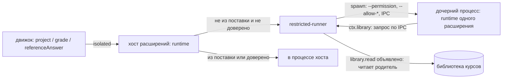
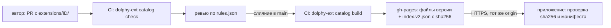

# Расширения

Расширение — каталог с манифестом `extension.json`, который добавляет приложению один или несколько вкладов (точек вклада): виды заданий, темы оформления, рендереры блоков кода в Markdown, правила оценки, настройки и подписки на события обучения. Любой вид задания (SQL, выбор варианта, дальше — перетаскивание, сопоставление) — расширение: ядро движка знает только конверт «вид + spec + ответ → вердикт», содержимое видов ему непрозрачно. Расширение не из поставки изолировано: его код исполняется в ограниченном процессе с объявленными в манифесте `permissions`, а элементы интерфейса — в изолированной рамке (раздел «Права и изоляция»; пользователь может отключить расширение или доверить его). Решение и его причины — `docs/adr/0001-exercise-types-as-extensions.md`; форма расширения для авторов и принятый риск безопасности — `docs/adr/0002-authoring-simplicity-over-isolation.md`; что изоляция даёт и чего не даёт — `docs/adr/0003-isolation-of-third-party-extensions.md`.

Помимо видов заданий, тем, рендереров и правил оценки расширение может добавлять команды в палитру приложения (Ctrl/⌘+K) и панели — собственные экраны с пунктом в боковом меню; панель всегда рисуется в изолированной рамке (разделы «Команды», «Панели», [ADR 0008](../adr/0008-extension-commands-and-panels.md)).

Расширения можно ставить из каталога прямо в приложении («Настройки → Расширения → Каталог»): каталог — статический индекс `index.v2.json` и файлы версий на GitHub Pages, исходники и проверки лежат в репозитории `dolphy-app/dolphy-extensions`. Устройство, цепочка доверия и её пределы — раздел «Установка и каталог» и [ADR 0004](../adr/0004-extension-catalog.md).

Расширение поставляет в каталог не только код, но и таблицы стилей, изображения и шрифты, а в приложении показывается его значок. Панели, элементы ввода и рендереры в изолированных рамках подключают свои ресурсы с `dolphy-ext://<id>` и не видят ресурсы других расширений (раздел «Ресурсы расширения» и [ADR 0010](../adr/0010-extension-static-assets.md)).

## Что такое расширение

Каталог с манифестом `extension.json` и файлами вкладов. Расширение может вносить любую комбинацию из одиннадцати точек (`contributes.exerciseTypes`, `themes`, `markdownRenderers`, `gradePolicies`, `settings`, `events`, `commands`, `panels`, `widgets`, `importers`, `exporters`, раздел «Точки вклада»). Код для процесса расширений (`main`, ES-модуль `.mjs`) нужен только вкладам `exerciseTypes`, `gradePolicies`, `events` и `commands`; у расширения из одних тем, рендереров содержимого и настроек `main` — `null`, и `src/index.ts` писать не нужно. Ниже — расширение с видом задания: JSON Schema для `spec` и ответа лежат в файлах или записаны прямо в манифесте, элемент ввода ответа (`renderer`) определяет custom element:

```
dolphy.choice/
  extension.json
  main.mjs            # export default { activate(ctx), deactivate? }
  view.mjs            # определяет custom element ввода ответа
```

Минимальный манифест:

```json
{
  "id": "dolphy.choice",
  "version": "1.0.0",
  "apiVersion": 1,
  "contributes": {
    "exerciseTypes": [
      {
        "id": "dolphy.choice",
        "specSchema": { "type": "object", "required": ["options", "correct"] },
        "answerSchema": "./schema/answer.json"
      }
    ]
  }
}
```

Умолчания (`normalizeManifest`): `main` — `./main.mjs`; `renderer` — `./view.mjs`; `element` — `id` вида с точками, заменёнными на дефисы, и суффиксом `-answer` (`dolphy.choice` → `dolphy-choice-answer`). Явные значения важнее умолчаний. `specSchema` и `answerSchema` — либо путь к `.json` внутри каталога, либо непустая схема объектом. Формат один: после разбора манифест всегда нормализован.

Правила манифеста проверяет `parseManifest` (`packages/extension-host/src/manifest.ts`): `id` — `[a-z][a-z0-9-]*(.[a-z][a-z0-9-]*)*`; `id` вида равен `id` расширения или начинается с `<id>.`; `main` — `.mjs`, `renderer` — `.js` или `.mjs`; выведенный или явный `element` — допустимое имя тега (с дефисом); все пути относительные и внутри каталога; `apiVersion` — `1`. Неизвестные ключи `contributes` отклоняются: расширение с более новой точкой вклада не загрузится в старом приложении. Имя каталога равно `id`. Если файл по умолчанию (`main.mjs`, `view.mjs`) отсутствует, диагностика называет его и помечает как умолчание.

### Метаданные и совместимость

Необязательные поля манифеста: `name` (название, 1–80 символов), `description` (1–500), `author` (GitHub-логин), `platforms` (подмножество `darwin`, `linux`, `win32`, без повторов; нет ключа — любая платформа) и `minAppVersion` (semver `x.y.z`). Локально их можно не указывать; для публикации в каталог `name`, `description` и `author` обязательны (проверка `dolphy-ext catalog check`, раздел «Установка и каталог»). Нормализованный манифест и `ResolvedExtension` хранят `null` / `[]` вместо отсутствующих значений. Необязательный `icon` — путь к файлу `.png` или `.webp` внутри расширения: квадрат от 64 до 512 пикселей, до 16 КиБ (SVG-значок не принимается). Обнаружение (`inspectExtensionDir`) читает файл при каждом обнаружении, проверяет формат, размер и геометрию и кладёт в `ResolvedExtension.icon` и `ExtensionInfoDto.icon` как `data:image/png|webp;base64,…`; снимок обнаружения хранит результат до следующего обнаружения. Некорректный значок делает расширение `invalid` с причиной. Окно показывает его 32 px в списке установленных, на карточке каталога и в диалоге установки; без значка вид прежний. У поставляемых расширений механизм тот же.

Необязательное поле `tags` — до 5 уникальных значений закрытого словаря `EXTENSION_TAGS` из `@dolphy-app/extension-api` (`learning`, `language`, `content`, `theme`, `interface`, `productivity`, `developer`); неизвестный, повторный или шестой тег — ошибка манифеста с путём `tags.N` и перечнем допустимых значений. Нормализованный манифест хранит `[]` вместо отсутствующего ключа. Теги нужны каталогу (фильтры и чипы); в каталог они попадают в запись версии полного индекса (раздел «Установка и каталог»).

Совместимость проверяют `discoverExtensions` и `inspectExtensionDir` по `appVersion` и `platform` (по умолчанию `process.platform`). Расширение не загружается и получает состояние `invalid` с диагностикой `requires-app` (данные `minAppVersion`) или `unavailable-platform` (данные `platform`); английский текст для CLI и логов даёт `formatDiagnostic` (`requires app >= X.Y.Z`, `not available on <platform>`), проверку совместимости — `checkCompatibility` из `@dolphy-app/extension-catalog`, её же используют выбор версии каталога и установщик. Версия приложения приходит из `EngineConfig.appVersion`; в несобранном приложении (режим разработки) она не задана, и `minAppVersion` не проверяется, пока не задан `DOLPHY_APP_VERSION=x.y.z`. `dolphy-ext validate` версии приложения не знает и сообщает только об ошибках формы этих полей.

**Диагностики.** Причина состояния расширения — не строка, а `diagnostics: [{code, data}]` (`ExtensionInfoDto`, контракт 14). Коды закрытого списка `EXTENSION_DIAGNOSTIC_CODES`: `manifest-unreadable` (`reason`), `manifest-invalid` (`issues` — `путь: сообщение`), `id-mismatch` (`expected`, `actual`), `requires-app` (`minAppVersion`), `unavailable-platform` (`platform`), `claim-clash` (`kind`, `name`, `by`), `load-failed` (`reason`), `overridden-by` (`origin`, `version`), `safe-mode`; предупреждения о переводах `locale.missing-key` (`key`) и `locale.invalid-file` (`file`, `reason`) — раздел «Локализация манифеста». У загруженного и отключённого пользователем расширения список пуст, если нет безопасного режима или предупреждений о переводах; причина отзыва остаётся отдельным полем `revoked`. Окно строит текст по коду и данным на русском и английском (`settings.extensions.diagnostic.<код>`); `formatDiagnostic` из `@dolphy-app/extension-host` — единственное место, строящее английский текст для `dolphy-ext`, логов и установщика.

**Ключ `$schema` и JSON Schema.** В манифесте допустим необязательный строковый ключ `$schema`: приложение и инструменты его игнорируют, `dolphy-ext build` копирует манифест как есть, ключ остаётся в `extension.json` сборки. `@dolphy-app/extension-api` содержит `extension.schema.json` (JSON Schema 2020-12 из zod-манифеста: `z.toJSONSchema(manifestSchema, { io: 'input', unrepresentable: 'any' })`, `additionalProperties: false` у объектов); файл лежит в `packages/extension-api/`, коммитится, сверяется тестом `manifest-schema.test.ts` (обновление — `UPDATE_EXTENSION_SCHEMA=1`) и публикуется как `dist/extension.schema.json` с подпутём экспорта `./extension.schema.json`. Генератор проекта пишет в манифест `$schema`, указывающий на этот файл установленного пакета. Схема помогает редактору (подсказки, ошибки), но не выражает перекрёстные правила — префикс `id`, «хотя бы один вклад», разрешение `learning.events` для событий, проверки точек вклада: источником истины остаются `parseManifest` и `dolphy-ext validate`.

**Эволюция API.** До заморозки API совместимость не гарантируется: `apiVersion` остаётся `1`, ломающие изменения (манифест, точки вклада, разрешения, `ctx`, каталог) допустимы в любом релизе и перечисляются в `CHANGELOG.md`, слои совместимости не создаются, расширения поставки и каталога обновляются в том же изменении. Момент заморозки и правила устаревания вводит отдельное решение владельца — [ADR 0014](../adr/0014-extension-api-evolution.md); там, где ADR 0001 и 0002 о версионировании расходятся, действует он.

Типы и константы API — пакет `@dolphy-app/extension-api`.

## Код расширения

Ниже — низкоуровневый API `ExtensionModule`. Писать расширение проще через SDK: `defineExtension` и `defineAnswerView` (раздел «Как написать расширение»).

```ts
export default {
  activate(ctx) {
    ctx.registerExerciseType('dolphy.choice', {
      project: ({ spec }) => ({ options: spec.options }), // публичный вид, без ключей ответов
      grade: ({ spec, answer, timeoutMs, authorMode }) => ({
        outcome: 'passed',
      }),
      referenceAnswer: ({ spec }) => spec.correct, // для проверки компилятором
    });
  },
};
```

`ctx` даёт `extensionId`, `logger`, `library` (`readText`/`stat` по библиотеке курсов) и `registerExerciseType`. Тип обязан быть объявлен в манифесте. Активация ленивая: по первому запросу к виду, отказ активации запоминается до перезапуска процесса.

`grade` возвращает `GradeResult`: `passed`, `failed` (вина ученика: `reason`, необязательно `feedback`, `detail` — только в режиме автора) или `error` (не вина ученика, попытка не тратится). Причины `failed`/`error` — открытые строки расширения; причины хоста (`timeout`, `resource_kill`, `worker_crash`, `internal`) порождает хост. Оценку FSRS считает ядро по `outcome` (`GradePolicy`); расширение её не выставляет.

## Элемент ввода ответа

Custom element (тег из `element`) в shadow DOM, определяется модулем `renderer`. Приложение выставляет свойства `view` (результат `project`), `value`, `disabled`, `verdict` и слушает события `dolphy-answer-change` (`detail: { value, complete }`) и `dolphy-answer-submit`. Кнопку «Проверить», подсказки и вердикт рисует приложение. Строки интерфейса приложения расширению недоступны: текст в элементе — данные задания или `aria-label` от приложения. Цвета берутся из CSS-переменных темы (`--v-theme-*`). Элемент не доверенного расширения исполняется в изолированной рамке, а не в окне приложения; контракт для автора тот же (раздел «Права и изоляция»).

## Процессы

```
renderer ── MessagePort ──► движок (utilityProcess «dolphy-engine»)
                              │  ExerciseTypes: describe/validate (манифесты, Ajv)
                              │  project / grade / referenceAnswer — MessageChannelMain
                              ▼
                            хост расширений (utilityProcess «dolphy-ext-host»)
                              │  runtime: activate, обработчики, воркеры (dolphy.sql, dolphy.js: fork)
```

- Канал движок ↔ хост расширений создаёт main (`host-link.ts`); при перезапуске любого процесса выдаётся новая пара портов.
- Клиент в движке (`createRemoteExerciseTypes`) держит дедлайн `timeoutMs + 2 с` на `grade`. Синхронный цикл в расширении не прервать, поэтому по дедлайну клиент отдаёт `error/timeout` и просит main перезапустить хост (`restart-ext-host`). Закрытие канала во время `grade` — `error/worker_crash`.
- Хост расширений перезапускается с backoff; после `MAX_CRASHES` падений за минуту перезапуск прекращается, приложение продолжает работать (карточки), вызовы видов получают `EXERCISE_TYPE_UNAVAILABLE`.
- Хост расширений сам расширения не ищет. Набор находит движок (`discoverExtensions`, изменяемый снимок `DiscoveryHolder`, общий у политики, каталога видов, реестра и установщика) и присылает его сообщением `replaceExtensions` по каналу: первым сообщением после каждого подключения порта (старт, перезапуск любой стороны) и после каждого применения изменений (`reload()`: установка, удаление, включение, доверие, правка в режиме разработчика). `ExtensionRuntime.replace` меняет каталог атомарно; вытесненные (удалённые или изменившиеся по версии, файлам `revision` или вкладам) расширения получают `deactivate()` после вызовов в полёте (не дольше `timeoutMs` вызова + 2 с), ограниченный процесс закрывается, следующий вызов получает свежий. Код в процессе хоста грузится с `?v=<n>` в URL: перезагружается входной модуль, его зависимости должны быть собраны в него. Событие `contributions-changed` движок публикует после подтверждения хоста; `ContributionsDto.generation` растёт при каждом применении и сбрасывается при запуске движка.

## Обнаружение

Два корня: расширения из поставки (`Resources/extensions`, в разработке — `<outRoot>/extensions`, read-only) и пользовательские (`<userData>/extensions`). Подкаталог с `extension.json` — расширение. Одинаковый `id` в обоих корнях — побеждает пользовательское (лог `info`). Повторный id вида, id темы или правила оценки, `element` или язык рендерера содержимого у разных расширений: первое выигрывает, второе пропускается целиком с предупреждением. Набор находится при запуске и перечитывается на лету при установке, удалении, включении, доверии и правке в режиме разработчика (раздел «Живое применение»). «Настройки → Расширения» показывает каждое расширение, его вклады по точкам, заявленные разрешения, состояние изоляции и причину, по которой оно не загрузилось или было перекрыто. Отключённое пользователем расширение (переключатель «Включено») остаётся в списке с пометкой «Отключено» и не даёт ни видов заданий, ни тем, ни рендереров, ни правил оценки; расширения из поставки отключить нельзя.

Имена подкаталогов, начинающиеся с точки, расширениями не считаются: `.staging`, `.trash` и `.catalog` — служебные каталоги установщика (раздел «Установка и каталог»). Если в каталоге расширения из пользовательского корня лежит `.dolphy-install.json`, расширение считается установленным из каталога: обнаружение читает файл, он нужен обновлениям и отзыву. Нет файла (расширение скопировано вручную) или он повреждён (предупреждение в логе) — расширение работает, но обновлений и отзыва не получает. Совместимость (`minAppVersion`, `platforms`) проверяется при обнаружении (раздел «Метаданные и совместимость»).

Файлы расширения отдаёт протокол `dolphy-ext://<id>/<путь>` (`apps/desktop/electron/main/shells/extension-assets.ts`). Корни — каталог разработчика, пользовательский, из поставки: файл берётся из первого корня, где он есть, и отвергнутый файл не уступает место одноимённому из следующего корня. Отдаются только:

- скрипты `.js`/`.mjs` с `Content-Type: text/javascript`;
- ресурсы `css`, `svg`, `png`, `webp`, `jpg`, `jpeg`, `woff2` с `Content-Type` из `ASSET_MIME` (`@dolphy-app/extension-catalog`).

Расширение имени — строчными буквами (`a.PNG` — 404). Все ответы несут `X-Content-Type-Options: nosniff`, `Cache-Control: no-cache` (правка в режиме разработчика видна сразу) и `Access-Control-Allow-Origin: *` (окно загружается с `file://`, рамка — с непрозрачным origin, а модули и шрифты идут в режиме CORS). SVG получает ещё `Content-Security-Policy: default-src 'none'; style-src 'unsafe-inline'; sandbox`: даже открытый как документ, он не выполняет скрипты.

Всё остальное — 404: `extension.json`, `README.md`, `.json`, `.md`, `.txt`, прочие типы, любой путь, где сегмент начинается с точки, путь `__dolphy/…` из каталога расширения, выход за каталог. Протокол не доверяет каталогу: проверки каталога (`catalog check`) не касаются расширений из режима разработчика и скопированных вручную. Поэтому при каждом запросе:

- файл приводится к `realpath`; путь за пределами `realpath` каталога расширения — 404 (сам каталог расширения может быть ссылкой: так разработчик подключает проект); для ресурса запрещена любая ссылка внутри каталога — и на файл, и на подкаталог (`realpath` должен совпасть с запрошенным путём), для скрипта разрешена ссылка внутрь каталога;
- размер ресурса не больше потолка его типа (`ASSET_LIMITS`: `css` 256 КиБ, `svg` 64 КиБ, изображение 512 КиБ, `woff2` 1 МиБ); больше — 413 и предупреждение в логе. У скриптов потолка нет.

CSP окна содержит `script-src 'self' dolphy-ext:` и `frame-src dolphy-ext:`; `style-src`, `img-src` и `font-src` окна не расширяются: доверенные и поставляемые элементы в окне используют встроенные `data:`-ресурсы. Тот же протокол отдаёт страницу и загрузчик изолированной рамки (`__dolphy/frame.html`, `__dolphy/frame.js`).

## Авторинг

Упражнение объявляет вид в `engine.exercise`:

```yaml
engine:
  exercise:
    type: dolphy.sql
    timeoutMs: 2000 # необязательно, по умолчанию 2000
    spec:
      fixture: fixtures/emp.sql
      expected: checks/join.csv
      reference: solutions/join.sql
```

Компилятор проверяет `spec` по схеме вида (`E_EXERCISE_SPEC`), сообщает о неизвестном виде (`W_UNKNOWN_EXERCISE_TYPE`) и прогоняет эталон: `referenceAnswer` → `grade` (`E_REFERENCE_FAILS`). CLI: `engine-cli validate <библиотека> --run-checks --extensions <каталог-корень>` (флаг повторяемый; без него проверки видов пропускаются, а `--run-checks` требует его).

Ответ ученика не попадает в журнал как есть: журнал хранит оценку и источник (`runner`); `spec` и ключи ответов в renderer не уходят — там только `task { type, timeoutMs, element, rendererUrl }` и `view` из `project`.

## Точки вклада

Манифест может содержать любые из двенадцати ключей `contributes`; пропущенный ключ — пустой список. Неизвестный ключ отклоняется. Во всех точках с `id`: `id` равен id расширения или начинается с `<id расширения>.`. Каждый пример в этом разделе, помеченный строкой `Файл ...`, проверяется тестом `packages/extension-tools/test/docs-contributions.test.ts`.

### Виды заданий (`exerciseTypes`)

Что даёт ученику: новый способ отвечать на упражнение — свой элемент ввода и проверка кодом расширения (подробности — разделы выше и «Как написать расширение»). Упражнение выбирает вид в `engine.exercise.type`.

Файл `extension.json` (вид задания):

```json
{
  "id": "acme.echo",
  "version": "1.0.0",
  "apiVersion": 1,
  "contributes": {
    "exerciseTypes": [
      {
        "id": "acme.echo",
        "specSchema": {
          "type": "object",
          "required": ["expected"],
          "properties": { "expected": { "type": "string" } }
        },
        "answerSchema": { "type": "string" }
      }
    ]
  }
}
```

Код — `defineExtension({ exerciseTypes: { 'acme.echo': { project, grade, referenceAnswer? } } })`. Пользователь видит вид в экране упражнения (элемент ввода) и в «Настройки → Расширения». Нужен `main` и, если не задан иной, `view.mjs` с элементом.

### Темы (`themes`)

Что даёт ученику: плитка темы в «Настройки → Внешний вид» рядом с «Как в системе», «Светлая», «Тёмная». Тема — только данные, кода нет (`main` — `null`).

Файл `extension.json` (тема):

```json
{
  "id": "acme.midnight",
  "version": "1.0.0",
  "apiVersion": 1,
  "contributes": {
    "themes": [
      {
        "id": "acme.midnight",
        "label": "Полночь",
        "dark": true,
        "colors": {
          "background": "#101820",
          "surface": "#1B2733",
          "primary": "#FFB000",
          "on-primary": "#101820"
        },
        "variables": { "border-opacity": 0.2 }
      }
    ]
  }
}
```

Правила:

- `id` не из встроенных (`system`, `light`, `dark`); `label` — 1–60 символов; `dark` — тёмная ли тема (влияет на базовые цвета Vuetify).
- `colors` — непустой объект; значения — строго `#rrggbb` или `#rrggbbaa`. Разрешённые ключи (`THEME_COLOR_KEYS`): `background`, `surface`, `surface-bright`, `surface-light`, `surface-variant`, `on-background`, `on-surface`, `on-surface-variant`, `primary`, `on-primary`, `secondary`, `on-secondary`, `error`, `on-error`, `warning`, `on-warning`, `success`, `on-success`, `info`, `on-info`, `hero-start`, `hero-end`, `hero-contrast`. Любой другой ключ — ошибка манифеста.
- `variables` — необязательно. Разрешённые ключи (`THEME_VARIABLE_KEYS`): `border-color` (цвет `#rrggbb`/`#rrggbbaa`), `border-opacity`, `medium-emphasis-opacity`, `high-emphasis-opacity`, `disabled-opacity` (числа от 0 до 1).
- Цвета блоков кода в тексте уроков и заданий выводятся из цветов темы, отдельных ключей для них нет: `primary` — ключевые слова, `success` — строки, `warning` — числа и имена классов, `info` — свойства, `secondary` — теги и сущности, `on-surface-variant` — комментарии; фон блока — `surface-variant`, обычный код — `on-surface`. Приложение само меняет светлоту каждого цвета (тон и насыщенность остаются), чтобы контраст с `surface-variant` был не ниже 4.5:1, поэтому тема с бледными акцентами остаётся читаемой. Различимость подсветки зависит от того, насколько различаются эти пять акцентов: если автор задаёт их близкими по тону, токены в коде тоже будут близкими.

### Рендереры содержимого (`markdownRenderers`)

Что даёт ученику: блоки кода ` ```<language> ` в тексте заданий и уроков выводит расширение (например, `dolphy.math` рисует формулы из блоков ` ```math `). Без расширения такой блок остаётся обычным кодом.

Файл `extension.json` (рендерер содержимого):

```json
{
  "id": "acme.shout",
  "version": "1.0.0",
  "apiVersion": 1,
  "contributes": {
    "markdownRenderers": [{ "language": "shout" }]
  }
}
```

`language` — `[a-z][a-z0-9-]{0,31}`, один язык — одно расширение. `renderer` — путь к `.js`/`.mjs`, по умолчанию `./markdown.mjs` (браузерный бандл; в проекте `dolphy-ext` его собирает из записи `markdown[<язык>]` файла `src/index.ts` сама сборка). Модуль, который грузит приложение, — `export default` с методом `render(source, container, context)`; `defineMarkdownRenderer` задаёт форму записи, а выбор по языку блока делает сборка:

Файл `src/index.ts` (рендерер содержимого):

```ts
import { defineMarkdownRenderer } from '@dolphy-app/extension-sdk';

export const markdown = {
  shout: defineMarkdownRenderer((source, container) => {
    const pre = container.ownerDocument.createElement('pre');
    pre.textContent = source.toUpperCase();
    container.replaceChildren(pre);
  }),
};
```

`context` — `{ language, signal }`: по `signal` (структурный `AbortSignal`) отменяется вывод при уходе со страницы. Модуль загружается по `dolphy-ext://`: у не доверенного расширения — в изолированной рамке (раздел «Права и изоляция»), у доверенного и из поставки — в окне приложения (общий JS-контекст, как у элементов ввода ответа). Если модуль не загрузился, не имеет `render()` или `render` бросил исключение, блок остаётся исходным текстом, под ним показывается заметка «Не удалось вывести блок…», страница работает дальше.

### Правила оценки (`gradePolicies`)

Что даёт ученику: в «Настройки → Обучение» (группа «Оценка», «Правило оценки») кроме встроенного `passAtN` появляется правило расширения. Оценка FSRS 1–5 за закрытую попытку считается выбранным правилом; выбор хранится в настройках.

Файл `extension.json` (правило оценки):

```json
{
  "id": "acme.policy",
  "version": "1.0.0",
  "apiVersion": 1,
  "contributes": {
    "gradePolicies": [{ "id": "acme.policy.generous", "label": "Щедрое" }]
  }
}
```

Файл `src/index.ts` (правило оценки):

```ts
import { defineExtension } from '@dolphy-app/extension-sdk';

export const host = defineExtension({
  gradePolicies: {
    'acme.policy.generous': ({ verdicts, gaveUp }) => {
      if (gaveUp) return 1;
      return verdicts.some(({ outcome }) => outcome === 'passed') ? 5 : null;
    },
  },
});
```

Контракт:

- Вход — `GradePolicyInput`: `verdicts` (вердикты попытки по порядку: `{ outcome: 'passed' | 'failed' | 'error', reason? }`) и `gaveUp` («Сдаться»).
- Результат — целое 1–5 или `null` («правило оценки не ставит, нужна самооценка»); можно вернуть промис.
- `id` — не `passAtN` (занят встроенным правилом), `label` — 1–60 символов; правило в коде регистрируется под тем же `id` (`registerGradePolicy`, в SDK — ключ `gradePolicies` в `defineExtension`). Нужен `main`.
- Любой сбой правила — хост недоступен, исключение, дедлайн 2 с (`POLICY_DEADLINE_MS` в `packages/extension-host/src/client.ts`), результат вне 1–5 и не `null`, расширение пропало — даёт предупреждение в лог и оценку по `passAtN` (`resolveGradePolicy`); закрытие попытки не зависит от чужого кода. Если выбранное правило пропало, экран настроек показывает, что действует Pass@N.
- Проверить правило без приложения: `loadGradePolicy` из `@dolphy-app/extension-sdk/testing`.

### Настройки (`settings`)

Что даёт пользователю: у расширения с `settings` в «Настройки → Расширения» есть кнопка «Настройки»; приложение рисует форму по определениям (переключатель, строка, многострочный текст, цвет, число, выбор из вариантов, редактор списка строк), «Сбросить» возвращает значения по умолчанию. Значения проверяет движок и хранит в `engine.db`. Расширение без кода (`main: null`) тоже может иметь настройки.

Файл `extension.json` (настройки расширения):

```json
{
  "id": "acme.streak",
  "version": "1.0.0",
  "apiVersion": 1,
  "contributes": {
    "settings": [
      {
        "id": "acme.streak.enabled",
        "type": "boolean",
        "label": "Считать серию дней",
        "default": true
      },
      {
        "id": "acme.streak.title",
        "type": "string",
        "label": "Заголовок",
        "description": "Показывается рядом с серией.",
        "default": "Серия",
        "maxLength": 40
      },
      {
        "id": "acme.streak.goal",
        "type": "number",
        "label": "Цель, дней",
        "default": 7,
        "min": 1,
        "max": 365,
        "integer": true,
        "group": "Цель",
        "order": 1
      },
      {
        "id": "acme.streak.motto",
        "type": "text",
        "label": "Девиз",
        "default": "Каждый день",
        "maxLength": 200,
        "group": "Цель",
        "order": 2
      },
      {
        "id": "acme.streak.accent",
        "type": "color",
        "label": "Цвет серии",
        "default": "#3366CC",
        "group": "Оформление"
      },
      {
        "id": "acme.streak.days",
        "type": "list",
        "label": "Дни без занятий",
        "default": ["сб", "вс"],
        "maxItems": 7,
        "itemMaxLength": 10,
        "group": "Оформление"
      },
      {
        "id": "acme.streak.mode",
        "type": "enum",
        "label": "Режим",
        "default": "daily",
        "options": [
          { "value": "daily", "label": "Каждый день" },
          { "value": "weekly", "label": "Раз в неделю" }
        ]
      }
    ]
  }
}
```

Контракт:

- Типы: `boolean`, `string` (`maxLength`), `text` (многострочная строка, `maxLength` ≤ 10 000), `color` (`#rrggbb`; значение хранится в нижнем регистре), `list` (список строк: `maxItems` 1–50, умолчание 50; `itemMaxLength` 1–200, умолчание 200), `number` (`min`, `max`, `integer`), `enum` (`options: [{ value, label }]`). `label` — 1–60 символов, `description` — до 500; подписи — данные расширения, не переводятся. Код получает `boolean`, `string`, `number` и `string[]` (`text` и `color` — строки); `onDidChange` срабатывает на изменение значения, равный список изменением не считается.
- Структура формы: необязательные `group` (заголовок раздела, 1–60), `order` (целое 0–1000, умолчание 0) и `visibleWhen: { setting, equals }`. Форма сортирует настройки по `order`, затем по порядку объявления; разделы идут в порядке первого вхождения в этом отсортированном списке, настройки без `group` — первым разделом без заголовка. Поле с `visibleWhen` скрыто, пока значение настройки `setting` того же расширения не равно `equals` (без сохранённого значения берётся её `default`). Скрытое значение сохраняется и доходит до кода. Ошибка манифеста: несуществующая цель, сама настройка, `list`, настройка, у которой есть свой `visibleWhen` (цепочки и циклы запрещены), `equals` другого типа, чем цель (`boolean`, `number` или строка). Это не выражение `when` команд: оно зарезервировано для следующей волны.
- Движок отклоняет неподходящее значение ошибкой `INVALID_ARGUMENT` с `details.reason`: `type`, `integer`, `range`, `max-length`, `option`, `format` (цвет не `#rrggbb`), `max-items`.
- `id` равен id расширения или начинается с `<id>.`, уникален; `default` обязан удовлетворять ограничениям (иначе манифест отклоняется).
- Код читает `ctx.settings.get(id)` синхронно (текущее значение или `default`) и подписывается `ctx.settings.onDidChange(handler)`; изменение пользователя доходит до работающего расширения без перезапуска.
- Значение, переставшее подходить определению после обновления расширения, при чтении заменяется `default`.
- Контракт `@dolphy-app/engine-contract` 16 добавил варианты `text`, `color` и `list` и поля `group`, `order`, `visibleWhen` в `ExtensionSettingDefDto`, ключи `exerciseTypes` и `markdownRenderers` в `ContributionTitlesDto`; `SettingValue` стал `boolean | string | number | string[]`.
- Данные, которые расширение копит само, лежат в `ctx.storage` (`get`, `set`, `delete`, `keys`; любой JSON; разрешение не нужно). Потолки: ключ — до 128 символов, значение — до 64 КиБ в JSON, ключей — не более 256, всего — не более 1 МиБ; превышение бросает `StorageQuotaError` (`limit`, `kind`), запись не происходит. Данные переживают перезапуск, обновление и отключение.

### События обучения (`events`)

Расширение подписывается на события: `session.started` и `session.finished` (`{ sessionId, at }`), `attempt.closed` (`{ exerciseId, courseId, lessonId, grade, outcome, source, at }`; `outcome` — `passed`, `failed`, `gave-up` или `self-assessed`). Ответы, `spec`, обратная связь и текст упражнения в события не попадают.

Правило: расширение с `contributes.events` обязано объявить разрешение `learning.events`, иначе `parseManifest` и `dolphy-ext validate` отклоняют манифест. Нужен `main`.

Файл `extension.json` (подписка на события):

```json
{
  "id": "acme.streak",
  "version": "1.0.0",
  "apiVersion": 1,
  "main": "./main.mjs",
  "permissions": ["learning.events"],
  "contributes": {
    "settings": [
      {
        "id": "acme.streak.enabled",
        "type": "boolean",
        "label": "Считать серию дней",
        "default": true
      }
    ],
    "events": [{ "event": "attempt.closed" }]
  }
}
```

Файл `src/index.ts` (подписка на события):

```ts
import { defineExtension, inActivate } from '@dolphy-app/extension-sdk';

export const host = defineExtension({
  // событие объявлено в extension.json, подписка — в activate
  events: { 'attempt.closed': inActivate },
  activate(ctx) {
    ctx.settings.onDidChange(({ id, value }) => {
      ctx.logger.info({ id, value }, 'setting changed');
    });
    ctx.events.on('attempt.closed', async ({ grade }) => {
      if (ctx.settings.get('acme.streak.enabled') !== true) return;
      const total = (await ctx.storage.get<number>('closed')) ?? 0;
      await ctx.storage.set('closed', total + 1);
      ctx.logger.debug({ grade, total: total + 1 }, 'attempt counted');
    });
  },
});
```

Контракт:

- Код подписывается `ctx.events.on(name, handler)` (один обработчик на событие) или ключом `events` в `defineExtension` (`events: { 'attempt.closed': handler }`); обработчик получает поля события, тип которых следует имени события. Если подписка делается в `activate`, в записи `events` событию соответствует `inActivate` (раздел «Типизированные id»).
- Доставка асинхронная, по порядку для одного расширения, не более одного раза; обработчик ограничен 2 с; очередь — 100 событий на расширение, при переполнении отбрасываются самые старые с предупреждением в лог.
- Сбой, исключение или таймаут обработчика никогда не влияют на журнал, оценку и ответ команды. Отключённое расширение и расширение без объявленного события события не получает; первое событие лениво активирует расширение.
- `attempt.closed` — по одному разу на записанную попытку ученика; не приходит при повторе запроса, синхронизации, импорте и выводе по диагностике (`placement`).

### Команды (`commands`)

Команда — именованное действие расширения с обработчиком в `main`. Запись: `id` (по правилам `id` расширения), `title` (до 60 символов), необязательные `description` (до 200), `category` (до 40), `keybinding` (сокращение вида `Mod+Shift+L`), `keybindings` (список привязок, до 4) `palette` (по умолчанию `true`; `false` скрывает команду из палитры, но её по-прежнему можно вызвать из панели или виджета расширения), `when` (условие видимости, раздел «Условия видимости (`when`)») и `icon` (имя из закрытого списка `EXTENSION_ICONS`, умолчание `puzzle`; раздел «Значки»). Не более 64 команд на расширение. Ключ `when` прямо у команды не поддерживается и отклоняется как неизвестный; условие задаётся у записи `keybindings`. Новые разрешения не нужны. Нужен `main`.

**Сочетания клавиш.** `keybinding` — сокращение: действующая привязка без условия, равная записи `{ "key": ... }` списка `keybindings`. Запись `keybindings`: `key` (обязательно; `Mod+Shift+L`, цепочка из двух нажатий `Mod+K Mod+S`, физическая клавиша `[KeyK]`; `Mod` — ⌘ на macOS, Ctrl на остальных), необязательные `mac`, `windows`, `linux` (заменяют `key` на своей платформе) и `when` (условие). Не более 4 записей на команду; одинаковая пара (`key`, `when`) в одной команде — ошибка.

- Манифест проверяется для всех трёх платформ: каждая строка клавиш (`key`, `mac`, `windows`, `linux`, `keybinding`) должна разбираться на macOS, Windows и Linux. Запись вроде `Mod+Ctrl+K` неверна, потому что на Windows и Linux `Mod` — это Ctrl и модификатор повторяется. Ошибка называет путь, например `contributes.commands.0.keybindings.1.key`.
- Правило набора: сочетание без Ctrl и ⌘ (Meta), которое печатает или правит текст (буква, цифра, знак, Space, Enter, Backspace, Delete и подобные, в том числе с Shift), обязано иметь `when`, неактивное при `inputFocus`, например `!inputFocus`. У сокращения `keybinding` условия нет, поэтому голая клавиша в нём — ошибка.
- Привязки нужны только для палитры: команда с любой привязкой и `palette: false` отклоняется (нужен `palette: true`).
- Привязка запускает только собственную команду расширения; чужие команды и команды приложения расширение назначить не может.
- Приоритет при совпадении: сочетания пользователя выше сочетаний приложения, те выше сочетаний расширений. Конфликт между расширением и приложением не ломает приложение: действует привязка с большим приоритетом.
- Привязки применяются вместе с расширением и снимаются при его отключении или удалении, перезапуск приложения не нужен.
- Пользователь меняет сочетания в «Настройки → Сочетания клавиш»; заданный пользователем набор команды целиком заменяет привязки расширения, сброс возвращает их.
- Контекст `when`: ключи `platform`, `isMac`, `isWindows`, `isLinux`, `inputFocus`, `modalOpen`, `paletteOpen`, `page`, `inSession`; операторы `!`, `&&`, `||`, `==`, `!=`, скобки, например `page == 'settings' && !inputFocus`.

Файл `extension.json` (команды расширения):

```json
{
  "id": "acme.tools",
  "version": "1.0.0",
  "apiVersion": 1,
  "main": "./main.mjs",
  "contributes": {
    "commands": [
      {
        "id": "acme.tools.hello",
        "title": "Поздороваться",
        "category": "Acme",
        "keybinding": "Mod+Shift+H"
      },
      {
        "id": "acme.tools.stats",
        "title": "Статистика",
        "palette": false
      }
    ],
    "panels": [{ "id": "acme.tools.view", "title": "Статистика Acme" }]
  }
}
```

Файл `src/index.ts` (команды расширения):

```ts
import {
  defineExtension,
  defineExtensionPanel,
  notify,
  openPanel,
} from '@dolphy-app/extension-sdk';

export const host = defineExtension({
  commands: {
    'acme.tools.hello': (args) => {
      const name = typeof args === 'string' ? args : 'мир';
      return notify(`Привет, ${name}!`);
    },
    'acme.tools.stats': () => openPanel('acme.tools.view', { from: 'stats' }),
  },
});

export const panels = {
  'acme.tools.view': defineExtensionPanel({
    mount(container, ctx) {
      container.textContent = `Панель ${ctx.panelId}`;
    },
  }),
};
```

Контракт:

- Обработчик получает `args` — JSON вызывающего (`undefined`, если аргументов нет; не более 200 000 символов) — и возвращает результат (таблица ниже).
- Регистрация: ключ `commands` в `defineExtension` (обработчик получает только `args`) или `ctx.commands.register(id, handler)` в `activate` (когда обработчику нужны `ctx.storage`, `ctx.settings` и остальное). Команду, не объявленную в манифесте, зарегистрировать нельзя, повторная регистрация бросает. Работает одинаково в процессе хоста и в ограниченном процессе. Первый вызов лениво активирует расширение; список команд в палитре активации не требует.
- Вызов — один RPC `extensions.invokeCommand(extensionId, commandId, args?)` (контракт `@dolphy-app/engine-contract` 11), общий для палитры и панели; отдельного вызова для панели нет. Метод вне очереди команд движка (`UNQUEUED`, как `practice.submitAnswer`): медленная команда не замораживает движок и идущую сессию. Возвращает `{ kind: 'none' | 'notify' | 'openPanel' | 'data', … }`.
- Отказ — ошибка `EXTENSION_COMMAND_FAILED` с `details: { extensionId, commandId, reason }`; `reason`: `unknown-command` (нет такого расширения или команды, она не объявлена), `disabled` (расширение отключено), `replaced` (набор расширений заменили во время вызова, повторите), `timeout`, `host-down` (хост расширений недоступен), `invalid-result` (результат нарушает правила), `handler-failed` (исключение обработчика, текст — данные расширения), `activation-timeout` (`activate()` не завершился за 10 с, раздел «Сроки»). `INVALID_ARGUMENT` — только неверные идентификаторы и аргументы длиннее 200 000 символов.
- Тест без приложения: `loadCommands` из `@dolphy-app/extension-sdk/testing` (`run(id, args)` возвращает тот же `{ kind: … }`, что увидит приложение; правила результата и регистрации — те же, что у хоста, их источник один — `normalizeCommandResult` в `@dolphy-app/extension-api`).

#### Результат команды

| Обработчик вернул                   | `kind`      | Что делает приложение                                                                                                                                                                                                                                      |
| ----------------------------------- | ----------- | ---------------------------------------------------------------------------------------------------------------------------------------------------------------------------------------------------------------------------------------------------------- |
| `undefined` или `null`              | `none`      | Ничего.                                                                                                                                                                                                                                                    |
| `notify(text)` (`{ notify: text }`) | `notify`    | Уведомление приложения (`role="status"`, 6 с, кнопка «Закрыть»); `text` — 1–500 символов, выводится как текст, без разметки.                                                                                                                               |
| `openPanel(id, props?)`             | `openPanel` | Переходит на страницу панели `id` этого расширения (`/ext/<extensionId>/<id>`); `props` (JSON) доходят до `ctx.props` панели. Панель должна быть объявлена в `panels`. Повтор на уже открытую панель обновляет `props` без пересоздания рамки (`onProps`). |
| любой другой JSON (до 64 КиБ)       | `data`      | Ничего: данные получает вызывающий. Из палитры они игнорируются, панель получает их значением `await ctx.call(…)`.                                                                                                                                         |

Эффекты `notify` и `openPanel` приложение исполняет одинаково для палитры и для вызова из панели. Это весь набор эффектов: произвольной разметки результатом команды нет, богатый вывод — панель.

#### Палитра команд

Палитра — диалог приложения (`widgets/command-palette`, смонтирован в `App.vue`), поэтому она доступна на любой странице, включая учебную сессию и диагностику. Открывается Ctrl/⌘+K на любой странице и кнопкой «Открыть палитру команд» на странице «Настройки → Сочетания клавиш»; кнопки в боковом меню нет. Палитра читает только реестр команд окна (см. «Реестр команд» ниже): команды приложения и команды расширений лежат в нём рядом.

- Поиск без учёта регистра по названию, категории и id расширения; поле поиска — `combobox`, список — `listbox` из `option` (`aria-activedescendant` указывает на выбранную строку, живая область сообщает число найденных команд). ↑/↓ двигают выбор по кругу, Enter выполняет, Escape закрывает и возвращает фокус на прежний элемент (в том числе внутрь рамки панели).
- Строка показывает название, `description`, подпись (у команд расширений — id расширения; у команд приложения подписи нет), категорию меткой и сочетание клавиш подсказкой с учётом платформы (⌘ на macOS, Ctrl на остальных; для команд расширений показывается действующее сочетание, в том числе заданное пользователем). Выбранный вариант (текущая тема, язык) помечен галочкой, скрытым текстом «Выбрано» и `aria-checked`. Название, описание и категория команд расширений — данные: не переводятся и выводятся как текст.
- В палитре нет команд с `palette: false`, команд отключённого, удалённого и ещё не загруженного расширения. Список обновляется по `contributions-changed` без перезагрузки; выбранная строка держится за ключом команды и не «прыгает», а команда, пропавшая между выбором и выполнением, даёт сообщение «расширение изменилось».
- Команда, которая ещё выполняется, повторно не запускается. Результат `notify` — уведомление, ошибка — понятное сообщение приложения (таймаут, «расширение изменилось», хост недоступен, неверный результат, иначе — текст ошибки обработчика).
- Привязки расширения (`keybinding`, `keybindings`) назначает приложение: расширение клавиши не перехватывает. Правила и приоритет описаны в разделе «Команды».
- Реализация — собственный компонент, а не `VCommandPalette` из Vuetify (labs, 4.2.2): у labs-компонента поле ввода не получает роль `combobox`, `aria-controls` и `aria-activedescendant`, число результатов не озвучивается (ADR 0008). Внешний вид (разметка, размеры, subheader категорий, подсветка активной строки, рамка клавиши, отступ сверху 15vh, ширина 500) повторяет Vuetify по `VCommandPalette.scss` (MIT); labs-API нестабилен, при обновлении Vuetify вид сверяют вручную.

#### Сроки

Сроки согласованы по цепочке: внутренний срок всегда короче внешнего, поэтому вызывающий получает причину, а не обрыв.

| Звено                                  | Срок | Где задан                                                                                                                                                       |
| -------------------------------------- | ---- | --------------------------------------------------------------------------------------------------------------------------------------------------------------- |
| Активация `activate()`                 | 10 с | `ACTIVATION_TIMEOUT_MS` / `activationTimeoutMs` (`runtime.ts`), в ограниченном процессе `readyTimeoutMs` (`restricted-runner.ts`); причина `activation-timeout` |
| Обработчик команды                     | 10 с | `EXTENSION_COMMAND_LIMITS.handlerMs` (`@dolphy-app/extension-api`), причина `handler-timeout`                                                                   |
| Раннер ограниченного процесса          | 12 с | `commandDeadlineMs` (`restricted-runner.ts`): по сроку процесс убивается                                                                                        |
| Клиент движка (вызов хоста расширений) | 14 с | `COMMAND_CLIENT_DEADLINE_MS` (`client.ts`), в окне — причина `timeout`                                                                                          |
| Обработчик импортёра и экспортёра      | 30 с | `EXTENSION_TRANSFER_LIMITS.handlerMs` (`@dolphy-app/extension-api`), причина `handler-timeout`                                                                  |
| Раннер ограниченного процесса (обмен)  | 32 с | `transferDeadlineMs` (`restricted-runner.ts`, `TRANSFER_DEADLINE_MS`): включает запуск процесса и передачу тела; по сроку процесс убивается                     |
| Клиент движка (импорт и экспорт)       | 34 с | `TRANSFER_CLIENT_DEADLINE_MS` (`client.ts`), причина `timeout`; хост не перезапускается                                                                         |
| Вызов `ctx.call` из рамки панели       | 15 с | `CALL_TIMEOUT_MS` (`frame-runtime.js`), больше срока клиента движка                                                                                             |

Бюджет дренажа при замене набора расширений (`fly`) — 10 с (для импорта и экспорта 30 с) плюс запас: заменяемый набор дожидается идущей команды, импорта или экспорта.

**Срок активации.** `activate()` (загрузка модуля, настройки, сам вызов) должен завершиться за 10 с, одинаково в процессе хоста и в ограниченном процессе; срок не настраивается расширением (параметр `activationTimeoutMs` рантайма нужен тестам). Не уложился — сбой `activation-timeout`: вызвавший (команда, событие, `project`, `grade`) получает именно его, а не срок своего вызова. В ограниченном процессе, если срок вызова выходит, пока процесс ещё активируется, причина тоже `activation-timeout`, а не `handler-timeout`; процесс убивается, как и прежде. Сбой **запоминается**: повторные вызовы сразу получают ту же причину и не запускают `activate()` заново, пока сборка не заменена (перезагрузка, включение и выключение, новая версия, режим исполнения). Регистрации (`ctx.commands.register`, `events.on`, `registerExerciseType`, `registerGradePolicy`), которые код делает после срока, ничего не регистрируют (флаг `abandoned` активации). Для `project` и `grade` клиент хоста сводит причину к `activation-failed` (`ExerciseTypeErrorCause` не меняется), для команд она доходит до окна как `activation-timeout` (`details.reason` ошибки `EXTENSION_COMMAND_FAILED`) и показывается сообщением «Расширение не запустилось за 10 с» (`extensionCommands.notice.activationTimeout`). Проверки: `packages/extension-host/test/runtime-activation.test.ts` и `restricted-runner.test.ts`, e2e `extension-surfaces.e2e.test.ts` (расширение с вечным `activate()`, команда из палитры).

- Таймаут и сбой обработчика возвращают типизированную ошибку и **не перезапускают хост расширений**, как и у событий: клик пользователя не должен убивать чужие вызовы `grade`. Ограниченный процесс, убитый по сроку, раннер отцепляет сразу, следующий вызов поднимает новый.
- Предел (как у событий): в процессе хоста исполняются доверенные расширения и расширения из поставки. Синхронный бесконечный цикл в их обработчике вешает хост расширений до его собственного сбоя — срок вызова истечёт, но прервать цикл нечем. Зависший асинхронный обработчик отпускается по сроку, его работа не прерывается. В ограниченном процессе синхронный цикл не страшен: процесс убивается раннером на 12 с. То же с `activate()`: срок активации (10 с) освобождает вызывающего (`activation-timeout`), но синхронный цикл в `activate()` доверенного расширения или расширения из поставки не прерывается.

#### Реестр команд

Палитра, сочетания клавиш и раздел «Сочетания клавиш» читают один реактивный реестр команд окна ([ADR 0012](../adr/0012-command-registry.md), `shared/lib/command-registry.ts`). Запись: ключ (`app:<id>` или `extension:<extensionId>:<id>`; источник входит в ключ, поэтому совпадение `id` команды расширения с командой приложения ничего не затирает), источник, название и категория (читаются при каждом чтении списка, поэтому следуют за языком), необязательные подпись, сочетание, признак «выбрано» и доступность, обработчик, признак «показывать в палитре». `register` возвращает отмену; повторный ключ — ошибка.

- Команды приложения (`features/app-commands`, регистрируются в `app/main.ts`): переходы (план дня, курсы, граф знаний, настройки и каждая вкладка настроек), смена темы (одна команда на каждую тему: «Как в системе», «Светлая», «Тёмная» и темы включённых расширений — набор следует за реактивным списком тем) и языка (русский, English, «Как в системе»), «Открыть палитру команд». Значение — отдельная команда («Тема: Полночь»), двухшаговой палитры нет. Смена темы и языка идёт через те же вызываемые API, что и экран «Внешний вид» (`theme-selection`, `locale-selection`); сбой выполнения показывается уведомлением.
- Команды расширений (`features/extension-commands`): адаптер регистрирует команды `palette: true` из реактивных вкладов, обновляет их по `contributions-changed` и снимает при удалении или отключении. Выполнение прежнее: проверка по живым вкладам, `extensions.invokeCommand`, эффекты `notify` и `openPanel`, сообщения о сбоях.
- **Расширения не вызывают команды приложения.** Результат команды — один из `none`, `notify`, `openPanel`, `data`; у него нет способа обратиться к реестру, а `openPanel` открывает только панель того же расширения. Рамка пересылает родителю лишь Ctrl/⌘+K. Если понадобится, флаг «открыта расширениям» появится на конкретных командах отдельным решением.
- Сочетания клавиш у команд приложения и расширений (привязки расширений — раздел «Команды»); обрабатывает один диспетчер на `document` (`shared/lib/shortcut-dispatcher.ts`, смонтирован в `App.vue`). Ctrl/⌘+K открывает палитру везде, в том числе в полях ввода и при фокусе внутри рамки панели. Остальные сочетания (все с `Mod`: `Mod+,` — «Настройки», `Mod+1/2/3` — план дня, курсы, граф знаний) не срабатывают в поле ввода, редактируемом элементе, при открытом диалоге или меню, при повторе клавиши и из рамок (события рамок до `document` окна не доходят); `preventDefault` вызывается только когда сочетание обработано. Меню Electron в приложении нет, `Cmd+,` и `Cmd+1…3` свободны.
- Раздел «Настройки → Сочетания клавиш» строится из реестра (команды приложения с сочетанием, по категориям, клавиши по платформе), содержит кнопку «Открыть палитру команд» и пояснение. Переназначение сочетаний (в том числе команд расширений) — в том же разделе.
- Компромисс: кнопки палитры в боковом меню нет, пользователь узнаёт о палитре из раздела «Сочетания клавиш» и по описанию; возможная доработка — подсказка при первом запуске.

#### Условия видимости (`when`)

Команда, панель и виджет могут иметь `when` — условие видимости: строка до 200 знаков, булево выражение над закрытым набором ключей окна. Пока оно ложно, вклад не показывается; значение пересчитывается при смене маршрута, курса в фокусе, языка и темы без перезагрузки окна.

| Ключ             | Тип     | Значение                                                                                          |
| ---------------- | ------- | ------------------------------------------------------------------------------------------------- |
| `route`          | текст   | Текущий экран: имя маршрута окна (`daily-plan`, `courses`, `session`, `settings-library` и т. д.) |
| `course.active`  | булево  | Курс в фокусе: выбран один курс, а не «все курсы»                                                 |
| `session.active` | булево  | Открыт экран учебной сессии                                                                       |
| `locale`         | текст   | Язык окна после разрешения режима «как в системе»: `ru` или `en`                                  |
| `theme.dark`     | булево  | Текущая тема тёмная                                                                               |

Операторы: `==`, `!=`, `in ('a', 'b')` (значение входит в список), `&&`, `||`, `!` и скобки; значения — строки в одинарных кавычках (без экранирования), `true` и `false`. Приоритет: `!`, затем `&&`, затем `||`. `!` ставится перед булевым ключом, группой в скобках или другим `!`; отрицание сравнения — `!=` или `!(route == 'courses')`. Булев ключ можно писать без сравнения (`course.active`, `!theme.dark`); текстовый ключ без сравнения — ошибка. Пример: `route in ('courses', 'daily-plan') && !theme.dark`.

- Манифест проверяется той же функцией `parseWhen` из `@dolphy-app/extension-api`, что используют окно и `dolphy-ext validate`: неизвестный ключ, неизвестное значение текстового ключа (`route == 'home'`), несовпадение типа (`theme.dark == 'yes'`, `route == true`), ошибка синтаксиса, пустое условие и условие длиннее 200 знаков — ошибка манифеста с путём записи и позицией (индекс знака в условии), например `contributes.commands.0.when: invalid "when" (unknown value 'home' for 'route' (known: …) at 9)`.
- Команда с ложным `when` не показана в палитре и не выполняется сочетанием клавиш (она недоступна, как команда с `enabled: false`); её привязки при этом не снимаются и не считаются свободными. Панели и виджеты расширения по-прежнему вызывают её через `ctx.call`: `when` скрывает вклад от пользователя, а не от расширения.
- Пункт меню панели с ложным `when` скрыт. Сама панель остаётся доступна расширению: `openPanel` открывает её по маршруту `/ext/<extensionId>/<panelId>`, даже когда пункта нет. Условие по `route` скрывает пункт и на самой странице панели (её маршрут — `extension-panel`), поэтому для панели лучше условия по состоянию: `course.active`, `session.active`, `locale`, `theme.dark`.
- Виджет с ложным `when` не рисуется: его рамка не создаётся, пока условие не станет истинным. Если ложны все виджеты места, блока «Виджеты расширений» нет.
- `when` у команды с `palette: false` допустим, но ничего не скрывает: такую команду не видно в палитре и без него.
- Условие команды и `when` записи `keybindings` — разные условия. Условие команды — этот язык (ключи таблицы выше); `keybindings[].when` — язык привязок над ключами ввода (`inputFocus`, `page`, …, раздел «Команды»). Привязка срабатывает, когда истинны оба.
- `parseWhen(text)` разбирает и проверяет условие (бросает `WhenError` с `reason`, `position` и `detail`), `evaluateWhen(expr, context)` — чистая функция без обращения к окну: контекст — объект `WhenContext` со значениями пяти ключей (значение может быть геттером, и читаются только те ключи, которые назвало условие). Обе экспортирует `@dolphy-app/extension-api`: любой диспетчер, который умеет собрать `WhenContext`, может пользоваться ими, как окно.

Файл `extension.json` (условие видимости):

```json
{
  "id": "acme.focus",
  "version": "1.0.0",
  "apiVersion": 1,
  "contributes": {
    "commands": [
      {
        "id": "acme.focus.report",
        "title": "Отчёт по курсу",
        "when": "route == 'courses' && course.active"
      }
    ],
    "panels": [
      {
        "id": "acme.focus.board",
        "title": "Доска курса",
        "when": "course.active && !session.active"
      }
    ],
    "widgets": [
      {
        "id": "acme.focus.hint",
        "title": "Подсказка",
        "slot": "dailyPlan",
        "when": "locale in ('ru', 'en') && !theme.dark"
      }
    ]
  }
}
```

### Панели (`panels`)

Панель — страница расширения внутри приложения. Запись: `id`, `title` (до 60 символов), необязательные `module` (`.js` или `.mjs`, по умолчанию `./panel.mjs`; код панели — запись `panels[<id>]` в `src/index.ts`), `when` (условие видимости пункта меню, раздел «Условия видимости (`when`)») и `icon` (имя из `EXTENSION_ICONS`, умолчание `puzzle`; значок пункта бокового меню, раздел «Значки»). Не более 8 панелей на расширение. Сама по себе панель `main` не требует; открывают её командой с результатом `openPanel`.

Файл `extension.json` (панель расширения):

```json
{
  "id": "acme.board",
  "version": "1.0.0",
  "apiVersion": 1,
  "main": "./main.mjs",
  "contributes": {
    "commands": [
      { "id": "acme.board.count", "title": "Посчитать", "palette": false },
      { "id": "acme.board.open", "title": "Открыть доску" }
    ],
    "panels": [{ "id": "acme.board.view", "title": "Доска" }]
  }
}
```

Файл `src/index.ts` (панель расширения):

```ts
import {
  defineExtension,
  defineExtensionPanel,
  openPanel,
} from '@dolphy-app/extension-sdk';

export const host = defineExtension({
  commands: {
    'acme.board.count': () => ({ total: 3 }),
    'acme.board.open': () => openPanel('acme.board.view', { tab: 'all' }),
  },
});

export const panels = {
  'acme.board.view': defineExtensionPanel({
    async mount(container, ctx) {
      const render = (props: unknown) => {
        container.textContent = `Вкладка: ${JSON.stringify(props)}`;
      };
      render(ctx.props);
      const off = ctx.onProps(render);
      ctx.signal.addEventListener('abort', off);
      const result = await ctx.call('acme.board.count');
      container.append(` Всего: ${JSON.stringify(result)}`);
    },
  }),
};
```

Контракт:

- Запись `panels[<id>]` в `src/index.ts` — `defineExtensionPanel({ mount })`; `mount(container, ctx)` получает DOM-контейнер (`HTMLElement` рамки) и `ctx = PanelContext = { panelId, props, context, signal, call(commandId, args), onProps(fn), onContextChange(fn) }`. `props` — свойства из `openPanel` (`undefined` без них); `context` — окружение приложения, `{ courseId: string | null }` (курс в фокусе, `null` — все курсы), только для чтения; смена курса доходит до открытой рамки через `onContextChange(fn)` без её пересоздания; `signal` прерывается при закрытии панели; `onProps` и `onContextChange` возвращают отписку; `call` возвращает JSON-ответ обработчика (`undefined`, если ответа нет), сбой — отклонённый промис с `Error`.
- `ctx.call` вызывает только команды этого же расширения (в том числе с `palette: false`), не чаще 20 вызовов в секунду и не более 4 одновременных; результаты `notify` и `openPanel` исполняет приложение, как и для палитры. Сбой вызова из панели возвращается панели и не показывается уведомлением: панель знает, что показать.
- Панель исполняется в изолированной рамке всегда, и у доверенных расширений тоже (ADR 0008): без доступа к сети, `window.dolphy` и данным приложения. Единственный канал наружу — `ctx.call` и сообщения моста (раздел «Изоляция интерфейса»).
- Сборка: `dolphy-ext build` собирает записи `panels` файла `src/index.ts` в модуль для браузера (`panel.mjs`; панели одного файла выбирает по `ctx.panelId` сама сборка); `module` в манифесте — `.js` или `.mjs` внутри каталога расширения.

#### Пункт меню и страница панели

- В боковом меню под основными пунктами появляется группа «Панели расширений»: по пункту на каждую панель включённого расширения, название — `title` панели (данные расширения). Группа и пункты следят за реактивными вкладами: установка, удаление и отключение расширения меняют меню без перезагрузки.
- Пункт ведёт на статический маршрут `/ext/<extensionId>/<panelId>`. Страница показывает кнопку «Назад», заголовок (`h1`, он же получает фокус при входе: фокус в рамку молча не уходит) с id расширения под ним и рамку `iframe sandbox="allow-scripts"` на всю оставшуюся высоту: высоту задаёт приложение, а не содержимое (режим рамки `panel`, раздел «Изоляция интерфейса»).
- Панель удалённого или отключённого расширения, как и неизвестный адрес, показывает пустое состояние со ссылкой на план дня и возвращается к жизни, когда расширение снова появится. Если модуль панели не загрузился, над рамкой показывается ошибка с текстом причины.
- Свойства `openPanel` приложение хранит в памяти окна по ключу панели и убирает, когда страница панели закрывается.

### Виджеты (`widgets`)

Виджет — карточка расширения на экране приложения. Запись: `id`, `title` (до 60 символов), `slot` (сейчас единственное значение — `dailyPlan`, экран «План на сегодня»; ключ обязателен), необязательные `minHeight` и `maxHeight` (целые, 80–320 px; умолчания 80 и 320; `minHeight` не больше `maxHeight`), `module` (`.js` или `.mjs`, по умолчанию `./widget.mjs`; код виджета — запись `widgets[<id>]` в `src/index.ts`) и `when` (условие видимости, раздел «Условия видимости (`when`)»). Не более 3 виджетов на расширение. Нового разрешения виджет не просит и сам `main` не требует; команды, которые он вызывает, требуют.

Файл `extension.json` (виджет расширения):

```json
{
  "id": "acme.streak",
  "version": "1.0.0",
  "apiVersion": 1,
  "contributes": {
    "commands": [
      {
        "id": "acme.streak.today",
        "title": "Серия сегодня",
        "palette": false,
        "icon": "fire"
      }
    ],
    "widgets": [
      {
        "id": "acme.streak.card",
        "title": "Серия дней",
        "slot": "dailyPlan",
        "minHeight": 96,
        "maxHeight": 200
      }
    ]
  }
}
```

Файл `src/index.ts` (виджет расширения):

```ts
import {
  defineExtension,
  defineExtensionWidget,
} from '@dolphy-app/extension-sdk';

export const host = defineExtension({
  commands: {
    'acme.streak.today': (args) => ({ days: 3, scope: args ?? null }),
  },
});

export const widgets = {
  'acme.streak.card': defineExtensionWidget({
    async mount(container, ctx) {
      const render = async () => {
        const answer = await ctx.call('acme.streak.today', {
          courseId: ctx.context.courseId,
        });
        container.textContent = `Серия: ${JSON.stringify(answer)}`;
      };
      ctx.onContextChange(() => void render());
      await render();
    },
  }),
};
```

Контракт:

- Запись `widgets[<id>]` — `defineExtensionWidget({ mount })`; `mount(container, ctx)` получает контейнер рамки и `ctx = WidgetContext = { widgetId, context, signal, call(commandId, args), onContextChange(fn) }`. Это `PanelContext` без `props` и `onProps`: виджет не открывают командой. `context` — `{ courseId: string | null }`, только чтение; `onContextChange` срабатывает, когда в приложении выбран другой курс, рамка при этом не пересоздаётся.
- `ctx.call` — тот же мост, что у панели: только команды этого же расширения (в том числе `palette: false`), не чаще 20 вызовов в секунду и не более 4 одновременных; результаты `notify` и `openPanel` исполняет приложение. Чужая команда отклоняется до вызова движка.
- Рамка изолирована всегда, и у доверенных расширений тоже (как у панели): `sandbox="allow-scripts"`, без сети, `window.dolphy` и данных приложения.
- Высота. Рамка сообщает высоту содержимого (`body`), приложение зажимает её в диапазон `minHeight`–`maxHeight`: пустой виджет занимает `minHeight`, содержимое выше `maxHeight` прокручивается внутри рамки. Высоту от высоты окна задавать не нужно; поля абзацев внутри `body` входят в высоту (`body` — `display: flow-root`).
- Блок. На экране «План на сегодня» виджеты места `dailyPlan` показываются отдельной областью «Виджеты расширений» после списка плана: заголовок `h3` с названием виджета (`title`, `%ключ%` подставляется на языке окна), id расширения под ним и рамка. Область сетка из карточек, на узком окне — одна колонка. Нет виджетов — нет и области. Ошибка загрузки модуля показывается над рамкой.
- Живое применение. Включение, отключение, удаление и обновление расширения меняют область без перезагрузки окна (`contributions-changed`); рамка живёт под ключом `extensionId:widgetId:revision`, обновление или правка файла в режиме разработчика создаёт её заново.
- Сборка: `dolphy-ext build` собирает записи `widgets` файла `src/index.ts` в модули виджетов (`widget.mjs` и модули из `module`; виджеты одного файла выбирает по `ctx.widgetId` сама сборка); тип `ExtensionWidgets` проверяет, что ключи совпадают с `contributes.widgets`.
- Тест без приложения: `loadWidget(widgets, id, { context?, call? })` из `@dolphy-app/extension-sdk/testing`; `setContext({ courseId })` имитирует смену курса.

Контракт 22 добавил `WidgetContributionDto`, `ContributionsDto.widgets`, `ExtensionContributesDto.widgets`, `ContributionTitlesDto.widgets` и поле `icon` у `CommandContributionDto` и `PanelContributionDto`.

### Расписания (`schedules`)

Расписание запускает обработчик расширения в заданное местное время, пока приложение работает. Запись: `id`, `every` (`daily` или `hourly`) и необязательное `at` — `HH:MM` по 24-часовым часам, только у `daily` (умолчание `09:00`; у `hourly` ключ `at` — ошибка манифеста). До четырёх расписаний на расширение (`EXTENSION_SCHEDULE_LIMITS.schedules`), `id` — как у остальных вкладов. Расписание требует код (`main`), разрешений не просит: оно запускает тот же код с теми же охранами (изоляция, пределы, учёт сбоев), а пользователь выключает его в строке расширения.

Файл `extension.json` (расписания расширения):

```json
{
  "id": "acme.reminder",
  "version": "1.0.0",
  "apiVersion": 1,
  "permissions": ["notifications"],
  "contributes": {
    "schedules": [
      { "id": "acme.reminder.morning", "every": "daily", "at": "08:30" },
      { "id": "acme.reminder.hourly", "every": "hourly" }
    ]
  }
}
```

Файл `src/index.ts` (расписания расширения):

```ts
import { defineExtension, inActivate } from '@dolphy-app/extension-sdk';

export const host = defineExtension({
  schedules: {
    'acme.reminder.morning': inActivate,
    'acme.reminder.hourly': () => undefined,
  },
  activate(ctx) {
    ctx.schedule.on('acme.reminder.morning', async () => {
      await ctx.notifications.show({
        title: 'Время заниматься',
        body: 'Утреннее повторение ждёт',
      });
    });
  },
});
```

Контракт:

- `ctx.schedule.on(id, handler)` (или запись `schedules` в `defineExtension`, `inActivate` — когда обработчику нужен `ctx`). `id` обязан быть объявлен в манифесте, иначе бросает; вторая подписка на тот же `id` бросает. Обработчик вызывается без аргументов. Подписанное расписание, о котором код забыл, видно в журнале предупреждением `declared in the manifest but not registered by the extension code`.
- Время — местное время компьютера: `daily` срабатывает в `at`, `hourly` — в начале каждого часа (в поясах со сдвигом в полчаса — по местным часам). Местное время, которого нет в сутки перехода на летнее время (например, `02:30` весной), в этот день не срабатывает; повторяющийся осенью час срабатывает по первому вхождению у `daily` и в каждый реальный час у `hourly`.
- Лениво: расширение активируется в момент срабатывания (как при событии), не раньше. Обработчик ограничен 10 с (`EXTENSION_SCHEDULE_LIMITS.handlerMs`); сбой и превышение срока попадают в здоровье расширения и в журнал, хост не перезапускается.
- Пропущенное не воспроизводится. Планировщик (`packages/extension-host/src/scheduler.ts`, в процессе движка рядом с доставкой событий) проверяет срабатывания каждые 30 с по часам процесса и хранит в памяти только курсор прошлой проверки. Срабатывание, обнаруженное позже чем через 2 минуты после своего момента (`EXTENSION_SCHEDULE_LIMITS.lateMs`: приложение было закрыто или компьютер спал), пропускается. Обработчик, который ещё работает с прошлого срабатывания (в том числе не уложившийся в 10 с), нового срабатывания не получает: об этом пишет планировщик (пока не вернулся вызов) и сам рантайм (пока работает код).
- Действует сразу, без перезапуска: каждая проверка читает набор расширений и политику заново. Отключённое расширение, расширение в безопасном режиме, удалённое и отозванное не срабатывают; включённое снова не получает пропущенного.
- Переключатель «Расписание» в строке расширения (только у загруженных расширений с `schedules`): выключен — расписания расширения не срабатывают. Значение — `ExtensionSettingsDto.schedulesOff` (отсортированные id без повторов, `engine.db`), метод `extensions.setSchedulesEnabled(id, enabled)`; расширение не перезапускается, значение переживает перезапуск приложения и обновление расширения. Под переключателем строка показывает расписания человеческим текстом («Каждый день в 08:30 · Каждый час»).
- Доставка — запрос хоста `fireSchedule` (`ExtRequest`, лениво активирует, `restart: false`); ограниченный процесс получает его тем же раннером, срок вызова — как у команды (12 с у раннера, 14 с у планировщика).
- e2e в несобранном приложении ускоряет часы: `DOLPHY_SCHEDULE_TICK_MS` — период проверки, `DOLPHY_CLOCK_OFFSET_FILE` — файл со смещением часов планировщика относительно системных (мс; перечитывается на каждом тике, поэтому тест подводит часы к моменту срабатывания, когда приложение уже готово); в собранном приложении переменные не действуют.
- Тест без приложения: `createMemorySchedule({ declared? })` и `loadSchedules(module, options)` из `@dolphy-app/extension-sdk/testing`: `fire(id)` зовёт подписанный обработчик и ждёт его (`true`), без подписки или при ещё работающем прошлом обработчике пропускает (`false`), сбой обработчика отклоняет обещание; `ids()` — подписанные расписания.

Контракт 29 добавил `ScheduleContributionDto`, `ContributionsDto.schedules`, `ExtensionContributesDto.schedules`, `ExtensionSettingsDto.schedulesOff`, метод `extensions.setSchedulesEnabled` и поля `EngineConfig.scheduleTickMs`/`scheduleClockOffsetFile`.

### Значки команд и панелей (`icon`)

Необязательное `icon` у `commands` и `panels` — имя из закрытого списка `EXTENSION_ICONS` (`@dolphy-app/extension-api`), умолчание `puzzle`. Имена: `puzzle`, `book`, `brain`, `calendar`, `chart`, `check`, `clock`, `cog`, `fire`, `flag`, `heart`, `help`, `home`, `idea`, `list`, `message`, `pencil`, `play`, `star`, `target`, `trophy`, `bell`, `bookmark`, `tag`. Неизвестное имя — ошибка манифеста (`contributes.commands.0.icon`). Картинку рисует приложение (`shared/config/extension-icons.ts`: имя → символ шрифта иконок, запись по всем именам обязательна), от расширения приходит только имя.

- Палитра показывает значок слева от названия команды расширения, боковое меню — перед названием панели. Значок декоративный (`aria-hidden`): название несёт смысл, имя доступно скринридеру только как название. У команд приложения значка нет.
- Смена `icon` в обновлённом расширении перерегистрирует запись палитры без перезагрузки окна.

### Импортёры и экспортёры (`importers`, `exporters`)

Импортёр превращает файл, который выбрал пользователь, в каталог курса; экспортёр выгружает курс или прогресс в файл. Запись импортёра: `id`, `title` (до 60 символов), `accept` (от 1 до 8 расширений файла в нижнем регистре вида `.csv`, без повторов) и необязательный `input` — `text` (по умолчанию, обработчик получает файл строкой UTF-8) или `bytes`. Запись экспортёра: `id`, `title` и `scope` — `course` (снимок выбранного курса) или `progress` (статистика через `ctx.stats`). Не более 8 записей каждого вида на расширение; обе точки требуют код (`main`). Экспортёр с `scope: 'progress'` без разрешения `learning.stats` — ошибка манифеста (`contributes.exporters.<i>.scope`). Отдельного разрешения для импорта и экспорта нет: согласие — явный выбор файла в диалоге приложения, расширение путей файловой системы не видит.

Контракт обмена (`@dolphy-app/extension-api`): обработчик импортёра получает `{name, text}` либо `{name, bytes}` и возвращает `{files: Record<путь, текст>}`; обработчик экспортёра получает `{scope: 'course', courseId, title, files}` либо `{scope: 'progress'}` и возвращает `{filename, text | bytes}`. Пределы — `EXTENSION_TRANSFER_LIMITS`: файл пользователя до 20 МиБ, до 5000 файлов в результате импорта (до 2 МиБ каждый, до 20 МиБ суммарно), результат экспорта до 20 МиБ, имя файла до 120 знаков, бюджет обработчика 30 с. Вклады видны окну в `ContributionsDto.importers` и `exporters` (`ImporterContributionDto`, `ExporterContributionDto`), сводка каталога и `ExtensionContributesDto` несут их id; сбой обмена — код `EXTENSION_TRANSFER_FAILED` с `details: { extensionId, id, kind, reason }` (`ExtensionTransferFailureReason`). Проверку и запись курса ведёт движок (абзац «Запись и проверка в движке» ниже), окно — этап 4a.4 спеки `extension-api-breadth-2`.

**Исполнение в хосте.** Запросы протокола хоста `runImporter` (файл целиком в `text` или `bytes`) и `runExporter` (снимок курса либо `{scope: 'progress'}`) обслуживают оба раннера одинаково: рантайм в процессе хоста и рантайм в ограниченном процессе. Хост лениво активирует расширение и вызывает зарегистрированный обработчик (`ctx.importers.register(id, handler)`, `ctx.exporters.register(id, handler)`: id объявлен в манифесте, повтор бросает). Файл не той формы, которую объявил импортёр (`text` вместо `bytes`), снимок не той области (`scope` экспортёра), файл больше 20 МиБ и снимок курса больше 20 МиБ не доходят до обработчика (`handler-failed`). Результат проверяют `normalizeImportResult` и `normalizeExportResult` (`@dolphy-app/extension-api`): число файлов, размеры, путь без `..`, пустых и начинающихся с точки сегментов, без совпадений без учёта регистра, без обратной косой и управляющих знаков и не длиннее 1024 байт в UTF-8 (`EXTENSION_TRANSFER_LIMITS.pathBytes`); имя файла экспорта без разделителей, не `.` и не `..`, ровно одно из `text` и `bytes`. Нарушение — `invalid-result`. Одну и ту же функцию вызывают рантайм (в том числе в ограниченном процессе), раннер-родитель (процесс не доверен) и клиент движка, а `loadImporters`/`loadExporters` SDK повторяют её в тестах автора.

**Передача в ограниченный процесс.** Сообщение IPC не больше 1 МиБ (`IPC_MAX_MESSAGE_CHARS`), а файл — до 20 МиБ, поэтому вызов с телом идёт иначе: голова (`stream` — те же поля без `text`, `bytes` и `files`, плюс размер тела) и части `chunk` — поток байт по 192 КиБ в base64 (ровно 256 КиБ знаков, JSON их не экранирует). Текст кодируется в UTF-8 (BOM сохраняется), каталог файлов — кадрами `[длина пути u32][путь][длина содержимого u32][содержимое]` (`transfer-wire.ts`). Получатель выделяет буфер по обещанному размеру (потолок проверяется до выделения), принимает части строго по порядку и собирает вызов, когда пришли все байты; повреждённый поток — отказ вызову. Ответ идёт зеркально (`result-stream` и `chunk`): успешный ответ импорта или экспорта в обход потока отвергается (`invalid-result`), голова результата обязана совпасть с методом вызова. Процесс шлёт части с паузой 10 мс (`CHUNK_PACE_MS`): родитель завершает процесс, который шлёт больше 200 сообщений в секунду, а ответ в 20 МиБ — около 130 частей. Экспорт прогресса тела не имеет и идёт обычным сообщением.

**Запись и проверка в движке.** Расширение возвращает только строки, на диск пишет движок (методы `extensions.runImporter`, `commitImport`, `discardImport`, `runExporter`, `extension-transfers.ts`; новых разрешений нет, согласие — явный выбор файла в окне). `runImporter(extensionId, importerId, file)` проверяет, что расширение включено и импортёр объявлен, что имя файла — имя без каталога, форма файла (`{name, text}` или `{name, bytes}`) совпадает с `input` импортёра и размер не больше 20 МиБ (`MAX_EXTENSION_TRANSFER_BYTES`; больше — `too-large` без вызова расширения), и вызывает порт `ExtensionTransfers`. Присланное дерево записывается в `.staging/<opId>/<имя>` (порт `SnapshotInstaller`, корень `imported`; каталог с точкой сканер библиотеки пропускает), проверяется компилятором курсов с теми же проверками, что у загрузки библиотеки (`exerciseTypes`), и движок возвращает `ImportPreviewDto`: число курсов, уроков и упражнений, сводку диагностик и до 50 ошибок и предупреждений (ошибки первыми, пути — от каталога курса). Ошибки или ни одного курса — `importId: null`, временный каталог удалён сразу и на диске ничего нет; иначе импорт ждёт решения: не больше 4 (`MAX_PENDING_IMPORTS`) по 10 минут (`PENDING_IMPORT_TTL_MS`), вытесненный, истёкший, отменённый и оставшийся при закрытии движка импорт теряет временный каталог, а `.staging` целиком очищается при старте. Каталог назначения — `imported/<id расширения>-<имя файла без расширения латиницей через дефис>` (кириллица транслитерируется, без латиницы и цифр — `import`), поэтому повторный импорт того же файла тем же расширением заменяет каталог, а `ImportPreviewDto.replaces` говорит об этом заранее. `commitImport(importId)` идёт в очереди команд: подменяет каталог (`install`, прежний уходит в `.trash/imported/<opId>`), перезагружает библиотеку и при отказе (ошибки в библиотеке, например повтор `id` курса из другого каталога) возвращает прежний каталог и прежнюю библиотеку и бросает `EXTENSION_TRANSFER_FAILED` с `reason: 'reload-rejected'` и `details.summary`/`details.diagnostics`; нет такого ожидающего импорта — `NOT_FOUND`. Остальные три метода идут вне очереди (`UNQUEUED`): обработчик занимает до 30 с, и медленный импорт не должен замораживать остальные вызовы. `discardImport` идемпотентен (`false`, если импорта нет).

`runExporter(extensionId, exporterId, request)` принимает `{scope: 'course', courseId}` или `{scope: 'progress'}`; область запроса должна совпасть с `scope` экспортёра (иначе `INVALID_ARGUMENT`). Для курса движок сканирует библиотеку, находит каталог курса и читает его текстовые файлы (корректный UTF-8 без NUL; точечные имена, символические ссылки и файлы вне корня пропускаются; до 20 МиБ, 5000 файлов и 1024 байт на путь — иначе `too-large`) и передаёт обработчику `{scope: 'course', courseId, title, files}`; пути расширению не видны, доступ идёт по явному действию пользователя, разрешение `library.read` не нужно. Курса нет в библиотеке — `NOT_FOUND`. Сбои порта (`ExtensionTransferError`) становятся `EXTENSION_TRANSFER_FAILED`; `handler-failed`, `timeout` и `invalid-result` пишутся в здоровье расширения, как сбои команд, `timeout` и `host-down` допускают повтор. Тесты: `packages/engine/test/app/services/extension-transfers.test.ts` (настоящая библиотека на диске), `packages/engine-rpc/test/{rpc,integration/engine}.test.ts`.

### Локализация манифеста (`locales/`)

Что даёт пользователю: подписи расширения (название, описание, названия вкладов, разделы и варианты настроек) показываются на языке приложения и меняются при его смене без перезагрузки окна. Что не переводится: строки, которые код возвращает во время работы (`notify`, тексты ошибок), и данные курсов.

Файлы `locales/ru.json` и `locales/en.json` — плоские объекты «ключ → текст». Строка манифеста вида `%ключ%` (целиком, без интерполяции; ключ `[A-Za-z0-9_.-]{1,64}`) заменяется текстом из файла:

Файл `extension.json` (переводимые подписи):

```json
{
  "id": "acme.dusk",
  "version": "1.0.0",
  "apiVersion": 1,
  "name": "%name%",
  "description": "%description%",
  "contributes": {
    "themes": [
      {
        "id": "acme.dusk",
        "label": "%theme.label%",
        "dark": true,
        "colors": { "background": "#1b1b2f", "primary": "#f7a8b8" }
      }
    ]
  }
}
```

Файл `locales/en.json` (переводимые подписи):

```json
{
  "name": "Dusk",
  "description": "A dark theme with a soft pink accent",
  "theme.label": "Dusk"
}
```

Файл `locales/ru.json` (переводимые подписи):

```json
{
  "name": "Сумерки",
  "description": "Тёмная тема с мягким розовым акцентом",
  "theme.label": "Сумерки"
}
```

- Поля: `name`, `description` расширения; `label`/`title`/`description`/`category` вкладов (`exerciseTypes`, `markdownRenderers`, `themes`, `gradePolicies`, `settings`, `commands`, `panels`), `group` настройки и `label` вариантов `enum`. Идентификаторы, значения и пути не переводятся. Сам `%ключ%` подчиняется предельной длине поля.
- Цепочка в окне: текущий язык приложения → `en` → исходная строка `%ключ%`. Каталог и `catalog build` показывают `en`; `manifestMismatch` `name` и `description` не сверяет, поэтому расхождения установленного манифеста с индексом нет.
- Лимиты файла: ≤ 64 КиБ, ≤ 500 ключей, значение ≤ 500 символов (`LOCALE_LIMITS`). Движок читает файлы при обнаружении (`ResolvedExtension.messages`, только при `verifyFiles`) и отдаёт окну как есть: `ExtensionInfoDto.messages` и `ContributionsDto.messages` (по id расширения, без расширений без файлов). Подписи в DTO остаются как в манифесте (`%ключ%`); окно подставляет текст чистой функцией `resolveText(value, tables, locale)` из `@dolphy-app/extension-api` в реактивных вычислениях (`useExtensionText`), поэтому смена языка и обновление расширения не требуют запросов. Это палитра команд (название, описание, категория), боковое меню, страница панели, плитки и команды тем, правила оценки, список установленных (название, описание, чипы вкладов) и диалог настроек (подписи, описания, разделы, варианты).
- Диагностики. Ключ, которого нет в `locales/en.json`, даёт предупреждение `locale.missing-key` (`{ key }`) в строке расширения, подпись показана как `%ключ%`. Битый файл (не JSON, не плоский объект строк, больше лимитов, ссылка вместо файла) игнорируется с предупреждением `locale.invalid-file` (`{ file, reason }`); расширение работает. Предупреждения лежат в `ExtensionInfoDto.diagnostics` загруженного расширения, английский текст для журнала — `formatDiagnostic`.
- Инструменты (`dolphy-ext validate`, `build`, `catalog check`, правило `CHECK-026`): `locales/en.json` обязателен, если в манифесте есть `%ключ%`; ошибка — ключ, которого нет в `en`, текст (на любом языке) длиннее предела своего поля, недопустимая форма файла; предупреждение — ключ файла, которого нет в манифесте, и файл в `locales/`, кроме `ru.json` и `en.json`. `name` и `description` другие проверки (`CHECK-003`, `CHECK-019`, `lint`) судят по английскому тексту.
- Файлы `locales/*.json` — обычные файлы версии каталога (`json`); установщик кладёт их рядом с манифестом, а протокол `dolphy-ext://` `.json` не отдаёт (404): переводы читает только движок.
- Как проверить. Unit: `packages/extension-api/test/locale.test.ts` (`resolveText`, разбор таблиц, подстановка в манифесте), `packages/extension-host/test/locales.test.ts` (чтение, предупреждения, реестр), `packages/extension-tools/test/locales.test.ts` и `catalog-install.test.ts` (проверки, `catalog build` на `en`, установка), `apps/desktop/test/extension-commands-registry.test.ts`, `settings-extension-form.test.ts`, `settings-catalog-lib.test.ts`, `extension-assets.test.ts` (404). e2e: `extension-locales.e2e.test.ts` (фикстура `locale-extension` на всех точках, смена языка без перезагрузки, сырой ключ, битый файл).
- Контракт 18 добавил `ExtensionInfoDto.messages`, `ContributionsDto.messages`, `ExtensionMessagesDto` и коды диагностик `locale.missing-key`, `locale.invalid-file`.

### Как добавить новую точку вклада

Для разработчиков платформы: точка — один модуль в `packages/extension-host/src/points/` (`ContributionPoint`: zod-схема записи, `normalize`, `check`, `resolve` файлов, `claims` для конфликтов, `needsMain`), который добавляется в список `CONTRIBUTION_POINTS` (`points/index.ts`); типы записи и ключ манифеста — в `@dolphy-app/extension-api`. Если данные нужны окну приложения, добавьте поле в `ContributionsDto` и отдавайте его через порт `ExtensionRegistry.contributions()`; если нужен вызов кода расширения — метод в протоколе `protocol.ts`, регистрация в `ExtensionContext` и порт в `@dolphy-app/engine`, как у `GradePolicies`.

## Данные, настройки и события

Три возможности контекста `ctx` дают расширению состояние: оно помнит данные между запусками (`ctx.storage`), имеет настройки, которые пользователь меняет в приложении (`ctx.settings`, точка `settings`), и реагирует на ход обучения (`ctx.events`, точка `events`). Решение и его причины — [ADR 0007](../adr/0007-extension-state-and-events.md). Состояние появилось в контракте `@dolphy-app/engine-contract` 10; текущий контракт — 11 (добавил `ctx.commands`, разделы «Команды» и «Панели»).

Единственный владелец данных — движок: хост расширений `engine.db` не открывает. Хранилище и значения настроек лежат в таблицах `extension_storage` и `extension_setting` (миграция 4; порт `ExtensionDataStore`, адаптеры memory и sqlite, общий набор контрактных тестов). Канал между движком и хостом двусторонний: хост отправляет движку запросы `storage.get|set|delete|keys` и `settings.all` (идентификаторы `h<N>`, ответ `{ id, ok, result }` или `{ id, ok: false, error }`, срок 5 с, перезапуск хоста они не взводят), движок хосту — вызовы вкладов, уведомление об изменении настройки и доставку событий. Ограниченный процесс ходит к движку через родителя тем же IPC, что и `ctx.library`; `extensionId` родитель подставляет сам. Запросы отключённого и неизвестного расширения движок отклоняет.

### Хранилище (`ctx.storage`)

```ts
await ctx.storage.set('streak', { days: 3, last: '2026-10-01' });
const streak = await ctx.storage.get<{ days: number }>('streak');
const keys = await ctx.storage.keys();
await ctx.storage.delete('streak'); // false, если ключа не было
```

- Значение — любой JSON; у каждого расширения своё пространство, чужие данные недоступны. Разрешение не нужно. Работает одинаково в ограниченном процессе, у доверенных и поставляемых расширений.
- Данные переживают перезапуск приложения, обновление версии и отключение расширения. Удаление расширения их по умолчанию сохраняет (см. «Жизненный цикл данных»).
- Потолки (`EXTENSION_STORAGE_LIMITS`): ключ — до 128 символов (кодовые единицы UTF-16), значение — до 64 КиБ в JSON (байты UTF-8), ключей — не более 256, всего — не более 1 МиБ (ключи в сумму не входят). Превышение бросает в расширении `StorageQuotaError` (`name`, `kind` — `key-length`, `value-size`, `key-count` или `total-size`, `limit`); запись не происходит, остальные данные не меняются. Значения настроек (`extension_setting`) считаются отдельно с теми же числами.
- Других отказов код расширения видит как обычный `Error` с полем `code` (например, расширение отключено).
- Квота вместо разрешения — осознанно: состояние безобидно, защита — потолки.

### Секреты (`ctx.secrets`)

```ts
await ctx.secrets.set('api-token', token);
const saved = await ctx.secrets.get('api-token'); // string | undefined
await ctx.secrets.delete('api-token'); // false, если ключа не было
```

- Значение — строка (токены, пароли); у каждого расширения своё пространство, чужие ключи недоступны и из ограниченного процесса (раннер подставляет свой `extensionId`). Разрешение не нужно (собственные данные безобидны, ADR 0007).
- Потолки (`EXTENSION_SECRET_LIMITS`): ключ — до 128 символов, значение — до 4 КиБ (байты UTF-8), ключей — не более 32; превышение бросает `StorageQuotaError`, запись не происходит.
- Шифрует системное хранилище ключей (Electron `safeStorage`, только в main). Цепочка: код расширения → запрос хоста `secrets.get|set|delete` (`hostRequestSchema`, `callService` в `channel.ts`) → служба `ExtensionHostServices.secrets` (включённость, потолки) → порт движка `PlatformServices.cipher` (`available`, `encrypt`, `decrypt`) → адаптер `electron/host/platform.ts` → сообщение `platform-request` по `parentPort` хоста движка → обработчик `electron/main/platform-services.ts` → ответ `platform-response` через `engineHost.postMessage` (срок 5 с; при завершении хоста ожидающие запросы отклоняются). Шифртекст (base64) лежит в `engine.db`, таблица `extension_secret` (миграция 5; третье пространство `ExtensionDataStore.secrets`): `clearData`, удаление с данными и `dataUsage` (`secrets`) работают как у хранилища кода. Main — шифровальная машина без состояния. Умолчание порта (CLI, тесты) — хранилища ключей нет.
- Без хранилища ключей `set` и `get` существующего ключа бросают `SecretsUnavailableError` (`name: 'SecretsUnavailable'`, `code: 'SECRETS_UNAVAILABLE'`); `get` несуществующего ключа даёт `undefined`, `delete` работает. Хранилище недоступно, если `safeStorage.isEncryptionAvailable()` ложно, на Linux выбран бэкенд `basic_text` (фиксированный пароль — не защита), приложение ещё не готово, либо значение не расшифровалось (связка ключей сменилась: `delete` и запись заново чинят ключ).
- Открытое значение и шифртекст в журналы и диагностику не попадают: main логирует только операцию и код отказа, сообщения ошибок платформы отбрасываются (тест `platform-services.test.ts` сканирует файловый журнал).
- e2e и смоук не обращаются к настоящей связке ключей (на macOS это запрос пароля): в несобранном приложении `DOLPHY_FAKE_SAFE_STORAGE=1` подставляет обратимый шифр, `DOLPHY_FAKE_SAFE_STORAGE=unavailable` — отсутствие хранилища. В собранном приложении переменная не действует.
- Помощник тестов — `createMemorySecrets({ available? })` из `@dolphy-app/extension-sdk/testing` (`setAvailable(false)` имитирует отсутствие хранилища ключей).

### Системные уведомления (`ctx.notifications`)

```ts
const shown = await ctx.notifications.show({
  title: 'Серия продолжается',
  body: 'Ещё один день подряд',
});
// true — передано системе; false — ОС их не поддерживает или пользователь выключил их расширению
```

- Разрешение `notifications` («Системные уведомления»). Без него `show` бросает `PermissionError('notifications')`, в ограниченном процессе тоже: понятную ошибку даёт контекст процесса, решает служба `notifications` движка по `permissions` манифеста (подделанный запрос получает `INVALID_ARGUMENT` с `details.reason: 'permission'`, который код расширения видит как тот же `PermissionError`).
- Название — 1–80 символов, текст — до 300 (кодовые точки, `EXTENSION_NOTIFICATION_LIMITS`), чистый текст. Движок убирает управляющие символы и символы направления письма, в названии заменяет переводы строки пробелом, обрезает края; пустое название и превышение длины — `INVALID_ARGUMENT` с `details.field` (`title`/`body`).
- Не более 3 уведомлений в скользящую минуту и 30 в скользящий час на расширение; сверх лимита — `NotificationRateLimitError` (`window`, `limit`, `code: 'EXT_NOTIFICATION_RATE_LIMIT'`; на проводе — `INVALID_ARGUMENT` с `details.reason: 'rate-limit'`). Счётчики живут в памяти движка. Вызовы, отклонённые по тексту, и вызовы выключенного расширения лимит не расходуют.
- Строка расширения в «Настройки → Расширения → Установленные» имеет переключатель «Уведомления» (только у расширений с разрешением `notifications`). Выключен — `show` даёт `false`, уведомление не показывается. Значение — `ExtensionSettingsDto.notificationsOff` (отсортированные id без повторов, `engine.db`), метод `extensions.setNotificationsEnabled(id, enabled)`; расширение не перезапускается, значение переживает перезапуск приложения и обновление расширения.
- Уведомление называет расширение: на macOS его название (или id, если названия нет; `%ключ%` — по таблице `en`) стоит подзаголовком, на остальных системах — последней строкой текста. Звука нет (`silent: true`). Клик показывает окно приложения. Работает, только пока приложение запущено.
- Цепочка: код расширения → запрос хоста `notifications.show` (`hostRequestSchema`, `callService`; ограниченный процесс идёт через раннер, который подставляет свой `extensionId`) → служба `ExtensionHostServices.notifications` (включённость, разрешение, очистка, лимиты, переключатель) → порт движка `PlatformServices.notifier` → адаптер `electron/host/platform.ts` → `platform-request` с `op: 'notify'` → обработчик `electron/main/platform-services.ts` создаёт Electron `Notification` и возвращает `true`; `false` — `Notification.isSupported()` ложно. Отказ, срок и закрытый хост main для расширения — тоже `false`: уведомление необязательно.
- Уведомления не зависят от хранилища ключей. Текст уведомлений в журнал main не пишется (он принадлежит расширению).
- e2e (несобранное приложение): `DOLPHY_NOTIFICATION_LOG=<файл>` заменяет вызов ОС строкой JSON `{ source, title, body }` на уведомление; в собранном приложении переменная не действует. Настоящий `Notification` покрыт юнитом с подменой и ручной проверкой на macOS.
- Помощник тестов — `createMemoryNotifications({ permitted?, supported?, enabled?, now? })` из `@dolphy-app/extension-sdk/testing`: те же очистка текста, длины и окна частоты; `shown` — журнал показанного, `setEnabled`/`setSupported` — переключатель пользователя и поддержка ОС.

### События: что, когда и кому приходит

| Событие            | Поля                                                                           | Когда                                                                                                                                         |
| ------------------ | ------------------------------------------------------------------------------ | --------------------------------------------------------------------------------------------------------------------------------------------- |
| `session.started`  | `sessionId`, `at`                                                              | Движок создал идентификатор сессии: окно вызывает `practice.startSession` при первом упражнении плана дня (или ленивое создание в `getBatch`) |
| `session.finished` | `sessionId`, `at`                                                              | `practice.finishSession({ sessionId })`: окно вызывает её один раз, когда экран сессии дошёл до итога; выход посреди занятия её не вызывает   |
| `attempt.closed`   | `exerciseId`, `courseId`, `lessonId`, `grade` (1–5), `outcome`, `source`, `at` | Ровно один раз на каждую записанную попытку ученика (`practice.recordAttempt`, `practice.completeAttempt`)                                    |

- `outcome`: `passed` или `failed` по вердиктам раннера (`passed`, если хоть один вердикт `passed`), `gave-up` — ученик сдался, `self-assessed` — оценку поставил ученик без проверки. Поле `source` (`self`, `runner`, …) позволяет отличить самооценку после неудачной проверки.
- События не отправляются при повторе запроса (дубликат), при синхронизации и импорте журнала, а также для попыток `placement.finish` (вывод по диагностике, а не выполненное задание): иначе одна диагностика породила бы десятки событий.
- `practice.finishSession` идемпотентна: повтор и неизвестный `sessionId` не ошибка (`emitted: false`); событие уходит только по `sessionId`, выданному этим процессом (помнятся 16 последних открытых). После неё следующий `getBatch` начинает новую сессию.
- Приватность: в события не попадают ответы ученика, `spec`, обратная связь и текст упражнения — только идентификаторы, оценка, исход и время. Журнал обучения расширению недоступен. Поэтому доступ закрыт разрешением `learning.events`.
- Канал событий — внутренний приёмник движка, а не `EngineEvent`: `EngineEvent` — контракт, который видит окно. События буферизуются тем же циклом `flush`, что и шина, и уходят хосту сообщением `deliverEvent`; приёмник не ждёт расширение и не может уронить команду. Нет хоста расширений — событие теряется.
- Гарантии доставки: асинхронная, по порядку для одного расширения, не более одного раза. На обработчик — 2 с (`EVENT_HANDLER_MS`), на доставку вместе с ленивой активацией — 10 с (`EVENT_DELIVERY_MS`). Очередь — 100 событий на расширение, при переполнении отбрасываются самые старые с предупреждением в лог. Право на событие (включено ли расширение, объявлено ли событие, есть ли `learning.events`) проверяется при постановке в очередь и перед каждой отправкой: отключение, удаление и обновление расширения отбрасывают накопленное, а пропущенное не доставляется после включения.
- Один обработчик на событие; подписка требует `learning.events` (иначе `PermissionError`) и объявления события в манифесте.

### Статистика обучения (`ctx.stats`)

Разрешение `learning.stats` открывает агрегаты по журналу попыток: серию дней и разбивку по дням. Без него оба метода бросают `PermissionError('learning.stats')`, в ограниченном процессе тоже: проверка есть в контексте процесса (понятная ошибка без запроса), но решает служба `stats` движка по `permissions` манифеста — подделанный запрос из процесса без разрешения получает `INVALID_ARGUMENT` с `details.reason: 'permission'`, который код расширения видит как тот же `PermissionError`.

| Вызов                                      | Ответ                                                                                                                                                         |
| ------------------------------------------ | ------------------------------------------------------------------------------------------------------------------------------------------------------------- |
| `ctx.stats.streak({ courseId? })`          | `{ current, longest }` в днях                                                                                                                                 |
| `ctx.stats.daily({ from, to, courseId? })` | по записи на каждую дату от `from` до `to` включительно (`YYYY-MM-DD`, не более 366 дат): `{ date, attempts, correct, accuracy }`, `accuracy = correct / attempts`, `null` без попыток |

- Дни — местные сутки в часовом поясе процесса движка (`Intl.DateTimeFormat().resolvedOptions().timeZone`); переход на летнее время и 23- или 25-часовые сутки серию не рвут, потому что даты считаются по календарю, а не по 24 часам.
- Попытка «верна» при оценке не ниже 3 (порог планировщика). `current` не обрывается, пока сегодня попыток ещё нет: считается серия до вчера; день без попыток серию разрывает; `longest` — самая длинная серия за всю историю.
- Это история попыток, а не прогресс: `progress_reset` в счёт не идёт, сброшенный курс свою историю сохраняет. Отменённые учеником попытки (`practice.undo`, ADR 0017) в историю не входят: отмена — «этого не было». Курс — префикс `<курс>::` идентификатора упражнения; неизвестный `courseId` даёт нули (серия `{ 0, 0 }`, дни с нулями).
- Приватность: в ответе только числа и даты. Идентификаторов упражнений и курсов, оценок, времени попыток и текстов нет; журнал целиком расширению недоступен.
- Индекс «местная дата × курс → { попыток, верных }» движок строит при первом обращении одним проходом по журналу (`createStatsIndex`, `packages/engine/src/app/stats-index.ts`) и сбрасывает при любой записи попытки (запись, синхронизация, импорт, перестройка проекций) и при смене часового пояса. Дальше запросы — просмотр готовых счётчиков.
- Неверные границы (`from`/`to` не дата, `from` позже `to`, больше 366 дат, `courseId` не строка) — `INVALID_ARGUMENT` с `details.field`; отключённое расширение — `reason: 'disabled'`.
- Путь запроса: `ctx.stats` → `HostRequest` `stats.streak`/`stats.daily` (`packages/extension-host/src/protocol.ts`, ограниченный процесс идёт через раннер, который подставляет свой `extensionId`) → `ExtensionHostServices.stats` движка. Помощник тестов — `createMemoryStats` в `@dolphy-app/extension-sdk/testing`: те же правила дней, порога и диапазона.

### Настройки в приложении

«Настройки → Расширения → Установленные»: у загруженного (включённого) расширения с `settings` есть кнопка «Настройки». Диалог рисует форму по определениям: `v-switch` для `boolean`, текстовое поле для `string` (счётчик `maxLength`), числовое поле для `number` (подсказка «От 1 до 10» по `min` и `max`), список для `enum`, `v-textarea` для `text`, выбор цвета (`<input type="color">`) с полем ввода hex для `color`, редактор для `list` (добавить, удалить, переставить кнопками или Alt+↑/↓ в поле элемента). Настройки собраны в разделы по `group` и скрываются по `visibleWhen` (модель — `pages/settings/model/extension-settings-form.ts`). Подпись и описание берутся из определения как есть. Значения проверяет движок (тип, границы, целое, длина, формат цвета, размер списка, `options`); отказ возвращает прежнее значение и показывает причину под полем. Строка, текст, цвет (поле hex) и число записываются при уходе из поля (строка, цвет и число — и по Enter), переключатель, выбор, выбор цвета и изменение списка — сразу. «Сбросить» возвращает значения по умолчанию. Изменение, пришедшее из другого окна, из «Сбросить» или «Очистить данные» (`settings-changed`, область `extensionValues`), обновляет открытую форму.

Движок отдаёт значения только включённым расширениям (`extensions.getSettingValues|setSettingValue|resetSettingValues`; у отключённого `INVALID_ARGUMENT` с `reason: 'disabled'`), поэтому у отключённого расширения кнопки «Настройки» нет.

### Жизненный цикл данных

| Действие                   | Хранилище кода и значения настроек                                                                                                                     |
| -------------------------- | ------------------------------------------------------------------------------------------------------------------------------------------------------ |
| Обновление версии          | остаются; значение, переставшее подходить определению, при чтении заменяется `default`                                                                 |
| Отключение                 | остаются; расширение не получает событий и запросов                                                                                                    |
| Удаление                   | по умолчанию остаются; флажок «Удалить данные расширения» в диалоге удаляет их вместе с расширением (`extensions.uninstall(id, { removeData: true })`) |
| «Очистить данные» в строке | стираются; работающее расширение видит пустое хранилище и значения по умолчанию                                                                        |

У установленного расширения в списке показаны занятые данные (число ключей и размер, `extensions.dataUsage`; строки нет, если данных нет) и кнопка «Очистить данные» с подтверждением (`extensions.clearData`). Запись в хранилище самим расширением события не даёт, поэтому цифры обновляются при следующем чтении списка («Обновить», возврат на вкладку, изменение настройки). Данные остались после удаления — их видно после повторной установки, так как `dataUsage` и `clearData` работают и для удалённого расширения.

Данные расширений локальные: в журнал событий `engine.db`, синхронизацию и экспорт они не попадают.

### Как проверить

- Уведомления (`ctx.notifications`): `packages/engine/test/app/services/extension-notifications.test.ts` (разрешение, очистка, длины, лимиты, переключатель), `packages/extension-host/test/runtime-state.test.ts`, `channel-host-requests.test.ts` и `restricted-runner.test.ts`, `packages/extension-sdk/test/testing-notifications.test.ts`, `apps/desktop/test/platform-notifications.test.ts` (main с подменой `Notification`, адаптер хоста), e2e `apps/desktop/e2e/extension-notifications.e2e.test.ts` (фикстуры `notify-extension`, `notify-denied-extension`).
- Расписания (`ctx.schedule`): `packages/extension-host/test/scheduler.test.ts` (границы окна и опоздания в 2 минуты, сон, пересечение суток, переход на летнее время в `Europe/Berlin`, пояс со сдвигом в полчаса, перекрытие, отключение, переключатель, безопасный режим, удаление), `runtime-schedules.test.ts` (ленивая активация, срок 10 с, ещё работающий обработчик), `schedules-integration.test.ts` (планировщик → канал → рантайм и настоящий ограниченный процесс), `points-schedules.test.ts` (манифест, реестр, протокол), общий набор `describeSettingsStoreContract` (`schedulesOff`), `apps/desktop/e2e/extension-schedules.e2e.test.ts` (ускоренные часы).
- Статистика (`ctx.stats`): `packages/engine/test/app/stats-index.test.ts` (границы суток, летнее время, серия, фильтр курса, сброс индекса), `packages/engine/test/app/services/extension-stats.test.ts` (разрешение, приватность, диапазоны), `packages/extension-host/test/runtime-state.test.ts` и `restricted-runner.test.ts`, `packages/extension-sdk/test/testing-stats.test.ts`, e2e `apps/desktop/e2e/extension-stats.e2e.test.ts` (фикстуры `stats-extension`, `stats-denied-extension`).
- Unit: `packages/engine` (сервисы, приёмник событий), контрактные тесты `ExtensionDataStore` для memory и sqlite, `packages/extension-host/test` (канал, `ctx.*` в процессе и в ограниченном процессе, доставка, `engine-parity.test.ts`), `packages/extension-sdk/test`; окно — `apps/desktop/test/settings-extension-settings.test.ts`, `settings-extension-data.test.ts`, `settings-install.test.ts`, `session-model.test.ts`.
- e2e: `apps/desktop/e2e/extension-state.e2e.test.ts` (фикстура `fixtures/state-extension`: настройки без перезагрузки, события ровно один раз в изолированном и доверенном режимах, переживание перезапуска, отключение, очистка, квота, установка из каталога и удаление с флажком и без).

## Права и изоляция

Расширение, которое поставили не мы, работает в рамках: его код исполняется в ограниченном процессе и получает только объявленные в манифесте возможности, а его элементы интерфейса живут в изолированной рамке и не видят окно приложения. Что это даёт и чего не даёт — `docs/adr/0003-isolation-of-third-party-extensions.md`; здесь — устройство и правила для авторов.

### Кто изолирован

Изолировано расширение, у которого происхождение не `bundled` и которому пользователь не выдал «Доверять» (`createExtensionPolicy`, `packages/extension-host/src/policy.ts`). Это пользовательские расширения и расширения из режима разработчика (`DOLPHY_DEV_EXTENSIONS`). Расширения из поставки не изолируются и не переключаются никогда, даже если их `id` попал в настройки, — поэтому `dolphy.sql` может использовать воркеры и нативный модуль. Пользовательская копия с `id` расширения из поставки — обычное пользовательское расширение, изолированное.

Изоляция охватывает весь код расширения: `project`, `grade`, `referenceAnswer` и правила оценки исполняются в ограниченном процессе (запросы хосту несут флаг `isolated`, который движок вычисляет на каждый вызов), а элемент ввода ответа и рендерер содержимого — в рамке. Тема — данные, кода нет.

### Разрешения в манифесте

Разрешение `learning.events` обязательно для `contributes.events`, `learning.stats` открывает `ctx.stats`, `notifications` — `ctx.notifications`; все показываются в диалоге установки, карточке каталога и списке установленных. Манифест объявляет `permissions` — список из `EXTENSION_PERMISSIONS` (`@dolphy-app/extension-api`). Дубли и неизвестные имена отклоняет `parseManifest`, `dolphy-ext validate` печатает ошибку вида `permissions.0: …`. Без объявления у кода расширения нет ни одного разрешения. Разрешения применяются автоматически по объявленному, без запроса у пользователя; он видит их в «Настройки → Расширения» заранее. Хранилище `ctx.storage` и настройки разрешения не требуют.

Команды и панели нового разрешения не требуют: команда исполняет тот же код с теми же охранами контекста (`ctx.library` требует `library.read`, `ctx.events` — `learning.events`), панель исполняется в рамке без сети и без доступа к данным приложения и вызывает только команды своего расширения. Панели доверенных расширений тоже в рамке: «Доверять» даёт коду расширения свободу процесса хоста, но не окно приложения для его панели (иначе панель получила бы `window.dolphy` и вызовы любых расширений; ADR 0008).

Сопоставление «разрешение → возможность» — одна таблица, `packages/extension-host/src/permissions.ts`:

| Разрешение        | Что меняется в ограниченном процессе                                                                                                                   |
| ----------------- | ------------------------------------------------------------------------------------------------------------------------------------------------------ |
| `library.read`    | Флага Node нет: родитель отвечает на запросы прокси `ctx.library` (`readText`, `stat`). Без разрешения методы бросают `PermissionError`                |
| `process.spawn`   | `--allow-child-process`: можно запускать процессы                                                                                                      |
| `worker.threads`  | `--allow-worker`: можно создавать потоки                                                                                                               |
| `native.addons`   | `--allow-addons`: можно загружать нативные модули                                                                                                      |
| `learning.events` | Флага Node нет: хост доставляет расширению события обучения (`contributes.events`); без разрешения манифест с `events` отклоняется                     |
| `learning.stats`  | Флага Node нет: `ctx.stats` отвечает движок, пока разрешение объявлено (решение принимает движок, а не процесс); без разрешения вызовы бросают `PermissionError` |
| `notifications`   | Флага Node нет: уведомление показывает main по запросу движка, пока разрешение объявлено (решает служба движка: разрешение, лимиты, переключатель «Уведомления»); без разрешения `show` бросает `PermissionError` |
| `network`         | Только объявляется и показывается пользователю; ничего не включает и не ограничивает: режим разрешений Node не умеет ограничивать сеть (см. «Пределы») |

Всегда, независимо от объявленного: `--permission` (до Node 22.13 — `--experimental-permission`), `--allow-fs-read=<каталог расширения>` и `--allow-fs-read=<каталог сборки дочернего процесса>` (оба — реальные пути, без символических ссылок), окружение из одной переменной `ELECTRON_RUN_AS_NODE=1` (переменных окружения приложения в процессе нет). Запись в файловую систему, чтение вне этих каталогов и всё, что не объявлено, даёт `ERR_ACCESS_DENIED` (или `PermissionError` у `ctx.library`) внутри расширения: вызов получает ошибку `handler-failed`, а проверка — вердикт `error`; движок, хост расширений и другие расширения продолжают работать.

Пример манифеста с разрешениями — вид задания, который читает файлы курса и запускает внешнюю программу:

Файл `extension.json` (вид задания с правами):

```json
{
  "id": "acme.lint",
  "version": "1.0.0",
  "apiVersion": 1,
  "permissions": ["library.read", "process.spawn"],
  "contributes": {
    "exerciseTypes": [
      {
        "id": "acme.lint",
        "specSchema": { "type": "object", "required": ["rules"] },
        "answerSchema": { "type": "string" }
      }
    ]
  }
}
```

### Как запускается ограниченный процесс

Код изолированного расширения исполняет `createRestrictedRunner` (`restricted-runner.ts`), а не хост расширений: рантайм хоста выбирает раннер по флагу `isolated` запроса и для расширений из поставки никогда не изолирует. Дочерний процесс — `process.execPath` с `ELECTRON_RUN_AS_NODE=1`, а не второй `utilityProcess`: флаг `--permission` через `utilityProcess.execArgv` в Electron 44 принимается, но не применяется (проверено экспериментом; см. «Пределы»). Вход процесса — `restricted/ext-restricted.mjs` (сборка `apps/desktop`, в упаковке — `extraResources`, вне asar: режим разрешений сверяет настоящие пути файлов).



- Процесс поднимается лениво, по первому запросу к расширению; один процесс обслуживает все его запросы. Сообщения `ready` ждём не дольше 10 с.
- Дедлайн вызова: `timeoutMs + 1500 мс` для `grade`, 10 с для остальных. По дедлайну процесс убивается (`SIGKILL`), вызов получает `handler-failed`, следующий запрос поднимает новый процесс. Так ограничен и синхронный цикл.
- Падение процесса: запросы в полёте получают `handler-failed`. Более 5 выходов за минуту — процесс перестаёт запускаться на минуту (`activation-failed`, в лог — `extension process keeps crashing`).
- `ctx.library` — прокси: запросы идут родителю по тому же IPC, родитель читает библиотеку сам (через порт, а не прямым доступом к файлам) и только если `library.read` объявлено; проверяет это и родитель, и дочерний процесс (ради понятной ошибки). Дать `--allow-fs-read=<корень библиотеки>` было бы хуже: это выдало бы чтение всего дерева, включая чужие курсы.
- Стандартный вывод и ошибки процесса попадают в лог хоста с `extensionId`.
- Режим меняется на лету: хост держит активации раздельно по режиму, смена режима освобождает активацию другого, перезапуск приложения не нужен.

### Изоляция интерфейса

Элемент ввода ответа и рендерер содержимого не доверенного расширения исполняются в `<iframe sandbox="allow-scripts">` без `allow-same-origin` (`IsolatedFrame.vue`, `ExerciseAnswer.vue`). У рамки непрозрачный origin: ни DOM приложения, ни `window.dolphy`, ни его хранилище ей недоступны. Страницу рамки и её загрузчик отдаёт протокол `dolphy-ext` (`dolphy-ext://<id>/__dolphy/frame.html`, `…/frame.js`; путь `__dolphy/` в каталоге расширения не читается).

CSP страницы рамки строится для конкретного расширения (`frameCsp(id)`, `extension-assets.ts`) и отдаётся заголовком страницы. Для `acme.echo`: `default-src 'none'; script-src dolphy-ext://acme.echo; style-src dolphy-ext://acme.echo 'unsafe-inline'; img-src dolphy-ext://acme.echo data: blob:; font-src dolphy-ext://acme.echo data:; connect-src 'none'; base-uri 'none'; form-action 'none'`. Рамка загружает скрипты, таблицы стилей, изображения и шрифты только со своего `dolphy-ext://<id>` (и `data:`/`blob:`, встроенные стили); ресурсы чужого расширения останавливает CSP до запроса к протоколу, в том числе через `import()`, `<link>`, ``, CSS `@import`, `url()` и `@font-face`. `id` проходит `EXTENSION_ID_PATTERN` (строчные буквы, цифры, дефис, точки между сегментами), поэтому в источник не попадает ничего, кроме имени хоста. CSP окна приложения разрешает такие рамки через `frame-src dolphy-ext:`.

Узкий источник-хост работает на непрозрачном origin и нестандартной схеме — это проверено экспериментом в Electron 44.4.5 (Chromium 152.0.7977.130), итоги в [ADR 0010](../adr/0010-extension-static-assets.md). Условия опыта: схема `dolphy-ext` зарегистрирована как `standard + secure + supportFetchAPI + corsEnabled`, страница рамки открыта в `<iframe sandbox="allow-scripts">` из окна `file://`, внутри рамки `window.origin === 'null'`, CSP — заголовок страницы рамки. Свой id: `import()` модуля, `<link rel="stylesheet">`, `` (PNG и SVG), `@font-face` (шрифт загружается), CSS `@import` и `url()` — запросы доходят до протокола. Чужой id: `import()`, `<link>` и `` блокируются, `@font-face` даёт ошибку, а CSS `@import url(чужой)` и `background-image: url(чужой)` не делают ни одного запроса к протоколу; браузер сообщает нарушения `script-src-elem`, `style-src-elem`, `img-src` и `font-src`. Контроль: с CSP на уровне схемы (`script-src dolphy-ext:` и т. д.) те же пробы чужого id проходят и доходят до протокола, то есть прежний предел был реален, а узкий источник его снимает. Проверять заново при обновлении Electron: страж — `apps/desktop/e2e/extension-assets.e2e.test.ts` («враждебное расширение») и юнит-тест заголовка `apps/desktop/test/extension-assets.test.ts`.

Канал — только `postMessage`. Контракт сообщений описан в комментарии в начале [`frame-runtime.js`](../../apps/desktop/electron/main/shells/frame-runtime.js); сторона приложения — `apps/desktop/src/shared/lib/frame-bridge.ts`. Кратко:

- приложение → рамка (`{ dolphy: 1, … }`): `init` (режим `answer` или `markdown`, адрес модуля), `props` (`view`, `value`, `disabled`, `verdict`), `theme`, `dispose`;
- рамка → приложение (`{ dolphyFrame: 1, … }`): `ready`, `answer-change`, `answer-submit`, `size`, `done`, `error`;
- порядок: приложение ждёт `ready`, затем шлёт `init`, `theme`, `props`; рамка принимает сообщения только от `window.parent`, приложение — только от `contentWindow` своей рамки и проверяет форму каждого сообщения (высота ограничена 4000 px, текст ошибки — 10 000 символов); модуль расширения рамка грузит только с `dolphy-ext://<id>` самой рамки.

Что должен знать автор элемента ввода или рендерера:

- Тот же custom element и та же пара событий (`dolphy-answer-change`, `dolphy-answer-submit`), что и без изоляции: рантайм рамки создаёт элемент, выставляет свойства и пересылает события. Код менять не нужно, если он не обращается к окну приложения.
- Нет доступа к родительскому окну, `window.dolphy` и хранилищу приложения, сети (`connect-src 'none'`); скрипты, таблицы стилей, изображения и шрифты — со своего `dolphy-ext://<id>` (разделы ниже), а также `data:`/`blob:`, стили можно и встроить.
- Свои ресурсы подключаются по адресу относительно модуля: `new URL('assets/panel.css', import.meta.url)`. У страницы рамки нет `<base>` (`base-uri 'none'`), поэтому относительный адрес без `import.meta.url` не разрешится. Внутри самой таблицы стилей `url(font.woff2)` разрешается относительно таблицы. Подключайте `<link rel="stylesheet">` в контейнер, в `document.head` или в тень элемента ввода: стили в тени действуют, а `@font-face` — только в таблице на уровне документа (ограничение Chromium для теневых деревьев), поэтому элементу с тенью, которому нужен свой шрифт, подключайте таблицу ещё и в `document.head`.
- Что выбрать — встроить или положить файлом. До ~4 КиБ (иконка, мелкий узор) удобнее `data:`-URI или строка `?inline` — нечего запрашивать, нет вспышки без стиля; таблица и изображения побольше, шрифты — отдельными файлами `assets/…` и `new URL(…, import.meta.url)` (раздел «Ресурсы расширения»: потолки, проверки, как сборка раскладывает файлы). Шрифт — как правило файлом: `woff2` из `data:` в таблице стилей допустим, но раздувает таблицу.
- SVG используйте как изображение (``, `url()` в CSS): как документ, `<object>` или `<iframe>` он не откроется (в CSP рамки нет `frame-src`/`object-src`), а при прямом открытии выполняет только разметку, без скриптов. Таблица стилей не может подключать чужие ресурсы: `@import` и `url()` на другое расширение остановит CSP рамки.
- Пока ресурс грузится, рамка показывает содержимое без стилей. Дождитесь `load` у `<link>` (и `document.fonts.load(…)`), если вид не должен мигать; панель и рендерер могут вернуть промис из `mount`/`render`.
- Размер: рамка сообщает приложению высоту `body` через `ResizeObserver`; высота определяется содержимым (минимум 40 px у приложения), не задавайте её от высоты окна.
- Фокус и клавиатура: Tab входит в рамку и выходит из неё; Ctrl/⌘+Enter внутри рамки отправляет ответ (рантайм рамки шлёт `answer-submit`, повторная отправка от самого элемента в том же такте схлопывается).
- Тема: приложение передаёт вычисленные CSS-переменные `--v-*` и признак тёмной темы; используйте `rgb(var(--v-theme-on-surface))` и т. п., фон рамки прозрачный.

#### Режим панели

Панель использует ту же рамку (`PanelFrame.vue`, `frame-bridge.ts`, `frame-runtime.js`) в режиме `panel`. Отличия от режимов `answer` и `markdown`:

- Режим заполнения: приложение задаёт рамке высоту контейнера (страница панели — вся высота окна за вычетом заголовка), рантайм рамки сообщение `size` не шлёт. Содержимое прокручивается внутри рамки; высоту `body` от высоты окна задавать не нужно.
- Сообщения приложение → рамка: `init` с `mode: 'panel'` (адрес модуля, `panelId`, `props`, `context`), `panel-props` (новые свойства открытой панели), `context` (новое окружение: курс в фокусе сменился), `panel-result` (`callId`, `ok`, `value` или `error: { message }`), а также общие `theme` и `dispose`.
- Сообщения рамка → приложение: `panel-call` (`callId`, `command`, `args`) — вызов команды; `shortcut` с `key: 'mod+k'` — открыть палитру; общие `ready` и `error`. Каждое сообщение приложение проверяет по форме (идентификаторы ограничены по длине, аргументы — 200 000 символов); сообщение с неверной формой отбрасывается.
- Привязка расширения. Рамку к расширению привязывает приложение при её создании: идентификатор расширения и допустимые команды берутся из привязки (`PanelBinding`), поле `extensionId` в сообщении рамки игнорируется (подделанный `panel-call` с чужим `extensionId` вызывает команду своего расширения или получает отказ, чужое расширение он не затрагивает). Набор команд — снимок на момент создания рамки.
- Пределы вызовов: не более 20 в секунду и 4 одновременных; аргументы длиннее 200 000 символов рантайм отклоняет сам, а приложение молча отбрасывает такое сообщение; срок ответа — 15 с.
- Клавиши. Рамка не передаёт родителю события клавиатуры: рантайм пересылает приложению только Ctrl/⌘+K (`shortcut`), поэтому палитра открывается и при фокусе внутри рамки; приложение принимает это сообщение после той же проверки источника, что и остальные. Больше ничего родителю не уходит.

#### Режим виджета

Виджет использует ту же рамку (`WidgetFrame.vue`, `frame-bridge.ts`, `frame-runtime.js`) в режиме `widget`. От режима `panel` отличается высотой:

- Высоту рамки выбирает приложение: рантайм рамки шлёт `size` (высота `body`; после монтирования рантайм читает её сам, потому что `ResizeObserver` молчит, пока браузер не рисует кросс-доменную рамку вне окна просмотра), приложение зажимает значение в `minHeight`–`maxHeight` из манифеста. Содержимое выше диапазона прокручивается внутри рамки.
- Сообщения приложение → рамка: `init` с `mode: 'widget'` (адрес модуля, `widgetId`, `context`), `context` (новое окружение), общие `theme` и `dispose`. Рамка → приложение: `panel-call`, `shortcut` (только Ctrl/⌘+K), `size`, `ready`, `error`. Привязка к расширению, пределы вызовов (20 в секунду, 4 одновременных, срок 15 с) и проверка формы сообщений — как у панели.
- Окружение `{ courseId: string | null }` приложение передаёт в `init` и обновляет сообщением `context` (то же для режима `panel`); рантайм принимает только эту форму (иначе «все курсы»), отдаёт её замороженной и не зовёт слушателей, если значение не изменилось.

### Что видит пользователь

«Настройки → Расширения»: у каждого расширения не из поставки — заявленные разрешения (и пометка, что сеть не ограничивается), метка «Изолировано» или «Доверено» и два переключателя: «Включено» и «Доверять (без изоляции)». У расширений из поставки — «Встроенное», «Доверено» и нет переключателей. Состояние (отключено, доверено) хранится в `engine.db` и переживает перезапуск.

- Отключённое расширение не даёт ни видов заданий, ни тем, ни рендереров, ни правил оценки; в списке оно помечено «Отключено».
- «Доверять» снимает изоляцию кода и интерфейса: код исполняется в процессе хоста расширений, а элемент ввода — в окне приложения (с доступом к `window.dolphy`). Исключение — панели: они остаются в рамке и у доверенных расширений, а их команды исполняются тем же кодом без новых разрешений.
- Изменение действует сразу и для кода (новые проверки), и для интерфейса: плитки тем и рендереры содержимого обновляются без перезагрузки окна и без перезапуска приложения (раздел «Живое применение»). Исключение одно: элемент ввода доверенного расширения, уже определённый в окне, остаётся прежним до перезагрузки (баннер «Обновление применится после перезагрузки окна»).

### Режим разработчика

Расширения из `DOLPHY_DEV_EXTENSIONS` изолированы так же, как пользовательские, и получают объявленные в манифесте разрешения автоматически, чтобы автор видел настоящее поведение. Если на время разработки нужна свобода (произвольные файлы, отладка), включите для расширения «Доверять» в «Настройки → Расширения» — переключатель есть и у расширения из разработки; изменение действует сразу. Перед выпуском проверьте расширение без доверия: так его увидит пользователь.

### Пределы

Изоляция — ограничение ущерба, а не решение о доверии. Честно о том, чего она не даёт:

1. Режим разрешений Node — «ремень безопасности», а не граница безопасности против намеренно вредоносного кода: документация Node прямо говорит, что он не даёт гарантий при наличии вредоносного кода.
2. Сеть кода расширения не ограничивается: `network` — справочное разрешение, режим разрешений Node сеть не закрывает. Интерфейсу в рамке сеть, напротив, закрыта (`connect-src 'none'`).
3. Расход процессора и памяти ограничен только дедлайном вызова и убийством процесса, квот нет. Вывод и поток сообщений ограниченного процесса ограничены (раздел «Журнал и пределы»), доверенные расширения и расширения из поставки — нет.
4. `--permission` применяется только потому, что дочерний процесс запускается как `ELECTRON_RUN_AS_NODE`; тот же флаг через `utilityProcess.execArgv` в Electron 44 молча игнорируется (проверено экспериментом). Поэтому fuse `RunAsNode` остаётся включённым; компенсируют выключенные `NODE_OPTIONS` и флаги инспектора, проверка целостности asar, охрана `webContents`, отказ во всех разрешениях сеанса и `Permissions-Policy` у рамок ([ADR 0011](../adr/0011-electron-fuses-and-runasnode.md)). Поведение надо перепроверять при каждом обновлении Electron: стражи — сценарий смоука `isolated`, процессный тест `restricted.test.ts` и проверка схемы fuses в `smoke:packaged`.
5. **Снят** ([ADR 0010](../adr/0010-extension-static-assets.md)). CSP рамки раньше разрешала `script-src dolphy-ext:` — схему целиком, и вредоносный модуль мог вызвать `import()` чужого `dolphy-ext://…/*.js`. Теперь `script-src`, `style-src`, `img-src` и `font-src` рамки называют только `dolphy-ext://<свой id>`, проверено в Electron (раздел «Изоляция интерфейса»). Остаётся: модуль доверенного расширения или расширения из поставки в окне подчиняется `script-src 'self' dolphy-ext:` окна, то есть может импортировать любой скрипт расширения, — он и так не ограничен (п. 6).
6. Доверенные расширения и расширения из поставки не ограничены ничем.
7. Нет подписей, проверки издателей и обзора кода: пользователь сам решает, что поставить и кому доверять.
8. Синхронный бесконечный цикл в обработчике команды или события доверенного расширения или расширения из поставки (в процессе хоста) вешает хост расширений до его собственного сбоя: срок вызова истечёт и вызывающий получит `timeout`, но прервать цикл нечем (раздел «Команды», «Сроки»). То же для синхронного цикла в `activate()`: срок активации в 10 с освобождает вызывающего (`activation-timeout`, запоминается до замены сборки), но цикл не прервать. В ограниченном процессе цикл прерывает раннер, убивая процесс.
9. Расширение с объявленным `process.spawn` равнозначно полному доверию: запущенный им процесс не ограничен режимом разрешений.
10. Обходы из ограниченного процесса настоящим пробником не проверялись (решение владельца). По документации Node 24 `process._debugProcess` не входит в модель разрешений; на нашем стеке это не проверено и записано как открытый риск, мера — выключенный `EnableNodeCliInspectArguments` (ADR 0011). Лимита кучи V8 у дочернего процесса нет (лимиты вывода и IPC есть, раздел «Журнал и пределы»); расширение, положенное вручную, может содержать символические ссылки наружу каталога.

### Как проверить

- Unit (`packages/extension-host/test`): `permissions.test.ts` (флаги по разрешениям), `manifest.test.ts`, `policy.test.ts`, `runtime-isolation.test.ts` (выбор раннера по флагу `isolated`), `restricted-runner.test.ts` (ленивый запуск, дедлайн, срок активации и его запоминание, цикл падений, прокси библиотеки), `runtime-activation.test.ts` (срок активации в процессе хоста). Мост и рантайм рамки — `apps/desktop/test/frame-bridge.test.ts`, `frame-runtime.test.ts`.
- Процессный: `packages/extension-host/test/restricted.test.ts` — настоящий дочерний процесс; «враждебное» расширение не может читать вне каталога, писать, запускать процессы и потоки; объявленные `process.spawn` и `library.read` работают; режим меняется на лету.
- Протокол и CSP рамки (`apps/desktop/test/extension-assets.test.ts`): типы, заголовки, 404 для закрытых файлов, настоящие символические ссылки, потолки, `frameCsp` для id с точками и дефисами.
- e2e ресурсов (`extension-assets.e2e.test.ts`, фикстуры `assets-extension`, `hostile-assets-extension`): панель, элемент ввода и рендерер подключают таблицу, PNG, SVG и шрифт; «враждебная» панель не получает чужие скрипт, таблицу, изображения и шрифт (`import()`, `<link>`, ``, `@import`, `url()`, `@font-face`) и манифест/README; SVG со скриптом отдаётся с песочницей и не выполняется; символическая ссылка наружу и файл больше потолка не отдаются; правка таблицы в режиме разработчика пересоздаёт рамку без перезагрузки окна.
- e2e (`pnpm -F @dolphy/desktop e2e`): `isolation-code.e2e.test.ts` (код в Electron, «Доверять» на лету), `isolation-ui.e2e.test.ts` (рамка `sandbox="allow-scripts"`, ввод, Ctrl+Enter, Tab, тема, рендерер содержимого, «Доверять» без перезагрузки окна), `extension-settings.e2e.test.ts` (разрешения и метки, переключатели без перезагрузки окна, отключение, доверие переживает перезапуск).
- e2e состояния расширений (`extension-state.e2e.test.ts`): события обучения доставляются и в изолированном режиме, и при включённом «Доверять».
- e2e поверхностей расширений (`extension-surfaces.e2e.test.ts`): панель изолирована (подделка сообщения с чужим `extensionId`, `sandbox="allow-scripts"`), Ctrl/⌘+K работает из рамки.
- Виджеты и значки. Unit: `packages/extension-host/test/points-surfaces.test.ts` (манифест, высоты, реестр, значки), `packages/extension-tools/test/entry.test.ts`, `ids.test.ts`, `typed-ids.test.ts` (сборка `widgets`, типы), `packages/extension-sdk/test` (`dispatchWidgets`, `loadWidget`), `apps/desktop/test/frame-runtime.test.ts` и `frame-bridge-panel.test.ts` (режим `widget`, окружение), `extension-widgets-model.test.ts`, `extension-icons.test.ts`, `extension-commands-registry.test.ts`. e2e: `extension-widgets.e2e.test.ts` (фикстура `widgets-extension`: блок появляется и пропадает, высота зажата в диапазон, прокрутка внутри, чужая команда отклоняется, курс доходит до рамки без пересоздания, значки в меню и палитре, обновление, удаление, правка в режиме разработчика). Доступность (axe светлой и тёмной темы) проверена ревью окна, в e2e axe нет.
- Смоук `pnpm -F @dolphy/desktop smoke`: сценарий `isolated` — упражнение «враждебного» расширения получает вердикт, в отчёте чтение `/etc/hosts`, запись, запуск процесса и поток запрещены, переменная `HOME` не видна.
- Документация: примеры этого раздела проверяет `packages/extension-tools/test/docs-contributions.test.ts`.

## Установка и каталог

Расширения из каталога ставятся в `<userData>/extensions/<id>` — туда же, куда копируются вручную, поэтому для движка это обычное пользовательское расширение (изоляция, отключение, «Доверять» — как в разделе «Права и изоляция»). Каталог — не сервер, а статические файлы: один индекс `index.v2.json` и файлы версий. Решения и их причины — [ADR 0004](../adr/0004-extension-catalog.md) (каталог и его проверки) и [ADR 0010](../adr/0010-extension-static-assets.md) (ресурсы, значок; его решение о двух индексах отменено [ADR 0014](../adr/0014-extension-api-evolution.md)).

### Для пользователя

1. «Настройки → Расширения → Каталог»: список из индекса. Поиск работает по названию, id и описанию; фильтры — быстрые группы, теги и виды вклада (раздел «Фильтры, теги и названия в окне»). Расширения, недоступные на текущей платформе, скрыты. Карточка показывает значок (если он есть), название, id, версию, автора, описание, теги, разрешения и вклады.
2. «Установить»: диалог повторяет значок, название, версию, разрешения и то, что расширение работает в изоляции. Приложение скачивает файлы, проверяет их и ставит расширение; любая ошибка оставляет прежнее состояние нетронутым.
3. Расширение работает сразу после ответа об успехе: диалог пишет «Установлено. Расширение уже работает.», темы появляются в «Настройки → Внешний вид», вид задания доступен новой попытке, рендерер действует на выводимые после этого блоки, правило оценки видно в «Настройки → Обучение». Окно не перезагружается, хосты не перезапускаются (раздел «Живое применение»). Единственное исключение — обновление доверенного расширения, чей элемент ввода уже определён в окне: настройки показывают «Обновление применится после перезагрузки окна» с кнопкой «Перезагрузить окно».
4. Обновления. При запуске приложение в фоне (не чаще раза в 24 часа) перечитывает индекс и сравнивает установленные из каталога расширения с ним; запуск не ждёт результата. Если есть новее совместимая версия, экран показывает «Доступно обновлений: N», у расширения — «Обновить до vX.Y.Z», у списка — «Обновить все». Ничего не заменяется без нажатия. Флажок «Проверять обновления при запуске» (по умолчанию включён) хранится в настройках движка; при выключенном флажке проверки на старте нет, но вкладка «Каталог» читает индекс при открытии (кэш моложе 10 минут не перезапрашивается; «Обновить каталог» запрашивает принудительно).
5. «Удалить» доступно для расширений из пользовательского корня (`origin = user`), в том числе скопированных вручную: каталог уходит в `.trash`, данные курсов и прогресс не затрагиваются. Расширения из поставки и из режима разработчика удалить нельзя. Расширение, его темы, рендереры и правила пропадают сразу; если выбранная тема принадлежала ему, окно сразу показывает «Как в системе» (сохранённый выбор не меняется и возвращается вместе с расширением), а правило оценки удалённого расширения даёт «Pass@N» с пометкой в «Настройки → Обучение».
   Данные расширения (хранилище и значения настроек) при удалении по умолчанию остаются и возвращаются при повторной установке; флажок «Удалить данные расширения» в диалоге удаляет их вместе с расширением (раздел «Жизненный цикл данных»).
6. Отзыв. Если установленная версия попала в `revoked` индекса, расширение отключается: в списке «Расширение отозвано» с причиной, включить его нельзя, пока не выйдет исправленная версия. Отзыв действует только на установленные из каталога расширения; скопированные вручную и поставляемые он не затрагивает.
7. Офлайн. Индекс кэшируется на диске с ETag. Без сети вкладка показывает последний кэш и сообщение «Нет связи с каталогом. Показаны сохранённые данные»; без кэша — состояние ошибки с «Повторить». Установка без сети невозможна, установленные расширения работают всегда.

Расширение, которое не подходит (`minAppVersion` новее приложения, другая платформа, другая версия API, отозвано), в каталоге остаётся видимым с причиной и неактивной кнопкой; если старше есть совместимая версия, предлагается «Установить vX.Y.Z (совместимая)».

### Фильтры, теги и названия в окне

Спека — `specs/archive/2026-10-03-catalog-metadata`, решение — [ADR 0013](../adr/0013-catalog-metadata.md). Контракт `@dolphy-app/engine-contract` версии 13: `ContributionTitlesDto`, поля `titles` и `tags` в `ExtensionInfoDto` и `CatalogEntryDto`; новых методов нет.

**Эффективные теги** (`pages/settings/lib/tags.ts`, `effectiveTags`): если автор указал `tags`, окно показывает их, и только их; иначе теги вычисляются по вкладам. Явный список заменяет вычисленный, а не дополняет. Теги, которых нет в словаре окна (из более нового индекса), игнорируются; если известных тегов не осталось, действует запасная таблица. Так 14 опубликованных тем попадают в группы без новой версии.

| Вклад                                      | Запасные теги        |
| ------------------------------------------ | -------------------- |
| `themes`                                   | `theme`, `interface` |
| `exerciseTypes`, `gradePolicies`, `events` | `learning`           |
| `markdownRenderers`                        | `content`            |
| `commands`                                 | `productivity`       |
| `panels`                                   | `interface`          |
| `settings`                                 | ничего               |

`language` и `developer` вычислить нельзя — только явно.

**Группы** — одна таблица «тег → группа», тест следит, что каждый тег словаря входит ровно в одну группу; расширение входит в группу, если его эффективные теги пересекаются с ней:

| Группа                   | Теги                                 |
| ------------------------ | ------------------------------------ |
| «Обучение»               | `learning`, `language`, `content`    |
| «Оформление и интерфейс» | `theme`, `interface`, `productivity` |
| «Для разработчиков»      | `developer`                          |

**Панель фильтров** (`CatalogExtensions.vue`, чип — `FilterChip.vue`): над списком всегда видны чипы групп с числом расширений («Обучение: 3»); группа без расширений скрыта, если не выбрана. Кнопка «Ещё фильтры» (`aria-expanded`, `aria-controls`) раскрывает ряд видов вклада (восемь прежних чипов, имена и `data-testid` не менялись) и ряд тегов (только теги, которые есть в загруженном каталоге, с числами). Выбор тега или вида раскрывает блок; пока выбран хотя бы один из них, блок не сворачивается, а после снятия остаётся раскрытым, чтобы фокус не пропал. Чип — кнопка с `aria-pressed`; чип группы и тега несёт число в доступном имени и в отдельном тексте; чип без выбора с нулём недоступен. Число считается по показываемым записям под поиском без учёта выбранных чипов, поэтому не мигает при выборе. Логика: внутри ряда «или», между рядами (группы, теги, виды) и с поиском «и». Строка `role="status"` объявляет число найденных.

**Чипы вкладов.** Текст чипа — название из `titles` (карточка каталога, диалог установки и список установленных), иначе идентификатор. Идентификатор доступен подсказкой (`title`) и, если название у двух чипов точки совпадает, скрытым текстом для скринридера. Виды заданий и языки рендерера показываются идентификатором моноширинно. События показываются локализованным названием (`session.started` — «Начало занятия», `session.finished` — «Конец занятия», `attempt.closed` — «Закрытие попытки»; ключи сообщений — `EVENT_MESSAGE_KEYS`), неизвестное событие — исходным именем. Группа длиннее восьми значений сворачивается («Ещё N»). Если у расширения единственный вклад — тема, а её название равно названию расширения, строка вкладов не показывается: карточка уже говорит то же самое. Теги показаны компактными чипами под описанием.

**Поля записи.** `titles` — поле записи `index.v2.json` (не версии): окно без названий показывает идентификаторы. `tags` — поле версии (как `icon`); установщик сверяет теги манифеста с записью (`manifestMismatch`, без учёта порядка), названия не сверяет. Разбор и примеры — раздел «Как это устроено», абзац «Названия и теги».

### Как это устроено

Код — пакеты `@dolphy-app/extension-catalog` (индекс и выбор версии, без Node-зависимостей) и `@dolphy-app/extension-install` (Node-адаптер порта `ExtensionInstaller`), сервис `extensions.catalog|install|uninstall|updates|setCheckUpdates` и события `extensions-changed` и `contributions-changed` движка (контракт v9; контракт v10 добавил `uninstall(id, { removeData })` и необязательные `settings` и `events` в сводке записи индекса — пустые не записываются; контракт v11 добавил необязательные `commands` и `panels` там же; контракт v12 добавил `icon: string | null` в `ExtensionInfoDto` и `CatalogEntryDto`, новых методов нет).

**Индекс.** JSON `index.v2.json` со `schemaVersion: 2`, который разбирает `parseIndex` (тот же код использует приложение и сборщик каталога). Версия расширения с любым разрешением, типом файла (`css`, `svg`, `png`, `webp`, `jpg`, `jpeg`, `woff2` и файлы с кодом), ключом записи и `icon` попадает в индекс целиком: отдельного подмножества для старых приложений нет (ADR 0014). У расширения — не более 5 последних версий, от новой к старой, у версии — до 100 файлов; `baseUrl` относительный (от адреса каталога), `source` — https-адрес исходников; `revoked` — список отзыва.

**Один индекс.** `dolphy-ext catalog build` пишет один файл `index.v2.json`; `index.json` не пишется и приложением не читается. Приложения, выпущенные до ADR 0014, разбирали `index.json` первой схемы строго и теряют каталог: это принято владельцем (ADR 0014, у ADR 0013 отменено решение о двух индексах). Имя `index.v2.json` — просто имя формата, оно не меняется, чтобы не менять адрес каталога.

Приложение читает `index.v2.json` в том же каталоге, что и адрес каталога (`fullIndexUrl`); ответ 404 — «каталог недоступен» (показывается кэш, если он есть), запасного обращения нет. **Идентичность каталога — адрес `catalogUrl`** (по умолчанию он оканчивается на `index.json`, но сам этот файл не запрашивается): `catalogUrl` в `.dolphy-install.json`, кэш и отзыв привязаны к нему, поэтому установленные расширения продолжают получать обновления. ETag и кэш (`.catalog/index.v2.json` и `meta.json` с ETag, временем и адресом) ведутся по одному файлу, защита от отката сравнивает `generatedAt` с закэшированным индексом. Разбор в приложении терпим (`parseIndexLenient`): неизвестные ключи отбрасываются, непонятная запись или версия пропускается с предупреждением в логе (`some catalog entries were skipped`); список `revoked` строгий — непонятный отзыв отвергает индекс целиком, а не теряется. `catalog check` и `catalog build` разбирают строго (`parseIndex`).

**Как публиковать индекс.** Файл лежит в корне сайта каталога рядом с `extensions/` и пишется одним запуском `dolphy-ext catalog build` (при отзыве — `catalog build --reindex`); публикующий конвейер (`deploy.yml` репозитория каталога) выкладывает его и не правит вручную. Статический сервер или CDN должны отдавать файл и честный 404: страница-заглушка со статусом 200 на месте отсутствующего файла — неверный индекс, ошибка сети или ответ 5xx — «нет связи» (показывается кэш).

**README, журнал изменений и устаревание (контракт v20).** Запись версии может нести `CHANGELOG.md` рядом с `README.md` (`catalog build` копирует его в версию, `CHECK-030` ограничивает 64 КиБ и UTF-8). `extensions.docs(id, { version? })` возвращает `{ version, readme, changelog, truncated, source }`: README установленной версии читается из каталога расширения без сети (`source: 'installed'`), версии каталога скачивает `ExtensionInstaller.versionFile` с проверкой размера и `sha256` по индексу и хранит в `<extensions>/.catalog/files/<sha256>` (адресация по содержимому: версии неизменны, ETag не нужен, потолок 20 МиБ, лишнее удаляется в `ready()`, файл крупнее 1 МиБ не берётся). `source: 'cache'` — до каталога не дозвониться (последнее обращение не удалось), текст взят из кэша; нет кэша — `EXTENSION_INSTALL_FAILED` `network`. Показываются первые 64 КиБ (`truncated`). `extensions.docImage(id, version, path)` отдаёт `png`/`webp`/`jpg`/`jpeg` до 256 КиБ как `data:`-URI; движок Markdown не разбирает, картинки запрашивает окно лениво. `CatalogEntryDto` получает `versions` (до 5: `CatalogVersionDto` + `compatible`, `incompatible`, `hasChangelog`), `deprecated` (пометка, действующая для показанной версии) и `elsewhere` (расширение с этим id уже есть, но установлено не из этого каталога). Устаревание — необязательное поле записи индекса `deprecated: { versions | null, reason, alternatives }` (из `deprecated.json` репозитория каталога, `catalog build --deprecated`); это предупреждение, не отзыв: политика и статус не меняются. `ExtensionInfoDto.deprecated` накладывает сервис `extensions.list` по `installer.deprecationOf(id, версия)` только для установленных из каталога; названия альтернатив берутся из индекса (`null`, если записи нет). Терпимый разбор приложения отбрасывает нечитаемое `deprecated`, запись остаётся.

**Страница расширения, рендер README, «Что нового», устаревание и индикатор в окне (спека `extension-distribution-ux`, стадия 5b).** Название на карточке каталога и в строке установленного ведёт на страницу `Настройки → Расширения → <id>` (маршрут `settings/extensions/:id`, вкладка «Расширения» остаётся выбранной; открытая вкладка списка хранится в адресе `?tab=catalog`, «Назад» возвращает туда, откуда пришли). Страница сопоставляет установленное и запись каталога по id (`lib/extension-details.ts`, модель `model/extension-details.ts`), показывает значок, название, автора (ссылка на профиль GitHub, если автор похож на логин), описание, теги, разрешения, вклады, «Исходники», кнопку действия (свои `useInstall` и `InstallDialog`), до 5 версий с пометкой совместимости, «Что нового» (весь `CHANGELOG.md` показанной версии) и README; `?version=` выбирает версию, чьё описание показано. Расширение вне каталога открывается без каталожных блоков; без каталога (нет сети и кэша) показано только установленное. README берётся из `extensions.docs`; три состояния — текст (с пометкой «Без связи с каталогом: показаны сохранённые данные», если он из кэша), «README недоступен» с «Повторить» и загрузка; показаны первые 64 КиБ, обрезка помечена.

**Безопасный вывод README** (`lib/readme.ts`, `ui/ReadmeView.vue`): отдельный `markdown-it` с `html: false` (сырой HTML виден текстом; общий `shared/lib/markdown.ts` рендереров расширений не используется), ссылками остаются только `https:` (`target="_blank" rel="noopener noreferrer"`, `setWindowOpenHandler` отдаёт их браузеру), все остальные (`javascript:`, `data:`, относительные, `http:`, `mailto:`) — обычный текст; картинка — заглушка `` без `src`, и только для файлов `png`/`webp`/`jpg`/`jpeg` версии (не больше 8 на текст), окно просит каждую у движка через `docImage` (до 256 КиБ), а всё остальное и неудачный запрос заменяет её `alt`. CSP окна не расширяется, сетевых запросов страница не делает.

**«Что нового» в диалоге обновления.** `useInstall` запрашивает `CHANGELOG.md` целевой версии (`extensions.docs(id, { version })`, один запрос на расширение), чистая функция `changelogBetween(markdown, from, to)` (`lib/changelog.ts`) выбирает разделы `## [v]<semver>` новее установленной и не новее целевой, новые сверху; нет разделов — «Описание изменений не найдено» и ссылка на страницу (`?version=` целевой). Заголовки внутри блоков кода разделом не считаются.

**Устаревание в окне.** Значок «Устарело» и предупреждение `ExtensionDeprecation.vue` (причина из каталога как есть, диапазон версий, если он ограничен, альтернативы с названиями из каталога ссылками на их страницы) есть на карточке каталога (показанная версия), в диалоге установки (версия, которая будет установлена, `deprecationFor`), на странице и в строке установленного (установленная версия). Установка и обновление разрешены, статус записи и счётчик обновлений не меняются.

**Индикатор обновлений.** Хранилище `shared/api/engine/extension-updates.ts` (по образцу `contributions.ts`) читает `extensions.updates()` при подключении, после каждого `extensions-changed` (его шлёт и стартовая проверка обновлений) и после переподключения, ответ устаревшего запроса отбрасывается. `v-badge` («9+» от девяти) стоит на пункте «Настройки» бокового меню (`app/layouts/ShellLayout.vue`) и на вкладке «Расширения» (`SettingsPage.vue`); значок скрыт от скринридера, число — доступное описание ссылки и вкладки («Доступно обновлений: N», `common.extensionUpdates`), имя пункта не меняется.

**Адрес каталога (спека `extension-distribution-ux`, стадия 5c, контракт 25).** Адрес — настройка: `ExtensionSettingsDto.catalogUrl: string | null` (`null` — умолчание; нечитаемое сохранённое значение читается как `null`), `extensions.setCatalogUrl(url | null)` и `extensions.catalogSource()` → `{ url, default, origin: 'default' | 'setting' | 'env' }`. Проверка адреса — в сервисе (`parseCatalogUrl`): `https:`, `http:` только на loopback (`localhost`, `127.0.0.0/8`, `[::1]`), до 2048 знаков, без логина и фрагмента, путь `.json`; причины отказа — `INVALID_ARGUMENT` с `details.reason` (`not-url`, `scheme`, `credentials`, `fragment`, `not-json`, `too-long`, `env`); результат — `URL.href`, а адрес, равный умолчанию, хранится как `null`, иначе `catalogUrl` в `.dolphy-install.json` расходился бы с идентичностью по умолчанию. `DOLPHY_EXTENSION_CATALOG_URL` (несобранное приложение) важнее настройки: `origin: 'env'`, `setCatalogUrl` отказывает, поле в окне неактивно.

Порт `ExtensionInstaller` разделён: `CatalogInstaller` — установщик одного адреса (`createExtensionInstaller`), `ExtensionInstaller` добавляет `catalogSource()` и `useCatalog(url | null)`; `createSwitchableInstaller` (`@dolphy-app/extension-install`) создаёт установщик нового адреса, загружает его кэш и только потом подменяет действующий (операции, начатые на прежнем, доделываются на нём). `setCatalogUrl` сохраняет настройку, переключает установщик, сбрасывает метку `updateCheckedAt` (`saveUpdateCheckedAt(null)`), заново применяет набор расширений (`extensionApply.reload()`), публикует `extensions-changed` и запускает проверку обновлений. Файл `.dolphy-install.json` не трогается: `catalogUrl` в нём — идентичность прежнего каталога. Поэтому `revocationOf(id, version, catalogUrl)` и `deprecationOf(id, version, catalogUrl)` возвращают `null`, если адрес установки не совпадает с действующим (`revocationReason` в `extension-host` передаёт `install.catalogUrl`; сервис `extensions.list` передаёт его в `deprecationOf`), а `updates()`, `assertReplaceable` и `elsewhere` уже сверяли адрес. Откат индекса сравнивается только внутри одного адреса (кэш индекса хранит `meta.url`, кэш другого адреса не читается; файлы версий в `.catalog/files` адресованы по `sha256` и общие).

В окне «Каталог → Дополнительно» (`ui/CatalogAdvanced.vue`, `model/catalog-source.ts`): поле адреса, «Применить» и «Сбросить», действующий адрес с признаком (по умолчанию / из настройки / из переменной окружения), ошибка рядом с полем по причине отказа движка; после применения каталог перечитывается. Расширение, чей `installed.catalogUrl` не равен действующему адресу (`isFromAnotherCatalog`), помечено «Из другого каталога» в списке и на странице; запись нового каталога с тем же id получает действие `elsewhere` — неактивная кнопка «Установить» и пояснение «Уже установлено из другого источника».

Файл `extension.json` (расширение для каталога):

```json
{
  "id": "acme.dawn",
  "version": "1.1.0",
  "apiVersion": 1,
  "name": "Рассвет ACME",
  "description": "Светлая тема с тёплым акцентом",
  "author": "acme-dev",
  "platforms": ["darwin", "linux", "win32"],
  "minAppVersion": "0.4.0",
  "contributes": {
    "themes": [
      {
        "id": "acme.dawn",
        "label": "Рассвет ACME",
        "dark": false,
        "colors": { "background": "#FBF6F0", "primary": "#B45309" }
      }
    ]
  }
}
```

Так выглядит индекс: у версии могут быть `icon` (значок как `data:`-URI; в примере для краткости картинка 1×1, настоящий значок — квадрат от 64 до 512 пикселей) и файлы с ресурсами. Так выглядит запись с панелью, значком и картинкой из `assets/`:

Файл `index.v2.json` (индекс каталога):

```json
{
  "schemaVersion": 2,
  "generatedAt": "2026-10-02T09:30:00.000Z",
  "extensions": [
    {
      "id": "acme.badge",
      "name": "Значок ACME",
      "description": "Панель со значком и своей таблицей стилей",
      "author": "acme-dev",
      "source": "https://github.com/dolphy-app/dolphy-extensions/tree/main/extensions/acme.badge",
      "platforms": [],
      "contributes": {
        "exerciseTypes": [],
        "themes": [],
        "markdownRenderers": [],
        "gradePolicies": [],
        "panels": ["acme.badge.view"]
      },
      "titles": { "panels": { "acme.badge.view": "Значок ACME" } },
      "versions": [
        {
          "version": "1.0.0",
          "apiVersion": 1,
          "minAppVersion": null,
          "permissions": [],
          "publishedAt": "2026-10-02T09:30:00.000Z",
          "baseUrl": "extensions/acme.badge/1.0.0/",
          "icon": "data:image/png;base64,iVBORw0KGgoAAAANSUhEUgAAAAEAAAABCAYAAAAfFcSJAAAADUlEQVR42mNkYPhfDwAChwGA60e6kgAAAABJRU5ErkJggg==",
          "tags": ["interface"],
          "files": [
            {
              "path": "README.md",
              "size": 412,
              "sha256": "3bf4971765d9c8fe89e2bae11812e20097be1345a1d50258d77b2c3e33fa320a"
            },
            {
              "path": "assets/icon.png",
              "size": 2310,
              "sha256": "b83f1a6b56e21e4bd08bb7da26a30db2a7818cfb101b45776d83e57b1a36b911"
            },
            {
              "path": "assets/mark.svg",
              "size": 241,
              "sha256": "6fbf60876915ef828b58eeb0ed19bd82be66be6815574ecf11a30229306dd354"
            },
            {
              "path": "extension.json",
              "size": 396,
              "sha256": "6f3d43a8af2a803f787faf18df9e9085ee6c7873875cfaa6734c00bf3fe1affd"
            },
            {
              "path": "panel.mjs",
              "size": 1187,
              "sha256": "9d1c6f4ab7e0c2b35a8f31d2e4c7b6a05f3e8d19c4b2a7e60f5d3c1b8a9e7f24"
            }
          ]
        }
      ]
    }
  ],
  "revoked": []
}
```

**Названия и теги.** Запись расширения в `index.v2.json` необязательно содержит `titles` — карту «точка вклада → {id → название}» для `exerciseTypes`, `markdownRenderers`, `themes`, `gradePolicies`, `settings`, `commands` и `panels`; названия — `label` или `title` манифеста новейшей версии (1–60 символов), ключи — id из `contributes` той же записи (строгий разбор отвергает чужой id). У видов заданий и рендереров название необязательно (`title`, 1–60 символов, у рендерера ключ — язык), в карту попадают только записи с `title`; у событий названий нет. Без названия показывается идентификатор моноширинно, с названием — название, а идентификатор остаётся подсказкой. `catalog build` заполняет карту сам, пустые точки и весь ключ при отсутствии названий не пишет; пересборка без повышения версии обновляет названия. Теги (`tags`, до 5 значений закрытого словаря `EXTENSION_TAGS`: `learning`, `language`, `content`, `theme`, `interface`, `productivity`, `developer`) лежат в записи **версии**, как `icon`. Терпимый разбор приложения отбрасывает непонятную карту `titles` и теги вне своего словаря, не пропуская ни запись, ни версию. Названия не входят в `manifestMismatch` (запасная версия может быть старше новейшего манифеста), теги сверяются как множества: расхождение — `manifest tags differ from the catalog entry`. Ошибку тега в манифесте (неизвестный, повторный, шестой) называет `parseManifest`, а значит `validate` и `catalog check` (`CHECK-001`); отдельного правила нет. Для установленных расширений названия и теги берёт реестр из разобранного манифеста (`titlesOf`, `ResolvedExtension.tags`), для карточек каталога — из записи индекса (теги показанной версии).

Примеры проверяет `packages/extension-tools/test/docs-contributions.test.ts`: манифесты — сборкой и `dolphy-ext validate`, индекс — `parseIndex`.

**Файлы версии.** Набор файлов, а не архив: то, что выдаёт `dolphy-ext build` (`extension.json`, `main.mjs`, `view.mjs`, схемы, ресурсы из `assets/`, значок), плюс `README.md`. У каждого файла в индексе — `path`, `size` и `sha256` (строчный hex). Допустимы расширения `json`, `js`, `mjs`, `md`, `txt` и ресурсы `css`, `svg`, `png`, `webp`, `jpg`, `jpeg`, `woff2` (строчными буквами; потолки на файл — в таблице раздела «Ресурсы расширения», тип проверяется по содержимому); сегменты пути — `[A-Za-z0-9_-][A-Za-z0-9._-]*` без зарезервированных имён устройств Windows; в версии обязателен `extension.json`, не более 100 файлов и 10 МБ суммарно. Адрес файла — `baseUrl + path` относительно адреса индекса, то есть всегда на origin индекса.

**Выбор версии** (`resolveVersion`, `latestUpdate`): берётся новейшая версия, у которой `apiVersion` равен поддерживаемому приложением, `minAppVersion` не выше версии приложения, а сама версия не отозвана (`revoked[].versions` — диапазон вроде `<1.2.0` или `1.1.0`); `platforms` записи должны включать текущую платформу (пустой список — любая). Если новейшая не подходит, причина (`platform`, `api`, `app`, `revoked`) показывается в каталоге, а старшая совместимая версия предлагается как запасная. В несобранном приложении версия не задана, и `minAppVersion` не проверяется (`DOLPHY_APP_VERSION`, раздел «Метаданные и совместимость»).

**Каталог установки и служебные каталоги** (все внутри `<userData>/extensions`, точка в имени — не расширение):

| Путь                 | Что                                                                                                                                                  |
| -------------------- | ---------------------------------------------------------------------------------------------------------------------------------------------------- |
| `<id>/`              | установленное расширение; рядом с `extension.json` — `.dolphy-install.json`                                                                          |
| `.catalog/`          | кэш индекса (`index.v2.json`, `meta.json`: ETag, время, адрес)                                                                                       |
| `.staging/<id>-<r>/` | скачанное и проверяемое; после установки удаляется, незавершённое старше часа убирается при запуске                                                  |
| `.trash/`            | прежняя версия при замене (`<id>-<время>`) и удалённые расширения (`removed/`); при запуске прерванная замена восстанавливается, остальное очищается |

**Метаданные установки.** `<id>/.dolphy-install.json` — `{ catalogUrl, version, installedAt }` (`INSTALL_META_FILE` в `@dolphy-app/extension-catalog`). Обновления и отзыв действуют только на расширения, у которых файл есть и `catalogUrl` совпадает с текущим каталогом. Установка поверх каталога без такого файла отвергается (`conflict`): свои файлы пользователь молча не теряет. Расширения из поставки и режима разработчика каталог заменить не может.

**Атомарная замена с откатом.** Файлы скачиваются в `.staging/<id>-<случайный суффикс>/`, проверяются (ниже), туда же пишется `.dolphy-install.json`. Затем прежний каталог переименовывается в `.trash/`, стейджинг — на его место; если второй шаг не удался, прежний каталог возвращается (`swapDirectory`). Если приложение убили между двумя переименованиями, при следующем запуске `ready()` возвращает каталог из `.trash/<id>-<время>` на место (берётся самая новая запись с читаемым `extension.json`), а удалённые расширения лежат в `.trash/removed/` и не воскресают. Любая ошибка до замены оставляет прежнее состояние нетронутым.

**Проверки безопасности:**

- Приложение ходит только на адрес каталога и адреса файлов того же origin; редиректы (не более 3) проверяются на тот же origin, иначе отказ. Сеть — только из процесса движка, CSP окна не меняется. Запросы идут с `User-Agent: dolphy/<версия приложения>`.
- Таймаут запроса вместе с телом — 15 с; индекс — не более 16 МБ (в полном индексе у каждой версии лежит значок до ~22 КБ); файл — не больше заявленного в индексе `size`; версия — не более 100 файлов и 10 МБ, потолки по типам файлов, имена без учёта регистра различны.
- Для каждого файла совпадают размер и `sha256`; иначе отказ `integrity`.
- Скачанный каталог проверяется как обычное расширение (`inspectExtensionDir`, включая `minAppVersion` и `platforms`), а его `id`, `version`, `permissions`, значок (`icon`: файл манифеста как `data:`-URI против `icon` версии) и вклады должны совпадать с записью индекса. Сводка `contributes` записи принимает необязательные `settings` и `events` (идентификаторы настроек и имена событий): `dolphy-ext catalog build` пишет их, только если они не пусты, отсутствующий ключ равен пустому списку, а разрешение `learning.events` сверяется вместе с остальными `permissions`. Старые приложения отвергают индекс с этими ключами целиком.
- Индекс старее закэшированного (`generatedAt`) отвергается: это защита от отката к старому списку отзыва.
- Одна операция над расширением за раз.

**Чего нет.** Подписи индекса и файлов ключом автора или организации, проверки издателя, автоматической замены кода без нажатия. `sha256` в индексе лежит на том же origin, что и файлы: он защищает от повреждения и частичной подмены файлов, но не от того, у кого есть запись в публикацию каталога (см. ниже).

### Ресурсы расширения

Расширение кладёт в версию таблицы стилей (`css`), изображения (`png`, `webp`, `jpg`, `jpeg`, `svg`) и шрифты (`woff2`). Где лежат файлы и как их проверяют:

| Тип            | Расширения                   | Потолок на файл                 | Проверка по содержимому                                         |
| -------------- | ---------------------------- | ------------------------------- | --------------------------------------------------------------- |
| Стили          | `css`                        | 256 КиБ                         | UTF-8 без NUL; без `@import`, `expression(`, внешних `url()`    |
| Векторные      | `svg`                        | 64 КиБ                          | XML с корнем `svg`, белый список элементов и атрибутов          |
| Растровые      | `png`, `webp`, `jpg`, `jpeg` | 512 КиБ, не более 4096×4096 px  | сигнатура и заголовок кадра, без анимации                       |
| Шрифты         | `woff2`                      | 1 МиБ                           | подпись и поле длины                                            |
| Значок         | `png`, `webp` (`icon`)       | 16 КиБ, квадрат от 64 до 512 px | как у растровых и геометрия                                     |
| Версия целиком | —                            | 10 МБ, 100 файлов               | расширения строчными буквами, имена без учёта регистра различны |

- **Источник.** Каталог `assets/` проекта копируется как есть; `import css from './panel.css?inline'` даёт таблицу стилей строкой, `?url` и `new URL('./x.png', import.meta.url)` дают `data:`-URI для файла до 4 КиБ и файл `assets/<имя>-<хеш>.<расширение>` с адресом относительно модуля для файла крупнее (`assetsPlugin` в `extension-tools`, `ASSETS_INLINE_LIMIT`). Имя следует за содержимым: повторная сборка пишет тот же файл. Простой `import './panel.css'` — ошибка сборки с подсказкой. Встроенная форма — для мелочей (один файл, нечего запрашивать), отдельный файл — для больших изображений и шрифтов.
- **Проверки** (`extension-tools/src/catalog/assets.ts`, один модуль для `catalog check`, `catalog build` и `dolphy-ext build`/`validate`; сигнатуры и потолки — общие константы `@dolphy-app/extension-catalog`: `ASSET_LIMITS`, `inspectBinaryAsset`, `iconProblem`). Тип проверяется по содержимому: PNG (цепочка блоков, `IHDR` с контрольной суммой, без анимации), JPEG (заголовок кадра), WebP (RIFF, без анимации), WOFF2 (подпись и поле длины); заявленный в заголовке размер не доверенный — больше 4096×4096 отвергается. SVG принимается только по белому списку: XML с корнем `svg` и `xmlns`, известные элементы и атрибуты, без `script`, `foreignObject`, анимации, `on*`-атрибутов, `DOCTYPE`, `ENTITY`, `href`/`xlink:href` и `url()` кроме `#id` и `data:image/png|jpeg|webp`. CSS — без `@import`, `expression(`, `src()`, строковых адресов в `image-set()`, а `url()` ведёт только на `data:image`, `data:font`, `#id` и относительные пути внутри расширения; разбор идёт по токенам, поэтому строки, комментарии и экранирование (`\40import`, `u\72l(`) не прячут правило.
- **Правила `catalog check`.** `CHECK-017` — файлы в `assets/`: тип, сигнатура, потолки, пиксели, безопасность SVG и CSS (сообщение — `assets/<файл>: <причина>`; расширение прописными буквами — отдельное сообщение); `CHECK-018` — значок манифеста: файл существует, `.png` или `.webp`, до 16 КиБ, квадрат от 64 до 512 пикселей; `CHECK-019` — описание короче 20 символов; `CHECK-020` — разрешение не упомянуто в `README.md`; `CHECK-021` — id уже опубликован с другим `author` (первый издатель владеет id; по логину, не криптографически); `CHECK-022`…`CHECK-025` — эвристики по собранной версии (`eval`/`new Function`, обфускация, URL без `network`, встроенная карта исходников), работают только с `--built <siteDir>`; всё предупреждения, кроме карты исходников. `dolphy-ext lint` запускает те же проверки над проектом до PR. `dolphy-ext catalog check --list-rules` перечисляет правила.
- **Значок.** Манифест называет файл (`icon`), `catalog build` встраивает его в запись версии полного индекса как `data:image/png|webp;base64,…` (до ~22 КБ; окну он нужен до установки, а CSP окна `img-src 'self' data:` не расширяется, каталог читает движок). Установщик сверяет `icon` версии с файлом, скачанным в стейджинг (`manifestMismatch`); у установленного расширения значок читает обнаружение (раздел «Метаданные и совместимость»). Окно показывает значок 32 px (``: значок декоративен, название рядом) в списке установленных, на карточке каталога и в диалоге установки; он не получает фокус и не меняет доступное имя строки. Без значка вид прежний, подложки или заглушки нет. Значок, который браузер не смог разобрать (индекс составлен вручную, `catalog build` такого не выпустит), скрывается, а не рисуется «битой картинкой». Значок и название переносятся одной группой: длинное название остаётся рядом со значком. Значок рисуется на поверхности темы без подложки и с сохранением пропорций, поэтому прозрачный значок с тёмным или светлым знаком пропадает на теме противоположной яркости: автору рекомендован непрозрачный фон. Значок панели в боковом меню и в палитре команд — отдельная задача (раздел «Границы»).
- **Раздача и рамка.** Ресурсы читает из каталога установленного расширения протокол `dolphy-ext` (типы, `Content-Type`, 404 и 413 — раздел «Обнаружение»), а рамка расширения видит только свой `dolphy-ext://<id>` (CSP на расширение, раздел «Изоляция интерфейса»). Окно ресурсы расширений не загружает: тема остаётся данными (цвета и переменные), доверенные и поставляемые элементы используют встроенные `data:`-ресурсы.
- **Живое применение.** Ресурсы — файлы каталога расширения: они входят в `revision`, поэтому обновление и правка таблицы в режиме разработчика пересоздают рамку без перезагрузки окна (раздел «Живое применение»); значок обновляется вместе со списком расширений.
- **Как писать.** Встроенный путь и путь файлом, когда какой выбирать, и проверяемый пример панели с таблицей стилей и картинкой — раздел «Стили, изображения и значок».
- **Как проверить.** Unit: `packages/extension-catalog/test/assets.test.ts` и `formats.test.ts`; `packages/extension-host/test/icon.test.ts`; `packages/extension-tools/test/assets.test.ts`, `assets-build.test.ts` и `catalog-assets.test.ts` (версия со всеми типами файлов и разрешениями есть в индексе); окно — `apps/desktop/test/settings-catalog-lib.test.ts` и `extension-icon.test.ts`. e2e: `catalog.e2e.test.ts` (значок в списке, карточке и диалоге, ресурсы, сервер без `index.v2.json` — каталог недоступен) и `extension-assets.e2e.test.ts` (протокол и рамка).

### Репозиторий каталога и цепочка доверия

Каталог ведёт репозиторий `dolphy-app/dolphy-extensions`:

| Что                            | Где                                                               |
| ------------------------------ | ----------------------------------------------------------------- |
| Исходники расширений           | `extensions/<id>/` (ветка `main`); `<id>` равен `id` из манифеста |
| Правила ревью                  | `rules/rules.json` и `skills/extension-reviewer/SKILL.md`         |
| Отзыв версий                   | `revoked.json` — массив `{ id, versions, reason }`                |
| Проверки pull request'а        | `.github/workflows/pr-check.yml`                                  |
| Публикация                     | `.github/workflows/deploy.yml`                                    |
| Опубликованные файлы и индексы | ветка `gh-pages`: `index.v2.json` и `extensions/<id>/<версия>/…`  |

Индекс приложение читает по адресу `https://dolphy-app.github.io/dolphy-extensions/index.json` (`DEFAULT_EXTENSION_CATALOG_URL` в `apps/desktop/electron/host/installer.ts`); оно запрашивает `index.v2.json` в том же каталоге; `index.json` не читается и не публикуется (ответ 404 — «каталог недоступен»). Репозиторий пока приватный; GitHub Pages на бесплатном плане работает только для публичных, поэтому он должен стать публичным до первой публикации.

Цепочка доверия:



1. Автор открывает pull request с `extensions/<id>/`. Workflow `pr-check.yml` по изменённым путям составляет матрицу расширений (`fail-fast: false`) и на каждое запускает `dolphy-ext catalog check` (правила `CHECK-001`…`CHECK-025`, см. README `@dolphy-app/extension-tools`) и пробный `catalog build`. Зависимости ставятся с `--ignore-scripts`, секретов на PR нет, кроме чтения пакетов.
2. Смысловое ревью — человек по `rules/rules.json`: совпадение описания и кода, честность разрешений, зависимости (порядок ревью — `skills/extension-reviewer/SKILL.md`). Детерминированное проверяет CI, смысловое — ревьюер.
3. После слияния в `main` `deploy.yml` собирает изменённые расширения (`dolphy-ext catalog build`) и коммитом дописывает ветку `gh-pages`: версия публикуется неизменной (другое содержимое под тем же номером — ошибка сборки), индекс получает `sha256` каждого файла. Публикации идут строго по очереди.
4. Приложение скачивает файлы и сверяет их с индексом.

Пределы, о которых надо знать честно: ревью смотрит код, но не гарантирует отсутствие вредоносного поведения; `sha256` подтверждает, что приложение получило то, что опубликовал CI, а не то, что это безопасно; подписи ключом нет, поэтому тот, кто может записать в ветку `gh-pages` или подменить `main` в обход ревью, может опубликовать что угодно; защита веток репозиториев на бесплатном плане пока недоступна, порядок «PR → проверки → ревью → слияние» держится на соглашении. Ущерб ограничивает изоляция (раздел «Права и изоляция»): расширение из каталога изолировано, пока пользователь не нажал «Доверять». Подпись индекса — отдельное решение при росте каталога.

### Настройка для разработки

Адрес каталога задаёт `DOLPHY_EXTENSION_CATALOG_URL` (значение — адрес каталога, `http(s)`; `index.v2.json` берётся рядом с ним). Переменная читается только в несобранном приложении (`pnpm dev`, e2e); в собранном всегда официальный каталог. Неверный адрес даёт предупреждение в логе и официальный каталог. Чтобы проверять `minAppVersion`, задайте ещё `DOLPHY_APP_VERSION=x.y.z`.

Локальный каталог из проекта расширения, расположенного в `<src>/<id>` (нужен `README.md`; `name`, `description` и `author` — в манифесте):

```sh
npx dolphy-ext catalog build --src ~/catalog-src --ids acme.dawn --out ~/catalog-site
python3 -m http.server 8080 --directory ~/catalog-site   # любой статический сервер
DOLPHY_EXTENSION_CATALOG_URL=http://localhost:8080/index.json pnpm dev
```

`catalog build` сам собирает проект (как `dolphy-ext build`), кладёт версию в `<out>/extensions/<id>/<версия>/` и обновляет `<out>/index.v2.json`; повторная сборка той же версии с другим содержимым — ошибка. Чтобы выложить вторую версию, поднимите `version` в манифесте и запустите команду снова. Отзыв локально: `--revoked revoked.json` (массив `{ id, versions, reason }`) или `catalog build --reindex --out ~/catalog-site --revoked revoked.json`. e2e (`apps/desktop/e2e/catalog.e2e.test.ts`) делает то же программно: `e2e/support/catalog-server.ts`.

## Живое применение

Установка, обновление, удаление, «Включено», «Доверять» и правки в режиме разработчика вступают в силу сразу: без перезагрузки окна, без перезапуска хоста движка (очередь команд, `engine.db`, идущая сессия) и без перезапуска хоста расширений (он перезапускается только при собственном сбое). Открытая сессия и введённый ответ не теряются. Спека — `specs/archive/2026-10-01-extension-live-apply`.

### Движок и хост расширений

Применяет движок: `reload()` перечитывает корни (`discoverExtensions` без состояния), заменяет снимок `DiscoveryHolder`, отправляет набор хосту расширений (`replaceExtensions`, ответ-ack) и после этого публикует `{ type: 'contributions-changed', generation }`. `ContributionsDto.generation` — монотонный счётчик набора вкладов; он начинается с 0 при каждом запуске движка. Серия операций применяется последовательно, запросы во время применения сливаются в одно следующее применение. Вызов `grade`, идущий в момент применения, завершается вердиктом: результатом прежней версии или `error` (попытка не тратится), но не `worker_crash`. Подробности — раздел «Процессы».

`ContributionsDto` кроме тем, рендереров и правил оценки несёт `exerciseTypes`: тег элемента, адрес модуля, `isolated`, `origin` и `revision` каждого вида. `revision` — отпечаток файлов каталога расширения (у расширений из поставки — пустая строка): по нему окно отличает правку или обновление от «ничего не изменилось». `origin` и `revision` есть и у `ExerciseTaskDto` (по ним смонтированный элемент знает, что он из `dev`), и у `MarkdownRendererDto`.

### Окно

- Вклады — реактивное хранилище (`shared/api/engine/contributions.ts`). Оно читает `extensions.contributions()` при запуске и после каждого `contributions-changed`. Ответ с поколением меньше уже виденного (из события или из принятого ответа) устарел и отбрасывается; после перезапуска хоста движка (`connectEngine().onReconnect`) счётчик `generation` начинается заново, поэтому «виденное» поколение сбрасывается, а ответы прежнего порта отбрасываются. Сбой чтения оставляет прежние вклады.
- Темы: `bindExtensionThemes` (`shared/lib/theme-registry.ts`) регистрирует и удаляет темы расширений в реестре Vuetify и применяет сохранённый выбор (`createThemeSelection`). Если выбранная тема пропала, окно сразу показывает «Как в системе», сохранённое значение не меняется и тема возвращается вместе с расширением. Плитки в «Внешний вид» и «Как в системе» следят за теми же вкладами.
- Рендереры содержимого: `MarkdownView` выводит блоки заново, когда набор рендереров, адрес модуля (с ревизией) или признак `isolated` изменились. Модуль доверенного расширения грузится по адресу `?v=<revision>` (`shared/lib/extension-url.ts`): загрузчик ESM не вытесняет модули, а новый адрес даёт новый модуль. Рамки недоверенных расширений создаются заново на каждый блок.
- Правила оценки: параметры выбора в «Настройки → Обучение» реактивны; сохранённый id пропавшего правила не меняется, экран показывает «Pass@N» с пометкой.
- Элементы ввода: смонтированный элемент и введённый в нём ответ не трогаются при обновлении расширения, новые монтирования берут новые файлы. Исключение — расширения с происхождением `dev`: `AnswerElement` берёт действующий вид из вкладов и пересоздаёт элемент (или рамку) при каждой правке; состояние элемента может быть потеряно.
- Единственный остаток перезагрузки (R7): `customElements.define` нельзя повторить. `ensureAnswerElement` запоминает ревизию файлов, определивших тег; `staleAnswerElements` сравнивает её с ревизией действующего неизолированного вида, и только при расхождении «Настройки → Расширения» показывают баннер «Обновление применится после перезагрузки окна» с кнопкой «Перезагрузить окно». Удаление и отключение такого расширения перезагрузки не требуют: движок отвергает вид задания, новая попытка получает `EXERCISE_TYPE_UNAVAILABLE`.
- Виджеты: блок «Виджеты расширений» экрана «План на сегодня» (`widgets/extension-widgets`) читает те же реактивные вклады: включение, отключение, удаление и обновление расширения добавляют и убирают карточки без перезагрузки окна, новая `revision` пересоздаёт рамку виджета (ключ `extensionId:widgetId:revision`); блока без виджетов нет.
- Команды и панели: палитра (`features/extension-commands`, `widgets/command-palette`) и группа «Панели расширений» в боковом меню читают те же реактивные вклады, поэтому установка, обновление, отключение и удаление расширения обновляют палитру и меню без перезагрузки окна; выбранная в палитре строка держится за ключом команды. Рамка панели живёт под ключом `extensionId:panelId:revision`: обновление расширения (и правка модуля панели или любого файла, например таблицы стилей, в режиме разработчика) даёт новую `revision` (отпечаток всех файлов каталога) и пересоздаёт рамку, а открытая панель переживает замену набора без перезагрузки окна. Панель исчезнувшего расширения показывает пустое состояние и оживает, когда расширение вернётся.
- Значок и ресурсы: значок едет в тех же `ExtensionInfoDto` и `CatalogEntryDto`, что и остальные данные списка, поэтому установка, обновление и удаление меняют его вместе со строкой. Ресурсы читаются с диска при каждом запросе (`Cache-Control: no-cache`), так что правка таблицы или картинки в режиме разработчика видна после пересоздания рамки.

### Как проверить

- Unit: хранилище вкладов с охраной поколения и сбросом при переподключении (`apps/desktop/test/contributions-store.test.ts`), реестр тем (`theme-registry.test.ts`), выбор темы (`theme-selection.test.ts`, `appearance-settings.test.ts`), правила оценки (`grade-policy-settings.test.ts`), определение R7 (`answer-element.test.ts`), адрес модуля с ревизией (`extension-url.test.ts`, `markdown-blocks.test.ts`); бэкенд — `packages/extension-host/test` и `packages/engine/test/app/services/extensions-apply.test.ts`.
- e2e (`pnpm -F @dolphy/desktop e2e`): `live-apply.e2e.test.ts` (второе окно меняет расширения, пока первое открыто: тема, рендерер, правило оценки и вид задания действуют без перезагрузки; удаление выбранной темы; обновление при смонтированном элементе сохраняет ответ; баннер R7), `catalog.e2e.test.ts`, `extension-settings.e2e.test.ts`, `dev-extensions.e2e.test.ts`. Каждый сценарий ставит на окно `window.__marker` и проверяет, что он пережил операцию, то есть окно не перезагружалось.
- e2e поверхностей расширений (`extension-surfaces.e2e.test.ts`, «живое применение»): установка из каталога и обновление добавляют и убирают пункты меню и команды палитры, открытая панель переживает перезагрузку набора.

## Диагностика и безопасный режим

Пользователь видит, почему расширение не загрузилось или сбоит, и может запустить приложение без чужого кода. Причины состояния — `diagnostics` (раздел «Метаданные и совместимость»); здесь — безопасный режим, здоровье расширений и хост расширений (контракты 15 и 17).

### Безопасный режим

В режиме каждое расширение не из поставки (пользовательское и из режима разработчика) получает состояние `disabled` с диагностикой `safe-mode`: оно не даёт вкладов, а его код не запускается. Расширения из поставки работают как обычно, поэтому упражнения `dolphy.choice` и прочие поставляемые виды заданий проходят. Установка и удаление работают, установленное остаётся отключённым.

Режим включают три способа, действует их объединение:

- флаг запуска `--safe-mode`;
- переменная окружения `DOLPHY_SAFE_MODE=1` (иное значение не включает);
- настройка `extensions.safeMode` в `engine.db` (по умолчанию `false`, переживает перезапуск; значение не `boolean` — `INVALID_ARGUMENT`).

Флаг и переменную читает main (`electron/main/safe-mode.ts`, флаг сильнее) и передаёт движку полем `EngineConfig.forceSafeMode` (`'flag'` или `'env'`). Настройкой такой режим не снимается. Применяет режим `createExtensionPolicy`: `isEnabled` у не поставляемого расширения возвращает `false`, `safeMode()` сообщает действующее состояние реестру. Настройка меняется `extensions.setSafeMode(enabled)` через тот же `reload()`, что и «Включено» и «Доверять»: расширения возвращаются сразу, без перезапуска приложения.

Окно: баннер оболочки (`app/layouts/SafeModeBanner.vue`) вверху каждого окна на любой странице; данные — `extensions.diagnostics().safeMode` (`{ active, persisted, forcedBy }`). Если режим включён только настройкой, на баннере есть кнопка «Выключить безопасный режим»; если флагом или переменной, кнопки нет, а текст называет, что убрать. Переключатель «Безопасный режим» есть и в «Настройки → Расширения».

### Здоровье расширений

Движок копит в памяти (`packages/engine/src/app/extension-health.ts`; не сохраняется между запусками) для каждого расширения: число сбоев с запуска приложения, последний сбой (`at`, `reason`, сообщение), длительность последней активации в мс и `suppressedUntil` — приостановку ограниченного процесса за цикл падений. Читает всё это `extensions.diagnostics()` (кроме того, в ответе `host` и `safeMode`).

- Сбоем считается исход вызова: команда с причиной `handler-failed`, `timeout` или `invalid-result` (`services/extensions.ts`), вид задания и событие обучения с отказом обработчика, неверным результатом, сбоем активации или превышением срока (`client.ts`, `event-dispatcher.ts`). Потеря хоста (`host-down`), замена расширения и неизвестная команда — состояние системы, не сбой.
- Убийство ограниченного процесса и приостановка — состояние, а не сбой: пока расширение приостановлено, отказы его вызовам не считаются. Пятое падение процесса за 60 с приостанавливает расширение на 60 с (`restricted-runner.ts`).
- Хост расширений сообщает движку об активации (`runtime.ts`: замер в процессе хоста и в ограниченном процессе), о приостановке (`restricted-runner.ts`) и о смене файлов расширения запросом хоста `health.report` (`activated`, `suppressed`, `reset`). Он идёт тем же путём, что `storage.*`: ограниченный процесс шлёт его родителю, а родитель подменяет `extensionId` своим.
- Сводка расширения сбрасывается, когда оно вытеснено при замене набора (`ExtensionRuntime.replace`: файлы, версия или вклады изменились, либо расширение убрано).

Строка расширения в «Настройки → Расширения» показывает число сбоев, время и причину последнего и «Приостановлено до ЧЧ:ММ». Окно перечитывает здоровье по событию `extension-health-changed`.

### Хост расширений

`diagnostics().host` — `running`, `restarting` или `gave-up`. Супервизор (`electron/main/ext-supervisor.ts`) перезапускает упавший хост с паузой; после `MAX_CRASHES` падений за минуту он прекращает перезапуски (`gave-up`) и больше не завершает приложение. Состояние он сообщает главному процессу, тот — хосту движка сообщением `ext-host-status`, и движок публикует `extension-health-changed`.

В `gave-up` вверху «Настройки → Расширения» виден баннер «Хост расширений остановлен после повторных сбоев» с кнопкой «Перезапустить хост». Нажатие вызывает `extensions.restartHost()`; движок просит main (`reset-ext-host`), и `ExtSupervisor.reset()` очищает окно падений, снимает `gave-up` и сразу запускает хост. Когда хост готов, состояние снова `running`, а команды расширений выполняются.

### Журнал и пределы

Всё, что пишут main, движок и хост расширений, попадает в файловый журнал; ограниченный процесс при этом не может завалить ни журнал, ни хост.

**Файл.** `<userData>/logs/dolphy-ГГГГ-ММ-ДД[.N].log`, одна JSON-запись на строку: `level` (`debug`/`info`/`warn`/`error`), `source` (`main`, `engine`, `ext-host`), `message`, `at` и остальные поля записи (`extensionId`, `stream`, …). Пишет только main (`electron/main/log-file.ts`): `utilityProcess.fork` движка и хоста расширений получает `stdio: 'pipe'`, main читает их stderr построчно, приводит строку логгера (`msg`, `time`) к общему виду, пишет в файл и повторяет вывод в свой stderr (stdout повторяется как есть), поэтому вывод для разработчика и смоук-скрипта прежний. Строка не в JSON (падение процесса, предупреждение Node) записывается как `warn` с исходным текстом; строка длиннее 64 КиБ усекается. Источник ставит писатель, а не процесс. Сбой записи (диск полон) приложение не роняет: об отказе сообщается один раз за серию.

**Ротация.** Новый файл — каждый день (по местному времени) и при 2 МиБ; номер `N` растёт в пределах дня. При запуске и при каждой смене файла удаляются файлы старше 7 суток, затем самые старые, пока сумма больше 10 МиБ; текущий файл не удаляется, даже если он один больше предела.

**Чтение.** Каталог движок получает как `EngineConfig.logsDir`; порт `LogReader` (`packages/engine/src/ports/log-reader.ts`), файловый адаптер — `createFileLogReader` (`@dolphy-app/engine/node`, `nodeDefaults` подключает его, когда `logsDir` задан). `extensions.readLogs({ extensionId?, minLevel?, limit? })` (контракт 17) читает все файлы от новых к старым и возвращает последние до 500 подходящих записей, самые новые последними; нечитаемые строки пропускаются; `message` и `details` (остальные поля одной JSON-строкой) обрезаются до 4096 знаков. Вызов идёт вне очереди команд (`UNQUEUED`): журнал нужен как раз тогда, когда долгая команда держит очередь. Нет `logsDir` — журнала нет, ответ пустой.

**Фильтр по расширению** идёт по полю `extensionId`. Раннер ограниченного процесса добавляет его к каждой записи (ставит после полей процесса, чужим именем запись не подписать); для доверенных расширений и расширений из поставки в процессе хоста `ctx.logger` оборачивается тем же (`runtime.ts`, `scopedLogger`).

**Окно.** «Настройки → Расширения» → «Журнал» (общая кнопка и действие в строке расширения с фильтром по его id): диалог с последними 500 записями, самые новые внизу, фильтры по id и минимальному уровню, «Обновить», пустое состояние. «Скопировать диагностику» кладёт в буфер английский технический текст (`pages/settings/lib/diagnostics-report.ts`): версии приложения, контракта, движка, Electron, Chrome, Node, платформа, безопасный режим, состояние хоста, расширения (id, версия, происхождение, состояние, коды диагностик, изоляция, сводка здоровья). Поля отбираются по списку, а не сериализуются целиком; пути домашнего каталога заменяются на `~`. Содержимого библиотеки, данных обучения, значений настроек и хранилища расширений в тексте нет. Ничего никуда не отправляется.

**Пределы ограниченного процесса** (`restricted-runner.ts`):

- Вывод (stdout/stderr) попадает в журнал не больше 64 КиБ за окно 60 с на расширение; лишнее отбрасывается, по закрытии окна пишется одна запись `output truncated` с `droppedBytes`. Строка не помещается целиком — отбрасывается целиком.
- Размер сообщения процесса — `JSON.stringify(message).length` после приёма — больше 1 МиБ, или больше 200 сообщений в фиксированной секунде завершают процесс. Мера защищает от лавины, а не от одного огромного сообщения до разбора (Node его уже принял). В журнал идёт `error` с причиной `ipc-size` или `ipc-rate` и `extensionId`; в здоровье — сбой с той же причиной (запрос хоста `health.report` вида `failed`: сбой случился вне вызова, а вызов в полёте получает отказ с причиной `ipc-size`/`ipc-rate`, не числящейся в `isFault`, чтобы не посчитать сбой дважды); следующий вызов запускает новый процесс, и убийство идёт в счёт цикла падений (пять за 60 с — приостановка). Файлы импорта и экспорта предел не задевают: их тела идут потоком частей (раздел «Импортёры и экспортёры»).

### CI: упакованный смоук и e2e

`.github/workflows/desktop-checks.yml` вынесен из `ci.yml`, чтобы обычные PR в `develop` оставались быстрыми. Запуск: `pull_request` в `main`, `workflow_dispatch` и (только e2e) ночью по расписанию; фильтра `paths` нет, поэтому релиз-PR всегда получает обе проверки. Задачи: `Packaged smoke (macos-14)` и `Packaged smoke (ubuntu-latest)` — `pnpm smoke:packaged` (на Linux под `xvfb-run`); `Desktop e2e (Linux)` — `pnpm -F @dolphy/desktop e2e` под `xvfb-run`. Песочница Chromium на Linux остаётся включённой: шаг workflow снимает ограничение AppArmor на непривилегированные user namespaces (`kernel.apparmor_restrict_unprivileged_userns=0`), приложение не запускается с `--no-sandbox`. Релиз-PR вливают только при зелёных смоуке и e2e (скилл `git-workflow`, `AGENTS.md` «CI/CD»); защиты ветки в репозитории нет, правило держится на процедуре релиза. Подробности и ручной запуск — раздел E2E в `apps/desktop/README.md`.

### Как проверить

- Unit: `packages/extension-host/test/{policy,registry,restricted-runner,health,client}.test.ts`, `packages/engine/test/app/{extension-health.test.ts,services/extensions.test.ts}`, адаптеры настроек — общий набор `describeSettingsStoreContract`, `packages/engine-rpc/test/integration/engine.test.ts`, окно — `apps/desktop/test/{safe-mode-banner,safe-mode-source,settings-extensions,ext-supervisor}.test.ts`. Журнал и пределы: `restricted-runner.test.ts` (вывод и IPC), процессный `restricted.test.ts` (2 МиБ от настоящего процесса), `runtime-state.test.ts` (`ctx.logger`), `packages/engine/test/node/log-reader.test.ts`, `packages/engine/test/app/extension-logs.test.ts`, `apps/desktop/test/{log-file,supervisor,ext-supervisor,extension-log-dialog,diagnostics-report}.test.ts`.
- Импорт и экспорт: `packages/extension-host/test/{transfer-wire,runtime-transfers,client-transfers,restricted-transfers}.test.ts` (части и кадры; границы результата — 5000/5001 файлов, 2 МиБ + 1, `../x`, `.git/x`, `A.md` и `a.md`; сроки; замена набора; настоящий ограниченный процесс с файлами в несколько МиБ в обе стороны и зависшим обработчиком), блок «импорт и экспорт через ограниченный процесс» в `restricted-runner.test.ts` (процесс, нарушающий протокол потока), SDK — `packages/extension-sdk/test/testing-transfers.test.ts`, типы id — `packages/extension-tools/test/{ids,typed-ids,cli}.test.ts`.
- e2e (`pnpm -F @dolphy/desktop e2e`): `safe-mode.e2e.test.ts` (флаг, переменная, настройка и кнопка баннера без перезагрузки окна, установка и удаление из каталога в режиме), `extension-health.e2e.test.ts` (падающая команда меняет строку расширения; шесть убийств хоста и перезапуск кнопкой); `diagnostics.e2e.test.ts` (в файловом журнале есть запись о готовности хоста; диалог журнала; «Скопировать диагностику»). Схема манифеста — `packages/extension-host/test/manifest-schema.test.ts`, `pnpm build:packages && pnpm verify:packages`. Workflow CI проверяется запуском `gh workflow run desktop-checks.yml --ref <ветка>`.

## Как написать расширение

Расширение — каталог с `extension.json`, кодом для процесса расширений (`main.mjs`) и, при необходимости, элементом ввода ответа (`view.mjs`), панелью (`panel.mjs`) и рендерером содержимого (`markdown.mjs`). Весь код автора — один файл `src/index.ts`: сборка сама раскладывает его по этим файлам. Писать его удобнее всего на TypeScript с [`@dolphy-app/extension-sdk`](../../packages/extension-sdk/README.md), собирать — [`dolphy-ext`](../../packages/extension-tools/README.md).

### Быстрый старт

Из корня репозитория:

```sh
pnpm create-extension ~/projects/acme-hello --local .
cd ~/projects/acme-hello
pnpm install
pnpm test
pnpm dev # dolphy-ext build --watch
```

`--local <корень>` подключает `@dolphy-app/extension-sdk` и `@dolphy-app/extension-tools` как `link:<корень>/packages/...` — так проект работает с исходниками репозитория Dolphy. Без флага пакеты ставятся из npmjs (`@dolphy-app/*`, токен не нужен), а если генератор собран не из релиза, в `package.json` попадёт условное `^0.0.0` и он напечатает предупреждение. Id по умолчанию — kebab-case имени каталога, задаётся флагом `--id`. Во втором терминале запустите приложение с каталогом сборки:

```sh
DOLPHY_DEV_EXTENSIONS=~/projects/acme-hello/dist-ext pnpm dev
```

Правка исходника пересобирает бандл, приложение подхватывает его без перезапуска хостов и без перезагрузки окна (см. «Режим разработчика» ниже).

**`dolphy-ext dev [dir] [--app <path>]`** запускает watch-сборку и установленное приложение с `DOLPHY_DEV_EXTENSIONS=<dir>/dist-ext`. Приложение ищется: `--app`, `DOLPHY_APP`, стандартное место платформы (macOS `/Applications/Dolphy.app`, `~/Applications/Dolphy.app`; Windows `%LOCALAPPDATA%\Programs\Dolphy\Dolphy.exe`; Linux новейший `~/Applications/Dolphy-Linux-*.AppImage`); не найдено — код 2. Приложение с единственным экземпляром при втором запуске выходит молча, поэтому выход за 5 с сопровождается подсказкой «Dolphy is probably already running». Ctrl+C останавливает сборку и приложение (код 0). Код — `packages/extension-tools/src/dev.ts`.

**Отладка в режиме разработчика.** `dolphy-ext build --watch` (и `dev`) пишет во все бандлы встроенные карты исходников (`sourcemap: 'inline'` в `watchJob`); обычная сборка и `catalog build` — никогда, `CHECK-025` отвергает их в присланной версии. При заданном `DOLPHY_DEV_EXTENSIONS` оболочка `electron/main/shells/devtools-shortcut.ts` переключает DevTools главного окна по `F12`, `Cmd+Alt+I` (macOS), `Ctrl+Shift+I` — в любой сборке, в том числе упакованной; без переменной сочетания ничего не делают. Рамки расширений (`dolphy-ext://<id>/__dolphy/frame.html`) видны в DevTools главного окна. Node-бандл `main.mjs` несёт карту, но процесс расширений запускается без `--enable-source-maps` (ADR 0011): стек в журнале указывает на строки `main.mjs`. Руководство автора — `packages/extension-sdk/docs/debugging.md`.

**Шаблоны.** `--template exercise|theme|command-panel|events|blank` выбирает вид проекта; без флага — `exercise` (вид задания с настройкой и командой). `theme` — тема без кода (тест проверяет контраст текста), `command-panel` — команды палитры и панель, `events` — подписка на `attempt.closed`, `ctx.storage`, команда и панель («серия дней»), `blank` — одна команда. Неизвестное имя — код 2 и список имён. Каждый проект проходит `build`, `validate`, `lint`, `typecheck` и свои тесты. В манифесте шаблона заполнены `name`, `description` и `author` (замените `your-github-login` своим логином на GitHub до публикации в каталоге): без них `dolphy-ext lint` предупреждает.

### Раскладка проекта

```
acme-hello/
  extension.json      # манифест
  src/index.ts        # host (defineExtension), views (defineAnswerView),
                      # panels (defineExtensionPanel), markdown (defineMarkdownRenderer)
  test/               # vitest: обработчик без приложения и вид в happy-dom
  assets/             # необязательно: таблицы стилей, изображения, шрифты, значок
  package.json  tsconfig.json  README.md  .gitignore
  AGENTS.md           # инструкции для агента: раскладка, команды, правила
  CLAUDE.md           # одна строка `@AGENTS.md`
  .github/workflows/ci.yml  # push и pull request: build, validate, lint, typecheck, test
  .dolphy/ids.d.ts   # типы id из extension.json (генерируется, в git не хранится)
  dist-ext/acme.hello/  # результат сборки (extension.json, main.mjs, view.mjs)
```

Схемы `spec` и ответа можно писать объектами прямо в манифесте или путями к файлам в `schema/`; `main`, `renderer` и `element` по умолчанию — `./main.mjs`, `./view.mjs` и `<id без точек>-answer`.

Именованные экспорты `src/index.ts`:

| Экспорт    | Что                                           | Куда попадает                         |
| ---------- | --------------------------------------------- | ------------------------------------- |
| `host`     | `defineExtension({ … })`                      | `main.mjs` (`main`), нужен при `main` |
| `views`    | `id вида задания → defineAnswerView(mount)`   | `renderer` вида (`view.mjs`)          |
| `panels`   | `id панели → defineExtensionPanel({ mount })` | `module` панели (`panel.mjs`)         |
| `markdown` | `язык → defineMarkdownRenderer(render)`       | `renderer` рендерера (`markdown.mjs`) |

Правила сборки (`dolphy-ext build`):

- Манифест остаётся единственным объявлением: для каждого объявленного вида задания, панели и языка в записи должен быть ключ, лишний ключ — ошибка с его именем; нет `src/index.ts` у расширения с кодом — ошибка с шагами переноса со старой раскладки (`src/main.ts` + `src/view.ts` больше не собираются). Расширение без кода (темы, настройки, `main: null` без рендереров) собирается из одного манифеста.
- Ключи записей `views`, `panels` и `markdown` читаются из исходника статически (объектный литерал, в том числе через локальную константу и реэкспорт из своих файлов), код автора при сборке не исполняется.
- В каждый выходной файл попадает только свой код: `main.mjs` — `host`, `view.mjs` — виды этого файла, `panel.mjs` — его панели, `markdown.mjs` — его рендереры. Если несколько видов, панелей или языков указывают на один файл, он диспетчеризует по id (`ctx.panelId`, язык блока, тег элемента). Файлы самодостаточны, общих чанков нет; воркеры из `nodeEntries` файла `dolphy-ext.config.json` остаются отдельными входами.
- Импорт `node:*`, встроенного модуля или пакета из `external` файла `dolphy-ext.config.json`, который остался в браузерном файле, — ошибка сборки с именем файла и модуля. Верхний уровень `src/index.ts` и его модулей — только объявления: `defineAnswerView` и остальные `define…` ничего не регистрируют и не помечены побочными эффектами, так что `src/index.ts` можно импортировать в тестах в Node; custom element с тегом из манифеста определяет браузерный файл сборки.
- Библиотеке, которую тянет код хоста, нужно `"sideEffects": false` в её `package.json` (иначе её верхний уровень считается кодом с эффектами и попадает в браузерные файлы).
- Типы id из манифеста генерируются статически: `dolphy-ext types` (и каждая сборка, и перестройка `--watch` после правки `extension.json`) пишет `.dolphy/ids.d.ts` без исполнения кода автора (раздел «Типизированные id» ниже). Каталог `.dolphy/` не входит в `dist-ext` и в проверку исходников каталога.

### Как сборка раскладывает `src/index.ts`

Решение зафиксировано в [ADR 0009](../adr/0009-single-entry-extension-authoring.md). Раскладка результата прежняя (`main.mjs`, `view.mjs`, `panel.mjs`, `markdown.mjs`, воркеры из `nodeEntries`), манифест — статические данные; меняется только источник: вместо файла на каждый контекст исполнения автор пишет один `src/index.ts`.

**Виртуальные обвязки.** Для каждого выходного файла, который называет манифест (`main`, `renderer`, `module`), сборка создаёт виртуальный вход и собирает его своим вызовом bundler (по одному на файл, как и раньше). Обвязка ничего не пишет в проект и импортирует из `src/index.ts` только нужный экспорт:

- `main.mjs` — экспорт `host` как модуль расширения (`export default`);
- `view.mjs` — записи `views` этого файла; обвязка определяет custom element с тегом из `element` манифеста через `registerAnswerView` (подпуть `@dolphy-app/extension-sdk/runtime`, который импортирует только обвязка и который разрешается из проекта автора, чтобы описания и регистрация были из одной копии SDK);
- `panel.mjs` — записи `panels` этого файла (`module` панели);
- `markdown.mjs` — записи `markdown` этого файла (`renderer` рендерера содержимого).

**Диспетчеризация общих файлов.** Если несколько видов, панелей или языков указывают в манифесте на один файл, обвязка отдаёт их одним модулем и выбирает запись по id: тег элемента для видов, `ctx.panelId` для панелей, язык блока для рендереров (`dispatchPanels`, `dispatchMarkdown`). Файлов от этого не становится больше: общих чанков нет, каждый файл самодостаточен.

**Отсечение кода и чистые вызовы.** В браузерные файлы не должен попасть код хоста, и наоборот. Это работает потому, что объявления SDK (`defineExtension`, `defineExerciseType`, `defineAnswerView`, `defineExtensionPanel`, `defineMarkdownRenderer`) помечены `/*#__NO_SIDE_EFFECTS__*/`: bundler видит, что вызов без побочных эффектов, и выбрасывает те, на результат которых обвязка не ссылается; `@dolphy-app/extension-sdk` объявлен `sideEffects: false`. Метка не отсекает поля объекта-литерала, поэтому сборка сама урезает литералы `views`, `panels` и `markdown` до ключей текущего файла (преобразование по статическому разбору `src/index.ts`): иначе панель тянула бы код видов и рендереров. Для автора из этого следует правило: верхний уровень `src/index.ts` и его модулей — только объявления; библиотека, которую тянет код хоста, объявляет `"sideEffects": false` (так сделан и `engine-sql-runner`: побочный эффект только у `worker.ts`), иначе её верхний уровень считается кодом с эффектами и попадает в браузерные файлы.

**Статический разбор и его пределы.** Сборка не исполняет код автора, поэтому ключи записей `views`, `panels` и `markdown` она читает из текста `src/index.ts` (TypeScript AST). Ключ должен читаться статически: строковый литерал, локальная константа, значение с `as const` или `satisfies`, относительный реэкспорт из своих файлов. Спред (`...other`), вычисляемый ключ (`[makeId()]`) и значение, импортированное из пакета, — ошибка с названием причины, а не молчаливый пропуск: пропущенная запись означала бы расширение, которое собралось, но тихо не обслуживает вид.

**Защита от `node:*` в браузерных файлах.** Проверяется итоговый код каждого браузерного файла, а не разрешение импортов: импорты кода хоста остаются в графе `src/index.ts`, и важно только то, что после отсечения осталось в файле. Голые `import "node:…"` без привязок, которые bundler оставляет от отсечённого кода, сборка удаляет; `node:*`, встроенный модуль или пакет из `external` файла `dolphy-ext.config.json`, импортированный с привязками, — ошибка с именем файла и модуля. Воркеры из `nodeEntries` остаются отдельными Node-входами, собираются как есть, и код, которому нужен Node, живёт там или в `host`.

**Сверка с манифестом (ошибки сборки).** На каждой сборке и пересборке: для каждого объявленного вида задания, панели и языка рендерера нужен ключ в `views`, `panels`, `markdown`; ключ, которого нет в манифесте, — ошибка с его именем и файлом; манифест с `main` требует `host`. Хост после активации дополнительно предупреждает в логе об объявленных, но не зарегистрированных коде командах, событиях, видах и правилах оценки.

**Старая раскладка.** Автоопределения нет (ADR 0009): `src/main.ts`, `src/view.ts`, `src/panel.ts`, `src/markdown.ts` больше не собираются. Если у расширения с кодом нет `src/index.ts`, сборка падает с ошибкой, которая называет найденные старые файлы и шаги переноса по манифесту: 1. создать `src/index.ts`; 2. перенести экспорт по умолчанию главного файла в `export const host = defineExtension({ … })`; 3. заменить `defineAnswerElement(tag, mount)` записью `export const views = { '<id вида>': defineAnswerView(mount) }` (тег теперь берётся из `extension.json`); 4. перенести модуль панели в `export const panels = { '<id панели>': defineExtensionPanel({ … }) }`; 5. перенести модуль рендерера в `export const markdown = { '<язык>': defineMarkdownRenderer(…) }`; 6. удалить старые файлы и в тестах импортировать из `src/index.ts`. Шаги, к которым у манифеста нет вкладов, в сообщение не попадают.

**Побочные эффекты при импорте и тесты.** `defineAnswerView` возвращает описание и не вызывает `customElements.define` (раньше `defineAnswerElement` регистрировал элемент сразу, поэтому файл нельзя было импортировать в Node). Теперь `src/index.ts` импортируется в тестах без DOM-эффектов: `loadExerciseType`, `loadEvents`, `loadCommands`, `loadGradePolicy` принимают экспорт `host` как есть, а `loadView(views, id)` и `loadPanel(panels, id)` монтируют вид или панель в happy-dom и возвращают помощников. Элемент в таких тестах создаётся с тестовым тегом, а не с тегом манифеста.

**Типы id.** `dolphy-ext types` пишет `.dolphy/ids.d.ts` из манифеста статически (раздел «Типизированные id» ниже), поэтому расхождение кода с манифестом ловит компилятор до сборки. Записи `defineExtension` исчерпывающие: объявленный id обязан быть в записи, id, который регистрируется в `activate`, помечается `inActivate`; при отсутствии `ids.d.ts` записи необязательны и открыты, все id — строки.

**Режим разработчика (`--watch`).** Правка `src/index.ts` или любого файла из его графа пересобирает только затронутые выходные файлы; правка `extension.json` перезапускает все вотчеры, заново копирует схемы и ресурсы, переписывает `.dolphy/ids.d.ts` (только если содержимое изменилось, чтобы вотчер проекта не зациклился) и сохраняет предыдущий выход. Вотчеры по числу файлов шлют события одной правки порознь, поэтому отчёт собирается, пока какой-либо вотчер занят, и уходит после 150 мс тишины: `rebuilt main.mjs, view.mjs`. Одинаковые ошибки сводятся в одну запись и называют выходной файл и экспорт (`failed to bundle main.mjs (host from src/index.ts)`). Сбой первой сборки не оставляет вотчер без файлов для слежения: плагин сам добавляет `src/index.ts` и разобранные файлы в список слежения.

**Что не меняется.** Раскладка `dist-ext/<id>/` и имена файлов из манифеста; `extension.json` копируется как есть и остаётся единственным объявлением (ADR 0002, ADR 0004); контракт `engine-contract`, протокол хоста, установщик, каталог и `dolphy-ext catalog check` не затронуты. Код автора не исполняется нигде, кроме собственных сред расширения (процесс расширений, окно, рамка): ни при сборке, ни при `types`, `validate`, установке и проверке каталога.

### Минимальный манифест и код

Так выглядит проект, который создаёт генератор для id `acme.hello` (вид «text match»: ответ сравнивается с `spec.expected`; настройка `acme.hello.trim` и команда `acme.hello.status` показывают типизированные id).

`extension.json`:

```json
{
  "$schema": "./node_modules/@dolphy-app/extension-api/dist/extension.schema.json",
  "id": "acme.hello",
  "version": "0.1.0",
  "apiVersion": 1,
  "name": "Text match",
  "description": "Exercise type: the learner types a string that is compared with the expected text.",
  "author": "your-github-login",
  "tags": ["learning"],
  "contributes": {
    "exerciseTypes": [
      {
        "id": "acme.hello",
        "specSchema": {
          "type": "object",
          "required": ["expected"],
          "additionalProperties": false,
          "properties": {
            "expected": { "type": "string", "minLength": 1 },
            "ignoreCase": { "type": "boolean" }
          }
        },
        "answerSchema": { "type": "string" }
      }
    ],
    "settings": [
      {
        "id": "acme.hello.trim",
        "type": "boolean",
        "label": "Ignore spaces around the answer",
        "default": true
      }
    ],
    "commands": [
      { "id": "acme.hello.status", "title": "Show how answers are compared" }
    ]
  }
}
```

`src/index.ts` (весь код: обработчик вида, настройка и команда в `host`, поле `<input>` внутри shadow DOM в `views`; тесты — `test/index.test.ts` с `loadExerciseType`, `loadCommands` и `loadView`; id в коде проверяет компилятор по `.dolphy/ids.d.ts`, см. «Типизированные id» ниже):

```ts
import {
  defineAnswerView,
  defineExerciseType,
  defineExtension,
  inActivate,
  notify,
} from '@dolphy-app/extension-sdk';
import type { ExtensionViews } from '@dolphy-app/extension-sdk';

interface Spec {
  expected: string;
  ignoreCase?: boolean;
}

// filled from the setting in `activate`, read by the handlers below
const options = { trim: true };

const matches = (answer: string, spec: Spec): boolean => {
  const given = options.trim ? answer.trim() : answer;
  if (spec.ignoreCase === true) {
    return given.toLowerCase() === spec.expected.toLowerCase();
  }
  return given === spec.expected;
};

// extension code: runs in the extension process of the app
// the schemas from extension.json have already checked `spec` and the answer
// before the handlers run
// the ids come from extension.json: `dolphy-ext types` (and every build)
// writes them to .dolphy/ids.d.ts, so a misspelt id, a declared id without a
// handler or an undeclared setting fails `pnpm typecheck`
export const host = defineExtension({
  exerciseTypes: {
    'acme.hello': defineExerciseType<Spec, string, Record<string, never>>({
      project: () => ({}),
      grade: ({ spec, answer }) =>
        matches(answer, spec)
          ? { outcome: 'passed' }
          : { outcome: 'failed', reason: 'mismatch' },
      referenceAnswer: ({ spec }) => spec.expected,
    }),
  },
  // this command is registered in `activate`: the marker names the id there
  commands: { 'acme.hello.status': inActivate },
  activate(ctx) {
    options.trim = ctx.settings.get('acme.hello.trim');
    ctx.settings.onDidChange((change) => {
      if (change.id === 'acme.hello.trim') options.trim = change.value;
    });
    ctx.commands.register('acme.hello.status', () =>
      notify(
        options.trim
          ? 'Answers are compared without the spaces around them.'
          : 'Answers are compared exactly as typed.',
      ),
    );
  },
});

// the answer input: runs in the app window; the build defines the custom
// element with the tag from extension.json
export const views = {
  'acme.hello': defineAnswerView((api, initial) => {
    const input = document.createElement('input');
    input.type = 'text';
    input.spellcheck = false;
    if (api.label !== null) input.setAttribute('aria-label', api.label);

    const applyValue = (value: unknown) => {
      input.value = typeof value === 'string' ? value : '';
    };
    let appliedValue = initial.value;
    applyValue(appliedValue);
    input.disabled = initial.disabled;

    input.addEventListener('input', () => {
      api.setAnswer(input.value, input.value.trim().length > 0);
    });
    input.addEventListener('keydown', (event) => {
      if (event.key === 'Enter') api.submit();
    });
    api.root.append(input);

    return {
      update: (props) => {
        input.disabled = props.disabled;
        // apply the value only when the app really changed it
        if (props.value !== appliedValue) {
          appliedValue = props.value;
          applyValue(appliedValue);
        }
      },
    };
  }),
} satisfies ExtensionViews;
```

### Стили, изображения и значок

Расширение может нести таблицы стилей (`css`), изображения (`png`, `webp`, `jpg`, `jpeg`, `svg`) и шрифты (`woff2`) для панелей, элементов ввода и рендереров, которые рисуются в изолированной рамке. Потолки, проверки и правила `catalog check` — раздел «Ресурсы расширения»; те же проверки выполняет `dolphy-ext build`, поэтому ошибка видна до публикации. Путь ресурса выбирают по размеру:

- **Встроить в код** — для мелочи (до ~4 КиБ): таблица стилей импортируется строкой (`import css from './panel.css?inline'`), небольшая картинка — `data:`-URI (`new URL('./logo.png', import.meta.url)` в исходнике). Нечего запрашивать, нет вспышки без стиля, одно целое для публикации.
- **Положить файлом** — для больших изображений и шрифтов: файл в `assets/` копируется как есть и открывается по адресу относительно собранного модуля, `new URL('assets/mark.svg', import.meta.url)`; файл крупнее порога, подключённый из исходников через `new URL('./big.png', import.meta.url)`, сборка сама пишет в `assets/<имя>-<хеш>.png`.

Пример: панель со своей таблицей стилей (строка `?inline`) и картинкой из `assets/`. Проверяется машиной: `docs-contributions.test.ts` собирает проект, проверяет `validate` и `tsc` и убеждается, что таблица попала в `panel.mjs`, а `assets/mark.svg` — в результат сборки.

Файл `extension.json` (панель со стилями и картинкой):

```json
{
  "id": "acme.badge",
  "version": "1.0.0",
  "apiVersion": 1,
  "contributes": {
    "panels": [{ "id": "acme.badge.view", "title": "Значок" }]
  }
}
```

Файл `src/env.d.ts` (панель со стилями и картинкой):

```ts
declare module '*?inline' {
  const text: string;
  export default text;
}
```

Файл `src/panel.css` (панель со стилями и картинкой):

```css
.badge {
  display: flex;
  align-items: center;
  gap: 0.75rem;
  padding: 1rem;
  border-radius: 12px;
  background: rgb(var(--v-theme-surface-variant));
  color: rgb(var(--v-theme-on-surface));
}

.badge img {
  width: 48px;
  height: 48px;
}
```

Файл `assets/mark.svg` (панель со стилями и картинкой):

```svg
<svg xmlns="http://www.w3.org/2000/svg" viewBox="0 0 48 48">
  <circle cx="24" cy="24" r="22" fill="#4f46e5" />
  <path d="M14 25l7 7 13-15" fill="none" stroke="#ffffff" stroke-width="4" />
</svg>
```

Файл `src/index.ts` (панель со стилями и картинкой):

```ts
import { defineExtensionPanel } from '@dolphy-app/extension-sdk';
import css from './panel.css?inline';

export const panels = {
  'acme.badge.view': defineExtensionPanel({
    mount(container) {
      const doc = container.ownerDocument;
      const style = doc.createElement('style');
      style.textContent = css;
      const mark = doc.createElement('img');
      mark.alt = '';
      mark.src = new URL('assets/mark.svg', import.meta.url).href;
      const label = doc.createElement('span');
      label.textContent = 'Готово';
      const badge = doc.createElement('div');
      badge.className = 'badge';
      badge.append(mark, label);
      container.append(style, badge);
    },
  }),
};
```

Что важно помнить:

- Растровая картинка подключается так же: положите `assets/logo.png` и замените имя в `new URL(…)`. Адрес без `import.meta.url` не разрешится, потому что у страницы рамки нет `<base>`.
- `@font-face` действует только в таблице на уровне документа, не в тени элемента ввода (раздел «Изоляция интерфейса»): элементу с тенью подключайте таблицу со шрифтом ещё и в `document.head`.
- Пока ресурс грузится, рамка показывает содержимое без стиля; дождитесь `load` у `<link>` (и `document.fonts.load(…)`) или встройте таблицу строкой.
- Значок расширения — другое: `"icon": "assets/icon.png"` в манифесте (`.png` или `.webp`, квадрат 64–512 px, до 16 КиБ, лучше с непрозрачным фоном); его показывает приложение в списках, рамка и протокол тут ни при чём (раздел «Метаданные и совместимость»).
- В режиме разработчика правка таблицы или картинки пересоздаёт рамку без перезагрузки окна (раздел «Живое применение»).

### Типизированные id

`dolphy-ext types` (и каждая сборка, в том числе перестройка `--watch` после правки `extension.json`) читает `extension.json` и пишет `.dolphy/ids.d.ts`: расширение интерфейса `ExtensionIds` из `@dolphy-app/extension-sdk` (`declare module '@dolphy-app/extension-sdk' { interface ExtensionIds { … } }`). Генерация статическая: манифест разбирается тем же `parseManifest`, что и в `validate`, код автора не исполняется, сети нет. Вывод детерминирован и не перезаписывается, если содержимое не изменилось, поэтому вотчер проекта не зацикливается. `.dolphy/` не попадает ни в `dist-ext`, ни в проверку исходников каталога (`catalog check` её пропускает), а в проекте из шаблона лежит в `.gitignore`. В `tsconfig.json` файл подключается по имени (`"include": ["src", "test", ".dolphy/ids.d.ts"]`): каталог `.dolphy` целиком `include` пропустил бы как скрытый.

Что объявляется: `exerciseTypes`, `gradePolicies`, `commands`, `events`, `panels`, `importers`, `exporters`, `markdownLanguages` — объединения id (пустой вид — `never`), `settings` — карта «id настройки → тип значения» (`boolean`, `string` (и у `text`, `color`), `string[]` у `list`, `number`, у `enum` — объединение значений `options`). Что за это получает автор:

- `ctx.settings.get(id)` принимает только объявленные id и возвращает тип значения; `ctx.settings.onDidChange` отдаёт `{ id, value }`, где `value` сужается по `id`.
- `ctx.commands.register`, `ctx.importers.register`, `ctx.exporters.register`, `ctx.events.on` (тип полезной нагрузки — по имени события), `ctx.registerExerciseType`, `ctx.registerGradePolicy`, а также `ctx.call` панели и `openPanel` принимают только объявленные id.
- `defineExtension({ exerciseTypes, gradePolicies, events, commands, importers, exporters })` требует записи ровно с объявленными ключами: лишний и пропущенный ключ — ошибка компиляции; запись обязательна, если вид объявлен, и недопустима, если в манифесте нет ни одного id этого вида.
- `views`, `panels`, `markdown` записываются как `{ … } satisfies ExtensionViews` (`ExtensionPanels`, `ExtensionMarkdown`): те же ровно объявленные ключи; сборка проверяет их и сама (R3), но компилятор говорит об этом раньше и в редакторе.

Правило записей и `activate`. Обработчик, которому нужен `ctx`, регистрируют в `activate` (`ctx.commands.register`, `ctx.events.on`, …). Чтобы запись всё равно называла все объявленные id, такой id получает в записи значение `inActivate` из SDK («регистрируется в `activate`»): `commands: { 'acme.open': () => …, 'acme.data': inActivate }`. Хост по-прежнему предупреждает в логе об объявленном, но не зарегистрированном id, так что `inActivate` без регистрации в `activate` не остаётся незамеченным. Без файла `.dolphy/ids.d.ts` (тесты самого SDK, проект без генерации) все id — обычные строки, `ctx.settings.get` возвращает `boolean | string | number`, записи необязательны и открыты: ничего не ломается.

### Расширение целиком: серия дней

Пример в одном проекте: обработчик события, хранилище, команда палитры, команда `palette: false` для данных и панель. Он проверяется машиной: `docs-contributions.test.ts` собирает его `dolphy-ext build`, проверяет `validate` и прогоняет собранный `main.mjs` через `loadEvents` и `loadCommands` из `@dolphy-app/extension-sdk/testing`.

Файл `extension.json` (серия дней целиком):

```json
{
  "id": "acme.streak",
  "version": "1.0.0",
  "apiVersion": 1,
  "main": "./main.mjs",
  "permissions": ["learning.events"],
  "contributes": {
    "events": [{ "event": "attempt.closed" }],
    "commands": [
      {
        "id": "acme.streak.show",
        "title": "Показать серию дней",
        "category": "Серия дней",
        "keybinding": "Mod+Shift+S"
      },
      {
        "id": "acme.streak.data",
        "title": "Данные серии дней",
        "palette": false
      }
    ],
    "panels": [{ "id": "acme.streak.view", "title": "Серия дней" }]
  }
}
```

Файл `src/index.ts` (серия дней целиком):

```ts
import {
  defineExtension,
  defineExtensionPanel,
  inActivate,
  notify,
  openPanel,
} from '@dolphy-app/extension-sdk';
import type { ExtensionPanels } from '@dolphy-app/extension-sdk';

// type, а не interface: у interface нет индексной сигнатуры, и он не JsonValue
type Streak = {
  days: number;
  last: string;
};

const KEY = 'streak';
const DAY_MS = 86_400_000;

const dayOf = (at: number): string => new Date(at).toISOString().slice(0, 10);

// серия растёт, когда попытка закрыта на следующий день после последней;
// в тот же день не меняется, после пропуска начинается заново
const advance = (streak: Streak | undefined, at: number): Streak => {
  const day = dayOf(at);
  if (streak?.last === day) return streak;
  const continues =
    streak !== undefined && dayOf(Date.parse(streak.last) + DAY_MS) === day;
  return { days: continues ? streak.days + 1 : 1, last: day };
};

// все объявленные в extension.json события и команды перечислены в записях;
// inActivate значит «регистрируется в activate»: обработчикам нужен ctx
export const host = defineExtension({
  events: { 'attempt.closed': inActivate },
  commands: { 'acme.streak.show': inActivate, 'acme.streak.data': inActivate },
  activate(ctx) {
    ctx.events.on('attempt.closed', async ({ at, outcome }) => {
      if (outcome === 'gave-up') return;
      const streak = await ctx.storage.get<Streak>(KEY);
      await ctx.storage.set(KEY, advance(streak, at));
    });

    // данные для панели: команда скрыта из палитры, панель вызывает её через ctx.call
    ctx.commands.register(
      'acme.streak.data',
      async () => (await ctx.storage.get<Streak>(KEY)) ?? { days: 0, last: '' },
    );

    ctx.commands.register('acme.streak.show', async () => {
      const streak = await ctx.storage.get<Streak>(KEY);
      if (streak === undefined) {
        return notify('Серии пока нет: закройте первое упражнение.');
      }
      return openPanel('acme.streak.view', { days: streak.days });
    });
  },
});

export const panels = {
  'acme.streak.view': defineExtensionPanel({
    async mount(container, ctx) {
      const line = container.ownerDocument.createElement('p');
      container.append(line);
      const render = async () => {
        const streak = (await ctx.call('acme.streak.data')) as Streak;
        line.textContent =
          streak.days === 0
            ? 'Серии пока нет.'
            : `Серия: ${streak.days} дн., последний день ${streak.last}`;
      };
      // команда открывает панель снова с новыми свойствами: перерисовываем
      ctx.signal.addEventListener(
        'abort',
        ctx.onProps(() => void render()),
      );
      await render();
    },
  }),
} satisfies ExtensionPanels;
```

Что здесь происходит. `attempt.closed` приходит обработчику асинхронно и ровно один раз на записанную попытку; он читает и обновляет `ctx.storage`. Команда `acme.streak.show` в палитре показывает уведомление или открывает панель со свойствами; `acme.streak.data` скрыта (`palette: false`), но панель вызывает её через `ctx.call`. Манифест объявляет `learning.events` (иначе события не приходят), команды и панели других разрешений не просят. Панель исполняется в рамке без сети и видит только то, что вернула её команда.

### Шпаргалка по SDK

- `defineExtension({ exerciseTypes?, gradePolicies?, events?, commands?, schedules?, importers?, exporters?, activate?, deactivate? })` — готовый модуль расширения (экспорт `host` файла `src/index.ts`): виды из `exerciseTypes` регистрируются сами, при `deactivate` освобождаются; `events` — словарь «имя события → обработчик» (нужны `learning.events` и `contributes.events`); `commands` — словарь «id команды → обработчик» (команда объявлена в `contributes.commands`, разрешение не нужно; обработчику, которому нужен `ctx`, регистрируйтесь в `activate` через `ctx.commands.register`). `ctx.storage`, `ctx.settings`, `ctx.events` и `ctx.commands` доступны в `activate` и обработчиках (разделы «Данные, настройки и события» и «Команды»). Помощники результата команды — `notify(text)` и `openPanel(id, props?)`; модуль панели — `defineExtensionPanel({ mount })` в `src/panel.ts`.
- `defineExerciseType<Spec, Answer, View>({ project, grade, referenceAnswer? })` — типизированный обработчик. `project` отдаёт элементу публичный вид задания (без ключей ответа); `grade` возвращает `{ outcome: 'passed' }`, `{ outcome: 'failed', reason, detail? }` или `{ outcome: 'error', reason }`; `referenceAnswer` — эталон для проверки библиотеки компилятором. К моменту вызова `grade` `spec` и ответ уже проверены схемами из манифеста.
- `defineAnswerView(mount)` — запись `views[<id вида>]`: описание элемента ввода с shadow DOM, ничего не регистрирует (custom element с тегом `element` из манифеста определяет сборка в `view.mjs`). `mount(api, props)` получает `api.root`, `api.label` (`aria-label` от приложения), `api.setAnswer(value, complete)` и `api.submit()`, возвращает `{ update(props), destroy?() }`; `props` — `view`, `value`, `disabled`, `verdict`.
- `defineExtensionPanel({ mount })` — запись `panels[<id панели>]`; `defineExtensionWidget({ mount })` — запись `widgets[<id виджета>]` (`ctx = WidgetContext = { widgetId, context, signal, call, onContextChange }`); `defineMarkdownRenderer(render)` — запись `markdown[<язык>]`.
- `ExtensionIds` (интерфейс, который расширяет `.dolphy/ids.d.ts`), `ExtensionViews`, `ExtensionPanels`, `ExtensionWidgets`, `ExtensionMarkdown` и `inActivate` — типы и маркер для типизированных id: `export const views = { … } satisfies ExtensionViews`, `commands: { 'acme.data': inActivate }` (раздел «Типизированные id»). `ExtensionContext`, `PanelContext` и `WidgetContext` из SDK уже сужены до объявленных id.
- `@dolphy-app/extension-sdk/testing`: `loadView(views, id, options?)`, `loadPanel(panels, id, options?)` и `loadWidget(widgets, id, options?)` монтируют вид, панель или виджет в DOM-окружении тестов (happy-dom) и возвращают помощников (`changes`, `submissions`, `update(props)`, `query`/`queryAll` по shadow DOM, `calls`, `setProps`, `setContext({ courseId })` — курс в фокусе для `ctx.context` и `onContextChange`, `dispose()`); `loadExerciseType(host, type)` (как и остальные `load…`, принимает экспорт `host` как есть) запускает `project`/`grade`/`referenceAnswer` без приложения и проверяет форму результата; `createSchemaValidator(schema)` — проверка `spec` и ответа по своим схемам; `createMemoryLibrary(files)` — библиотека в памяти для видов, читающих файлы курса; `createMemoryStorage()`, `createMemorySettings(definitions, values?)`, `createMemoryEvents()` и `loadEvents(module, …)` — хранилище, настройки и события в памяти (те же потолки и `StorageQuotaError`; `emit(name, payload)` отправляет событие обработчику).
- `loadCommands(module, { declaredCommands?, declaredPanels?, storage?, … })` из `@dolphy-app/extension-sdk/testing`: активирует модуль с командами в памяти; `run(id, args)` возвращает `{ kind: 'none' | 'notify' | 'openPanel' | 'data', … }` по тем же правилам, что хост (регистрация необъявленной команды и повторная бросают, `openPanel` на необъявленную панель недопустим, результат больше 64 КиБ отклоняется); `ids()` — зарегистрированные команды. Общее `storage` у `loadCommands` и `loadEvents` даёт тесту проверить обработчик события и команду, читающую то же хранилище.
- `importers` и `exporters` в `defineExtension` — словари «id → обработчик» (запись объявлена в `contributes.importers`/`exporters`, разрешение не нужно; обработчику, которому нужен `ctx`, — `inActivate` и `ctx.importers.register`/`ctx.exporters.register` в `activate`). Обработчик текстового импортёра пишут как `({ name, text }: TextImportInput) => ({ files })`, байтового — `({ name, bytes }: BytesImportInput) => …`, экспортёра курса — `(input: CourseExportInput) => ({ filename, text })`; результат — `{ files }` или `{ filename, text | bytes }`.
- `loadImporters(module, { declaredImporters?, … })` и `loadExporters(module, { declaredExporters?, stats?, … })` из `@dolphy-app/extension-sdk/testing`: активируют модуль с импортёрами или экспортёрами в памяти; `run(id, input)` проверяет вход и результат по правилам хоста (форма `text`/`bytes` и `scope` объявленной записи, файл и снимок до 20 МиБ, пределы и пути результата) и бросает `invalid import result: …` / `invalid export result: …`; `ids()` — зарегистрированные записи. Срок 30 с в тесте не применяется.

### Сборка и проверка

```sh
pnpm build      # dolphy-ext build → dist-ext/<id> (и .dolphy/ids.d.ts)
pnpm typecheck  # dolphy-ext types && tsc: id в коде против манифеста
pnpm validate   # dolphy-ext validate dist-ext/<id>
pnpm test
```

`dolphy-ext validate` разбирает манифест тем же кодом, что приложение (`inspectExtensionDir`), проверяет файлы и переводы `locales/` (раздел «Локализация манифеста») и завершается кодом 1 при проблеме; предупреждения печатает строками `warning`. `dolphy-ext types [dir]` отдельно пишет только `.dolphy/ids.d.ts` (раздел «Типизированные id»). Подробности, дополнительные входы и внешние пакеты — в README `@dolphy-app/extension-tools`.

### Режим разработчика

`DOLPHY_DEV_EXTENSIONS=<каталог>` добавляет корень расширений `dev` с наивысшим приоритетом. Для проекта это `<проект>/dist-ext`; `pnpm dev` (`dolphy-ext build --watch`) пересобирает бандлы, приложение по правке файла перечитывает набор расширений и применяет изменение на лету: хосты не перезапускаются, окно не перезагружается, смонтированные элементы ввода расширения из разработки пересоздаются (их состояние может быть потеряно — только для `dev`), блоки содержимого выводятся заново. Манифест и схемы копируются один раз — после их правки перезапустите `pnpm dev`. Причины, по которым расширение не загрузилось, видны в «Настройки → Расширения». Расширение из разработки изолировано так же, как пользовательское, а объявленные `permissions` получает автоматически; чтобы снять изоляцию на время разработки, включите «Доверять» (раздел «Права и изоляция»).

### Установка вручную

Скопируйте `dist-ext/<id>` в `<userData>/extensions/` и перезапустите приложение. Совпадение id с расширением из поставки — побеждает пользовательское.

### Опубликовать расширение

Путь автора от проекта до каталога:

1. Проект: `npx --package=@dolphy-app/create-extension create-dolphy-extension acme-hello --id acme.hello` (первый аргумент — каталог, `--id` — id расширения; без него id выводится из имени каталога). Дальше — `pnpm install`, `pnpm dev`, `pnpm test` (раздел «Быстрый старт»).
2. Метаданные. В `extension.json` добавьте `name` (до 80 символов), `description` (до 500) и `author` — ваш логин GitHub; объявите в `permissions` всё, что нужно коду. Повысьте `version` выше уже опубликованной. Проект должен иметь `README.md` (что делает расширение и зачем нужны разрешения), `package.json` и lock-файл (`package-lock.json`, `pnpm-lock.yaml`, `yarn.lock` или `bun.lock`), зависимости только из реестра, без `postinstall`, `prepare` и других lifecycle-скриптов.
3. Форк `dolphy-app/dolphy-extensions` и проект в `extensions/<id>/`; имя каталога равно `id` из манифеста (без `node_modules` и `dist-ext`).
4. Проверка до PR: `npx dolphy-ext build` и `npx dolphy-ext validate dist-ext/<id>` в проекте, затем в корне форка (после `npm install`: инструменты ставятся из того же реестра) `npx dolphy-ext catalog check extensions --ids <id> --skip-github-check` (`--list-rules` печатает правила). Вывода нет и код 0 — замечаний нет; строки `error`/`warning` — замечания, код 1 при любом `error`. В CI проверка автора через GitHub API включена.
5. Pull request. CI проверит и пробно соберёт расширение, мейнтейнер проведёт ревью по `rules/rules.json`. После слияния в `main` версия появится в каталоге; опубликованные версии не меняются — для исправления поднимите `version` и откройте новый PR.

### Текущие ограничения

- Установка из приложения — только из каталога (раздел «Установка и каталог»); по произвольному адресу или из архива ставить нельзя: для этого остаются копирование каталога и `DOLPHY_DEV_EXTENSIONS`. Установленное работает сразу.
- Код расширения не из поставки исполняется в ограниченном процессе: всё, что нужно сверх чтения собственных файлов, объявляйте в `permissions` манифеста — `library.read` (если код читает библиотеку курсов через `ctx.library`), `process.spawn` (дочерние процессы), `worker.threads` (потоки), `learning.events` (события обучения, нужно для `contributes.events`), `native.addons` (нативные модули), `network` (справочное: сеть не ограничивается). Без объявления вызов падает с `ERR_ACCESS_DENIED` или `PermissionError`, проверка — с вердиктом `error`. Подробности, пример манифеста и пределы — раздел «Права и изоляция».

## Расширения по умолчанию

`dolphy.sql` (`packages/ext-sql`, раннер SQL из `@dolphy-app/engine-sql-runner` в дочерних процессах, воркер `worker.mjs`) и `dolphy.choice` (`packages/ext-choice`, один или несколько верных вариантов) — проекты `dolphy-ext` (`extension.json`, `src/index.ts` с `host` и `views`, `schema/`; у `ext-sql` ещё `dolphy-ext.config.json` с воркером и внешним `better-sqlite3`): `pnpm -F <пакет> build` (`dolphy-ext build`, `@dolphy-app/extension-tools`) собирает тем же кодом, что и у сторонних авторов, каталог `dist-ext/<id>/`. Плагин Vite `dolphy:extensions` (`apps/desktop/vite.config.ts`) собирает все `packages/ext-*` и копирует единственный каталог `dist-ext/<id>/` в `<outRoot>/extensions/<id>/` (имя каталога должно совпасть с `id` манифеста); упаковка кладёт его в `Resources/extensions` (`extraResources`).

`dolphy.js` (`packages/ext-js`) — задания с проверкой кода запуском: ученик пишет JavaScript, автор курса — тесты. Устройство то же, что у `dolphy.sql` (`extension.json` с разрешением `process.spawn`, `src/index.ts` с `host` и `views`, `dolphy-ext.config.json` с воркером `worker.mjs`, ничего внешнего). Спека вида (`engine.exercise.spec`): `tests` (обязательно, строка с кодом тестов), `reference` (эталонное решение: компилятор прогоняет его через `grade`, провал — `E_REFERENCE_FAILS`), `starter` (заготовка в поле ввода), `maxOutputChars` (предел вывода `console.log` ученика, по умолчанию 10000). Ответ — строка кода, не длиннее 20000 символов (иначе `failed/too_long`). Поле ответа подсвечивает JavaScript: прозрачный `textarea` лежит под слоем `pre` с тем же текстом (`sugar-high`), ввод, выделение и каретку ведёт браузер; цвета — переменные `--sh-*` с корня документа, которые приложение выводит из текущей темы (`bindSyntaxPalette`), поэтому они наследуются через теневой DOM и следуют за любой темой; при `forced-colors` слой скрыт.

- Тесты внутри `spec`, а не файлами по путям: у `dolphy.sql` пути относительны корня библиотеки, а курс из git лежит в `<libraryRoot>/repositories/<id>/` и их теряет. `tests`, `reference`, `starter` — обычные строки (в YAML — блок `|`), курс переносим в любую точку библиотеки. `project` отдаёт окну только `{ starter }`: `tests` и `reference` в окно не попадают.
- DSL тестов (`src/run-checks.ts`): `tests` — тело функции с параметрами `test`, `assert`, `logs`, `sleep`. `test(name, fn)` регистрирует проверку (`fn` может быть `async`), `assert` — `node:assert/strict`, `logs` — строки `console.log` кода ученика, `sleep(ms)` — ожидание. Код ученика и тесты исполняются в одном чистом контексте `node:vm`, поэтому тесты видят функции ученика как глобальные имена; `test`, `assert`, `logs`, `sleep` ученик не видит и затереть не может. Обработчики `test()` выполняются последовательно под общим дедлайном.
- Итоги: все тесты прошли — `passed` (`data: { passed, total }`); иначе `failed` с причиной `tests_failed` (обратная связь: `Passed N of M tests. First failure — <имя>: <сообщение>`), `syntax_error`, `runtime_error`, `timeout`, `output_limit`. `tests` без `test()` или не компилирующиеся, некорректный `spec`, сбой процесса проверки — `error` с `reason` (`tests_invalid`, `spec_invalid`, `worker_crash`, …): это ошибки автора или инфраструктуры, в журнал обучения как провал ученика они не попадают; в режиме автора текст ошибки приходит в `feedback`, стек провала — в `detail`.
- Изоляция и дедлайн: один запрос — один свежий дочерний процесс (`fork`, `ELECTRON_RUN_AS_NODE=1`, пустое окружение, без пула и состояния между проверками); не более четырёх одновременно, остальные ждут в очереди FIFO. Процесс запускается в режиме разрешений Node без грантов (читает только каталог собственного воркера, не пишет, не порождает процессы) с `--max-old-space-size=256`. Родитель убивает процесс (`SIGKILL`) через `timeoutMs` плюс 150 мс (по умолчанию `timeoutMs` — 2000): бесконечный цикл, вечный промис и цикл в колбэке таймера дают `failed/timeout` без перезапуска хоста расширений; процесса не остаётся (`kill` в `finally`, `deactivate` убивает живые). Выход процесса без результата (в том числе нехватка памяти) — `error/worker_crash`. Как и у `dolphy.sql`, это ограничение ущерба, а не граница безопасности (ADR 0002/0003).
- Вид: многострочное моноширинное поле в теневом корне, заполняется `starter`, пока ответа нет; `Tab` вставляет два пробела (после `Escape` — выходит из поля), `Ctrl/⌘+Enter` отправляет.

`dolphy.math` (`packages/ext-math`) — расширение без кода для процесса расширений (`main: null`, в `src/index.ts` только `markdown`): вклад `markdownRenderers` для языка `math` (блоки ` ```math `, формулы TeX рисует MathJax в SVG); собирается так же, как остальные.

## Границы

- Изоляция — ограничение ущерба, а не граница безопасности против злонамеренного кода: Node-процесс защищён режимом разрешений («ремень безопасности»), сеть кода не ограничивается, нет квот процессора и памяти, нет подписей и проверки издателей; доверенные расширения и расширения из поставки не ограничены (раздел «Права и изоляция», «Пределы»).
- Установка и каталог реализованы (раздел «Установка и каталог»). Вне границ: автообновление (обновляет только нажатие пользователя), подписи индекса и файлов и проверка издателя (доверие — ревью PR, сборка в CI и `sha256` в индексе), собственный сервер каталога (только статические файлы GitHub Pages).
- Точек вклада одиннадцать: `exerciseTypes`, `themes`, `markdownRenderers`, `gradePolicies`, `settings`, `events`, `commands`, `panels`, `widgets`, `importers`, `exporters`. Планировщик и модель памяти расширениями не задаются; интерфейс расширения — элемент ввода ответа, рендерер содержимого и панель (всегда в рамке).
- Изоляция реализована для расширений не из поставки (код — ограниченный процесс с `permissions`, интерфейс — рамка `sandbox="allow-scripts"`); вне её остаются расширения из поставки, доверенные расширения и всё перечисленное в пределах выше.
- Применение живое (раздел «Живое применение», ADR 0006, контракт `@dolphy-app/engine-contract` 9: `ContributionsDto.generation`, событие `contributions-changed`). Единственная перезагрузка окна — обновление расширения с интерфейсом в окне (из поставки или доверенного), чей элемент ввода уже определён (`customElements.define` не повторить); смонтированный элемент и введённый ответ при обновлении не меняются. Замена кода в процессе хоста накапливает память старых версий до перезапуска хоста; зависимость доверенного кода от нескольких файлов при правке обновляется после перезапуска хоста.
- Данные расширений: хранилище, значения настроек и события обучения описаны в разделе «Данные, настройки и события» (ADR 0007, контракт `@dolphy-app/engine-contract` 10: определения и значения настроек, `extensions.dataUsage|clearData`, `uninstall(id, { removeData })`, `practice.finishSession`, `settings` и `events` в `ExtensionContributesDto`). Настройки декларативны: расширение не рисует интерфейс, форму рисует приложение. Вне границ остаются чтение журнала обучения расширением, синхронизация и экспорт данных расширений, файловое хранилище и бинарные данные (хранилище — только JSON), локализация подписей настроек (подписи — данные расширения, как у тем).
- Команды и панели реализованы (разделы «Команды» и «Панели», [ADR 0008](../adr/0008-extension-commands-and-panels.md), контракт `@dolphy-app/engine-contract` 11: `CommandContributionDto`, `PanelContributionDto`, `CommandResultDto`, `commands` и `panels` в `ContributionsDto` и `ExtensionContributesDto`, метод `extensions.invokeCommand` вне очереди, ошибка `EXTENSION_COMMAND_FAILED`). Вне границ: нативное меню Electron и глобальные сочетания ОС, панели в окне приложения для доверенных расширений (панель всегда в рамке), доступ панели к данным движка и к чужим расширениям (только команды своего), произвольная разметка результатом команды и перезапуск хоста по таймауту команды.
- Условия видимости реализованы (раздел «Условия видимости (`when`)», контракт `@dolphy-app/engine-contract` 30: `when: string | null` в `CommandContributionDto`, `PanelContributionDto` и `WidgetContributionDto`, новых методов нет). Вне границ: ключи вне закрытого набора (в том числе контекстные ключи, которые задавало бы само расширение), списки значений в виде переменных, `when` у остальных точек вклада.
- Ресурсы и значок реализованы (раздел «Ресурсы расширения», [ADR 0010](../adr/0010-extension-static-assets.md), контракт `@dolphy-app/engine-contract` 12: `icon` в `ExtensionInfoDto` и `CatalogEntryDto`, новых методов нет). Вне границ: темы с CSS и шрифтами (тема остаётся данными), ресурсы для доверенных и поставляемых элементов в окне по протоколу (`style-src`, `img-src` и `font-src` окна не расширяются; такие элементы используют встроенные `data:`-ресурсы), значок панели в боковом меню и в палитре команд, анимированные форматы и видео, `.gif`, `.ico`, `.html`, `.wasm`, SVG-значок, подпись индекса и файлов. Расширения с новыми типами файлов, значком или вкладами `settings`, `events`, `commands`, `panels` выпущенное приложение в каталоге не видит: они есть только в `index.v2.json`.
- Названия вкладов и теги реализованы (спека `catalog-metadata`, контракт `@dolphy-app/engine-contract` 13: `ContributionTitlesDto` и поля `titles` и `tags` в `ExtensionInfoDto` и `CatalogEntryDto`, новых методов нет; абзац «Названия и теги» раздела «Установка и каталог»). Вне границ: названия видов заданий (у них нет `title` в манифесте), теги пользователей и собственный словарь.
- Диагностика, безопасный режим, журнал и CI реализованы (раздел «Диагностика и безопасный режим», [ADR 0015](../adr/0015-extension-diagnostics-safe-mode-and-logs.md), контракты `@dolphy-app/engine-contract` 14, 15 и 17: `diagnostics` вместо `message`, `extensions.{setSafeMode,diagnostics,restartHost,readLogs}`, `ExtensionSettingsDto.safeMode`). Вне границ: отправка журналов и диагностики куда-либо (только копирование по действию пользователя), сохранение здоровья между запусками, лимит кучи V8, квоты процессора.

**Отложенное (единый список; волны W1–W5 ссылаются на него).** Не делаем сейчас: сайт документации; typedoc-сайт; витрина каталога; `dolphy-ext analyze`; постраничный индекс; мастер «новое расширение» в приложении; хуки планировщика и модели памяти (вернуться после статистики и импортёров); сервисы между расширениями; инструмент матрицы совместимости; автообновление (только ручное, ADR 0004). Вне всех волн (уровень безопасности — как у Obsidian: ревью, безопасный режим, диагностика): независимый аудит, песочница ОС, подписанный индекс и проверка издателей, принудительное ограничение сети, лимит кучи V8, запрет симлинков, процессные тесты на всех ОС. Источник — Decision Log спеки `specs/archive/2026-10-04-extension-housekeeping`.
