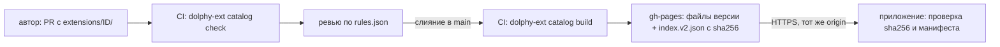

# Расширения

Расширение — каталог с манифестом `extension.json` и собранным кодом, который регистрирует вклады: виды заданий, темы оформления, рендереры блоков кода в Markdown, правила оценки, настройки, подписки на события обучения, команды, панели, инъекции компонентов в окно, расписания, импортёры и экспортёры. Манифест хранит только идентичность и метаданные; вклады объявляет код (`server` и `client`, раздел «Регистрация вкладов»). Любой вид задания (SQL, выбор варианта, дальше — перетаскивание, сопоставление) — расширение: ядро движка знает только конверт «вид + spec + ответ → вердикт», содержимое видов ему непрозрачно. Расширение исполняется без ограничений: серверный код — в процессе хоста расширений, интерфейс — компоненты Vue — рисуется прямо в окне приложения (раздел «Среда исполнения»; пользователь может отключить расширение). Решение и его причины — `docs/adr/0001-exercise-types-as-extensions.md`; форма расширения для авторов — `docs/adr/0002-authoring-simplicity-over-isolation.md`.

Расширение может добавлять команды в палитру приложения (Ctrl/⌘+K), панели — собственные экраны с пунктом в боковом меню (компонент Vue, который приложение рисует на своей странице) и инъекции — компоненты, которые окно рисует в любом своём месте (разделы «Команды», «Панели», «Инъекция в окно», [ADR 0008](../adr/0008-extension-commands-and-panels.md)).

Расширения можно ставить из каталога прямо в приложении («Настройки → Расширения → Каталог»): каталог — статический индекс `index.v2.json` и файлы версий на GitHub Pages, исходники и проверки лежат в репозитории `dolphy-app/dolphy-extensions`. Устройство, цепочка доверия и её пределы — раздел «Установка и каталог» и [ADR 0004](../adr/0004-extension-catalog.md).

Расширение поставляет в каталог не только код, но и таблицы стилей, изображения и шрифты, а в приложении показывается его значок. Панели, виды ответа и рендереры подключают свои ресурсы по адресу относительно модуля, `dolphy-ext://<id>/…` (раздел «Ресурсы расширения» и [ADR 0010](../adr/0010-extension-static-assets.md)).

## Что такое расширение

Каталог с минимальным манифестом `extension.json` и собранными файлами кода: `main.mjs` (серверная часть) и/или `client.mjs` (клиентская часть). Вклады в манифесте не объявляются: их регистрирует код, и приложение узнаёт о них после его запуска (раздел «Регистрация вкладов»). У расширения из одних тем и рендереров содержимого серверной части нет (`main` — `null`), у расширения из одних команд и событий нет клиентской (`client` — `null`). Ниже — собранное расширение с видом задания:

```
dolphy.choice/
  extension.json      # манифест: идентичность; main и client записала сборка
  main.mjs            # export const server: вид задания со схемами и обработчиками
  client.mjs          # export const client: addAnswerView(id, компонент Vue)
```

Манифест:

```json
{
  "id": "dolphy.choice",
  "version": "1.0.0",
  "apiVersion": 1,
  "main": "./main.mjs",
  "client": "./client.mjs",
  "name": "Multiple choice",
  "description": "Exercise type: the learner picks one or several options.",
  "tags": ["learning"]
}
```

Умолчания (`normalizeManifest`): `main` и `client` — `null`, если ключа нет; `dolphy-ext build` записывает `./main.mjs` и `./client.mjs` по тому, какие экспорты есть у `src/index.ts`. Явные значения важнее умолчаний. Формат один: после разбора манифест всегда нормализован.

Правила манифеста проверяет `parseManifest` (`packages/extension-host/src/manifest.ts`): допустимы ключи `id`, `version`, `apiVersion`, `main`, `client`, `name`, `description`, `author`, `platforms`, `minAppVersion`, `icon`, `tags`, `dependencies` и `$schema`; любой другой ключ отклоняется, а манифест с вкладами (ключ `contributes`) — с подсказкой «регистрируйте вклады в коде (`src/index.ts`: `server`, `client`)». `id` — `[a-z][a-z0-9-]*(.[a-z][a-z0-9-]*)*`; вклады с `id` называются `id` расширения или `<id>.…`; `main` и `client` — `.mjs`; все пути относительные и внутри каталога; `apiVersion` — `1`. Имя каталога равно `id`. Если файл, названный в манифесте (`main.mjs`, `client.mjs`), отсутствует, диагностика называет его.

### Метаданные и совместимость

Необязательные поля манифеста: `name` (название, 1–80 символов), `description` (1–500), `author` (GitHub-логин), `platforms` (подмножество `darwin`, `linux`, `win32`, без повторов; нет ключа — любая платформа) и `minAppVersion` (semver `x.y.z`). Локально их можно не указывать; для публикации в каталог `name`, `description` и `author` обязательны (проверка `dolphy-ext catalog check`, раздел «Установка и каталог»). Нормализованный манифест и `ResolvedExtension` хранят `null` / `[]` вместо отсутствующих значений. Необязательный `icon` — путь к файлу `.png` или `.webp` внутри расширения: квадрат от 64 до 512 пикселей, до 16 КиБ (SVG-значок не принимается). Обнаружение (`inspectExtensionDir`) читает файл при каждом обнаружении, проверяет формат, размер и геометрию и кладёт в `ResolvedExtension.icon` и `ExtensionInfoDto.icon` как `data:image/png|webp;base64,…`; снимок обнаружения хранит результат до следующего обнаружения. Некорректный значок делает расширение `invalid` с причиной. Окно показывает его 32 px в списке установленных, на карточке каталога и в диалоге установки; без значка вид прежний. У поставляемых расширений механизм тот же.

Необязательное поле `tags` — до 5 уникальных значений закрытого словаря `EXTENSION_TAGS` из `@dolphy-app/extension-api` (`learning`, `language`, `content`, `theme`, `interface`, `productivity`, `developer`); неизвестный, повторный или шестой тег — ошибка манифеста с путём `tags.N` и перечнем допустимых значений. Нормализованный манифест хранит `[]` вместо отсутствующего ключа. Теги нужны каталогу (фильтры и чипы); в каталог они попадают в запись версии полного индекса (раздел «Установка и каталог»).

Совместимость проверяют `discoverExtensions` и `inspectExtensionDir` по `appVersion` и `platform` (по умолчанию `process.platform`). Расширение не загружается и получает состояние `invalid` с диагностикой `requires-app` (данные `minAppVersion`) или `unavailable-platform` (данные `platform`); английский текст для CLI и логов даёт `formatDiagnostic` (`requires app >= X.Y.Z`, `not available on <platform>`), проверку совместимости — `checkCompatibility` из `@dolphy-app/extension-catalog`, её же используют выбор версии каталога и установщик. Версия приложения приходит из `EngineConfig.appVersion`; в несобранном приложении (режим разработки) она не задана, и `minAppVersion` не проверяется, пока не задан `DOLPHY_APP_VERSION=x.y.z`. `dolphy-ext validate` версии приложения не знает и сообщает только об ошибках формы этих полей.

**Зависимости.** Необязательное `dependencies` — до 16 записей `{ id, range? }`: расширения, без которых это не работает (раздел «Зависимости (`dependencies`)»). Каталог несёт их в записи версии индекса, а окно показывает в диалоге установки и на карточке каталога.

**Диагностики.** Причина состояния расширения — не строка, а `diagnostics: [{code, data}]` (`ExtensionInfoDto`, контракт 14). Коды закрытого списка `EXTENSION_DIAGNOSTIC_CODES`: `manifest-unreadable` (`reason`), `manifest-invalid` (`issues` — `путь: сообщение`), `id-mismatch` (`expected`, `actual`), `requires-app` (`minAppVersion`), `unavailable-platform` (`platform`), `claim-clash` (`kind`, `name`, `by`), `load-failed` (`reason`: `server` бросил исключение или не уложился в 10 с, раздел «Сбой регистрации (`load-failed`)»), `overridden-by` (`origin`, `version`), `safe-mode`, зависимости `dependency-missing`, `dependency-disabled`, `dependency-version`, `dependency-unmet` (`id`, `range`, у версии `found`) и `dependency-cycle` (`cycle`) — раздел «Зависимости (`dependencies`)». У загруженного и отключённого пользователем расширения список пуст, если нет безопасного режима; причина отзыва остаётся отдельным полем `revoked`. Окно строит текст по коду и данным на русском и английском (`settings.extensions.diagnostic.<код>`); `formatDiagnostic` из `@dolphy-app/extension-host` — единственное место, строящее английский текст для `dolphy-ext`, логов и установщика.

**Ключ `$schema` и JSON Schema.** В манифесте допустим необязательный строковый ключ `$schema`: приложение и инструменты его игнорируют, `dolphy-ext build` копирует манифест как есть, ключ остаётся в `extension.json` сборки. `@dolphy-app/extension-api` содержит `extension.schema.json` (JSON Schema 2020-12 из zod-манифеста: `z.toJSONSchema(manifestSchema, { io: 'input', unrepresentable: 'any' })`, `additionalProperties: false` у объектов); файл лежит в `packages/extension-api/`, коммитится, сверяется тестом `manifest-schema.test.ts` (обновление — `UPDATE_EXTENSION_SCHEMA=1`) и публикуется как `dist/extension.schema.json` с подпутём экспорта `./extension.schema.json`. Генератор проекта пишет в манифест `$schema`, указывающий на этот файл установленного пакета. Схема помогает редактору (подсказки, ошибки), но не выражает перекрёстные правила — например, цикл зависимостей между расширениями: источником истины остаются `parseManifest` и `dolphy-ext validate`.

**Эволюция API.** До заморозки API совместимость не гарантируется: `apiVersion` остаётся `1`, ломающие изменения (манифест, API регистрации, каталог) допустимы в любом релизе и перечисляются в `CHANGELOG.md`, слои совместимости не создаются, расширения поставки и каталога обновляются в том же изменении. Момент заморозки и правила устаревания вводит отдельное решение владельца — [ADR 0014](../adr/0014-extension-api-evolution.md); там, где ADR 0001 и 0002 о версионировании расходятся, действует он.

Типы и константы API — пакет `@dolphy-app/extension-api`.

## Процессы

```
renderer ── MessagePort ──► движок (utilityProcess «dolphy-engine»)
                              │  ExerciseTypes: describe/validate (регистрации, Ajv)
                              │  project / grade / referenceAnswer — MessageChannelMain
                              ▼
                            хост расширений (utilityProcess «dolphy-ext-host»)
                              │  runtime: server каждого расширения, обработчики, воркеры (dolphy.sql, dolphy.js: fork)
```

- Канал движок ↔ хост расширений создаёт main (`host-link.ts`); при перезапуске любого процесса выдаётся новая пара портов.
- Клиент в движке (`createRemoteExerciseTypes`) держит дедлайн `timeoutMs + 2 с` на `grade`. Синхронный цикл в расширении не прервать, поэтому по дедлайну клиент отдаёт `error/timeout` и просит main перезапустить хост (`restart-ext-host`). Закрытие канала во время `grade` — `error/worker_crash`.
- Хост расширений перезапускается с backoff; после `MAX_CRASHES` падений за минуту перезапуск прекращается, приложение продолжает работать (карточки), вызовы видов получают `EXERCISE_TYPE_UNAVAILABLE`.
- Хост расширений сам расширения не ищет. Набор находит движок (`discoverExtensions` читает только манифесты и даёт кандидатов `ExtensionCandidate`; изменяемый снимок `DiscoveryHolder` общий у политики, каталога видов, реестра и установщика) и присылает его сообщением `replaceExtensions` по каналу: первым сообщением после каждого подключения порта (старт, перезапуск любой стороны) и после каждого применения изменений (`reload()`: установка, удаление, включение, правка в режиме разработчика). Хост параллельно загружает `main.mjs` каждого кандидата, вызывает `server` и отвечает `ServerRegistration` расширения (метаданные и схемы видов, правила оценки, определения настроек, имена событий, метаданные команд, расписания, ввод и вывод импортёров и экспортёров) либо причиной сбоя (`load-failed`); обработчики остаются в хосте, движок получает только данные. `ExtensionRuntime.replace` меняет набор атомарно; вытесненные (удалённые или изменившиеся по версии, файлам `revision` или регистрациям) расширения получают очистку, которую вернул `server`, после вызовов в полёте (не дольше `timeoutMs` вызова + 2 с). Код в процессе хоста грузится с `?v=<n>` в URL: перезагружается входной модуль, его зависимости должны быть собраны в него. Событие `contributions-changed` движок публикует после ответа хоста; `ContributionsDto.generation` растёт при каждом применении и сбрасывается при запуске движка.

## Обнаружение

Два корня: расширения из поставки (`Resources/extensions`, в разработке — `<outRoot>/extensions`, read-only) и пользовательские (`<userData>/extensions`). Подкаталог с `extension.json` — расширение. Одинаковый `id` в обоих корнях — побеждает пользовательское (лог `info`). Повторный id вида задания, правила оценки, настройки, команды, расписания, импортёра или экспортёра у разных расширений: первое выигрывает, второе пропускается целиком с диагностикой `claim-clash`. Набор находится при запуске и перечитывается на лету при установке, удалении, включении и правке в режиме разработчика (раздел «Живое применение»). «Настройки → Расширения» показывает каждое расширение, его зарегистрированные вклады и причину, по которой оно не загрузилось или было перекрыто. Отключённое пользователем расширение (переключатель «Включено») остаётся в списке с пометкой «Отключено» и не даёт ни видов заданий, ни тем, ни рендереров, ни правил оценки; расширения из поставки отключить нельзя.

Имена подкаталогов, начинающиеся с точки, расширениями не считаются: `.staging`, `.trash` и `.catalog` — служебные каталоги установщика (раздел «Установка и каталог»). Если в каталоге расширения из пользовательского корня лежит `.dolphy-install.json`, расширение считается установленным из каталога: обнаружение читает файл, он нужен обновлениям и отзыву. Нет файла (расширение скопировано вручную) или он повреждён (предупреждение в логе) — расширение работает, но обновлений и отзыва не получает. Совместимость (`minAppVersion`, `platforms`) проверяется при обнаружении (раздел «Метаданные и совместимость»).

Файлы расширения отдаёт протокол `dolphy-ext://<id>/<путь>` (`apps/desktop/electron/main/shells/extension-assets.ts`). Корни — каталог разработчика, пользовательский, из поставки: файл берётся из первого корня, где он есть, и отвергнутый файл не уступает место одноимённому из следующего корня. Отдаются только:

- скрипты `.js`/`.mjs` с `Content-Type: text/javascript`;
- ресурсы `css`, `svg`, `png`, `webp`, `jpg`, `jpeg`, `woff2` с `Content-Type` из `ASSET_MIME` (`@dolphy-app/extension-catalog`).

Расширение имени — строчными буквами (`a.PNG` — 404). Все ответы несут `X-Content-Type-Options: nosniff`, `Cache-Control: no-cache` (правка в режиме разработчика видна сразу) и `Access-Control-Allow-Origin: *` (окно загружается с `file://`, а модули и шрифты идут в режиме CORS). SVG получает ещё `Content-Security-Policy: default-src 'none'; style-src 'unsafe-inline'; sandbox`: даже открытый как документ, он не выполняет скрипты.

Всё остальное — 404: `extension.json`, `README.md`, `.json`, `.md`, `.txt`, прочие типы, любой путь, где сегмент начинается с точки, выход за каталог. Протокол не доверяет каталогу: проверки каталога (`catalog check`) не касаются расширений из режима разработчика и скопированных вручную. Поэтому при каждом запросе:

- файл приводится к `realpath`; путь за пределами `realpath` каталога расширения — 404 (сам каталог расширения может быть ссылкой: так разработчик подключает проект); для ресурса запрещена любая ссылка внутри каталога — и на файл, и на подкаталог (`realpath` должен совпасть с запрошенным путём), для скрипта разрешена ссылка внутрь каталога;
- размер ресурса не больше потолка его типа (`ASSET_LIMITS`: `css` 256 КиБ, `svg` 64 КиБ, изображение 512 КиБ, `woff2` 1 МиБ); больше — 413 и предупреждение в логе. У скриптов потолка нет.

CSP окна содержит `script-src 'self' dolphy-ext:`: модули расширений грузятся в окно через `import()`. Окно грузится с `file://` (origin `null`), поэтому модули и ресурсы идут в режиме CORS.

## Авторинг

Упражнение объявляет вид в `engine.exercise`:

```yaml
engine:
  exercise:
    type: dolphy.sql
    timeoutMs: 2000 # необязательно, по умолчанию 2000
    spec:
      fixture: fixtures/emp.sql
      expected: checks/join.csv
      reference: solutions/join.sql
```

Компилятор проверяет `spec` по схеме вида (`E_EXERCISE_SPEC`), сообщает о неизвестном виде (`W_UNKNOWN_EXERCISE_TYPE`) и прогоняет эталон: `referenceAnswer` → `grade` (`E_REFERENCE_FAILS`). CLI: `engine-cli validate <библиотека> --run-checks --extensions <каталог-корень>` (флаг повторяемый; без него проверки видов пропускаются, а `--run-checks` требует его).

Ответ ученика не попадает в журнал как есть: журнал хранит оценку и источник (`runner`); `spec` и ключи ответов в окно не уходят — там только `task { type, timeoutMs }` и `view` из `project`.

## Регистрация вкладов

Расширение ничего не объявляет в манифесте: вклады регистрирует код. `src/index.ts` экспортирует `server` (`ServerEntry`: исполняется в хосте расширений на Node, собирается в `main.mjs`) и/или `client` (`ClientEntry`: исполняется в окне, собирается в `client.mjs`). Каждый из них — функция `(контекст) => очистка`: она вызывает методы контекста, каждый вызов добавляет вклад и возвращает `Disposable`, а возвращённая очистка (функция или `{ dispose }`) выполняется при выгрузке расширения. Типы — пакет `@dolphy-app/extension-api`, помощники `defineServer`, `defineClient` и `defineExerciseType` — `@dolphy-app/extension-sdk`.

Во всех вкладах с `id`: `id` равен id расширения или начинается с `<id расширения>.`, повтор id в расширении — ошибка. Регистрация `server` — всё или ничего: исключение (неверный id, превышение лимита, неверная запись) или срок в 10 с — `load-failed`, вкладов у расширения нет (разделы «Сбой регистрации (`load-failed`)» и «Сроки»). Каждый пример этого раздела, помеченный строкой `Файл ...`, проверяется тестом `packages/extension-tools/test/docs-contributions.test.ts`: проект собирается `dolphy-ext build`, проходит `validate` и `tsc`, а `server` запускается через `createTestServer`.

### Точки входа: `server` и `client`

```ts
import { defineClient, defineServer } from '@dolphy-app/extension-sdk';

export const server = defineServer((s) => {
  s.registerCommand({ id: 'acme.open', title: 'Open', run: () => undefined });
});

export const client = defineClient((c) => {
  c.addPanel({ id: 'acme.panel', title: 'Acme', component: Screen });
});
```

`ServerContext` (параметр `server`, в примерах `s`):

| Член                                                    | Что                                                                                                           |
| ------------------------------------------------------- | ------------------------------------------------------------------------------------------------------------- |
| `extensionId`                                           | id расширения                                                                                                 |
| `logger`                                                | журнал расширения: `debug`, `info`, `warn`, `error` (`fields`, `message?`); запись всегда несёт `extensionId` |
| `library`                                               | чтение библиотеки курсов: `readText(path)`, `stat(path)`                                                      |
| `storage`, `secrets`, `stats`, `notifications`          | хранилище, секреты, статистика обучения, системные уведомления (раздел «Данные, настройки и события»)         |
| `settings`                                              | `get(id)` — текущее значение или `default`; `onDidChange(handler)` — изменение пользователем                  |
| `registerExerciseType`, `registerGradePolicy`           | вид задания, правило оценки                                                                                   |
| `registerSettings`, `on`, `registerCommand`, `schedule` | настройки, подписка на событие обучения, серверная команда, расписание                                        |
| `before`                                                | хук «до» в учебном цикле: `session.start`, `practice.batch` (раздел «Хуки в учебный цикл»)                    |
| `registerImporter`, `registerExporter`                  | импортёр и экспортёр                                                                                          |
| `engine`                                                | клиент движка, все методы записи и чтения (раздел «Доступ к движку»)                                          |
| `handle`                                                | ответ на вызов `defineRpc` (раздел «RPC между частями»)                                                       |

`ClientContext` (параметр `client`, в примерах `c`): `extensionId`, `app` (`AppApi`, раздел «API окна»), `engine`, `addPanel`, `addInjection`, `addAnswerView`, `addMarkdownRenderer`, `addTheme`, `addCommand`. Компоненты в записях клиента — компоненты Vue или `Mountable` (раздел «Интерфейс на других фреймворках»); общие `vue` и `vuetify` дают приложение и окно (раздел «Интерфейс в окне»).

### Что как регистрируется

| Вклад               | Вызов                                                                                                                                                          | Часть              |
| ------------------- | -------------------------------------------------------------------------------------------------------------------------------------------------------------- | ------------------ |
| Вид задания         | `s.registerExerciseType(defineExerciseType({ id, title?, specSchema, answerSchema, project, grade, referenceAnswer? }))` и `c.addAnswerView(id, Component | Mountable)`    | `server`, `client` |
| Правило оценки      | `s.registerGradePolicy({ id, label, evaluate })`                                                                                                               | `server`           |
| Тема                | `c.addTheme({ id, label, dark, colors, variables? })`                                                                                                          | `client`           |
| Рендерер markdown   | `c.addMarkdownRenderer(language, Component | Mountable)`                                                                                                                   | `client`           |
| Настройки           | `s.registerSettings([...])`; чтение — `s.settings.get(id)`, `s.settings.onDidChange`                                                                           | `server`           |
| События             | `s.on(name, handler)`                                                                                                                                          | `server`           |
| Хуки «до»           | `s.before(name, handler)`; имена — `session.start`, `practice.batch`                                                                                           | `server`           |
| Команды             | `s.registerCommand({ id, title, description?, category?, keybindings?, palette?, when?, icon?, run })` (обработчик в хосте), `c.addCommand({ …, run })` (в окне) | `server`, `client` |
| Панель              | `c.addPanel({ id, title, icon?, when?, component: Component | Mountable })`; внутри `usePanel()` (`props`, `context`, `call`) или `ctx.handle` у `Mountable`; открывается результатом команды `openPanel(id, props)`  | `client`           |
| Инъекция            | `c.addInjection({ id, target, position?, component: Component | Mountable })`; внутри `useInjection()` → `{ target, position }` или `ctx.handle` у `Mountable`; устойчивая цель — `anchorSelector('dailyPlan')`       | `client`           |
| RPC                 | `defineRpc({ name, input, output })` (общий модуль), `s.handle(contract, handler)`, в компоненте `useRpc(contract)`                                            | `server`, `client` |
| Расписание          | `s.schedule({ id, every: 'daily', at }, handler)` или `s.schedule({ id, every: 'hourly' }, handler)`                                                           | `server`           |
| Импортёр, экспортёр | `s.registerImporter(…)`, `s.registerExporter(…)`                                                                                                               | `server`           |
| Зависимости         | только в манифесте (`dependencies`)                                                                                                                            | —                  |

### Виды заданий (`registerExerciseType`, `addAnswerView`)

Что даёт ученику: новый способ отвечать на упражнение — свой ввод ответа (компонент) и проверка кодом расширения. Любой вид задания (SQL, выбор варианта, дальше — перетаскивание, сопоставление) — расширение: ядро движка знает только конверт «вид + spec + ответ → вердикт», содержимое видов ему непрозрачно. Упражнение выбирает вид в `engine.exercise.type`.

Запись вида (`ExerciseTypeRegistration`): `id`; необязательный `title` (`LocalizedText`, 1–60 символов; подпись вклада в списке расширений, без неё показан id); `specSchema` и `answerSchema` — JSON Schema 2020-12 объектами для `engine.exercise.spec` и ответа ученика (приложение проверяет `spec` и ответ по ним до вызова обработчиков; схема, которую Ajv не компилирует, отклоняет расширение); `project({ exerciseId, spec })` — публичный вид задания для компонента ответа, без ключей ответа (вызывается при начале попытки); `grade({ exerciseId, spec, answer, timeoutMs, authorMode })` — проверка; необязательный `referenceAnswer({ exerciseId, spec })` — эталонный ответ для проверки компилятором (`undefined` — эталона нет). Ввод ответа — отдельный вклад окна: `c.addAnswerView(<id вида>, компонент)`; вид можно добавить для вида другого расширения.

`grade` возвращает `GradeResult`: `passed`, `failed` (вина ученика: `reason`, необязательно `feedback`, `detail` — только в режиме автора) или `error` (не вина ученика, попытка не тратится). Причины `failed`/`error` — открытые строки расширения; причины хоста (`timeout`, `resource_kill`, `worker_crash`, `internal`) порождает хост. Оценку FSRS считает ядро по `outcome` (`GradePolicy`); расширение её не выставляет.

Компонент ввода ответа окно рисует в своём дереве на ходу упражнения (`AnswerView.vue`), на тех же `vue` и `vuetify`, с темой и языком окна; вид ищется по id вида в реестре окна. Свойства компонента — `AnswerViewProps`: `view` (результат `project`), `value`, `disabled`, `verdict` и `label` (доступное имя поля, которое задаёт приложение; `null` — нет). Компонент сообщает ответ событием `change` (`{ value, complete }`: `complete` — ответ можно отправлять на проверку) и просит проверить его событием `submit`. Кнопку «Проверить», подсказки и вердикт рисует приложение. Строки интерфейса приложения расширению недоступны: текст в компоненте — данные задания или `label` от приложения. Цвета берутся из темы Vuetify окна (`useTheme()`, CSS-переменные `--v-theme-*`). Ошибка в `setup`, рендере или обработчике компонента заменяет только область ответа карточкой с сообщением и кнопкой «Повторить»; сессия и окно продолжают работать.

Файл `extension.json` (вид задания):

```json
{
  "id": "acme.echo",
  "version": "1.0.0",
  "apiVersion": 1
}
```

Файл `src/index.ts` (вид задания):

```ts
export { client } from './client.ts';
export { server } from './server.ts';
```

Файл `src/server.ts` (вид задания):

```ts
import { defineExerciseType, defineServer } from '@dolphy-app/extension-sdk';

interface Spec {
  expected: string;
}

export const server = defineServer((s) => {
  s.registerExerciseType(
    defineExerciseType<Spec, string, Record<string, never>>({
      id: 'acme.echo',
      title: { en: 'Echo', ru: 'Эхо' },
      specSchema: {
        type: 'object',
        required: ['expected'],
        properties: { expected: { type: 'string' } },
      },
      answerSchema: { type: 'string' },
      project: () => ({}),
      grade: ({ spec, answer }) =>
        answer === spec.expected
          ? { outcome: 'passed' }
          : { outcome: 'failed', reason: 'mismatch' },
      referenceAnswer: ({ spec }) => spec.expected,
    }),
  );
});
```

Файл `src/client.ts` (вид задания):

```ts
import { defineClient } from '@dolphy-app/extension-sdk';
import { EchoAnswer } from './echo-answer.ts';

export const client = defineClient((c) => {
  c.addAnswerView('acme.echo', EchoAnswer);
});
```

Файл `src/echo-answer.ts` (вид задания):

```ts
import type { AnswerChange } from '@dolphy-app/extension-sdk';
import { defineComponent, h } from 'vue';
import type { PropType } from 'vue';

export const EchoAnswer = defineComponent({
  props: {
    view: { type: null },
    value: { type: null },
    disabled: Boolean,
    verdict: { type: null },
    label: { type: String as PropType<string | null>, default: null },
  },
  emits: ['change', 'submit'],
  setup(props, { emit }) {
    return () =>
      h('input', {
        type: 'text',
        value: typeof props.value === 'string' ? props.value : '',
        disabled: props.disabled,
        'aria-label': props.label ?? undefined,
        onInput: (event: Event) => {
          if (!(event.target instanceof HTMLInputElement)) return;
          const value = event.target.value;
          const change: AnswerChange<string> = {
            value,
            complete: value.trim().length > 0,
          };
          emit('change', change);
        },
        onKeydown: (event: KeyboardEvent) => {
          if (event.key === 'Enter') emit('submit');
        },
      });
  },
});
```

### Темы (`addTheme`)

Что даёт ученику: плитка темы в «Настройки → Внешний вид» рядом с «Как в системе», «Светлая», «Тёмная». Тема — только данные, кода нет; регистрирует её `client`: `c.addTheme({ id, label, dark, colors, variables? })`.

Файл `extension.json` (тема):

```json
{
  "id": "acme.midnight",
  "version": "1.0.0",
  "apiVersion": 1
}
```

Файл `src/index.ts` (тема):

```ts
import { defineClient } from '@dolphy-app/extension-sdk';

export const client = defineClient((c) => {
  c.addTheme({
    id: 'acme.midnight',
    label: { en: 'Midnight', ru: 'Полночь' },
    dark: true,
    colors: {
      background: '#101820',
      surface: '#1B2733',
      primary: '#FFB000',
      'on-primary': '#101820',
    },
    variables: { 'border-opacity': 0.2 },
  });
});
```

Правила:

- `id` не из встроенных (`system`, `light`, `dark`); `label` — `LocalizedText`, 1–60 символов; `dark` — тёмная ли тема (влияет на базовые цвета Vuetify).
- `colors` — непустой объект; значения — строго `#rrggbb` или `#rrggbbaa`. Разрешённые ключи (`THEME_COLOR_KEYS`): `background`, `surface`, `surface-bright`, `surface-light`, `surface-variant`, `on-background`, `on-surface`, `on-surface-variant`, `primary`, `on-primary`, `secondary`, `on-secondary`, `error`, `on-error`, `warning`, `on-warning`, `success`, `on-success`, `info`, `on-info`, `hero-start`, `hero-end`, `hero-contrast`. Любой другой ключ отклоняет регистрацию.
- `variables` — необязательно. Разрешённые ключи (`THEME_VARIABLE_KEYS`): `border-color` (цвет `#rrggbb`/`#rrggbbaa`), `border-opacity`, `medium-emphasis-opacity`, `high-emphasis-opacity`, `disabled-opacity` (числа от 0 до 1).
- Цвета блоков кода в тексте уроков и заданий выводятся из цветов темы, отдельных ключей для них нет: `primary` — ключевые слова, `success` — строки, `warning` — числа и имена классов, `info` — свойства, `secondary` — теги и сущности, `on-surface-variant` — комментарии; фон блока — `surface-variant`, обычный код — `on-surface`. Приложение само меняет светлоту каждого цвета (тон и насыщенность остаются), чтобы контраст с `surface-variant` был не ниже 4.5:1, поэтому тема с бледными акцентами остаётся читаемой. Различимость подсветки зависит от того, насколько различаются эти пять акцентов: если автор задаёт их близкими по тону, токены в коде тоже будут близкими.

### Рендереры содержимого (`addMarkdownRenderer`)

Что даёт ученику: блоки кода ` ```<language> ` в тексте заданий и уроков выводит расширение (например, `dolphy.math` рисует формулы из блоков ` ```math `). Без расширения такой блок остаётся обычным кодом.

Регистрация в `client`: `c.addMarkdownRenderer(language, компонент)`. `language` — `[a-z][a-z0-9-]{0,31}` (`MARKDOWN_LANGUAGE_PATTERN`); один язык в расширении — один рендерер. Компонент Vue получает свойства `MarkdownBlockProps`: `source` — текст блока, `language`.

Файл `extension.json` (рендерер содержимого):

```json
{
  "id": "acme.shout",
  "version": "1.0.0",
  "apiVersion": 1
}
```

Файл `src/index.ts` (рендерер содержимого):

```ts
import { defineClient } from '@dolphy-app/extension-sdk';
import { defineComponent, h } from 'vue';

const Shout = defineComponent({
  props: {
    source: { type: String, required: true },
    language: { type: String, required: true },
  },
  setup: (props) => () => h('pre', props.source.toUpperCase()),
});

export const client = defineClient((c) => {
  c.addMarkdownRenderer('shout', Shout);
});
```

Приложение рисует компонент на месте блока ` ```<язык> `, в общем дереве Vue окна, на тех же `vue` и `vuetify` и с темой окна; клиентская часть загружается по `dolphy-ext://`. Если она не загрузилась, для языка нет компонента или компонент бросил исключение, блок остаётся исходным текстом, под ним показывается заметка «Не удалось вывести блок…», страница работает дальше.

### Правила оценки (`registerGradePolicy`)

Что даёт ученику: в «Настройки → Обучение» (группа «Оценка», «Правило оценки») кроме встроенного `passAtN` появляется правило расширения. Оценка FSRS 1–5 за закрытую попытку считается выбранным правилом; выбор хранится в настройках. Регистрация в `server`: `s.registerGradePolicy({ id, label, evaluate })`.

Файл `extension.json` (правило оценки):

```json
{
  "id": "acme.policy",
  "version": "1.0.0",
  "apiVersion": 1
}
```

Файл `src/index.ts` (правило оценки):

```ts
import { defineServer } from '@dolphy-app/extension-sdk';

export const server = defineServer((s) => {
  s.registerGradePolicy({
    id: 'acme.policy.generous',
    label: { en: 'Generous', ru: 'Щедрое' },
    evaluate: ({ verdicts, gaveUp }) => {
      if (gaveUp) return 1;
      return verdicts.some(({ outcome }) => outcome === 'passed') ? 5 : null;
    },
  });
});
```

Контракт:

- Вход `evaluate` — `GradePolicyInput`: `verdicts` (вердикты попытки по порядку: `{ outcome: 'passed' | 'failed' | 'error', reason? }`) и `gaveUp` («Сдаться»).
- Результат — целое 1–5 или `null` («правило оценки не ставит, нужна самооценка»); можно вернуть промис.
- `id` — не `passAtN` (занят встроенным правилом), `label` — `LocalizedText`, 1–60 символов.
- Любой сбой правила — хост недоступен, исключение, дедлайн 2 с (`POLICY_DEADLINE_MS` в `packages/extension-host/src/client.ts`), результат вне 1–5 и не `null`, расширение пропало — даёт предупреждение в лог и оценку по `passAtN` (`resolveGradePolicy`); закрытие попытки не зависит от чужого кода. Если выбранное правило пропало, экран настроек показывает, что действует Pass@N.
- Проверить правило без приложения: `createTestServer(server).gradePolicy(id).evaluate(input)` из `@dolphy-app/extension-sdk/testing`.

### Настройки (`registerSettings`)

Что даёт пользователю: у расширения с настройками в «Настройки → Расширения» есть кнопка «Настройки»; приложение рисует форму по определениям (переключатель, строка, многострочный текст, цвет, число, выбор из вариантов, редактор списка строк), «Сбросить» возвращает значения по умолчанию. Значения проверяет движок и хранит в `engine.db`. Регистрация в `server`: `s.registerSettings([...])`; чтение — `s.settings.get(id)`, изменение — `s.settings.onDidChange`.

Файл `extension.json` (настройки расширения):

```json
{
  "id": "acme.streak",
  "version": "1.0.0",
  "apiVersion": 1
}
```

Файл `src/index.ts` (настройки расширения):

```ts
import { defineServer, notify } from '@dolphy-app/extension-sdk';

export const server = defineServer((s) => {
  s.registerSettings([
    {
      id: 'acme.streak.enabled',
      type: 'boolean',
      label: { en: 'Count the streak', ru: 'Считать серию дней' },
      default: true,
    },
    {
      id: 'acme.streak.title',
      type: 'string',
      label: { en: 'Title', ru: 'Заголовок' },
      description: {
        en: 'Shown next to the streak.',
        ru: 'Показывается рядом с серией.',
      },
      default: 'Серия',
      maxLength: 40,
    },
    {
      id: 'acme.streak.goal',
      type: 'number',
      label: { en: 'Goal, days', ru: 'Цель, дней' },
      default: 7,
      min: 1,
      max: 365,
      integer: true,
      group: { en: 'Goal', ru: 'Цель' },
      order: 1,
    },
    {
      id: 'acme.streak.motto',
      type: 'text',
      label: { en: 'Motto', ru: 'Девиз' },
      default: 'Каждый день',
      maxLength: 200,
      group: { en: 'Goal', ru: 'Цель' },
      order: 2,
    },
    {
      id: 'acme.streak.accent',
      type: 'color',
      label: { en: 'Streak color', ru: 'Цвет серии' },
      default: '#3366CC',
      group: { en: 'Look', ru: 'Оформление' },
    },
    {
      id: 'acme.streak.days',
      type: 'list',
      label: { en: 'Days off', ru: 'Дни без занятий' },
      default: ['сб', 'вс'],
      maxItems: 7,
      itemMaxLength: 10,
      group: { en: 'Look', ru: 'Оформление' },
    },
    {
      id: 'acme.streak.mode',
      type: 'enum',
      label: { en: 'Mode', ru: 'Режим' },
      default: 'daily',
      options: [
        { value: 'daily', label: { en: 'Every day', ru: 'Каждый день' } },
        { value: 'weekly', label: { en: 'Once a week', ru: 'Раз в неделю' } },
      ],
    },
  ]);

  // читается при вызове обработчика: текущее значение или default
  s.registerCommand({
    id: 'acme.streak.show-goal',
    title: { en: 'Show the goal', ru: 'Показать цель' },
    run: () => {
      const goal = s.settings.get('acme.streak.goal');
      return notify(`Цель: ${String(goal)} дн.`);
    },
  });
});
```

Контракт:

- Типы: `boolean`, `string` (`maxLength`), `text` (многострочная строка, `maxLength` ≤ 10 000), `color` (`#rrggbb`; значение хранится в нижнем регистре), `list` (список строк: `maxItems` 1–50, умолчание 50; `itemMaxLength` 1–200, умолчание 200), `number` (`min`, `max`, `integer`), `enum` (`options: [{ value, label }]`). `label` — `LocalizedText`, 1–60 символов, `description` — до 500. Код получает `boolean`, `string`, `number` и `string[]` (`text` и `color` — строки); `onDidChange` срабатывает на изменение значения, равный список изменением не считается.
- Структура формы: необязательные `group` (заголовок раздела, 1–60), `order` (целое 0–1000, умолчание 0) и `visibleWhen: { setting, equals }`. Форма сортирует настройки по `order`, затем по порядку объявления; разделы идут в порядке первого вхождения в этом отсортированном списке, настройки без `group` — первым разделом без заголовка. Поле с `visibleWhen` скрыто, пока значение настройки `setting` того же расширения не равно `equals` (без сохранённого значения берётся её `default`). Скрытое значение сохраняется и доходит до кода. Ошибка регистрации: несуществующая цель, сама настройка, `list`, настройка, у которой есть свой `visibleWhen` (цепочки и циклы запрещены), `equals` другого типа, чем цель (`boolean`, `number` или строка). Это не выражение `when` команд.
- Движок отклоняет неподходящее значение ошибкой `INVALID_ARGUMENT` с `details.reason`: `type`, `integer`, `range`, `max-length`, `option`, `format` (цвет не `#rrggbb`), `max-items`.
- `id` равен id расширения или начинается с `<id>.`, уникален; `default` обязан удовлетворять ограничениям (иначе регистрация отклоняется).
- Код читает `s.settings.get(id)` синхронно (текущее значение или `default`; `id`, которого никто не регистрировал, бросает) и подписывается `s.settings.onDidChange(handler)`; изменение пользователя доходит до работающего расширения без перезапуска, сбой обработчика только пишется в журнал.
- Значение, переставшее подходить определению после обновления расширения, при чтении заменяется `default`.
- Данные, которые расширение копит само, лежат в `s.storage` (раздел «Хранилище (`server.storage`)»).

### События обучения (`on`)

Расширение подписывается на события: `session.started` и `session.finished` (`{ sessionId, at }`), `attempt.closed` (`{ exerciseId, courseId, lessonId, grade, outcome, source, at }`; `outcome` — `passed`, `failed`, `gave-up` или `self-assessed`). Ответы, `spec`, обратная связь и текст упражнения в события не попадают. Подписка — вызов `s.on(name, handler)` в `server`.

Файл `extension.json` (подписка на события):

```json
{
  "id": "acme.streak",
  "version": "1.0.0",
  "apiVersion": 1
}
```

Файл `src/index.ts` (подписка на события):

```ts
import { defineServer } from '@dolphy-app/extension-sdk';

export const server = defineServer((s) => {
  s.registerSettings([
    {
      id: 'acme.streak.enabled',
      type: 'boolean',
      label: { en: 'Count the streak', ru: 'Считать серию дней' },
      default: true,
    },
  ]);

  s.settings.onDidChange(({ id, value }) => {
    s.logger.info({ id, value }, 'setting changed');
  });

  s.on('attempt.closed', async ({ grade }) => {
    if (s.settings.get('acme.streak.enabled') !== true) return;
    const total = (await s.storage.get<number>('closed')) ?? 0;
    await s.storage.set('closed', total + 1);
    s.logger.debug({ grade, total: total + 1 }, 'attempt counted');
  });
});
```

Контракт:

- `s.on(name, handler)` — один обработчик на событие; обработчик получает поля события, тип которых следует имени события.
- Доставка асинхронная, по порядку для одного расширения, не более одного раза; обработчик ограничен 2 с; очередь — 100 событий на расширение, при переполнении отбрасываются самые старые с предупреждением в лог.
- Сбой, исключение или таймаут обработчика никогда не влияют на журнал, оценку и ответ команды. Отключённое расширение и расширение без подписки на событие его не получает.
- `attempt.closed` — по одному разу на записанную попытку ученика; не приходит при повторе запроса, синхронизации, импорте и выводе по диагностике (`placement`).

### Хуки в учебный цикл (`before`)

Серверная часть вмешивается в учебный цикл хуками «до»: `s.before(name, handler)`. Хук вызывается до операции движка и может изменить её вход или отменить её. Имена — закрытый список (`EXTENSION_HOOK_NAMES` в `@dolphy-app/extension-api`); неизвестное имя — ошибка регистрации. На имя — один обработчик в расширении; `s.before` возвращает `Disposable`.

| Хук              | Запрос                                                                                                               | Ответ                                                                                           | Когда                                                                                                                                         |
| ---------------- | -------------------------------------------------------------------------------------------------------------------- | ----------------------------------------------------------------------------------------------- | --------------------------------------------------------------------------------------------------------------------------------------------- |
| `session.start`  | `{ now }` (epoch мс)                                                                                                 | ничего: хук может только отменить, бросив ошибку                                                | `practice.startSession`, до создания сессии                                                                                                   |
| `practice.batch` | `{ sessionId, exerciseIds, reasons, memory, source }`; `sessionId` — `null`, пока сессии нет (план дня до `startSession`); `reasons[i]` — `review`, `new` или `remediation` для `exerciseIds[i]`; `memory[i]` — память движка об этом упражнении (ниже) | `{ exerciseIds, reasons }` одинаковой длины: упражнения можно переставлять, убирать и добавлять | после того как батч собран и перед возвратом: `practice.getBatch` и `plan.getDay` (из него окно строит сессию); `source` — `batch` или `plan` |

Порядок и результат:

- Расширения с хуком вызываются по очереди, по возрастанию id расширения; каждое получает результат предыдущего (для `session.start` — тот же запрос). Расширения без хука и отключённые не вызываются.
- Ответ `practice.batch` проверяет движок: схема, длины массивов равны, не больше `EXTENSION_HOOK_LIMITS.maxExercises` (500) упражнений, каждый id есть в библиотеке и принадлежит её курсам. Описания упражнений движок пересобирает для возвращённых id.
- `memory` параллелен `exerciseIds` запроса (ответ без `memory`) и только читается: состояние FSRS хук не меняет, влияет лишь на то, что показывается. Поля `memory[i]`: `retrievability` — вероятность вспомнить сейчас (0..1), `lastAttemptAt` — время последней попытки (epoch мс), `attempts` — число неотменённых попыток, `stability` (сутки) и `difficulty` — состояние FSRS. У упражнения без попыток `attempts: 0`, остальные поля `null`. Значения берутся из проекции памяти движка, журнал для хука не переигрывается; для упражнений, которые хук добавляет в ответ, памяти нет.
- Срок на один обработчик — `EXTENSION_HOOK_LIMITS.timeoutMs` (30 с).
- Отмена: исключение обработчика, невалидный ответ, срок и недоступный хост расширений отменяют операцию целиком — сессия не создаётся, батч не возвращается, журнал не меняется. Вызывающий получает ошибку `EXTENSION_HOOK_FAILED` с `details: { hook, extensionId, reason, message? }`, где `reason` — `failed`, `timeout`, `invalid-result` или `host-down`; текст ошибки содержит id расширения и сообщение его исключения. Окно показывает её как обычную ошибку начала сессии.

Файл `extension.json` (хук перед сессией):

```json
{
  "id": "acme.focus",
  "version": "1.0.0",
  "apiVersion": 1
}
```

Файл `src/index.ts` (хук перед сессией):

```ts
import { defineServer } from '@dolphy-app/extension-sdk';

export const server = defineServer((s) => {
  s.before('session.start', ({ now }) => {
    if (new Date(now).getHours() < 6) {
      throw new Error('sessions are closed until six in the morning');
    }
  });

  s.before('practice.batch', ({ exerciseIds, reasons }) => {
    const order = exerciseIds
      .map((id, index) => ({ id, reason: reasons[index] ?? 'new' }))
      .sort(
        (a, b) => Number(b.reason === 'review') - Number(a.reason === 'review'),
      );
    return {
      exerciseIds: order.map(({ id }) => id),
      reasons: order.map(({ reason }) => reason),
    };
  });
});
```

### Команды (`registerCommand`, `addCommand`)

Команда — именованное действие расширения. Серверная команда (`s.registerCommand`) исполняется в хосте расширений: обработчик получает аргументы и возвращает результат (таблица ниже), поэтому её вызывают и палитра, и панель. Клиентская команда (`c.addCommand`) исполняется в окне: её `run` ничего не получает и ничего не возвращает; её id не может совпадать с id серверной команды того же расширения.

Запись, общая для обоих видов: `id` (по правилам id вклада), `title` (до 60 символов), необязательные `description` (до 200) и `category` (до 40) — все `LocalizedText`; `keybindings` (список привязок, до 4); `palette` (по умолчанию `true`; `false` скрывает команду из палитры, но её по-прежнему можно вызвать из панели расширения); `when` (условие видимости, раздел «Условия видимости (`when`)»); `icon` (имя из закрытого списка `EXTENSION_ICONS`, умолчание `puzzle`; раздел «Значки команд и панелей (`icon`)»). Серверных команд не более 64 на расширение (`EXTENSION_COMMAND_LIMITS.commands`).

**Сочетания клавиш.** Запись `keybindings`: `key` (обязательно; `Mod+Shift+L`, цепочка из двух нажатий `Mod+K Mod+S`, физическая клавиша `[KeyK]`; `Mod` — ⌘ на macOS, Ctrl на остальных), необязательные `mac`, `windows`, `linux` (заменяют `key` на своей платформе) и `when` (условие привязки). Не более 4 записей на команду; одинаковая пара (`key`, `when`) в одной команде — ошибка.

- Каждая строка клавиш (`key`, `mac`, `windows`, `linux`) проверяется для всех трёх платформ: она должна разбираться на macOS, Windows и Linux. Запись вроде `Mod+Ctrl+K` неверна, потому что на Windows и Linux `Mod` — это Ctrl и модификатор повторяется. Нарушение отклоняет регистрацию (у серверной команды — `load-failed` с путём вроде `keybindings.1.key`).
- Правило набора: сочетание без Ctrl и ⌘ (Meta), которое печатает или правит текст (буква, цифра, знак, Space, Enter, Backspace, Delete и подобные, в том числе с Shift), обязано иметь `when`, неактивное при `inputFocus`, например `!inputFocus`.
- Привязки нужны только для палитры: команда с любой привязкой и `palette: false` отклоняется (нужен `palette: true`).
- Привязка запускает только собственную команду расширения; чужие команды и команды приложения расширение назначить не может.
- Приоритет при совпадении: сочетания пользователя выше сочетаний приложения, те выше сочетаний расширений. Конфликт между расширением и приложением не ломает приложение: действует привязка с большим приоритетом.
- Привязки применяются вместе с расширением и снимаются при его отключении или удалении, перезапуск приложения не нужен.
- Пользователь меняет сочетания в «Настройки → Сочетания клавиш»; заданный пользователем набор команды целиком заменяет привязки расширения, сброс возвращает их.
- Контекст `when` привязки: ключи `platform`, `isMac`, `isWindows`, `isLinux`, `inputFocus`, `modalOpen`, `paletteOpen`, `page`, `inSession`; операторы `!`, `&&`, `||`, `==`, `!=`, скобки, например `page == 'settings' && !inputFocus`.

Файл `extension.json` (команды расширения):

```json
{
  "id": "acme.tools",
  "version": "1.0.0",
  "apiVersion": 1
}
```

Файл `src/index.ts` (команды расширения):

```ts
export { client } from './client.ts';
export { server } from './server.ts';
```

Файл `src/server.ts` (команды расширения):

```ts
import { defineServer, notify } from '@dolphy-app/extension-sdk';

export const server = defineServer((s) => {
  s.registerCommand({
    id: 'acme.tools.hello',
    title: { en: 'Say hello', ru: 'Поздороваться' },
    category: 'Acme',
    keybindings: [{ key: 'Mod+Shift+H' }],
    run: (args) => {
      const name = typeof args === 'string' ? args : 'мир';
      return notify(`Привет, ${name}!`);
    },
  });

  // скрыта из палитры: данные получает вызывающий (панель или тест)
  s.registerCommand({
    id: 'acme.tools.stats',
    title: 'Stats',
    palette: false,
    run: () => ({ total: 3 }),
  });
});
```

Файл `src/client.ts` (команды расширения):

```ts
import { defineClient } from '@dolphy-app/extension-sdk';

export const client = defineClient((c) => {
  // исполняется в окне: возвращает страницу к началу
  c.addCommand({
    id: 'acme.tools.top',
    title: { en: 'Scroll to top', ru: 'К началу страницы' },
    category: 'Acme',
    run: () => window.scrollTo({ top: 0 }),
  });
});
```

Контракт:

- Обработчик серверной команды получает `args` — JSON вызывающего (`undefined`, если аргументов нет; не более 200 000 символов) — и возвращает результат (таблица ниже); работает не дольше 10 с (`EXTENSION_COMMAND_LIMITS.handlerMs`).
- Регистрация: `s.registerCommand(reg)`; обработчик замыкает `s`, поэтому ему доступны `s.storage`, `s.settings` и остальное. Повторный id бросает и отклоняет регистрацию. Список команд приложению известен сразу после регистрации.
- Вызов — один RPC `extensions.invokeCommand(extensionId, commandId, args?)` (контракт `@dolphy-app/engine-contract` 11), общий для палитры и панели; отдельного вызова для панели нет. Метод вне очереди команд движка (`UNQUEUED`, как `practice.submitAnswer`): медленная команда не замораживает движок и идущую сессию. Возвращает `{ kind: 'none' | 'notify' | 'openPanel' | 'data', … }`.
- Отказ — ошибка `EXTENSION_COMMAND_FAILED` с `details: { extensionId, commandId, reason }`; `reason`: `unknown-command` (нет такого расширения или команды), `disabled` (расширение отключено), `replaced` (набор расширений заменили во время вызова, повторите), `timeout`, `host-down` (хост расширений недоступен), `invalid-result` (результат нарушает правила), `handler-failed` (исключение обработчика, текст — данные расширения). `INVALID_ARGUMENT` — только неверные идентификаторы и аргументы длиннее 200 000 символов.
- Тест без приложения: `createTestServer(server)` из `@dolphy-app/extension-sdk/testing` (`running.commands.run(id, args)` возвращает тот же `{ kind: … }`, что увидит приложение; правила результата и регистрации — те же, что у хоста, их источник один — `normalizeCommandResult` в `@dolphy-app/extension-api`).

#### Результат команды

| Обработчик вернул                   | `kind`      | Что делает приложение                                                                                                                                                                                                                                      |
| ----------------------------------- | ----------- | ---------------------------------------------------------------------------------------------------------------------------------------------------------------------------------------------------------------------------------------------------------- |
| `undefined` или `null`              | `none`      | Ничего.                                                                                                                                                                                                                                                    |
| `notify(text)` (`{ notify: text }`) | `notify`    | Уведомление приложения (`role="status"`, 6 с, кнопка «Закрыть»); `text` — 1–500 символов, выводится как текст, без разметки.                                                                                                                               |
| `openPanel(id, props?)`             | `openPanel` | Переходит на страницу панели `id` этого расширения (`/ext/<extensionId>/<id>`); `props` (JSON) доходят до `usePanel().props` панели. Панель должна быть добавлена тем же расширением (`addPanel`). Повтор на уже открытую панель обновляет `props` без пересоздания компонента. |
| любой другой JSON (до 64 КиБ)       | `data`      | Ничего: данные получает вызывающий. Из палитры они игнорируются, панель получает их значением `await panel.call(…)`. |

Эффекты `notify` и `openPanel` приложение исполняет одинаково для палитры и для вызова из панели. Это весь набор эффектов: произвольной разметки результатом команды нет, богатый вывод — панель.

#### Палитра команд

Палитра — диалог приложения (`widgets/command-palette`, смонтирован в `App.vue`), поэтому она доступна на любой странице, включая учебную сессию и диагностику. Открывается Ctrl/⌘+K на любой странице и кнопкой «Открыть палитру команд» на странице «Настройки → Сочетания клавиш»; кнопки в боковом меню нет. Палитра читает только реестр команд окна (см. «Реестр команд» ниже): команды приложения и команды расширений лежат в нём рядом.

- Поиск без учёта регистра по названию, категории и id расширения; поле поиска — `combobox`, список — `listbox` из `option` (`aria-activedescendant` указывает на выбранную строку, живая область сообщает число найденных команд). ↑/↓ двигают выбор по кругу, Enter выполняет, Escape закрывает и возвращает фокус на прежний элемент (в том числе внутрь панели).
- Строка показывает название, `description`, подпись (у команд расширений — id расширения; у команд приложения подписи нет), категорию меткой и сочетание клавиш подсказкой с учётом платформы (⌘ на macOS, Ctrl на остальных; для команд расширений показывается действующее сочетание, в том числе заданное пользователем). Выбранный вариант (текущая тема, язык) помечен галочкой, скрытым текстом «Выбрано» и `aria-checked`. Название, описание и категория команд расширений — данные расширения (`LocalizedText`): показываются на языке окна и выводятся как текст, без разметки.
- В палитре нет команд с `palette: false`, команд отключённого, удалённого и ещё не загруженного расширения. Список обновляется по `contributions-changed` без перезагрузки; выбранная строка держится за ключом команды и не «прыгает», а команда, пропавшая между выбором и выполнением, даёт сообщение «расширение изменилось».
- Команда, которая ещё выполняется, повторно не запускается. Результат `notify` — уведомление, ошибка — понятное сообщение приложения (таймаут, «расширение изменилось», хост недоступен, неверный результат, иначе — текст ошибки обработчика).
- Привязки расширения (`keybindings`) назначает приложение: расширение клавиши не перехватывает. Правила и приоритет описаны в разделе «Команды». Клиентские команды (`addCommand`) показываются в палитре так же, как серверные; их обработчик исполняется в окне.
- Реализация — собственный компонент, а не `VCommandPalette` из Vuetify (labs, 4.2.2): у labs-компонента поле ввода не получает роль `combobox`, `aria-controls` и `aria-activedescendant`, число результатов не озвучивается (ADR 0008). Внешний вид (разметка, размеры, subheader категорий, подсветка активной строки, обводка клавиши, отступ сверху 15vh, ширина 500) повторяет Vuetify по `VCommandPalette.scss` (MIT); labs-API нестабилен, при обновлении Vuetify вид сверяют вручную.

#### Сроки

Сроки согласованы по цепочке: внутренний срок всегда короче внешнего, поэтому вызывающий получает причину, а не обрыв.

| Звено                                  | Срок | Где задан                                                                                                                                                       |
| -------------------------------------- | ---- | --------------------------------------------------------------------------------------------------------------------------------------------------------------- |
| Регистрация `server`                   | 10 с | `ACTIVATION_TIMEOUT_MS` / `activationTimeoutMs` (`runtime.ts`); причина `load-failed` |
| Обработчик команды                     | 10 с | `EXTENSION_COMMAND_LIMITS.handlerMs` (`@dolphy-app/extension-api`), причина `handler-timeout`                                                                   |
| Клиент движка (вызов хоста расширений) | 14 с | `COMMAND_CLIENT_DEADLINE_MS` (`client.ts`), в окне — причина `timeout`                                                                                          |
| Обработчик импортёра и экспортёра      | 30 с | `EXTENSION_TRANSFER_LIMITS.handlerMs` (`@dolphy-app/extension-api`), причина `handler-timeout`                                                                  |
| Клиент движка (импорт и экспорт)       | 34 с | `TRANSFER_CLIENT_DEADLINE_MS` (`client.ts`), причина `timeout`; хост не перезапускается                                                                         |
| Вызов `call` из панели                 | 14 с | `COMMAND_CLIENT_DEADLINE_MS` (`client.ts`): тот же вызов `invokeCommand`, что и у палитры                                                                      |

Бюджет дренажа при замене набора расширений (`fly`) — 10 с (для импорта и экспорта 30 с) плюс запас: заменяемый набор дожидается идущей команды, импорта или экспорта.

**Срок регистрации.** `server` (загрузка модуля, вызов, в том числе асинхронная часть) должен завершиться за 10 с; срок не настраивается расширением (параметр `activationTimeoutMs` рантайма нужен тестам). Не уложился — расширение получает `load-failed`, вкладов у него нет. Сбой остаётся, пока набор не заменён (перезагрузка, включение и выключение, новая версия). Регистрации, которые код делает после срока, ничего не регистрируют. Проверки: `packages/extension-host/test/runtime-activation.test.ts`, e2e `extension-surfaces.e2e.test.ts` (расширение с вечным `server`).

- Таймаут и сбой обработчика возвращают типизированную ошибку и **не перезапускают хост расширений**, как и у событий: клик пользователя не должен убивать чужие вызовы `grade`.
- Предел (как у событий): обработчики исполняются в процессе хоста. Синхронный бесконечный цикл в обработчике вешает хост расширений до его собственного сбоя — срок вызова истечёт, но прервать цикл нечем. Зависший асинхронный обработчик отпускается по сроку, его работа не прерывается. То же с `server`: срок регистрации (10 с) освобождает движок (`load-failed`), но синхронный цикл в `server` не прерывается.

#### Реестр команд

Палитра, сочетания клавиш и раздел «Сочетания клавиш» читают один реактивный реестр команд окна ([ADR 0012](../adr/0012-command-registry.md), `shared/lib/command-registry.ts`). Запись: ключ (`app:<id>` или `extension:<extensionId>:<id>`; источник входит в ключ, поэтому совпадение `id` команды расширения с командой приложения ничего не затирает), источник, название и категория (читаются при каждом чтении списка, поэтому следуют за языком), необязательные подпись, сочетание, признак «выбрано» и доступность, обработчик, признак «показывать в палитре». `register` возвращает отмену; повторный ключ — ошибка.

- Команды приложения (`features/app-commands`, регистрируются в `app/main.ts`): переходы (план дня, курсы, граф знаний, настройки и каждая вкладка настроек), смена темы (одна команда на каждую тему: «Как в системе», «Светлая», «Тёмная» и темы включённых расширений — набор следует за реактивным списком тем) и языка (русский, English, «Как в системе»), «Открыть палитру команд». Значение — отдельная команда («Тема: Полночь»), двухшаговой палитры нет. Смена темы и языка идёт через те же вызываемые API, что и экран «Внешний вид» (`theme-selection`, `locale-selection`); сбой выполнения показывается уведомлением.
- Команды расширений (`features/extension-commands`): адаптер регистрирует серверные команды `palette: true` из реактивных вкладов и клиентские команды из реестра окна, обновляет их по `contributions-changed` и снимает при удалении или отключении. Серверная команда выполняется так: проверка по живым вкладам, `extensions.invokeCommand`, эффекты `notify` и `openPanel`, сообщения о сбоях; клиентская — вызовом её `run` в окне.
- **Расширения не вызывают команды приложения.** Результат команды — один из `none`, `notify`, `openPanel`, `data`; у него нет способа обратиться к реестру, а `openPanel` открывает только панель того же расширения.
- Сочетания клавиш у команд приложения и расширений (привязки расширений — раздел «Команды»); обрабатывает один диспетчер на `document` (`shared/lib/shortcut-dispatcher.ts`, смонтирован в `App.vue`). Ctrl/⌘+K открывает палитру везде, в том числе в полях ввода и при фокусе внутри панели. Остальные сочетания (все с `Mod`: `Mod+,` — «Настройки», `Mod+1/2/3` — план дня, курсы, граф знаний) не срабатывают в поле ввода, редактируемом элементе, при открытом диалоге или меню, при повторе клавиши; `preventDefault` вызывается только когда сочетание обработано. Меню Electron в приложении нет, `Cmd+,` и `Cmd+1…3` свободны.
- Раздел «Настройки → Сочетания клавиш» строится из реестра (команды приложения с сочетанием, по категориям, клавиши по платформе), содержит кнопку «Открыть палитру команд» и пояснение. Переназначение сочетаний (в том числе команд расширений) — в том же разделе.
- Компромисс: кнопки палитры в боковом меню нет, пользователь узнаёт о палитре из раздела «Сочетания клавиш» и по описанию; возможная доработка — подсказка при первом запуске.

#### Условия видимости (`when`)

Команда и панель могут иметь `when` — условие видимости: строка до 200 знаков, булево выражение над закрытым набором ключей окна. Пока оно ложно, вклад не показывается; значение пересчитывается при смене маршрута, курса в фокусе, языка и темы без перезагрузки окна.

| Ключ             | Тип     | Значение                                                                                          |
| ---------------- | ------- | ------------------------------------------------------------------------------------------------- |
| `route`          | текст   | Текущий экран: имя маршрута окна (`daily-plan`, `courses`, `session`, `settings-library` и т. д.) |
| `course.active`  | булево  | Курс в фокусе: выбран один курс, а не «все курсы»                                                 |
| `session.active` | булево  | Открыт экран учебной сессии                                                                       |
| `locale`         | текст   | Язык окна после разрешения режима «как в системе»: `ru` или `en`                                  |
| `theme.dark`     | булево  | Текущая тема тёмная                                                                               |

Операторы: `==`, `!=`, `in ('a', 'b')` (значение входит в список), `&&`, `||`, `!` и скобки; значения — строки в одинарных кавычках (без экранирования), `true` и `false`. Приоритет: `!`, затем `&&`, затем `||`. `!` ставится перед булевым ключом, группой в скобках или другим `!`; отрицание сравнения — `!=` или `!(route == 'courses')`. Булев ключ можно писать без сравнения (`course.active`, `!theme.dark`); текстовый ключ без сравнения — ошибка. Пример: `route in ('courses', 'daily-plan') && !theme.dark`.

- Условие проверяется той же функцией `parseWhen` из `@dolphy-app/extension-api`, что использует хост при регистрации и окно: неизвестный ключ, неизвестное значение текстового ключа (`route == 'home'`), несовпадение типа (`theme.dark == 'yes'`, `route == true`), ошибка синтаксиса, пустое условие и условие длиннее 200 знаков отклоняют регистрацию с позицией (индекс знака в условии), например `invalid "when" (unknown value 'home' for 'route' (known: …) at 9)`; у серверной команды это `load-failed`.
- Команда с ложным `when` не показана в палитре и не выполняется сочетанием клавиш (она недоступна, как команда с `enabled: false`); её привязки при этом не снимаются и не считаются свободными. Панель расширения по-прежнему вызывает её через `call`: `when` скрывает вклад от пользователя, а не от расширения.
- Пункт меню панели с ложным `when` скрыт. Сама панель остаётся доступна расширению: `openPanel` открывает её по маршруту `/ext/<extensionId>/<panelId>`, даже когда пункта нет. Условие по `route` скрывает пункт и на самой странице панели (её маршрут — `extension-panel`), поэтому для панели лучше условия по состоянию: `course.active`, `session.active`, `locale`, `theme.dark`, например `c.addPanel({ id, title, when: 'course.active && !session.active', component })`.
- У инъекции `when` нет: она появляется и исчезает вместе со своей целью.
- `when` у команды с `palette: false` допустим, но ничего не скрывает: такую команду не видно в палитре и без него.
- Условие команды и `when` записи `keybindings` — разные условия. Условие команды — этот язык (ключи таблицы выше); `keybindings[].when` — язык привязок над ключами ввода (`inputFocus`, `page`, …, раздел «Команды»). Привязка срабатывает, когда истинны оба.
- `parseWhen(text)` разбирает и проверяет условие (бросает `WhenError` с `reason`, `position` и `detail`), `evaluateWhen(expr, context)` — чистая функция без обращения к окну: контекст — объект `WhenContext` со значениями пяти ключей (значение может быть геттером, и читаются только те ключи, которые назвало условие). Обе экспортирует `@dolphy-app/extension-api`: любой диспетчер, который умеет собрать `WhenContext`, может пользоваться ими, как окно.

Файл `extension.json` (условие видимости):

```json
{
  "id": "acme.focus",
  "version": "1.0.0",
  "apiVersion": 1
}
```

Файл `src/index.ts` (условие видимости):

```ts
import { defineServer, notify } from '@dolphy-app/extension-sdk';

export const server = defineServer((s) => {
  s.registerCommand({
    id: 'acme.focus.report',
    title: { en: 'Course report', ru: 'Отчёт по курсу' },
    when: "route == 'courses' && course.active",
    keybindings: [{ key: 'Mod+Shift+R', when: '!inputFocus' }],
    run: () => notify('Отчёт по курсу готов'),
  });
});
```

### Панели (`addPanel`)

Панель — страница расширения внутри приложения: компонент Vue (или `Mountable` другого фреймворка), который приложение рисует в своём дереве. Регистрация в `client`: `c.addPanel({ id, title, icon?, when?, component })` — `title` до 60 символов (`LocalizedText`), `icon` — имя из `EXTENSION_ICONS` (умолчание `puzzle`; значок пункта бокового меню, раздел «Значки команд и панелей (`icon`)»), `when` — условие видимости пункта меню (раздел «Условия видимости (`when`)»), `component` — компонент Vue. Не более 8 панелей на расширение (`EXTENSION_COMMAND_LIMITS.panels`). Серверная часть панели не требует; открывают её пунктом меню или командой с результатом `openPanel`.

Файл `extension.json` (панель расширения):

```json
{
  "id": "acme.board",
  "version": "1.0.0",
  "apiVersion": 1
}
```

Файл `src/index.ts` (панель расширения):

```ts
export { client } from './client.ts';
export { server } from './server.ts';
```

Файл `src/server.ts` (панель расширения):

```ts
import { defineServer, openPanel } from '@dolphy-app/extension-sdk';

export const server = defineServer((s) => {
  // данные для панели: команда скрыта из палитры, панель вызывает её через panel.call
  s.registerCommand({
    id: 'acme.board.count',
    title: 'Board data',
    palette: false,
    run: () => ({ total: 3 }),
  });

  s.registerCommand({
    id: 'acme.board.open',
    title: { en: 'Open the board', ru: 'Открыть доску' },
    run: () => openPanel('acme.board.view', { tab: 'all' }),
  });
});
```

Файл `src/client.ts` (панель расширения):

```ts
import { defineClient } from '@dolphy-app/extension-sdk';
import { Board } from './board.ts';

export const client = defineClient((c) => {
  c.addPanel({
    id: 'acme.board.view',
    title: { en: 'Board', ru: 'Доска' },
    icon: 'list',
    component: Board,
  });
});
```

Файл `src/board.ts` (панель расширения):

```ts
import { usePanel } from '@dolphy-app/extension-sdk/client';
import { defineComponent, h, ref } from 'vue';

export const Board = defineComponent({
  setup() {
    const panel = usePanel();
    const total = ref<unknown>(null);
    void panel.call('acme.board.count').then((result) => {
      total.value = result;
    });
    // `panel.props` реактивно: повторный openPanel меняет их на месте
    return () =>
      h(
        'p',
        `Вкладка: ${JSON.stringify(panel.props)} Всего: ${JSON.stringify(total.value)}`,
      );
  },
});
```

Контракт:

- Компонент панели окно рисует на странице панели, на тех же `vue` и `vuetify`, с темой и языком окна. Внутри компонента `usePanel()` из `@dolphy-app/extension-sdk/client` возвращает `PanelHandle = { panelId, props, context, call(commandId, args) }`; вне панели окна она бросает ошибку. `props` — свойства из `openPanel` (`undefined` без них), реактивные: повторный `openPanel` обновляет их на месте, компонент не пересоздаётся. `context` — окружение приложения, `{ courseId: string | null }` (курс в фокусе, `null` — все курсы), реактивный объект только для чтения: смена курса меняет его на месте. `call` возвращает JSON-ответ обработчика (`undefined`, если ответа нет), сбой — отклонённый промис с `Error`.
- `call` вызывает только команды этого же расширения (в том числе с `palette: false`); чужая команда отклоняется до вызова движка. Результаты `notify` и `openPanel` исполняет приложение, как и для палитры. Сбой вызова из панели возвращается панели и не показывается уведомлением: панель знает, что показать.
- Панель — код в окне приложения, как вид ответа, инъекция и рендерер содержимого (раздел «Интерфейс в окне»): возможности те же, что у любого кода окна. Серверная часть расширения (команды, обработчики) остаётся за `call`.
- Сборка: `dolphy-ext build` собирает `client` в `client.mjs`; `vue` и `vuetify` в бандл не входят (приложение отдаёт их через `globalThis.__dolphy`).

#### Пункт меню и страница панели

- В боковом меню под основными пунктами появляется группа «Панели расширений»: по пункту на каждую панель включённого расширения, название — `title` панели (данные расширения). Группа и пункты следят за реактивными вкладами: установка, удаление и отключение расширения меняют меню без перезагрузки.
- Пункт ведёт на статический маршрут `/ext/<extensionId>/<panelId>`. Страница показывает кнопку «Назад», заголовок (`h1`, он же получает фокус при входе) с id расширения под ним и компонент панели на всю оставшуюся высоту (`PanelHost.vue`); прокручивается содержимое панели.
- Панель удалённого или отключённого расширения, как и неизвестный адрес, показывает пустое состояние со ссылкой на план дня и возвращается к жизни, когда расширение снова появится. Если модуль панели не загрузился или компонент бросил исключение, область панели заменяет карточка с текстом причины и кнопкой «Повторить»; окно работает дальше.
- Свойства `openPanel` приложение хранит в памяти окна по ключу панели и убирает, когда страница панели закрывается.

### Инъекция в окно (`addInjection`)

Инъекция — компонент Vue (или `Mountable`), который расширение рисует в любом месте окна: рядом с элементом DOM или внутри него. Закрытого набора мест нет. Регистрация в `client`: `c.addInjection({ id, target, position?, component })`:

- `id` — уникален в расширении;
- `target` — CSS-селектор (1–200 символов, `INJECTION_LIMITS.selectorLength`), который принимает `document.querySelector`;
- `position` — `before`, `after`, `prepend` или `append` (по умолчанию `append`): `before` и `after` ставят компонент рядом с целью, `prepend` и `append` — внутрь неё;
- `component` — компонент Vue или `Mountable` (раздел «Интерфейс на других фреймворках»; у `Mountable` то же — `ctx.handle`); внутри компонента Vue `useInjection()` из `@dolphy-app/extension-sdk/client` возвращает `{ target, position }` — элемент цели и положение компонента (вне инъекции бросает ошибку).

**Устойчивая цель — якорь.** Приложение помечает стабильные места атрибутом `data-ext-anchor="<id>"`, а `anchorSelector(id)` из `@dolphy-app/extension-sdk` (и `@dolphy-app/extension-api`) возвращает его селектор: `anchorSelector('dailyPlan')` — `[data-ext-anchor="dailyPlan"]`, экран «План на сегодня». Якоря — единственная цель, которую приложение держит стабильной. Любой другой селектор (класс, `data-testid`, структура разметки) зависит от вёрстки приложения: после её изменения цель может перестать находиться, а компонент оказаться не на месте, и приложение этого не гарантирует. Если всё же берёте такой селектор, выбирайте элемент рядом с контейнером, а не узел внутри списка, который Vue перерисовывает: Vue может сместить чужой узел. Подмена встроенного компонента не поддерживается; скрыть блок можно CSS из ресурсов расширения.

**Как работает.** Окно держит реестр инъекций (`shared/lib/extension-injections.ts`) и следит за DOM (`MutationObserver` на `document.body`, повторный поиск не чаще раза в кадр): по цели находит элементы, ставит рядом или внутрь контейнер и рисует в него компонент с контекстом основного приложения (`inject`, Vuetify, i18n и тема работают). Компонент монтируется для каждого найденного элемента цели, когда цель появилась, и снимается, когда исчезла (например, при смене маршрута); при отключении, удалении и обновлении расширения снимается всё. Сбой компонента (загрузка, `setup`, рендер) показывается карточкой с кнопкой «Повторить» и не роняет страницу.

Файл `extension.json` (инъекция расширения):

```json
{
  "id": "acme.hint",
  "version": "1.0.0",
  "apiVersion": 1
}
```

Файл `src/index.ts` (инъекция расширения):

```ts
import { anchorSelector, defineClient } from '@dolphy-app/extension-sdk';
import { useInjection } from '@dolphy-app/extension-sdk/client';
import { defineComponent, h } from 'vue';
import { VAlert } from 'vuetify/components';

const Hint = defineComponent({
  setup() {
    const injection = useInjection();
    return () =>
      h(VAlert, { type: 'info', variant: 'tonal', density: 'compact' }, () =>
        `Подсказка расширения (${injection.position})`,
      );
  },
});

export const client = defineClient((c) => {
  c.addInjection({
    id: 'acme.hint.card',
    target: anchorSelector('dailyPlan'),
    position: 'append',
    component: Hint,
  });
});
```

### Интерфейс на других фреймворках

Панель, инъекция, вид ответа и рендерер содержимого принимают в поле `component` либо компонент Vue, либо `Mountable`: функцию `mount(el, ctx)`, которая рисует в выданный элемент любым фреймворком (или без него) и возвращает очистку. Vue остаётся фреймворком по умолчанию: общие `vue` и `vuetify` окна, тема и язык. Остальное рисуется внутри собственного `<div>`, а расширения на разных фреймворках работают в одном окне одновременно; сбой одного не трогает остальные.

#### `Mountable` и `MountContext`

```ts
type Unmount = () => void | Promise<void>;

interface Mountable<Props, Handle = undefined> {
  readonly [MOUNTABLE]: true;
  mount(el: HTMLElement, ctx: MountContext<Props, Handle>): Unmount | Promise<Unmount>;
}
```

Тип и бренд (`Symbol.for('dolphy.extension.mountable')`) живут в `@dolphy-app/extension-api`; `defineMountable<Props, Handle>(mount)` из `@dolphy-app/extension-sdk` строит объект, `isMountable(value)` распознаёт его по бренду. Окно создаёт `<div>`, вызывает `mount` один раз, когда компонент появился, и очистку, когда он исчез: смена маршрута, выключение или удаление расширения, исчезновение цели инъекции. Перед очисткой отменяется `ctx.signal`.

`MountContext` не зависит от Vue; это всё, что Vue-компонент получает через `usePanel`, `useInjection`, `useApp`, `useEngine` и `useRpc`:

| Поле                       | Что                                                                                                                                         |
| -------------------------- | ------------------------------------------------------------------------------------------------------------------------------------------- |
| `props`, `onProps(fn)`     | текущие props — неизменяемый снимок (объект не меняется на месте) — и слушатель следующего; `onProps` возвращает функцию отписки             |
| `theme`, `onTheme(fn)`     | `{ id, dark }` действующей темы окна и слушатель смены                                                                                      |
| `locale`, `onLocale(fn)`   | `'en' \| 'ru'` и слушатель смены                                                                                                           |
| `emit(event, payload?)`    | событие приложению; только вид ответа имеет события: `change` с `AnswerChange` и `submit`, на других поверхностях и с другими именами вызов ничего не делает |
| `app`, `engine`            | `AppApi` и клиент движка, те же объекты, что `client.app` и `client.engine`                                                                 |
| `callRpc(contract, input)` | вызов серверной части: проверяет вход и ответ схемами контракта, сбой — отклонённый промис; то же, что `useRpc(contract)(input)`               |
| `extensionId`              | id расширения                                                                                                                               |
| `signal`                   | `AbortSignal`, отменяется при размонтировании: передайте в `fetch`, проверьте после `await`                                                |
| `reportError(error)`       | заменяет область компонента карточкой «Расширение <название>: <ошибка>» с кнопкой «Повторить»; для блока markdown — заметкой на месте блока   |
| `handle`                   | `PanelHandle` панели (`panelId`, `props`, `context`, `call`), `InjectionHandle` вставки (`target`, `position`), `undefined` в виде ответа и рендерере |

`Props` и `Handle` зависят от поверхности: `PanelProps` (`panelId`, `props`, `context`) и `PanelHandle` в панели, `InjectionProps` (`target`, `position`) и `InjectionHandle` во вставке, `AnswerViewProps` в виде ответа, `MarkdownBlockProps` (`source`, `language`) в рендерере. Исключение из `mount`, из очистки или из слушателя, как и `reportError`, показывается карточкой только на этой области; остальное окно и другие расширения работают.

Файл `extension.json` (монтируемый компонент):

```json
{
  "id": "acme.plain",
  "version": "1.0.0",
  "apiVersion": 1
}
```

Файл `src/index.ts` (монтируемый компонент):

```ts
import { defineClient, defineMountable } from '@dolphy-app/extension-sdk';
import type { PanelHandle, PanelProps } from '@dolphy-app/extension-sdk';

// чистый DOM: так же монтируется Svelte, Lit или Solid
const Hello = defineMountable<PanelProps, PanelHandle>((el, ctx) => {
  const title = document.createElement('h2');
  const draw = ({ props }: PanelProps) => {
    title.textContent = `Привет, ${typeof props === 'string' ? props : 'мир'}!`;
  };
  draw(ctx.props);
  el.append(title);
  const stop = ctx.onProps(draw);
  return () => {
    stop();
    el.replaceChildren();
  };
});

export const client = defineClient((c) => {
  c.addPanel({ id: 'acme.plain.view', title: 'Привет', component: Hello });
});
```

#### Пресеты сборки (`frameworks`)

`dolphy-ext.config.json` принимает `"frameworks"`: массив имён пресетов, по умолчанию `["vue"]`. Пресет `vue` включён всегда; неизвестное имя — ошибка конфигурации со списком известных (сейчас `vue` и `react`). Пресет — набор расширений исходников (`.vue`; `.tsx` и `.jsx`), плагинов сборки и добавок к конфигурации Vite клиентского бандла; файл `server` и воркеры пресетов не видят. Внешние для клиентского бандла остаются только `vue` и `vuetify` (читаются из `globalThis.__dolphy`); рантайм остальных фреймворков входит в бандл расширения. `.tsx` или `.jsx` с разметкой JSX без `"react"` в `frameworks` — ошибка сборки, называющая конфиг.

**React** (`"frameworks": ["react"]`). `.tsx` и `.jsx` компилируются автоматическим JSX-рантаймом встроенным компилятором сборки (без `@vitejs/plugin-react`: бандлу не нужен Fast Refresh), `react` и `react-dom` — обычные `devDependencies` проекта и попадают в `client.mjs`. В `tsconfig.json` нужен `"jsx": "react-jsx"`.

```tsx
import { defineClient } from '@dolphy-app/extension-sdk';
import type { PanelHandle, PanelProps } from '@dolphy-app/extension-sdk';
import { reactComponent, usePanel } from '@dolphy-app/extension-sdk/react';

const Panel = ({ props }: PanelProps) => {
  const panel = usePanel();
  return <button onClick={() => void panel.call('acme.ping')}>{String(props)}</button>;
};

export const client = defineClient((c) => {
  c.addPanel({
    id: 'acme.react.view',
    title: 'React',
    component: reactComponent<PanelProps, PanelHandle>(Panel),
  });
});
```

`@dolphy-app/extension-sdk/react` (`react` и `react-dom` 19 — необязательные peer-зависимости SDK: корень SDK их не импортирует) даёт `reactComponent(Component, { strictMode? })`: оборачивает компонент в `Mountable`, рисует `<Component {...ctx.props} />` через `createRoot`, перерисовывает при смене props, темы и языка, а на очистке размонтирует корень. Хуки на React-контексте, который выдаёт адаптер: `useApp()`, `useEngine()`, `useRpc(contract)`, `usePanel()`, `useInjection()` — те же объекты и правила, что в Vue; `useTheme()`, `useLocale()` (компонент рисуется заново при смене) и `useMountContext()` — весь `MountContext`. Вне компонента, который рисует адаптер, хуки бросают ошибку. Ошибка рендера уходит в `ctx.reportError` сама; ошибки обработчиков событий и асинхронного кода React не ловит — перехватывайте их и вызывайте `useMountContext().reportError(error)`. Готовый проект — шаблон `react-panel` и рецепт `packages/extension-sdk/docs/recipe-react.md`.

**Тесты.** `mountForTest(mountable, { props, handle?, app?, engine?, theme?, locale?, extensionId?, el? })` из `@dolphy-app/extension-sdk/testing` монтирует `Mountable` в новый `<div>` (нужен DOM: `happy-dom` или `jsdom`) на записывающем контексте и возвращает `{ el, ctx, setProps, setTheme, setLocale, emitted, errors, unmount }`. `createTestClient` кладёт `Mountable` в `component` записи как есть.

#### Компоненты `.vue` (SFC)

Пресет `vue` собирает `.vue` в клиентском бандле: `<script setup lang="ts">`, `<template>` и `<style>`.

- Компоненты Vuetify в шаблоне пишутся тегами `<v-btn>`, `<v-card>`, директивы — `v-ripple`, без импорта: сборка превращает использованные в импорты из `vuetify/components` и `vuetify/directives`, а они заменяются чтением общих модулей окна. Бандл не содержит `vue` и `vuetify`; тема и язык окна действуют на компонент.
- `<style>` и `<style scoped>` собираются строкой и при загрузке `client.mjs` вставляются в один тег `<style data-dolphy-ext="<id расширения>">` в `<head>` **глобально, в документ окна**: обычный `<style>` действует на всё окно, а не на компонент. Пишите `<style scoped>`. Тег один на загруженный модуль; при повторной загрузке `client.mjs` (перезагрузка расширения) старый тег заменяется. `<style module>` не поддержан.
- `.vue` в серверной части — ошибка сборки: у `main.mjs` нет окна и нет Vue.
- `tsc` не заглядывает внутрь `.vue`, поэтому проект с компонентами проверяет `vue-tsc --noEmit` (скрипт `typecheck` шаблона `command-panel`, `devDependencies.vue-tsc`): он знает импорт `.vue` без заглушки `declare module` и проверяет `<script setup lang="ts">` и шаблон. В тестах нужен `@vitejs/plugin-vue` в `vitest.config.ts`, а `<v-btn>` тест регистрирует заглушкой (`app.component('v-btn', …)`): Vuetify приложения в нём нет. Готовый проект — шаблон `command-panel` и рецепт `packages/extension-sdk/docs/recipe-command-panel.md`.

Файл `extension.json` (панель на SFC):

```json
{
  "id": "acme.sfc",
  "version": "1.0.0",
  "apiVersion": 1
}
```

Файл `src/index.ts` (панель на SFC):

```ts
import { defineClient } from '@dolphy-app/extension-sdk';
import Counter from './Counter.vue';

export const client = defineClient((c) => {
  c.addPanel({ id: 'acme.sfc.view', title: 'Счётчик', component: Counter });
});
```

Файл `src/Counter.vue` (панель на SFC):

```vue
<script setup lang="ts">
import { usePanel } from '@dolphy-app/extension-sdk/client';
import { ref } from 'vue';

const panel = usePanel();
const count = ref(0);
</script>

<template>
  <section class="counter">
    <h2>{{ panel.panelId }}</h2>
    <v-btn color="primary" @click="count += 1">Нажато {{ count }}</v-btn>
  </section>
</template>

<style scoped>
.counter {
  padding: 16px;
}
</style>
```

#### Что стоит знать

- **Размер.** Каждое расширение несёт собственную копию рантайма. Панель React «привет, мир» в том виде, как собирает инструмент (без минификации), — 565 515 Б в `client.mjs` и 106 460 Б после gzip. `.vue` с одной `<v-btn>` — 1 152 Б и 568 Б gzip: Vue и Vuetify общие. Порога размера и теста на него нет.
- **Свой рантайм.** Общей копии React у расширений нет: два расширения на React загружают две копии, у каждой свои состояние и контекст.
- **Нет Vuetify и оверлеев приложения** в компонентах чужих фреймворков: `VDialog`, `VMenu`, `VSnackbar` — компоненты Vue. Диалоги и меню автор рисует сам.
- **Тема** приходит значениями `ctx.theme` (`{ id, dark }`, `ctx.onTheme`; в React `useTheme()`) и CSS-переменными окна: `rgb(var(--v-theme-on-surface))`, `rgb(var(--v-theme-primary))`. Смена темы или языка меняет вид без перезагрузки.
- **Стили** компонента чужого фреймворка — забота автора: простой `import './x.css'` — ошибка сборки; таблицу импортируют строкой (`import css from './x.css?inline'`) и рисуют в `<style>`. Документ окна общий, поэтому дайте классам префикс, который не пересечётся с приложением. Shadow DOM для изоляции нет.
- **Ошибки.** Исключение в `mount`, очистке или слушателе контекста и `ctx.reportError` заменяют только область компонента карточкой; ошибки рендера React ловит адаптер, ошибки обработчиков событий и асинхронного кода автор передаёт в `reportError` сам.
- **Серверная часть не меняется**: `server` остаётся на Node без UI и пресетов.

### Доступ к движку (`engine`)

Расширение вызывает движок напрямую, как само окно. На сервере это `s.engine`, в компоненте — `useEngine()` из `@dolphy-app/extension-sdk/client`, в `client.engine` при регистрации — тот же клиент окна. Тип — `ExtensionEngine` (экспортируется из `@dolphy-app/extension-sdk`): все методы контракта движка (`LearningEngine`: `library`, `practice`, `settings`, `plan`, `extensions` и остальные службы, `diagnostics`), включая методы записи, и `subscribe` для событий движка; нет только `close`. Ошибки приходят как `EngineError` с теми же кодами, что в окне.

- Запись идёт в тот же журнал, что и запись окна: расширение с `practice.recordAttempt` может добавить попытки, которых пользователь не делал, а неверная запись портит журнал, синхронизируемый между устройствами. Расширение исполняется без ограничений (раздел «Среда исполнения»), поэтому проверок на стороне движка сверх обычной проверки аргументов нет: ответственность за запись на авторе.
- Движок создаётся после первой регистрации (библиотека проверяет виды заданий, которые регистрируют расширения), поэтому `await s.engine…` внутри самого `server()` не завершится: через 10 с расширение получит `load-failed`. Вызывайте `s.engine` в обработчиках (команд, событий, расписаний, `s.handle`); вызов без `await` внутри `server()` дождётся готовности движка.
- Вне компонента, который рисует приложение, `useEngine()` бросает ошибку. В тестах `createTestServer(server, { extensionId, engine })` и `createTestClient(client, { extensionId, engine })` отдают коду переданный `engine`; без него любое обращение к `engine` бросает ошибку с именем нужной опции.

### RPC между частями (`defineRpc`, `useRpc`, `server.handle`)

Клиентская часть вызывает серверную типизированным вызовом. Контракт — общий модуль, который импортируют обе части: `defineRpc({ name, input, output })` из `@dolphy-app/extension-sdk` (или `@dolphy-app/extension-sdk/rpc`, подпуть не тянет `vue`). `input` и `output` — схемы `zod`: пакет `zod` автор кладёт в зависимости проекта, сборка включает его в бандлы. `name` — строчные сегменты через точку, не меньше двух (`greeting.say-hello`, `RPC_NAME_PATTERN`), до 120 символов (`EXTENSION_RPC_LIMITS.nameLength`); `defineRpc` бросает ошибку на неверное имя и возвращает контракт как есть.

- Сервер отвечает вызовом `s.handle(contract, handler)`: один обработчик на имя, не более 64 на расширение (`EXTENSION_RPC_LIMITS.rpcs`). Возвращает `Disposable`. Вход проверяется `contract.input` до обработчика, результат — `contract.output` после него; нарушение отклоняет вызов.
- Компонент вызывает `const say = useRpc(contract)` (в `setup`) и затем `await say(input)`. `useRpc` проверяет вход схемой до обращения к серверу и ответ — после него; обращение идёт через `engine.extensions.invokeRpc({ extensionId, name, input })`, поэтому тот же вызов доступен и из серверного кода другого расширения и из `useEngine()`.
- Вход передаётся как JSON: не больше 200 000 символов `JSON.stringify(input)` (`EXTENSION_RPC_LIMITS.inputChars`), иначе движок отвечает `INVALID_ARGUMENT`. Обработчику отведено 10 с (`EXTENSION_RPC_LIMITS.handlerMs`); вызов не занимает очередь команд движка.
- Ошибка обработчика доходит до вызывающего с сообщением исключения. Остальные отказы — `EXTENSION_RPC_FAILED` с `details.reason`: `unknown-rpc` (расширения или обработчика нет), `disabled`, `invalid-input`, `invalid-result`, `handler-failed`, `timeout`, `host-down`, `replaced` (расширение перезагружено во время вызова), `activation-timeout`. Повторить стоит `timeout` и `host-down`.
- `createTestServer(...).rpc(contract, input)` вызывает обработчик так же, как хост: проверяет вход и результат схемами, отклоняет незарегистрированное имя; таймаут обработчика в тесте не действует.

### API окна (`useApp`, `mountAt`)

`useApp()` из `@dolphy-app/extension-sdk/client` (и `client.app` при регистрации) возвращает `AppApi` — явный список возможностей окна. Это не доступ к внутренностям приложения (хранилища, роутер): список не меняется вместе с вёрсткой.

| Член                                        | Что                                                                                                              |
| ------------------------------------------- | ---------------------------------------------------------------------------------------------------------------- |
| `openCourse(courseId)`                      | показывает курс: ставит его в фокус и открывает «Курсы»                                                          |
| `openLesson(courseId, lessonId)`            | открывает сессию курса (отдельной страницы урока нет, `lessonId` не используется)                                |
| `openExercise(courseId, lessonId, exerciseId)` | то же для упражнения: открывает сессию курса                                                                  |
| `openPanel(extensionId, panelId, props?)`   | открывает панель расширения, `props` приходят в `usePanel().props`                                               |
| `openSettings(extensionId?)`                | открывает «Настройки → Расширения», у раздела расширения, если id задан                                          |
| `notify(message, kind?)`                    | показывает уведомление (`info` по умолчанию, также `success`, `warning`, `error`); текст как есть, без разметки  |
| `theme`, `locale`                           | `{ id, dark }` действующей темы и `'en' \| 'ru'`; реактивные: чтение в `computed`, `watch` и шаблоне следит за изменением |
| `runCommand(commandKey)`                    | запускает команду палитры по ключу (`extension:<id расширения>:<id команды>`) без аргументов; промис отклоняется, если команды нет, она отключена или упала |
| `mountAt(target, component, props?)`        | монтирует компонент в элемент окна, возвращает `Disposable`                                                      |

`mountAt` рисует компонент с контекстом приложения (Vuetify, i18n, тема, `inject`) и с теми же `useApp()`, `useEngine()`, `useRpc()`, что у панели. `target` — элемент или CSS-селектор: селектор ищется один раз, в момент вызова, берётся первый найденный элемент, а отсутствующий элемент даёт ошибку. Компонент монтируется один раз и не переносится, если элемент заменили; `dispose()` снимает его. Для компонента, который должен следовать за DOM, есть `c.addInjection` (раздел «Инъекция в окно»). Селекторы, кроме `data-ext-anchor`, зависят от вёрстки приложения.

Файл `extension.json` (прямой доступ и RPC):

```json
{
  "id": "acme.direct",
  "version": "1.0.0",
  "apiVersion": 1
}
```

Файл `src/index.ts` (прямой доступ и RPC):

```ts
export { client } from './client.ts';
export { server } from './server.ts';
```

Файл `src/shared/rpc.ts` (прямой доступ и RPC):

```ts
import { defineRpc } from '@dolphy-app/extension-sdk';
import { z } from 'zod';

export const courseNames = defineRpc({
  name: 'courses.names',
  input: z.object({}),
  output: z.object({ names: z.array(z.string()) }),
});

export const markKnown = defineRpc({
  name: 'attempts.mark-known',
  input: z.object({ exerciseId: z.string().min(1) }),
  output: z.object({ eventId: z.string() }),
});
```

Файл `src/server.ts` (прямой доступ и RPC):

```ts
import { defineServer } from '@dolphy-app/extension-sdk';
import { courseNames, markKnown } from './shared/rpc.ts';

export const server = defineServer((s) => {
  s.handle(courseNames, async () => {
    const page = await s.engine.library.listCourses();
    return { names: page.items.map((course) => course.name) };
  });

  s.handle(markKnown, async ({ exerciseId }) => {
    const result = await s.engine.practice.recordAttempt({
      requestId: crypto.randomUUID(),
      exerciseId,
      grade: 5,
    });
    return { eventId: result.eventId };
  });
});
```

Файл `src/client.ts` (прямой доступ и RPC):

```ts
import { defineClient } from '@dolphy-app/extension-sdk';
import { Panel } from './panel.ts';

export const client = defineClient((c) => {
  c.addPanel({
    id: 'acme.direct.view',
    title: { en: 'Direct', ru: 'Прямой доступ' },
    component: Panel,
  });
});
```

Файл `src/panel.ts` (прямой доступ и RPC):

```ts
import { useApp, useEngine, useRpc } from '@dolphy-app/extension-sdk/client';
import { defineComponent, h, ref } from 'vue';
import { courseNames, markKnown } from './shared/rpc.ts';

export const Panel = defineComponent({
  setup() {
    const app = useApp();
    const engine = useEngine();
    const loadNames = useRpc(courseNames);
    const markOnServer = useRpc(markKnown);
    const names = ref<string[]>([]);
    const fail = (error: unknown) =>
      app.notify(error instanceof Error ? error.message : String(error), 'error');
    return () =>
      h('div', [
        h(
          'button',
          {
            onClick: () =>
              void loadNames({}).then((reply) => (names.value = reply.names), fail),
          },
          'Courses from the server',
        ),
        h(
          'button',
          {
            onClick: () =>
              void engine.library
                .listCourses()
                .then((page) => (names.value = page.items.map((c) => c.name)), fail),
          },
          'Courses from the window',
        ),
        h(
          'button',
          { onClick: () => void markOnServer({ exerciseId: '' }).catch(fail) },
          'Mark with an empty id',
        ),
        h('ul', names.value.map((name) => h('li', name))),
      ]);
  },
});
```


### Расписания (`schedule`)

Расписание запускает обработчик расширения в заданное местное время, пока приложение работает. Регистрация в `server`: `s.schedule({ id, every: 'daily', at }, handler)` или `s.schedule({ id, every: 'hourly' }, handler)`. `at` — `HH:MM` по 24-часовым часам, обязателен у `daily` (`SCHEDULE_AT_PATTERN`), у `hourly` ключа `at` нет. До четырёх расписаний на расширение (`EXTENSION_SCHEDULE_LIMITS.schedules`), `id` — как у остальных вкладов. Обработчик работает с теми же пределами и учётом сбоев, что остальной код расширения, а пользователь выключает расписания расширения в его строке.

Файл `extension.json` (расписания расширения):

```json
{
  "id": "acme.reminder",
  "version": "1.0.0",
  "apiVersion": 1
}
```

Файл `src/index.ts` (расписания расширения):

```ts
import { defineServer } from '@dolphy-app/extension-sdk';

export const server = defineServer((s) => {
  s.schedule(
    { id: 'acme.reminder.morning', every: 'daily', at: '08:30' },
    async () => {
      await s.notifications.show({
        title: 'Время заниматься',
        body: 'Утреннее повторение ждёт',
      });
    },
  );

  s.schedule({ id: 'acme.reminder.hourly', every: 'hourly' }, () => {
    s.logger.info({ hour: new Date().getHours() }, 'hourly tick');
  });
});
```

Контракт:

- Обработчик вызывается без аргументов; второе расписание с тем же `id` отклоняет регистрацию.
- Время — местное время компьютера: `daily` срабатывает в `at`, `hourly` — в начале каждого часа (в поясах со сдвигом в полчаса — по местным часам). Местное время, которого нет в сутки перехода на летнее время (например, `02:30` весной), в этот день не срабатывает; повторяющийся осенью час срабатывает по первому вхождению у `daily` и в каждый реальный час у `hourly`.
- Обработчик ограничен 10 с (`EXTENSION_SCHEDULE_LIMITS.handlerMs`); сбой и превышение срока попадают в здоровье расширения и в журнал, хост не перезапускается.
- Пропущенное не воспроизводится. Планировщик (`packages/extension-host/src/scheduler.ts`, в процессе движка рядом с доставкой событий) проверяет срабатывания каждые 30 с по часам процесса и хранит в памяти только курсор прошлой проверки. Срабатывание, обнаруженное позже чем через 2 минуты после своего момента (`EXTENSION_SCHEDULE_LIMITS.lateMs`: приложение было закрыто или компьютер спал), пропускается. Обработчик, который ещё работает с прошлого срабатывания (в том числе не уложившийся в 10 с), нового срабатывания не получает: об этом пишет планировщик (пока не вернулся вызов) и сам рантайм (пока работает код).
- Действует сразу, без перезапуска: каждая проверка читает набор расширений и политику заново. Отключённое расширение, расширение в безопасном режиме, удалённое и отозванное не срабатывают; включённое снова не получает пропущенного.
- Переключатель «Расписание» в строке расширения (только у загруженных расширений с расписаниями): выключен — расписания расширения не срабатывают. Значение — `ExtensionSettingsDto.schedulesOff` (отсортированные id без повторов, `engine.db`), метод `extensions.setSchedulesEnabled(id, enabled)`; расширение не перезапускается, значение переживает перезапуск приложения и обновление расширения. Под переключателем строка показывает расписания человеческим текстом («Каждый день в 08:30 · Каждый час»).
- Доставка — запрос хоста `fireSchedule` (`ExtRequest`, `restart: false`); срок вызова — как у команды (14 с у планировщика).
- e2e в несобранном приложении ускоряет часы: `DOLPHY_SCHEDULE_TICK_MS` — период проверки, `DOLPHY_CLOCK_OFFSET_FILE` — файл со смещением часов планировщика относительно системных (мс; перечитывается на каждом тике, поэтому тест подводит часы к моменту срабатывания, когда приложение уже готово); в собранном приложении переменные не действуют.
- Тест без приложения: `createTestServer(server)` из `@dolphy-app/extension-sdk/testing`: `running.schedule.fire(id)` зовёт обработчик и ждёт его (`true`), при ещё работающем прошлом обработчике пропускает (`false`), сбой обработчика отклоняет обещание; `running.registration.schedules` — зарегистрированные расписания.

### Значки команд и панелей (`icon`)

Необязательное `icon` у команд и панелей — имя из закрытого списка `EXTENSION_ICONS` (`@dolphy-app/extension-api`), умолчание `puzzle`. Имена: `puzzle`, `book`, `brain`, `calendar`, `chart`, `check`, `clock`, `cog`, `fire`, `flag`, `heart`, `help`, `home`, `idea`, `list`, `message`, `pencil`, `play`, `star`, `target`, `trophy`, `bell`, `bookmark`, `tag`. Неизвестное имя отклоняет регистрацию (для `client` — запись игнорируется с ошибкой в журнале окна, для серверной команды — `load-failed`). Картинку рисует приложение (`shared/config/extension-icons.ts`: имя → символ шрифта иконок, запись по всем именам обязательна), от расширения приходит только имя.

- Палитра показывает значок слева от названия команды расширения, боковое меню — перед названием панели. Значок декоративный (`aria-hidden`): название несёт смысл, имя доступно скринридеру только как название. У команд приложения значка нет.
- Смена `icon` в обновлённом расширении перерегистрирует запись палитры без перезагрузки окна.

### Импортёры и экспортёры (`registerImporter`, `registerExporter`)

Импортёр превращает файл, который выбрал пользователь, в каталог курса; экспортёр выгружает курс или прогресс в файл. Регистрация в `server`: `s.registerImporter({ id, title, accept, input, run })` — `title` до 60 символов (`LocalizedText`), `accept` от 1 до 8 расширений файла в нижнем регистре вида `.csv` без повторов, `input` — `text` (обработчик получает файл строкой UTF-8) или `bytes`; `s.registerExporter({ id, title, scope, run })` — `scope` `course` (снимок выбранного курса) или `progress` (статистика через `s.stats`). Не более 8 записей каждого вида на расширение. Согласие — явный выбор файла в диалоге приложения, расширение путей файловой системы не видит.

Контракт обмена (`@dolphy-app/extension-api`): обработчик импортёра получает `{name, text}` либо `{name, bytes}` и возвращает `{files: Record<путь, текст>}`; обработчик экспортёра получает `{scope: 'course', courseId, title, files}` либо `{scope: 'progress'}` и возвращает `{filename, text | bytes}`. Пределы — `EXTENSION_TRANSFER_LIMITS`: файл пользователя до 20 МиБ, до 5000 файлов в результате импорта (до 2 МиБ каждый, до 20 МиБ суммарно), результат экспорта до 20 МиБ, имя файла до 120 знаков, бюджет обработчика 30 с. Вклады видны окну в `ContributionsDto.importers` и `exporters`; сбой обмена — код `EXTENSION_TRANSFER_FAILED` с `details: { extensionId, id, kind, reason }` (`ExtensionTransferFailureReason`). Проверку и запись курса ведёт движок (абзац «Запись и проверка в движке» ниже).

**Исполнение в хосте.** Запросы протокола хоста `runImporter` (файл целиком в `text` или `bytes`) и `runExporter` (снимок курса либо `{scope: 'progress'}`) обслуживает рантайм в процессе хоста: он вызывает обработчик `run` записи, которую `server` зарегистрировал (`s.registerImporter`, `s.registerExporter`; повторный id бросает и отклоняет регистрацию). Файл не той формы, которую объявил импортёр (`text` вместо `bytes`), снимок не той области (`scope` экспортёра), файл больше 20 МиБ и снимок курса больше 20 МиБ не доходят до обработчика (`handler-failed`). Результат проверяют `normalizeImportResult` и `normalizeExportResult` (`@dolphy-app/extension-api`): число файлов, размеры, путь без `..`, пустых и начинающихся с точки сегментов, без совпадений без учёта регистра, без обратной косой и управляющих знаков и не длиннее 1024 байт в UTF-8 (`EXTENSION_TRANSFER_LIMITS.pathBytes`); имя файла экспорта без разделителей, не `.` и не `..`, ровно одно из `text` и `bytes`. Нарушение — `invalid-result`. Одну и ту же функцию вызывают рантайм и клиент движка, а `createTestServer` SDK повторяет её в тестах автора (`importer(id).run`, `exporter(id).run`).

**Запись и проверка в движке.** Расширение возвращает только строки, на диск пишет движок (методы `extensions.runImporter`, `commitImport`, `discardImport`, `runExporter`, `extension-transfers.ts`; согласие — явный выбор файла в окне). `runImporter(extensionId, importerId, file)` проверяет, что расширение включено и импортёр зарегистрирован, что имя файла — имя без каталога, форма файла (`{name, text}` или `{name, bytes}`) совпадает с `input` импортёра и размер не больше 20 МиБ (`MAX_EXTENSION_TRANSFER_BYTES`; больше — `too-large` без вызова расширения), и вызывает порт `ExtensionTransfers`. Присланное дерево записывается в `.staging/<opId>/<имя>` (порт `SnapshotInstaller`, корень `imported`; каталог с точкой сканер библиотеки пропускает), проверяется компилятором курсов с теми же проверками, что у загрузки библиотеки (`exerciseTypes`), и движок возвращает `ImportPreviewDto`: число курсов, уроков и упражнений, сводку диагностик и до 50 ошибок и предупреждений (ошибки первыми, пути — от каталога курса). Ошибки или ни одного курса — `importId: null`, временный каталог удалён сразу и на диске ничего нет; иначе импорт ждёт решения: не больше 4 (`MAX_PENDING_IMPORTS`) по 10 минут (`PENDING_IMPORT_TTL_MS`), вытесненный, истёкший, отменённый и оставшийся при закрытии движка импорт теряет временный каталог, а `.staging` целиком очищается при старте. Каталог назначения — `imported/<id расширения>-<имя файла без расширения латиницей через дефис>` (кириллица транслитерируется, без латиницы и цифр — `import`), поэтому повторный импорт того же файла тем же расширением заменяет каталог, а `ImportPreviewDto.replaces` говорит об этом заранее. `commitImport(importId)` идёт в очереди команд: подменяет каталог (`install`, прежний уходит в `.trash/imported/<opId>`), перезагружает библиотеку и при отказе (ошибки в библиотеке, например повтор `id` курса из другого каталога) возвращает прежний каталог и прежнюю библиотеку и бросает `EXTENSION_TRANSFER_FAILED` с `reason: 'reload-rejected'` и `details.summary`/`details.diagnostics`; нет такого ожидающего импорта — `NOT_FOUND`. Остальные три метода идут вне очереди (`UNQUEUED`): обработчик занимает до 30 с, и медленный импорт не должен замораживать остальные вызовы. `discardImport` идемпотентен (`false`, если импорта нет).

`runExporter(extensionId, exporterId, request)` принимает `{scope: 'course', courseId}` или `{scope: 'progress'}`; область запроса должна совпасть с `scope` экспортёра (иначе `INVALID_ARGUMENT`). Для курса движок сканирует библиотеку, находит каталог курса и читает его текстовые файлы (корректный UTF-8 без NUL; точечные имена, символические ссылки и файлы вне корня пропускаются; до 20 МиБ, 5000 файлов и 1024 байт на путь — иначе `too-large`) и передаёт обработчику `{scope: 'course', courseId, title, files}`; пути расширению не видны, доступ идёт по явному действию пользователя. Курса нет в библиотеке — `NOT_FOUND`. Сбои порта (`ExtensionTransferError`) становятся `EXTENSION_TRANSFER_FAILED`; `handler-failed`, `timeout` и `invalid-result` пишутся в здоровье расширения, как сбои команд, `timeout` и `host-down` допускают повтор. Тесты: `packages/engine/test/app/services/extension-transfers.test.ts` (настоящая библиотека на диске), `packages/engine-rpc/test/{rpc,integration/engine}.test.ts`.

**Окно: диалоги файла, импорт и экспорт.** Файл и место сохранения выбирает пользователь в системном диалоге главного процесса (`window.dolphy.platform.pickFile({accept, title})` и `saveFile({suggestedName, bytes})`, `electron/main/shells/platform.ts`): путь окну и расширению не отдаётся, main читает файл до 20 МиБ сам и возвращает `{status: 'picked', name, bytes}` (либо `too-large` без чтения, либо `unsupported` для файла вне `accept`); `saveFile` берёт только имя без каталога и пишет туда, куда указал пользователь. Окно (`features/extension-transfers`) декодирует файл как UTF-8 для `input: 'text'` (не UTF-8 — сообщение без вызова расширения), вызывает `runImporter` и показывает сводку: число курсов, уроков и упражнений, диагностики (до 50), предупреждение «заменит существующий» при повторе; при ошибках или без курсов «Импортировать» недоступна, а на диске ничего нет. «Импортировать» вызывает `commitImport`; отказ перезагрузки (`reload-rejected`) остаётся в диалоге с диагностиками, импорт откатан. «Отмена» вызывает `discardImport`. Экспорт курса сначала спрашивает курс (по умолчанию курс в фокусе), экспорт прогресса идёт сразу; результат расширения уходит в `saveFile`. Входы — команды палитры «Импорт: …» и «Экспорт: …» (ключ `extension:<id расширения>:import|export:<id>`) и карточка «Импорт и экспорт» в «Настройки → Библиотека»; обе следуют за вкладами без перезагрузки окна, пока идёт действие, второе не начинается. e2e (несобранное приложение): `DOLPHY_FAKE_FILE_DIALOGS=<каталог>` заменяет диалоги ОС файлами каталога (`pick.txt` — путь «выбранного» файла, один раз; `save-cancel` — отказ от сохранения; сохранённые файлы лежат в `saved/`, вызовы — в `dialogs.jsonl`); в собранном приложении переменная не действует.

Пример: импортёр превращает CSV с парами «вопрос,ответ» в курс из карточек. Обработчик возвращает только дерево файлов курса (`course_manifest.json`, `lesson_manifest.json`, `exercise_manifest.json` и тексты карточек), пути — относительно каталога `imported/<id расширения>-<имя файла>`; на диск пишет приложение. Ошибка в строке файла — исключение обработчика, окно показывает его причину как `handler-failed`. Проверяется машиной: `docs-contributions.test.ts` собирает проект, запускает обработчик через `createTestServer` (`importer(id).run`) и компилирует результат компилятором курсов движка.

Файл `extension.json` (импортёр CSV):

```json
{
  "id": "acme.cards",
  "version": "1.0.0",
  "apiVersion": 1
}
```

Файл `src/index.ts` (импортёр CSV):

```ts
import { defineServer } from '@dolphy-app/extension-sdk';
import type { TextImportInput } from '@dolphy-app/extension-sdk';

const json = (value: unknown): string => `${JSON.stringify(value, null, 2)}\n`;

const slug = (name: string): string =>
  name
    .replace(/\.csv$/i, '')
    .toLowerCase()
    .replace(/[^a-z0-9]+/g, '-')
    .replace(/^-|-$/g, '') || 'cards';

export const server = defineServer((s) => {
  s.registerImporter({
    id: 'acme.cards.csv',
    title: { en: 'Cards from CSV', ru: 'Карточки из CSV' },
    accept: ['.csv'],
    input: 'text',
    run: ({ name, text }: TextImportInput) => {
      const rows = text.split(/\r?\n/).filter((line) => line.trim() !== '');
      if (rows.length === 0) throw new Error('В файле нет строк');
      const courseId = slug(name);
      const lessonId = `${courseId}::cards`;
      const files: Record<string, string> = {
        [`${courseId}/course_manifest.json`]: json({
          id: courseId,
          name: name.replace(/\.csv$/i, ''),
          dependencies: [],
          encompassed: [],
          superseded: [],
        }),
        [`${courseId}/cards/lesson_manifest.json`]: json({
          id: lessonId,
          name: 'Карточки',
          course_id: courseId,
          dependencies: [],
          encompassed: [],
          superseded: [],
        }),
      };
      rows.forEach((row, index) => {
        const comma = row.indexOf(',');
        if (comma <= 0 || comma === row.length - 1) {
          throw new Error(`Строка ${index + 1}: ожидается «вопрос,ответ»`);
        }
        const dir = `${courseId}/cards/c${index + 1}`;
        files[`${dir}/exercise_manifest.json`] = json({
          id: `${lessonId}::c${index + 1}`,
          name: `Карточка ${index + 1}`,
          lesson_id: lessonId,
          course_id: courseId,
          exercise_type: 'Declarative',
          exercise_asset: {
            FlashcardAsset: { front_path: 'front.md', back_path: 'back.md' },
          },
        });
        files[`${dir}/front.md`] = `${row.slice(0, comma).trim()}\n`;
        files[`${dir}/back.md`] = `${row.slice(comma + 1).trim()}\n`;
      });
      return { files };
    },
  });
});
```

Пример экспортёра курса: обработчик получает снимок текстовых файлов выбранного курса (пути относительно каталога курса, пути на диске расширению не видны) и возвращает имя файла и текст; место сохранения выбирает пользователь. Экспортёр ниже выгружает карточки обратно в CSV, поэтому вместе с импортёром выше они образуют круг.

Файл `extension.json` (экспортёр курса):

```json
{
  "id": "acme.cardsout",
  "version": "1.0.0",
  "apiVersion": 1
}
```

Файл `src/index.ts` (экспортёр курса):

```ts
import { defineServer } from '@dolphy-app/extension-sdk';
import type { CourseExportInput } from '@dolphy-app/extension-sdk';

const cell = (text: string): string => text.trim().replace(/\s+/g, ' ');

export const server = defineServer((s) => {
  s.registerExporter({
    id: 'acme.cardsout.csv',
    title: { en: 'Course as CSV', ru: 'Курс в CSV' },
    scope: 'course',
    run: ({ title, files }: CourseExportInput) => {
      const fronts = Object.keys(files)
        .filter((path) => path.endsWith('/front.md'))
        .sort((a, b) => a.localeCompare(b, 'en', { numeric: true }));
      const rows = fronts.map((path) => {
        const back = files[`${path.slice(0, -'front.md'.length)}back.md`];
        return `${cell(files[path] ?? '')},${cell(back ?? '')}`;
      });
      return {
        filename: `${title.replace(/[\\/]/g, '-').slice(0, 100)}.csv`,
        text: `${rows.join('\n')}\n`,
      };
    },
  });
});
```

Экспортёр прогресса (`scope: 'progress'`) устроен так же, но получает `{ scope: 'progress' }` и читает данные из `s.stats`.

### Зависимости (`dependencies`)

Расширение может потребовать другое расширение: `dependencies` — до 16 записей `{ id, range? }` в манифесте; это единственное, что расширение объявляет вне кода. `id` — id расширения, `range` — необязательный диапазон версий из сравнений через пробел (`>=1.2.0 <2.0.0`; операторы `<`, `<=`, `>=`, `>`, `=`; тильды, каретки и `||` не разбираются). Манифест отвергает зависимость от самого себя и повтор `id` (`dependencies.N.id`); цикл из нескольких расширений виден только при обнаружении (диагностика `dependency-cycle`). Зависимость от расширения из поставки допустима.

- Расширение загружается, только если каждая его зависимость есть, включена, сама загружена и подходит по версии. Иначе его состояние — `dependencies-unmet` («зависимости не выполнены» в «Настройки → Расширения»), код его `server` не выполняется, вкладов у него нет, а причины перечислены диагностиками с данными `id`, `range` (ключа нет без диапазона) и у версии `found`: `dependency-missing` (не установлена), `dependency-disabled` (выключена), `dependency-version` (версия вне диапазона), `dependency-unmet` (зависимость включена, но не загружена из-за собственных зависимостей), `dependency-cycle` (данные `cycle` — id расширений цикла; других причин у члена цикла нет).
- Отключение пользователем, безопасный режим и отзыв сильнее зависимостей: такое расширение просто `disabled`, без диагностик зависимостей.
- Состояние считается по текущему набору и настройкам при каждом запросе, поэтому включение, отключение, установка и удаление зависимости пересчитывают зависимых без перезагрузки окна.
- Порядок обнаружения топологический: зависимость раньше зависимого получает регистрацию вкладов; независимые расширения остаются в прежнем порядке.
- Зависимость — только присутствие, включённость и версия. Сервисов, сигналов и вызовов между расширениями нет, зависимости сами не устанавливаются, установка не блокируется: диалог установки и карточка каталога показывают зависимости с отметкой «установлено / нет» (`useInstalledExtensions` по `extensions.list`), а ставит их пользователь. Запись версии в индексе каталога несёт `versions[].dependencies`; скачанный манифест сверяется с ней.
- Диапазон версий приложения в зависимостях не задаётся: для этого есть `minAppVersion`.

Файл `extension.json` (зависимости):

```json
{
  "id": "acme.report",
  "version": "1.2.0",
  "apiVersion": 1,
  "dependencies": [
    { "id": "acme.cards", "range": ">=1.0.0 <2.0.0" },
    { "id": "dolphy.choice" }
  ]
}
```

### Подписи (`LocalizedText`)

Что даёт пользователю: подписи вкладов показываются на языке приложения и меняются при его смене без перезагрузки окна. Что не переводится: строки, которые код возвращает во время работы (`notify`, тексты ошибок), данные курсов, а также `name` и `description` манифеста (обычные строки; каталог показывает их как есть).

Подпись — `LocalizedText`: строка (один текст на все языки) или объект `{ en, ru? }`. `en` обязателен и служит запасным текстом: язык окна без перевода получает `en`. Такие поля у вклада: `title`, `description` и `category` команды, `title` панели, `label` темы, правила оценки и настройки, `group` настройки, `label` вариантов `enum`, `title` вида задания, импортёра и экспортёра. Предельная длина поля относится к каждому тексту отдельно. Идентификаторы, значения и пути не переводятся.

Файла переводов нет: тексты лежат в коде рядом со вкладом. Окно выбирает текст чистой функцией `resolveLocalizedText(text, locale)` из `@dolphy-app/extension-api` в реактивных вычислениях (`useExtensionText`), поэтому смена языка и обновление расширения не требуют запросов. Так подписаны палитра команд (название, описание, категория), боковое меню, страница панели, плитки и команды тем, правила оценки, список установленных (название вкладов) и диалог настроек (подписи, описания, разделы, варианты). Неверная подпись (пустой `en`, ключ кроме `en` и `ru`, текст длиннее предела поля) отклоняет регистрацию.

Файл `extension.json` (подписи на двух языках):

```json
{
  "id": "acme.dusk",
  "version": "1.0.0",
  "apiVersion": 1,
  "name": "Dusk",
  "description": "Reminders with a daily or weekly mode"
}
```

Файл `src/index.ts` (подписи на двух языках):

```ts
import { defineServer, notify } from '@dolphy-app/extension-sdk';

export const server = defineServer((s) => {
  s.registerSettings([
    {
      id: 'acme.dusk.mode',
      type: 'enum',
      label: { en: 'Reminder mode', ru: 'Режим напоминаний' },
      description: {
        en: 'How often the reminder appears.',
        ru: 'Как часто показывать напоминание.',
      },
      group: { en: 'Reminders', ru: 'Напоминания' },
      default: 'daily',
      options: [
        { value: 'daily', label: { en: 'Every day', ru: 'Каждый день' } },
        { value: 'weekly', label: { en: 'Once a week', ru: 'Раз в неделю' } },
      ],
    },
  ]);

  s.registerCommand({
    id: 'acme.dusk.mode-info',
    title: { en: 'Show the reminder mode', ru: 'Показать режим напоминаний' },
    category: { en: 'Reminders', ru: 'Напоминания' },
    // a plain string has no translation: it is shown as it is in every language
    description: 'Dusk',
    run: () => notify(`Mode: ${String(s.settings.get('acme.dusk.mode'))}`),
  });
});
```

### Сборка и границы

`dolphy-ext build` собирает `src/index.ts` в два выхода: `main.mjs` из `server` (Node, хост расширений) и `client.mjs` из `client` (браузер, окно), и записывает их имена в `main` и `client` собранного `extension.json`. Границы проверяются при каждой сборке: `node:*`, встроенные модули Node и пакеты из `external` нельзя оставлять в `client.mjs`, `vue` и `vuetify*` — в `main.mjs`; нарушение — ошибка сборки с файлом и модулем. Поэтому `src/index.ts` проекта с обеими частями реэкспортирует `server` и `client` из отдельных файлов, а компоненты Vue живут только в клиентских файлах. Подробности — раздел «Как сборка раскладывает `src/index.ts`».

### Тесты

`createTestServer(server, { extensionId })` и `createTestClient(client, { extensionId })` из `@dolphy-app/extension-sdk/testing` запускают `server` и `client` без приложения на заглушках и дают вызвать зарегистрированное: команды (`running.commands.run`), события, расписания, импорт и экспорт на сервере; панели, инъекции, виды ответа, рендереры, темы и команды в окне. Они проверяют те же правила регистрации, что хост и окно (префикс id, повторы, формы записей). Описание и пример — раздел «Тесты расширения».

## Данные, настройки и события

Три возможности серверного контекста (`ServerContext`) дают расширению состояние: оно помнит данные между запусками (`server.storage`), имеет настройки, которые пользователь меняет в приложении (`server.registerSettings`, `server.settings`), и реагирует на ход обучения (`server.on`). В примерах этого раздела контекст назван `s`, как в `defineServer((s) => …)`. Решение и его причины — [ADR 0007](../adr/0007-extension-state-and-events.md).

Единственный владелец данных — движок: хост расширений `engine.db` не открывает. Хранилище и значения настроек лежат в таблицах `extension_storage` и `extension_setting` (миграция 4; порт `ExtensionDataStore`, адаптеры memory и sqlite, общий набор контрактных тестов). Канал между движком и хостом двусторонний: хост отправляет движку запросы `storage.get|set|delete|keys` и `settings.all` (идентификаторы `h<N>`, ответ `{ id, ok, result }` или `{ id, ok: false, error }`, срок 5 с, перезапуск хоста они не взводят), движок хосту — вызовы вкладов, уведомление об изменении настройки и доставку событий. Запросы отключённого и неизвестного расширения движок отклоняет.

### Хранилище (`server.storage`)

```ts
await s.storage.set('streak', { days: 3, last: '2026-10-01' });
const streak = await s.storage.get<{ days: number }>('streak');
const keys = await s.storage.keys();
await s.storage.delete('streak'); // false, если ключа не было
```

- Значение — любой JSON; у каждого расширения своё пространство, чужие данные недоступны.
- Данные переживают перезапуск приложения, обновление версии и отключение расширения. Удаление расширения их по умолчанию сохраняет (см. «Жизненный цикл данных»).
- Потолки (`EXTENSION_STORAGE_LIMITS`): ключ — до 128 символов (кодовые единицы UTF-16), значение — до 64 КиБ в JSON (байты UTF-8), ключей — не более 256, всего — не более 1 МиБ (ключи в сумму не входят). Превышение бросает в расширении `StorageQuotaError` (`name`, `kind` — `key-length`, `value-size`, `key-count` или `total-size`, `limit`); запись не происходит, остальные данные не меняются. Значения настроек (`extension_setting`) считаются отдельно с теми же числами.
- Других отказов код расширения видит как обычный `Error` с полем `code` (например, расширение отключено).

### Секреты (`server.secrets`)

```ts
await s.secrets.set('api-token', token);
const saved = await s.secrets.get('api-token'); // string | undefined
await s.secrets.delete('api-token'); // false, если ключа не было
```

- Значение — строка (токены, пароли); у каждого расширения своё пространство, чужие ключи недоступны и. Собственные данные безобидны (ADR 0007).
- Потолки (`EXTENSION_SECRET_LIMITS`): ключ — до 128 символов, значение — до 4 КиБ (байты UTF-8), ключей — не более 32; превышение бросает `StorageQuotaError`, запись не происходит.
- Шифрует системное хранилище ключей (Electron `safeStorage`, только в main). Цепочка: код расширения → запрос хоста `secrets.get|set|delete` (`hostRequestSchema`, `callService` в `channel.ts`) → служба `ExtensionHostServices.secrets` (включённость, потолки) → порт движка `PlatformServices.cipher` (`available`, `encrypt`, `decrypt`) → адаптер `electron/host/platform.ts` → сообщение `platform-request` по `parentPort` хоста движка → обработчик `electron/main/platform-services.ts` → ответ `platform-response` через `engineHost.postMessage` (срок 5 с; при завершении хоста ожидающие запросы отклоняются). Шифртекст (base64) лежит в `engine.db`, таблица `extension_secret` (миграция 5; третье пространство `ExtensionDataStore.secrets`): `clearData`, удаление с данными и `dataUsage` (`secrets`) работают как у хранилища кода. Main — шифровальная машина без состояния. Умолчание порта (CLI, тесты) — хранилища ключей нет.
- Без хранилища ключей `set` и `get` существующего ключа бросают `SecretsUnavailableError` (`name: 'SecretsUnavailable'`, `code: 'SECRETS_UNAVAILABLE'`); `get` несуществующего ключа даёт `undefined`, `delete` работает. Хранилище недоступно, если `safeStorage.isEncryptionAvailable()` ложно, на Linux выбран бэкенд `basic_text` (фиксированный пароль — не защита), приложение ещё не готово, либо значение не расшифровалось (связка ключей сменилась: `delete` и запись заново чинят ключ).
- Открытое значение и шифртекст в журналы и диагностику не попадают: main логирует только операцию и код отказа, сообщения ошибок платформы отбрасываются (тест `platform-services.test.ts` сканирует файловый журнал).
- e2e и смоук не обращаются к настоящей связке ключей (на macOS это запрос пароля): в несобранном приложении `DOLPHY_FAKE_SAFE_STORAGE=1` подставляет обратимый шифр, `DOLPHY_FAKE_SAFE_STORAGE=unavailable` — отсутствие хранилища. В собранном приложении переменная не действует.
- Помощник тестов — `createMemorySecrets({ available? })` из `@dolphy-app/extension-sdk/testing` (`setAvailable(false)` имитирует отсутствие хранилища ключей).

### Системные уведомления (`server.notifications`)

```ts
const shown = await s.notifications.show({
  title: 'Серия продолжается',
  body: 'Ещё один день подряд',
});
// true — передано системе; false — ОС их не поддерживает или пользователь выключил их расширению
```

- Уведомление доступно любому включённому расширению; ограничивают его очистка текста, лимиты частоты и переключатель «Уведомления».
- Название — 1–80 символов, текст — до 300 (кодовые точки, `EXTENSION_NOTIFICATION_LIMITS`), чистый текст. Движок убирает управляющие символы и символы направления письма, в названии заменяет переводы строки пробелом, обрезает края; пустое название и превышение длины — `INVALID_ARGUMENT` с `details.field` (`title`/`body`).
- Не более 3 уведомлений в скользящую минуту и 30 в скользящий час на расширение; сверх лимита — `NotificationRateLimitError` (`window`, `limit`, `code: 'EXT_NOTIFICATION_RATE_LIMIT'`; на проводе — `INVALID_ARGUMENT` с `details.reason: 'rate-limit'`). Счётчики живут в памяти движка. Вызовы, отклонённые по тексту, и вызовы выключенного расширения лимит не расходуют.
- Строка расширения в «Настройки → Расширения → Установленные» имеет переключатель «Уведомления». Выключен — `show` даёт `false`, уведомление не показывается. Значение — `ExtensionSettingsDto.notificationsOff` (отсортированные id без повторов, `engine.db`), метод `extensions.setNotificationsEnabled(id, enabled)`; расширение не перезапускается, значение переживает перезапуск приложения и обновление расширения.
- Уведомление называет расширение: на macOS его название (`name` манифеста, или id, если названия нет) стоит подзаголовком, на остальных системах — последней строкой текста. Звука нет (`silent: true`). Клик показывает окно приложения. Работает, только пока приложение запущено.
- Цепочка: код расширения → запрос хоста `notifications.show` (`hostRequestSchema`, `callService`) → служба `ExtensionHostServices.notifications` (включённость, очистка, лимиты, переключатель) → порт движка `PlatformServices.notifier` → адаптер `electron/host/platform.ts` → `platform-request` с `op: 'notify'` → обработчик `electron/main/platform-services.ts` создаёт Electron `Notification` и возвращает `true`; `false` — `Notification.isSupported()` ложно. Отказ, срок и закрытый хост main для расширения — тоже `false`: уведомление необязательно.
- Уведомления не зависят от хранилища ключей. Текст уведомлений в журнал main не пишется (он принадлежит расширению).
- e2e (несобранное приложение): `DOLPHY_NOTIFICATION_LOG=<файл>` заменяет вызов ОС строкой JSON `{ source, title, body }` на уведомление; в собранном приложении переменная не действует. Настоящий `Notification` покрыт юнитом с подменой и ручной проверкой на macOS.
- Помощник тестов — `createMemoryNotifications({ permitted?, supported?, enabled?, now? })` из `@dolphy-app/extension-sdk/testing`: те же очистка текста, длины и окна частоты; `shown` — журнал показанного, `setEnabled`/`setSupported` — переключатель пользователя и поддержка ОС.

### Мост платформенных сервисов (main)

Решение — [ADR 0018](../adr/0018-platform-services-bridge.md). `safeStorage` и `Notification` есть только в главном процессе Electron, а хост движка и хост расширений — `utilityProcess` с единственным каналом `parentPort` к main. Движок видит платформу через порт `PlatformServices` (`packages/engine/src/ports`): `cipher` (`available`, `encrypt`, `decrypt`) и `notifier` (`show({ source, title, body })` → `boolean`); `createUnavailablePlatform()` — реализация «платформы нет» (хранилища ключей нет, уведомления `false`). Адаптер `apps/desktop/electron/host/platform.ts` превращает вызов порта в сообщение `platform-request` (`id`, `op`: `cipher.available|encrypt|decrypt` или `notify`, данные), main отвечает `platform-response` с тем же `id` (`apps/desktop/shared/platform.ts`, обработчик `electron/main/platform-services.ts`). Срок ответа — 5 с; закрытый хост и срок дают отказ порта (для секретов `SecretsUnavailableError`, для уведомлений `false`). Main — машина без состояния: шифртекст хранит движок, лимиты, права и переключатели проверяет служба `ExtensionHostServices`; main не доверяет содержимому запроса сверх формы, логирует только операцию и код отказа. Новая платформенная операция — новый `op` протокола, метод порта, ветка обработчика main и подмена в тестах (`createUnavailablePlatform`, `apps/desktop/test/platform-services.test.ts`).

### События: что, когда и кому приходит

| Событие            | Поля                                                                           | Когда                                                                                                                                         |
| ------------------ | ------------------------------------------------------------------------------ | --------------------------------------------------------------------------------------------------------------------------------------------- |
| `session.started`  | `sessionId`, `at`                                                              | Движок создал идентификатор сессии: окно вызывает `practice.startSession` при первом упражнении плана дня (или ленивое создание в `getBatch`) |
| `session.finished` | `sessionId`, `at`                                                              | `practice.finishSession({ sessionId })`: окно вызывает её один раз, когда экран сессии дошёл до итога; выход посреди занятия её не вызывает   |
| `attempt.closed`   | `exerciseId`, `courseId`, `lessonId`, `grade` (1–5), `outcome`, `source`, `at` | Ровно один раз на каждую записанную попытку ученика (`practice.recordAttempt`, `practice.completeAttempt`)                                    |

- `outcome`: `passed` или `failed` по вердиктам раннера (`passed`, если хоть один вердикт `passed`), `gave-up` — ученик сдался, `self-assessed` — оценку поставил ученик без проверки. Поле `source` (`self`, `runner`, …) позволяет отличить самооценку после неудачной проверки.
- События не отправляются при повторе запроса (дубликат), при синхронизации и импорте журнала, а также для попыток `placement.finish` (вывод по диагностике, а не выполненное задание): иначе одна диагностика породила бы десятки событий.
- `practice.finishSession` идемпотентна: повтор и неизвестный `sessionId` не ошибка (`emitted: false`); событие уходит только по `sessionId`, выданному этим процессом (помнятся 16 последних открытых). После неё следующий `getBatch` начинает новую сессию.
- Приватность: в события не попадают ответы ученика, `spec`, обратная связь и текст упражнения — только идентификаторы, оценка, исход и время. Журнал обучения расширению недоступен.
- Канал событий — внутренний приёмник движка, а не `EngineEvent`: `EngineEvent` — контракт, который видит окно. События буферизуются тем же циклом `flush`, что и шина, и уходят хосту сообщением `deliverEvent`; приёмник не ждёт расширение и не может уронить команду. Нет хоста расширений — событие теряется.
- Гарантии доставки: асинхронная, по порядку для одного расширения, не более одного раза. На обработчик — 2 с (`EVENT_HANDLER_MS`), на доставку — 10 с (`EVENT_DELIVERY_MS`). Очередь — 100 событий на расширение, при переполнении отбрасываются самые старые с предупреждением в лог. Право на событие (включено ли расширение, подписано ли оно: `ServerRegistration.events`) проверяется при постановке в очередь и перед каждой отправкой: отключение, удаление и обновление расширения отбрасывают накопленное, а пропущенное не доставляется после включения.
- Один обработчик на событие. Подписка `s.on(name, handler)` в `server` и есть объявление: на событие, на которое расширение не подписалось, оно ничего не получает.

### Статистика обучения (`server.stats`)

`server.stats` даёт агрегаты по журналу попыток: серию дней и разбивку по дням. Ответы ученика, `spec` и текст упражнения в агрегаты не входят.

| Вызов                                      | Ответ                                                                                                                                                         |
| ------------------------------------------ | ------------------------------------------------------------------------------------------------------------------------------------------------------------- |
| `s.stats.streak({ courseId? })`          | `{ current, longest }` в днях |
| `s.stats.daily({ from, to, courseId? })` | по записи на каждую дату от `from` до `to` включительно (`YYYY-MM-DD`, не более 366 дат): `{ date, attempts, correct, accuracy }`, `accuracy = correct / attempts`, `null` без попыток |

- Дни — местные сутки в часовом поясе процесса движка (`Intl.DateTimeFormat().resolvedOptions().timeZone`); переход на летнее время и 23- или 25-часовые сутки серию не рвут, потому что даты считаются по календарю, а не по 24 часам.
- Попытка «верна» при оценке не ниже 3 (порог планировщика). `current` не обрывается, пока сегодня попыток ещё нет: считается серия до вчера; день без попыток серию разрывает; `longest` — самая длинная серия за всю историю.
- Это история попыток, а не прогресс: `progress_reset` в счёт не идёт, сброшенный курс свою историю сохраняет. Отменённые учеником попытки (`practice.undo`, ADR 0017) в историю не входят: отмена — «этого не было». Курс — префикс `<курс>::` идентификатора упражнения; неизвестный `courseId` даёт нули (серия `{ 0, 0 }`, дни с нулями).
- Приватность: в ответе только числа и даты. Идентификаторов упражнений и курсов, оценок, времени попыток и текстов нет; журнал целиком расширению недоступен.
- Индекс «местная дата × курс → { попыток, верных }» движок строит при первом обращении одним проходом по журналу (`createStatsIndex`, `packages/engine/src/app/stats-index.ts`) и сбрасывает при любой записи попытки (запись, синхронизация, импорт, перестройка проекций) и при смене часового пояса. Дальше запросы — просмотр готовых счётчиков.
- Неверные границы (`from`/`to` не дата, `from` позже `to`, больше 366 дат, `courseId` не строка) — `INVALID_ARGUMENT` с `details.field`; отключённое расширение — `reason: 'disabled'`.
- Путь запроса: `server.stats` → `HostRequest` `stats.streak`/`stats.daily` (`packages/extension-host/src/protocol.ts`) → `ExtensionHostServices.stats` движка. Помощник тестов — `createMemoryStats` в `@dolphy-app/extension-sdk/testing`: те же правила дней, порога и диапазона.

### Настройки в приложении

«Настройки → Расширения → Установленные»: у загруженного (включённого) расширения с настройками есть кнопка «Настройки». Диалог рисует форму по определениям: `v-switch` для `boolean`, текстовое поле для `string` (счётчик `maxLength`), числовое поле для `number` (подсказка «От 1 до 10» по `min` и `max`), список для `enum`, `v-textarea` для `text`, выбор цвета (`<input type="color">`) с полем ввода hex для `color`, редактор для `list` (добавить, удалить, переставить кнопками или Alt+↑/↓ в поле элемента). Настройки собраны в разделы по `group` и скрываются по `visibleWhen` (модель — `pages/settings/model/extension-settings-form.ts`). Подпись, описание, раздел и подписи вариантов (`LocalizedText`) показываются на языке окна. Значения проверяет движок (тип, границы, целое, длина, формат цвета, размер списка, `options`); отказ возвращает прежнее значение и показывает причину под полем. Строка, текст, цвет (поле hex) и число записываются при уходе из поля (строка, цвет и число — и по Enter), переключатель, выбор, выбор цвета и изменение списка — сразу. «Сбросить» возвращает значения по умолчанию. Изменение, пришедшее из другого окна, из «Сбросить» или «Очистить данные» (`settings-changed`, область `extensionValues`), обновляет открытую форму.

Движок отдаёт значения только включённым расширениям (`extensions.getSettingValues|setSettingValue|resetSettingValues`; у отключённого `INVALID_ARGUMENT` с `reason: 'disabled'`), поэтому у отключённого расширения кнопки «Настройки» нет.

### Жизненный цикл данных

| Действие                   | Хранилище кода и значения настроек                                                                                                                     |
| -------------------------- | ------------------------------------------------------------------------------------------------------------------------------------------------------ |
| Обновление версии          | остаются; значение, переставшее подходить определению, при чтении заменяется `default`                                                                 |
| Отключение                 | остаются; расширение не получает событий и запросов                                                                                                    |
| Удаление                   | по умолчанию остаются; флажок «Удалить данные расширения» в диалоге удаляет их вместе с расширением (`extensions.uninstall(id, { removeData: true })`) |
| «Очистить данные» в строке | стираются; работающее расширение видит пустое хранилище и значения по умолчанию                                                                        |

У установленного расширения в списке показаны занятые данные (число ключей и размер, `extensions.dataUsage`; строки нет, если данных нет) и кнопка «Очистить данные» с подтверждением (`extensions.clearData`). Запись в хранилище самим расширением события не даёт, поэтому цифры обновляются при следующем чтении списка («Обновить», возврат на вкладку, изменение настройки). Данные остались после удаления — их видно после повторной установки, так как `dataUsage` и `clearData` работают и для удалённого расширения.

Данные расширений локальные: в журнал событий `engine.db`, синхронизацию и экспорт они не попадают.

### Как проверить

- Уведомления (`server.notifications`): `packages/engine/test/app/services/extension-notifications.test.ts` (очистка, длины, лимиты, переключатель), `packages/extension-host/test/runtime-state.test.ts` и `channel-host-requests.test.ts`, `packages/extension-sdk/test/testing-notifications.test.ts`, `apps/desktop/test/platform-notifications.test.ts` (main с подменой `Notification`, адаптер хоста), e2e `apps/desktop/e2e/extension-notifications.e2e.test.ts` (фикстура `notify-extension`).
- Расписания (`server.schedule`): `packages/extension-host/test/scheduler.test.ts` (границы окна и опоздания в 2 минуты, сон, пересечение суток, переход на летнее время в `Europe/Berlin`, пояс со сдвигом в полчаса, перекрытие, отключение, переключатель, безопасный режим, удаление), `runtime-schedules.test.ts` (срок 10 с, ещё работающий обработчик), `schedules-integration.test.ts` (планировщик → канал → рантайм), `registrar-schedules.test.ts` (регистрация и протокол), общий набор `describeSettingsStoreContract` (`schedulesOff`), `apps/desktop/e2e/extension-schedules.e2e.test.ts` (ускоренные часы).
- Статистика (`server.stats`): `packages/engine/test/app/stats-index.test.ts` (границы суток, летнее время, серия, фильтр курса, сброс индекса), `packages/engine/test/app/services/extension-stats.test.ts` (приватность, диапазоны), `packages/extension-host/test/runtime-state.test.ts`, `packages/extension-sdk/test/testing-stats.test.ts`, e2e `apps/desktop/e2e/extension-stats.e2e.test.ts` (фикстура `stats-extension`).
- Unit: `packages/engine` (сервисы, приёмник событий), контрактные тесты `ExtensionDataStore` для memory и sqlite, `packages/extension-host/test` (канал, `ServerContext`, доставка, `engine-parity.test.ts`), `packages/extension-sdk/test`; окно — `apps/desktop/test/settings-extension-settings.test.ts`, `settings-extension-data.test.ts`, `settings-install.test.ts`, `session-model.test.ts`.
- e2e: `apps/desktop/e2e/extension-state.e2e.test.ts` (фикстура `fixtures/state-extension`: настройки без перезагрузки, события ровно один раз, переживание перезапуска, отключение, очистка, квота, установка из каталога и удаление с флажком и без).

## Среда исполнения

Все расширения исполняются без ограничений: код имеет доступ к файлам, процессам, потокам и сети. Доверие к расширению — решение пользователя при установке; приложение прав не проверяет и ничего не запрашивает у расширения. Происхождение (`bundled`, `user`, `dev`) определяет только приоритет корней (раздел «Обнаружение»).

Серверная часть (`main.mjs`: `server`, который регистрирует вклады, и их обработчики — `project`, `grade`, `referenceAnswer`, правила оценки, обработчики команд, событий, расписаний, импорта и экспорта) исполняется в процессе хоста расширений — отдельном `utilityProcess`. Он отделяет код расширений от движка и окна, чтобы зависший или упавший обработчик не остановил приложение; это защита от зависания, а не граница безопасности. Хост перезапускается с backoff, вызовы ограничены сроками (раздел «Команды», «Сроки»). Клиентская часть (`client.mjs`) — компоненты Vue — рисуется в окне приложения (раздел «Интерфейс в окне»).

Безопасный режим и диагностика сохраняются (раздел «Диагностика и безопасный режим»): `--safe-mode` отключает все расширения не из поставки, журнал и здоровье расширений показывают сбои.

«Настройки → Расширения»: у каждого расширения не из поставки есть переключатель «Включено». Отключённое расширение не даёт ни видов заданий, ни тем, ни рендереров, ни правил оценки; в списке оно помечено «Отключено». Изменение действует сразу, без перезагрузки окна и перезапуска приложения (раздел «Живое применение»).

Установка расширения — решение пользователя, поэтому источник выбирают осознанно: каталог с ревью (раздел «Установка и каталог») или собственная копия каталога. Подписей издателей и обзора кода в приложении нет. Синхронный бесконечный цикл в обработчике вешает хост расширений до его собственного сбоя: срок вызова истечёт и вызывающий получит `timeout`, но прервать цикл нечем (раздел «Команды», «Сроки»).

### Интерфейс в окне

Вид ответа, панель, инъекция, рендерер содержимого, тема и клиентская команда регистрируются в `client` (`client.mjs`, `export const client`). Окно загружает модуль через `import()` с `dolphy-ext://<id>/…`, вызывает `client(c)` и держит реестр зарегистрированного; компоненты оно рисует в своём дереве на тех же экземплярах `vue` и `vuetify`, которые отдаёт `globalThis.__dolphy` (`apps/desktop/src/shared/lib/host-modules.ts`): тема, язык, оверлеи (`VDialog`, `VMenu`, `VSnackbar`) и `provide`/`inject` окна доступны компоненту.

Сбой компонента не роняет окно. Ошибка загрузки модуля, `setup`, рендера или обработчика заменяет только область этого компонента карточкой с сообщением и кнопкой «Повторить»; для блока markdown — заметкой на месте блока, текст страницы цел. Сессия упражнений продолжает работать.

Компонент может быть и `Mountable`: окно даёт ему собственный `<div>` (`MountableHost.vue`) вместо дерева Vue, а Vue-специфичное из списка ниже (общие `vue` и `vuetify`, `provide`/`inject`, оверлеи) ему недоступно; границы и ограничения — раздел «Интерфейс на других фреймворках».

Что должен знать автор вида, панели, инъекции или рендерера:

- Код компонента исполняется в окне приложения: не импортируйте `node:*` и пакеты для Node, не рассчитывайте на файловую систему и процессы — это работа серверной части (`server`), с которой компонент общается командами (`call`).
- `vue`, `vuetify`, `vuetify/components` и `vuetify/directives` импортируйте как обычно: сборка не кладёт их в бандл и заменяет импорты чтением из `globalThis.__dolphy`; стили `vuetify/styles` в окне уже есть. Свои копии Vue и Vuetify в бандл не попадают, и бандл занимает несколько КиБ.
- Свои ресурсы подключаются по адресу относительно модуля: `new URL('assets/panel.css', import.meta.url)`. Внутри таблицы стилей `url(font.woff2)` разрешается относительно таблицы. Что выбрать — встроить или положить файлом: до ~4 КиБ (иконка, мелкий узор) удобнее `data:`-URI или строка `?inline`; таблицы и изображения побольше, шрифты — отдельными файлами `assets/…` (раздел «Ресурсы расширения»: потолки, проверки, как сборка раскладывает файлы).
- SVG используйте как изображение (``, `url()` в CSS): как документ он не откроется, а при прямом открытии выполняет только разметку, без скриптов (`Content-Security-Policy` протокола).
- Размер определяет содержимое компонента: высота панели — вся высота страницы, высота инъекции и блока вида — по содержимому.
- Тема и язык — окна: используйте компоненты Vuetify, `useTheme()` и `rgb(var(--v-theme-on-surface))`; смена темы или языка меняет вид без перезагрузки.
- Сбой компонента показывается карточкой, поэтому обрабатывайте ожидаемые ошибки (например, отклонённый `call`) сами, а неожиданные оставьте компоненту.

### Режим разработчика

Расширения из `DOLPHY_DEV_EXTENSIONS` исполняются так же, как все остальные; их корень `dev` имеет наивысший приоритет (раздел «Обнаружение»).

### Как проверить

- Unit (`packages/extension-host/test`): `manifest.test.ts`, `runtime-activation.test.ts` (срок активации в процессе хоста).
- Протокол `dolphy-ext` (`apps/desktop/test/extension-assets.test.ts`): типы, заголовки, 404 для закрытых файлов, настоящие символические ссылки, потолки, SVG с песочницей.
- e2e ресурсов (`extension-assets.e2e.test.ts`, фикстура `assets-extension`): панель, вид ответа и рендерер в окне подключают таблицу, PNG, SVG и шрифт; SVG со скриптом отдаётся с песочницей и не выполняется; символическая ссылка наружу и файл больше потолка не отдаются; правка таблицы в режиме разработчика применяется без перезагрузки окна.
- e2e (`pnpm -F @dolphy/desktop e2e`): `extension-runtime-ui.e2e.test.ts` (компоненты всех поверхностей в дереве окна, общая тема и язык, сбой компонента и «Повторить»), `extension-settings.e2e.test.ts` (переключатель «Включено» без перезагрузки окна, отключение переживает перезапуск).
- e2e состояния расширений (`extension-state.e2e.test.ts`): события обучения доставляются.
- e2e поверхностей расширений (`extension-surfaces.e2e.test.ts`): панель — компонент окна, `usePanel().call` вызывает только команды своего расширения, Ctrl/⌘+K работает на странице панели. Unit окна: `answer-view.test.ts` (вид ответа: свойства, `change`, `submit`, карточка ошибки), `panel-host.test.ts`, `markdown-blocks.test.ts`.
- Инъекции и значки. Unit: реестр инъекций окна (монтирование и снятие по появлению и исчезновению цели), `extension-icons.test.ts`, `extension-commands-registry.test.ts`, `packages/extension-tools/test/host-modules.test.ts` (в клиентском бандле нет `vue` и `vuetify`), `packages/extension-sdk/test` (`useInjection`, `createTestClient`).
- Документация: примеры этого раздела проверяет `packages/extension-tools/test/docs-contributions.test.ts`.

## Установка и каталог

Расширения из каталога ставятся в `<userData>/extensions/<id>` — туда же, куда копируются вручную, поэтому для движка это обычное пользовательское расширение (включение и отключение — как в разделе «Среда исполнения»). Каталог — не сервер, а статические файлы: один индекс `index.v2.json` и файлы версий. Решения и их причины — [ADR 0004](../adr/0004-extension-catalog.md) (каталог и его проверки) и [ADR 0010](../adr/0010-extension-static-assets.md) (ресурсы, значок; его решение о двух индексах отменено [ADR 0014](../adr/0014-extension-api-evolution.md)).

### Для пользователя

1. «Настройки → Расширения → Каталог»: список из индекса. Поиск работает по названию, id и описанию; фильтры — быстрые группы и теги (раздел «Фильтры, теги и вклады в окне»). Расширения, недоступные на текущей платформе, скрыты. Карточка показывает значок (если он есть), название, id, версию, автора, описание и теги; вкладов на карточке нет: индекс их не перечисляет, они появляются у установленного расширения, когда его код зарегистрировался.
2. «Установить»: диалог повторяет значок, название и версию. Приложение скачивает файлы, проверяет их и ставит расширение; любая ошибка оставляет прежнее состояние нетронутым.
   Диалог и карточка каталога называют зависимости расширения с отметкой «установлено / нет»; зависимости сами не ставятся и установку не блокируют (раздел «Зависимости (`dependencies`)»).
3. Расширение работает сразу после ответа об успехе: диалог пишет «Установлено. Расширение уже работает.», темы появляются в «Настройки → Внешний вид», вид задания доступен новой попытке, рендерер действует на выводимые после этого блоки, правило оценки видно в «Настройки → Обучение». Окно не перезагружается, хосты не перезапускаются (раздел «Живое применение»).
4. Обновления. При запуске приложение в фоне (не чаще раза в 24 часа) перечитывает индекс и сравнивает установленные из каталога расширения с ним; запуск не ждёт результата. Если есть новее совместимая версия, экран показывает «Доступно обновлений: N», у расширения — «Обновить до vX.Y.Z», у списка — «Обновить все». Ничего не заменяется без нажатия. Флажок «Проверять обновления при запуске» (по умолчанию включён) хранится в настройках движка; при выключенном флажке проверки на старте нет, но вкладка «Каталог» читает индекс при открытии (кэш моложе 10 минут не перезапрашивается; «Обновить каталог» запрашивает принудительно).
5. «Удалить» доступно для расширений из пользовательского корня (`origin = user`), в том числе скопированных вручную: каталог уходит в `.trash`, данные курсов и прогресс не затрагиваются. Расширения из поставки и из режима разработчика удалить нельзя. Расширение, его темы, рендереры и правила пропадают сразу; если выбранная тема принадлежала ему, окно сразу показывает «Как в системе» (сохранённый выбор не меняется и возвращается вместе с расширением), а правило оценки удалённого расширения даёт «Pass@N» с пометкой в «Настройки → Обучение».
   Данные расширения (хранилище и значения настроек) при удалении по умолчанию остаются и возвращаются при повторной установке; флажок «Удалить данные расширения» в диалоге удаляет их вместе с расширением (раздел «Жизненный цикл данных»).
6. Отзыв. Если установленная версия попала в `revoked` индекса, расширение отключается: в списке «Расширение отозвано» с причиной, включить его нельзя, пока не выйдет исправленная версия. Отзыв действует только на установленные из каталога расширения; скопированные вручную и поставляемые он не затрагивает.
7. Офлайн. Индекс кэшируется на диске с ETag. Без сети вкладка показывает последний кэш и сообщение «Нет связи с каталогом. Показаны сохранённые данные»; без кэша — состояние ошибки с «Повторить». Установка без сети невозможна, установленные расширения работают всегда.

Расширение, которое не подходит (`minAppVersion` новее приложения, другая платформа, другая версия API, отозвано), в каталоге остаётся видимым с причиной и неактивной кнопкой; если старше есть совместимая версия, предлагается «Установить vX.Y.Z (совместимая)».

### Фильтры, теги и вклады в окне

Спека — `specs/archive/2026-10-03-catalog-metadata`, решение — [ADR 0013](../adr/0013-catalog-metadata.md).

**Теги** (`pages/settings/lib/tags.ts`, `effectiveTags`): окно показывает явные `tags` манифеста в порядке словаря, без повторов; теги, которых нет в словаре окна (из более нового индекса), игнорируются. Теги из вкладов не выводятся: каталог не знает вкладов до запуска кода, и расширение без `tags` не входит ни в одну группу фильтра. Автору публикуемого расширения нужны `tags`.

**Группы** — одна таблица «тег → группа», тест следит, что каждый тег словаря входит ровно в одну группу; расширение входит в группу, если его теги пересекаются с ней:

| Группа                   | Теги                                 |
| ------------------------ | ------------------------------------ |
| «Обучение»               | `learning`, `language`, `content`    |
| «Оформление и интерфейс» | `theme`, `interface`, `productivity` |
| «Для разработчиков»      | `developer`                          |

**Панель фильтров** (`CatalogExtensions.vue`, чип — `FilterChip.vue`): над списком всегда видны чипы групп с числом расширений («Обучение: 3»); группа без расширений скрыта, если не выбрана. Кнопка «Ещё фильтры» (`aria-expanded`, `aria-controls`) раскрывает ряд тегов (только теги, которые есть в загруженном каталоге, с числами). Выбор тега раскрывает блок; пока выбран хотя бы один тег, блок не сворачивается, а после снятия остаётся раскрытым, чтобы фокус не пропал. Чип — кнопка с `aria-pressed`; чип группы и тега несёт число в доступном имени и в отдельном тексте; чип без выбора с нулём недоступен. Число считается по показываемым записям под поиском без учёта выбранных чипов, поэтому не мигает при выборе. Логика: внутри ряда «или», между рядами (группы, теги) и с поиском «и». Строка `role="status"` объявляет число найденных.

**Чипы вкладов установленного расширения.** Список установленных и страница расширения показывают то, что расширение зарегистрировало: серверные вклады окно берёт из регистрации (`ServerRegistration`: виды заданий, правила оценки, настройки, события, команды, расписания, импортёры, экспортёры), клиентские — из реестра окна (панели, темы, инъекции, рендереры, команды клиента). Текст чипа — название записи на языке окна (`title` или `label`, `LocalizedText`), иначе идентификатор; идентификатор доступен подсказкой (`title`) и, если название у двух чипов совпадает, скрытым текстом для скринридера. Виды заданий без названия и языки рендерера показываются идентификатором моноширинно. События показываются локализованным названием (`session.started` — «Начало занятия», `session.finished` — «Конец занятия», `attempt.closed` — «Закрытие попытки»; ключи сообщений — `EVENT_MESSAGE_KEYS`), неизвестное событие — исходным именем. Группа длиннее восьми значений сворачивается («Ещё N»). Теги показаны компактными чипами под описанием. У расширения, которое не загрузилось, вкладов нет.

**Поля записи.** `tags` — поле записи **версии** (как `icon`); установщик сверяет теги манифеста с записью (`manifestMismatch`, без учёта порядка). Названий вкладов запись индекса не несёт. Разбор и примеры — раздел «Как это устроено», абзац «Теги».

### Как это устроено

Код — пакеты `@dolphy-app/extension-catalog` (индекс и выбор версии, без Node-зависимостей) и `@dolphy-app/extension-install` (Node-адаптер порта `ExtensionInstaller`), сервис `extensions.catalog|install|uninstall|updates|setCheckUpdates` и события `extensions-changed` и `contributions-changed` движка.

**Индекс.** JSON `index.v2.json` со `schemaVersion: 2`, который разбирает `parseIndex` (тот же код использует приложение и сборщик каталога). Версия расширения с любым типом файла (`css`, `svg`, `png`, `webp`, `jpg`, `jpeg`, `woff2` и файлы с кодом), ключом записи и `icon` попадает в индекс целиком: отдельного подмножества для старых приложений нет (ADR 0014). У расширения — не более 5 последних версий, от новой к старой, у версии — до 100 файлов; `baseUrl` относительный (от адреса каталога), `source` — https-адрес исходников; `revoked` — список отзыва.

Запись расширения несёт `id`, `name`, `description`, `author`, `source`, `platforms`, необязательное `deprecated` и `versions`; вкладов она не перечисляет: они известны только после запуска кода. Запись версии несёт `dependencies` (`[{ id, range? }]`, до 16, без повторов): `parseIndex` отвергает повтор и неверный диапазон, терпимый разбор при чтении отбрасывает нечитаемый список, версия остаётся. Скачанный манифест сверяется с записью (`manifest dependencies differ from the catalog entry`).

**Один индекс.** `dolphy-ext catalog build` пишет один файл `index.v2.json`; `index.json` не пишется и приложением не читается. Приложения, выпущенные до ADR 0014, разбирали `index.json` первой схемы строго и теряют каталог: это принято владельцем (ADR 0014, у ADR 0013 отменено решение о двух индексах). Имя `index.v2.json` — просто имя формата, оно не меняется, чтобы не менять адрес каталога.

Приложение читает `index.v2.json` в том же каталоге, что и адрес каталога (`fullIndexUrl`); ответ 404 — «каталог недоступен» (показывается кэш, если он есть), запасного обращения нет. **Идентичность каталога — адрес `catalogUrl`** (по умолчанию он оканчивается на `index.json`, но сам этот файл не запрашивается): `catalogUrl` в `.dolphy-install.json`, кэш и отзыв привязаны к нему, поэтому установленные расширения продолжают получать обновления. ETag и кэш (`.catalog/index.v2.json` и `meta.json` с ETag, временем и адресом) ведутся по одному файлу, защита от отката сравнивает `generatedAt` с закэшированным индексом. Разбор в приложении терпим (`parseIndexLenient`): неизвестные ключи отбрасываются, непонятная запись или версия пропускается с предупреждением в логе (`some catalog entries were skipped`); список `revoked` строгий — непонятный отзыв отвергает индекс целиком, а не теряется. `catalog check` и `catalog build` разбирают строго (`parseIndex`).

**Как публиковать индекс.** Файл лежит в корне сайта каталога рядом с `extensions/` и пишется одним запуском `dolphy-ext catalog build` (при отзыве — `catalog build --reindex`); публикующий конвейер (`deploy.yml` репозитория каталога) выкладывает его и не правит вручную. Статический сервер или CDN должны отдавать файл и честный 404: страница-заглушка со статусом 200 на месте отсутствующего файла — неверный индекс, ошибка сети или ответ 5xx — «нет связи» (показывается кэш).

**README, журнал изменений и устаревание (контракт v20).** Запись версии может нести `CHANGELOG.md` рядом с `README.md` (`catalog build` копирует его в версию, `CHECK-030` ограничивает 64 КиБ и UTF-8). `extensions.docs(id, { version? })` возвращает `{ version, readme, changelog, truncated, source }`: README установленной версии читается из каталога расширения без сети (`source: 'installed'`), версии каталога скачивает `ExtensionInstaller.versionFile` с проверкой размера и `sha256` по индексу и хранит в `<extensions>/.catalog/files/<sha256>` (адресация по содержимому: версии неизменны, ETag не нужен, потолок 20 МиБ, лишнее удаляется в `ready()`, файл крупнее 1 МиБ не берётся). `source: 'cache'` — до каталога не дозвониться (последнее обращение не удалось), текст взят из кэша; нет кэша — `EXTENSION_INSTALL_FAILED` `network`. Показываются первые 64 КиБ (`truncated`). `extensions.docImage(id, version, path)` отдаёт `png`/`webp`/`jpg`/`jpeg` до 256 КиБ как `data:`-URI; движок Markdown не разбирает, картинки запрашивает окно лениво. `CatalogEntryDto` получает `versions` (до 5: `CatalogVersionDto` + `compatible`, `incompatible`, `hasChangelog`), `deprecated` (пометка, действующая для показанной версии) и `elsewhere` (расширение с этим id уже есть, но установлено не из этого каталога). Устаревание — необязательное поле записи индекса `deprecated: { versions | null, reason, alternatives }` (из `deprecated.json` репозитория каталога, `catalog build --deprecated`); это предупреждение, не отзыв: политика и статус не меняются. `ExtensionInfoDto.deprecated` накладывает сервис `extensions.list` по `installer.deprecationOf(id, версия)` только для установленных из каталога; названия альтернатив берутся из индекса (`null`, если записи нет). Терпимый разбор приложения отбрасывает нечитаемое `deprecated`, запись остаётся.

**Страница расширения, рендер README, «Что нового», устаревание и индикатор в окне (спека `extension-distribution-ux`, стадия 5b).** Название на карточке каталога и в строке установленного ведёт на страницу `Настройки → Расширения → <id>` (маршрут `settings/extensions/:id`, вкладка «Расширения» остаётся выбранной; открытая вкладка списка хранится в адресе `?tab=catalog`, «Назад» возвращает туда, откуда пришли). Страница сопоставляет установленное и запись каталога по id (`lib/extension-details.ts`, модель `model/extension-details.ts`), показывает значок, название, автора (ссылка на профиль GitHub, если автор похож на логин), описание, теги, вклады, «Исходники», кнопку действия (свои `useInstall` и `InstallDialog`), до 5 версий с пометкой совместимости, «Что нового» (весь `CHANGELOG.md` показанной версии) и README; `?version=` выбирает версию, чьё описание показано. Расширение вне каталога открывается без каталожных блоков; без каталога (нет сети и кэша) показано только установленное. README берётся из `extensions.docs`; три состояния — текст (с пометкой «Без связи с каталогом: показаны сохранённые данные», если он из кэша), «README недоступен» с «Повторить» и загрузка; показаны первые 64 КиБ, обрезка помечена.

**Безопасный вывод README** (`lib/readme.ts`, `ui/ReadmeView.vue`): отдельный `markdown-it` с `html: false` (сырой HTML виден текстом; общий `shared/lib/markdown.ts` рендереров расширений не используется), ссылками остаются только `https:` (`target="_blank" rel="noopener noreferrer"`, `setWindowOpenHandler` отдаёт их браузеру), все остальные (`javascript:`, `data:`, относительные, `http:`, `mailto:`) — обычный текст; картинка — заглушка `` без `src`, и только для файлов `png`/`webp`/`jpg`/`jpeg` версии (не больше 8 на текст), окно просит каждую у движка через `docImage` (до 256 КиБ), а всё остальное и неудачный запрос заменяет её `alt`. CSP окна не расширяется, сетевых запросов страница не делает.

**«Что нового» в диалоге обновления.** `useInstall` запрашивает `CHANGELOG.md` целевой версии (`extensions.docs(id, { version })`, один запрос на расширение), чистая функция `changelogBetween(markdown, from, to)` (`lib/changelog.ts`) выбирает разделы `## [v]<semver>` новее установленной и не новее целевой, новые сверху; нет разделов — «Описание изменений не найдено» и ссылка на страницу (`?version=` целевой). Заголовки внутри блоков кода разделом не считаются.

**Устаревание в окне.** Значок «Устарело» и предупреждение `ExtensionDeprecation.vue` (причина из каталога как есть, диапазон версий, если он ограничен, альтернативы с названиями из каталога ссылками на их страницы) есть на карточке каталога (показанная версия), в диалоге установки (версия, которая будет установлена, `deprecationFor`), на странице и в строке установленного (установленная версия). Установка и обновление разрешены, статус записи и счётчик обновлений не меняются.

**Индикатор обновлений.** Хранилище `shared/api/engine/extension-updates.ts` (по образцу `contributions.ts`) читает `extensions.updates()` при подключении, после каждого `extensions-changed` (его шлёт и стартовая проверка обновлений) и после переподключения, ответ устаревшего запроса отбрасывается. `v-badge` («9+» от девяти) стоит на пункте «Настройки» бокового меню (`app/layouts/ShellLayout.vue`) и на вкладке «Расширения» (`SettingsPage.vue`); значок скрыт от скринридера, число — доступное описание ссылки и вкладки («Доступно обновлений: N», `common.extensionUpdates`), имя пункта не меняется.

**Адрес каталога (спека `extension-distribution-ux`, стадия 5c, контракт 25).** Адрес — настройка: `ExtensionSettingsDto.catalogUrl: string | null` (`null` — умолчание; нечитаемое сохранённое значение читается как `null`), `extensions.setCatalogUrl(url | null)` и `extensions.catalogSource()` → `{ url, default, origin: 'default' | 'setting' | 'env' }`. Проверка адреса — в сервисе (`parseCatalogUrl`): `https:`, `http:` только на loopback (`localhost`, `127.0.0.0/8`, `[::1]`), до 2048 знаков, без логина и фрагмента, путь `.json`; причины отказа — `INVALID_ARGUMENT` с `details.reason` (`not-url`, `scheme`, `credentials`, `fragment`, `not-json`, `too-long`, `env`); результат — `URL.href`, а адрес, равный умолчанию, хранится как `null`, иначе `catalogUrl` в `.dolphy-install.json` расходился бы с идентичностью по умолчанию. `DOLPHY_EXTENSION_CATALOG_URL` (несобранное приложение) важнее настройки: `origin: 'env'`, `setCatalogUrl` отказывает, поле в окне неактивно.

Порт `ExtensionInstaller` разделён: `CatalogInstaller` — установщик одного адреса (`createExtensionInstaller`), `ExtensionInstaller` добавляет `catalogSource()` и `useCatalog(url | null)`; `createSwitchableInstaller` (`@dolphy-app/extension-install`) создаёт установщик нового адреса, загружает его кэш и только потом подменяет действующий (операции, начатые на прежнем, доделываются на нём). `setCatalogUrl` сохраняет настройку, переключает установщик, сбрасывает метку `updateCheckedAt` (`saveUpdateCheckedAt(null)`), заново применяет набор расширений (`extensionApply.reload()`), публикует `extensions-changed` и запускает проверку обновлений. Файл `.dolphy-install.json` не трогается: `catalogUrl` в нём — идентичность прежнего каталога. Поэтому `revocationOf(id, version, catalogUrl)` и `deprecationOf(id, version, catalogUrl)` возвращают `null`, если адрес установки не совпадает с действующим (`revocationReason` в `extension-host` передаёт `install.catalogUrl`; сервис `extensions.list` передаёт его в `deprecationOf`), а `updates()`, `assertReplaceable` и `elsewhere` уже сверяли адрес. Откат индекса сравнивается только внутри одного адреса (кэш индекса хранит `meta.url`, кэш другого адреса не читается; файлы версий в `.catalog/files` адресованы по `sha256` и общие).

В окне «Каталог → Дополнительно» (`ui/CatalogAdvanced.vue`, `model/catalog-source.ts`): поле адреса, «Применить» и «Сбросить», действующий адрес с признаком (по умолчанию / из настройки / из переменной окружения), ошибка рядом с полем по причине отказа движка; после применения каталог перечитывается. Расширение, чей `installed.catalogUrl` не равен действующему адресу (`isFromAnotherCatalog`), помечено «Из другого каталога» в списке и на странице; запись нового каталога с тем же id получает действие `elsewhere` — неактивная кнопка «Установить» и пояснение «Уже установлено из другого источника».

**Ссылка установки `dolphy://extensions/install/<id>` (спека `extension-distribution-ux`, стадия 5d, ADR 0020).** Ссылка только открывает диалог установки записи каталога, ничего не ставит: установка начинается кнопкой «Установить». Оболочка `electron/main/shells/deep-link.ts` берёт ссылки из `process.argv` (холодный старт на Windows и Linux), `second-instance` и `open-url` (macOS). Разбор строгий (`parseInstallLink`): схема `dolphy:` и хост `extensions` (без учёта регистра), путь ровно `/install/<id>`, `id` по `EXTENSION_ID_PATTERN` до 64 знаков, без логина, порта, параметров, фрагмента, завершающего `/` и `%`-последовательностей; остальное игнорируется с предупреждением в журнале. Принятая ссылка буферизуется (хранится последняя) и передаётся окну по каналу `deeplink:install`; окно выводится на передний план. Схема регистрируется установщиками (`electron-builder.json`: `Info.plist`, NSIS, `x-scheme-handler/dolphy`), собранное приложение вызывает `setAsDefaultProtocolClient`, несобранное схему не перехватывает. Контракт не менялся.

Файл `extension.json` (расширение для каталога):

```json
{
  "id": "acme.dawn",
  "version": "1.1.0",
  "apiVersion": 1,
  "name": "Рассвет ACME",
  "description": "Светлая тема с тёплым акцентом",
  "author": "acme-dev",
  "platforms": ["darwin", "linux", "win32"],
  "minAppVersion": "0.4.0",
  "tags": ["theme", "interface"]
}
```

Файл `src/index.ts` (расширение для каталога):

```ts
import { defineClient } from '@dolphy-app/extension-sdk';

export const client = defineClient((c) => {
  c.addTheme({
    id: 'acme.dawn',
    label: { en: 'ACME Dawn', ru: 'Рассвет ACME' },
    dark: false,
    colors: { background: '#FBF6F0', primary: '#B45309' },
  });
});
```

Так выглядит индекс: у версии могут быть `icon` (значок как `data:`-URI; в примере для краткости картинка 1×1, настоящий значок — квадрат от 64 до 512 пикселей) и файлы с ресурсами. Так выглядит запись с панелью, значком и картинкой из `assets/`:

Файл `index.v2.json` (индекс каталога):
```json
{
  "schemaVersion": 2,
  "generatedAt": "2026-10-02T09:30:00.000Z",
  "extensions": [
    {
      "id": "acme.badge",
      "name": "Значок ACME",
      "description": "Панель со значком и своей таблицей стилей",
      "author": "acme-dev",
      "source": "https://github.com/dolphy-app/dolphy-extensions/tree/main/extensions/acme.badge",
      "platforms": [],
      "versions": [
        {
          "version": "1.0.0",
          "apiVersion": 1,
          "minAppVersion": null,
          "publishedAt": "2026-10-02T09:30:00.000Z",
          "baseUrl": "extensions/acme.badge/1.0.0/",
          "icon": "data:image/png;base64,iVBORw0KGgoAAAANSUhEUgAAAAEAAAABCAYAAAAfFcSJAAAADUlEQVR42mNkYPhfDwAChwGA60e6kgAAAABJRU5ErkJggg==",
          "tags": ["interface"],
          "files": [
            {
              "path": "README.md",
              "size": 412,
              "sha256": "3bf4971765d9c8fe89e2bae11812e20097be1345a1d50258d77b2c3e33fa320a"
            },
            {
              "path": "assets/icon.png",
              "size": 2310,
              "sha256": "b83f1a6b56e21e4bd08bb7da26a30db2a7818cfb101b45776d83e57b1a36b911"
            },
            {
              "path": "assets/mark.svg",
              "size": 241,
              "sha256": "6fbf60876915ef828b58eeb0ed19bd82be66be6815574ecf11a30229306dd354"
            },
            {
              "path": "client.mjs",
              "size": 1187,
              "sha256": "9d1c6f4ab7e0c2b35a8f31d2e4c7b6a05f3e8d19c4b2a7e60f5d3c1b8a9e7f24"
            },
            {
              "path": "extension.json",
              "size": 396,
              "sha256": "6f3d43a8af2a803f787faf18df9e9085ee6c7873875cfaa6734c00bf3fe1affd"
            }
          ]
        }
      ]
    }
  ],
  "revoked": []
}
```

**Теги.** Теги (`tags`, до 5 значений закрытого словаря `EXTENSION_TAGS`: `learning`, `language`, `content`, `theme`, `interface`, `productivity`, `developer`) лежат в записи **версии**, как `icon`; название и описание записи — `name` и `description` манифеста новейшей версии (для публикации обязательны вместе с `author`). Терпимый разбор приложения отбрасывает теги вне своего словаря, не пропуская ни запись, ни версию. Теги сверяются с манифестом как множества: расхождение — `manifest tags differ from the catalog entry`; `name` и `description` в `manifestMismatch` не входят (запасная версия может быть старше новейшего манифеста). Ошибку тега в манифесте (неизвестный, повторный, шестой) называет `parseManifest`, а значит `validate` и `catalog check` (`CHECK-001`); отдельного правила нет. Для установленных расширений теги берёт реестр из разобранного манифеста (`ResolvedExtension.tags`), для карточек каталога — из записи индекса (теги показанной версии).

Примеры проверяет `packages/extension-tools/test/docs-contributions.test.ts`: манифесты — сборкой и `dolphy-ext validate`, индекс — `parseIndex`.

**Файлы версии.** Набор файлов, а не архив: то, что выдаёт `dolphy-ext build` (`extension.json`, `main.mjs`, `client.mjs`, воркеры, ресурсы из `assets/`, значок), плюс `README.md`. У каждого файла в индексе — `path`, `size` и `sha256` (строчный hex). Допустимы расширения `json`, `js`, `mjs`, `md`, `txt` и ресурсы `css`, `svg`, `png`, `webp`, `jpg`, `jpeg`, `woff2` (строчными буквами; потолки на файл — в таблице раздела «Ресурсы расширения», тип проверяется по содержимому); сегменты пути — `[A-Za-z0-9_-][A-Za-z0-9._-]*` без зарезервированных имён устройств Windows; в версии обязателен `extension.json`, не более 100 файлов и 10 МБ суммарно. Адрес файла — `baseUrl + path` относительно адреса индекса, то есть всегда на origin индекса.

**Выбор версии** (`resolveVersion`, `latestUpdate`): берётся новейшая версия, у которой `apiVersion` равен поддерживаемому приложением, `minAppVersion` не выше версии приложения, а сама версия не отозвана (`revoked[].versions` — диапазон вроде `<1.2.0` или `1.1.0`); `platforms` записи должны включать текущую платформу (пустой список — любая). Если новейшая не подходит, причина (`platform`, `api`, `app`, `revoked`) показывается в каталоге, а старшая совместимая версия предлагается как запасная. В несобранном приложении версия не задана, и `minAppVersion` не проверяется (`DOLPHY_APP_VERSION`, раздел «Метаданные и совместимость»).

**Каталог установки и служебные каталоги** (все внутри `<userData>/extensions`, точка в имени — не расширение):

| Путь                 | Что                                                                                                                                                  |
| -------------------- | ---------------------------------------------------------------------------------------------------------------------------------------------------- |
| `<id>/`              | установленное расширение; рядом с `extension.json` — `.dolphy-install.json`                                                                          |
| `.catalog/`          | кэш индекса (`index.v2.json`, `meta.json`: ETag, время, адрес)                                                                                       |
| `.staging/<id>-<r>/` | скачанное и проверяемое; после установки удаляется, незавершённое старше часа убирается при запуске                                                  |
| `.trash/`            | прежняя версия при замене (`<id>-<время>`) и удалённые расширения (`removed/`); при запуске прерванная замена восстанавливается, остальное очищается |

**Метаданные установки.** `<id>/.dolphy-install.json` — `{ catalogUrl, version, installedAt }` (`INSTALL_META_FILE` в `@dolphy-app/extension-catalog`). Обновления и отзыв действуют только на расширения, у которых файл есть и `catalogUrl` совпадает с текущим каталогом. Установка поверх каталога без такого файла отвергается (`conflict`): свои файлы пользователь молча не теряет. Расширения из поставки и режима разработчика каталог заменить не может.

**Атомарная замена с откатом.** Файлы скачиваются в `.staging/<id>-<случайный суффикс>/`, проверяются (ниже), туда же пишется `.dolphy-install.json`. Затем прежний каталог переименовывается в `.trash/`, стейджинг — на его место; если второй шаг не удался, прежний каталог возвращается (`swapDirectory`). Если приложение убили между двумя переименованиями, при следующем запуске `ready()` возвращает каталог из `.trash/<id>-<время>` на место (берётся самая новая запись с читаемым `extension.json`), а удалённые расширения лежат в `.trash/removed/` и не воскресают. Любая ошибка до замены оставляет прежнее состояние нетронутым.

**Проверки безопасности:**

- Приложение ходит только на адрес каталога и адреса файлов того же origin; редиректы (не более 3) проверяются на тот же origin, иначе отказ. Сеть — только из процесса движка, CSP окна не меняется. Запросы идут с `User-Agent: dolphy/<версия приложения>`.
- Таймаут запроса вместе с телом — 15 с; индекс — не более 16 МБ (в полном индексе у каждой версии лежит значок до ~22 КБ); файл — не больше заявленного в индексе `size`; версия — не более 100 файлов и 10 МБ, потолки по типам файлов, имена без учёта регистра различны.
- Для каждого файла совпадают размер и `sha256`; иначе отказ `integrity`.
- Скачанный каталог проверяется как обычное расширение (`inspectExtensionDir`, включая `minAppVersion` и `platforms`), а его `id`, `version`, значок (`icon`: файл манифеста как `data:`-URI против `icon` версии), `tags` и `dependencies` должны совпадать с записью индекса.
- Индекс старее закэшированного (`generatedAt`) отвергается: это защита от отката к старому списку отзыва.
- Одна операция над расширением за раз.

**Чего нет.** Подписи индекса и файлов ключом автора или организации, проверки издателя, автоматической замены кода без нажатия. `sha256` в индексе лежит на том же origin, что и файлы: он защищает от повреждения и частичной подмены файлов, но не от того, у кого есть запись в публикацию каталога (см. ниже).

### Ресурсы расширения

Расширение кладёт в версию таблицы стилей (`css`), изображения (`png`, `webp`, `jpg`, `jpeg`, `svg`) и шрифты (`woff2`). Где лежат файлы и как их проверяют:

| Тип            | Расширения                   | Потолок на файл                 | Проверка по содержимому                                         |
| -------------- | ---------------------------- | ------------------------------- | --------------------------------------------------------------- |
| Стили          | `css`                        | 256 КиБ                         | UTF-8 без NUL; без `@import`, `expression(`, внешних `url()`    |
| Векторные      | `svg`                        | 64 КиБ                          | XML с корнем `svg`, белый список элементов и атрибутов          |
| Растровые      | `png`, `webp`, `jpg`, `jpeg` | 512 КиБ, не более 4096×4096 px  | сигнатура и заголовок кадра, без анимации                       |
| Шрифты         | `woff2`                      | 1 МиБ                           | подпись и поле длины                                            |
| Значок         | `png`, `webp` (`icon`)       | 16 КиБ, квадрат от 64 до 512 px | как у растровых и геометрия                                     |
| Версия целиком | —                            | 10 МБ, 100 файлов               | расширения строчными буквами, имена без учёта регистра различны |

- **Источник.** Каталог `assets/` проекта копируется как есть; `import css from './panel.css?inline'` даёт таблицу стилей строкой, `?url` и `new URL('./x.png', import.meta.url)` дают `data:`-URI для файла до 4 КиБ и файл `assets/<имя>-<хеш>.<расширение>` с адресом относительно модуля для файла крупнее (`assetsPlugin` в `extension-tools`, `ASSETS_INLINE_LIMIT`). Имя следует за содержимым: повторная сборка пишет тот же файл. Простой `import './panel.css'` — ошибка сборки с подсказкой. Встроенная форма — для мелочей (один файл, нечего запрашивать), отдельный файл — для больших изображений и шрифтов.
- **Проверки** (`extension-tools/src/catalog/assets.ts`, один модуль для `catalog check`, `catalog build` и `dolphy-ext build`/`validate`; сигнатуры и потолки — общие константы `@dolphy-app/extension-catalog`: `ASSET_LIMITS`, `inspectBinaryAsset`, `iconProblem`). Тип проверяется по содержимому: PNG (цепочка блоков, `IHDR` с контрольной суммой, без анимации), JPEG (заголовок кадра), WebP (RIFF, без анимации), WOFF2 (подпись и поле длины); заявленный в заголовке размер не доверенный — больше 4096×4096 отвергается. SVG принимается только по белому списку: XML с корнем `svg` и `xmlns`, известные элементы и атрибуты, без `script`, `foreignObject`, анимации, `on*`-атрибутов, `DOCTYPE`, `ENTITY`, `href`/`xlink:href` и `url()` кроме `#id` и `data:image/png|jpeg|webp`. CSS — без `@import`, `expression(`, `src()`, строковых адресов в `image-set()`, а `url()` ведёт только на `data:image`, `data:font`, `#id` и относительные пути внутри расширения; разбор идёт по токенам, поэтому строки, комментарии и экранирование (`\40import`, `u\72l(`) не прячут правило.
- **Правила `catalog check`.** `CHECK-017` — файлы в `assets/`: тип, сигнатура, потолки, пиксели, безопасность SVG и CSS (сообщение — `assets/<файл>: <причина>`; расширение прописными буквами — отдельное сообщение); `CHECK-018` — значок манифеста: файл существует, `.png` или `.webp`, до 16 КиБ, квадрат от 64 до 512 пикселей; `CHECK-019` — описание короче 20 символов; `CHECK-021` — id уже опубликован с другим `author` (первый издатель владеет id; по логину, не криптографически); `CHECK-022`, `CHECK-023`, `CHECK-025` — эвристики по собранной версии (`eval`/`new Function`, обфускация, встроенная карта исходников), работают только с `--built <siteDir>`; всё предупреждения, кроме карты исходников. `CHECK-022` пропускает ровно `new Function("")` с пустой строкой и без других аргументов: с пустым телом ничего не исполняется, а `zod` вызывает её, чтобы узнать, разрешена ли генерация кода, поэтому она есть в каждом бандле с `zod` (в том числе с `defineRpc`); `new Function(x)`, `new Function('a', 'return a')` и `eval(…)` по-прежнему предупреждают. `dolphy-ext lint` запускает те же проверки над проектом до PR. `dolphy-ext catalog check --list-rules` перечисляет правила.
- **Значок.** Манифест называет файл (`icon`), `catalog build` встраивает его в запись версии полного индекса как `data:image/png|webp;base64,…` (до ~22 КБ; окну он нужен до установки, а CSP окна `img-src 'self' data:` не расширяется, каталог читает движок). Установщик сверяет `icon` версии с файлом, скачанным в стейджинг (`manifestMismatch`); у установленного расширения значок читает обнаружение (раздел «Метаданные и совместимость»). Окно показывает значок 32 px (``: значок декоративен, название рядом) в списке установленных, на карточке каталога и в диалоге установки; он не получает фокус и не меняет доступное имя строки. Без значка вид прежний, подложки или заглушки нет. Значок, который браузер не смог разобрать (индекс составлен вручную, `catalog build` такого не выпустит), скрывается, а не рисуется «битой картинкой». Значок и название переносятся одной группой: длинное название остаётся рядом со значком. Значок рисуется на поверхности темы без подложки и с сохранением пропорций, поэтому прозрачный значок с тёмным или светлым знаком пропадает на теме противоположной яркости: автору рекомендован непрозрачный фон. Значок панели в боковом меню и в палитре команд — отдельная задача (раздел «Границы»).
- **Раздача.** Ресурсы читает из каталога установленного расширения протокол `dolphy-ext` (типы, `Content-Type`, 404 и 413 — раздел «Обнаружение»); компонент расширения в окне подключает их по адресу относительно модуля (`new URL('assets/panel.css', import.meta.url)`). Тема остаётся данными (цвета и переменные).
- **Живое применение.** Ресурсы — файлы каталога расширения: они входят в `revision`, поэтому обновление и правка таблицы в режиме разработчика применяются без перезагрузки окна (раздел «Живое применение»); значок обновляется вместе со списком расширений.
- **Как писать.** Встроенный путь и путь файлом, когда какой выбирать, и проверяемый пример панели с таблицей стилей и картинкой — раздел «Стили, изображения и значок».
- **Как проверить.** Unit: `packages/extension-catalog/test/assets.test.ts` и `formats.test.ts`; `packages/extension-host/test/icon.test.ts`; `packages/extension-tools/test/assets.test.ts`, `assets-build.test.ts` и `catalog-assets.test.ts` (версия со всеми типами файлов есть в индексе); окно — `apps/desktop/test/settings-catalog-lib.test.ts` и `extension-icon.test.ts`. e2e: `catalog.e2e.test.ts` (значок в списке, карточке и диалоге, ресурсы, сервер без `index.v2.json` — каталог недоступен) и `extension-assets.e2e.test.ts` (протокол и ресурсы в окне).

### Репозиторий каталога и цепочка доверия

Каталог ведёт репозиторий `dolphy-app/dolphy-extensions`:

| Что                            | Где                                                               |
| ------------------------------ | ----------------------------------------------------------------- |
| Исходники расширений           | `extensions/<id>/` (ветка `main`); `<id>` равен `id` из манифеста |
| Правила ревью                  | `rules/rules.json` и `skills/extension-reviewer/SKILL.md`         |
| Отзыв версий                   | `revoked.json` — массив `{ id, versions, reason }`                |
| Устаревание                    | `deprecated.json` — массив `{ id, versions?, reason, alternatives }` (предупреждение, не отзыв) |
| Проверки pull request'а        | `.github/workflows/pr-check.yml`                                  |
| Публикация                     | `.github/workflows/deploy.yml`                                    |
| Опубликованные файлы и индексы | ветка `gh-pages`: `index.v2.json` и `extensions/<id>/<версия>/…`  |

Индекс приложение читает по адресу `https://dolphy-app.github.io/dolphy-extensions/index.json` (`DEFAULT_EXTENSION_CATALOG_URL` в `apps/desktop/electron/host/installer.ts`); оно запрашивает `index.v2.json` в том же каталоге; `index.json` не читается и не публикуется (ответ 404 — «каталог недоступен»). Репозиторий пока приватный; GitHub Pages на бесплатном плане работает только для публичных, поэтому он должен стать публичным до первой публикации.

Цепочка доверия:



1. Автор открывает pull request с `extensions/<id>/`. Workflow `pr-check.yml` по изменённым путям составляет матрицу расширений (`fail-fast: false`) и на каждое запускает `dolphy-ext catalog check` (правила `CHECK-001`…`CHECK-025`, см. README `@dolphy-app/extension-tools`) и пробный `catalog build`. Зависимости ставятся с `--ignore-scripts`, секретов на PR нет, кроме чтения пакетов.
2. Смысловое ревью — человек по `rules/rules.json`: совпадение описания и кода, зависимости (порядок ревью — `skills/extension-reviewer/SKILL.md`). Детерминированное проверяет CI, смысловое — ревьюер.
3. После слияния в `main` `deploy.yml` собирает изменённые расширения (`dolphy-ext catalog build`) и коммитом дописывает ветку `gh-pages`: версия публикуется неизменной (другое содержимое под тем же номером — ошибка сборки), индекс получает `sha256` каждого файла. Публикации идут строго по очереди.
4. Приложение скачивает файлы и сверяет их с индексом.

Пределы, о которых надо знать честно: ревью смотрит код, но не гарантирует отсутствие вредоносного поведения; `sha256` подтверждает, что приложение получило то, что опубликовал CI, а не то, что это безопасно; подписи ключом нет, поэтому тот, кто может записать в ветку `gh-pages` или подменить `main` в обход ревью, может опубликовать что угодно; защита веток репозиториев на бесплатном плане пока недоступна, порядок «PR → проверки → ревью → слияние» держится на соглашении. Приложение код расширения не ограничивает (раздел «Среда исполнения»): выбор источника — решение пользователя. Подпись индекса — отдельное решение при росте каталога.

### Настройка для разработки

Адрес каталога задаёт `DOLPHY_EXTENSION_CATALOG_URL` (значение — адрес каталога, `http(s)`; `index.v2.json` берётся рядом с ним). Переменная читается только в несобранном приложении (`pnpm dev`, e2e); в собранном всегда официальный каталог. Неверный адрес даёт предупреждение в логе и официальный каталог. Чтобы проверять `minAppVersion`, задайте ещё `DOLPHY_APP_VERSION=x.y.z`.

Локальный каталог из проекта расширения, расположенного в `<src>/<id>` (нужен `README.md`; `name`, `description` и `author` — в манифесте):

```sh
npx dolphy-ext catalog build --src ~/catalog-src --ids acme.dawn --out ~/catalog-site
python3 -m http.server 8080 --directory ~/catalog-site   # любой статический сервер
DOLPHY_EXTENSION_CATALOG_URL=http://localhost:8080/index.json pnpm dev
```

`catalog build` сам собирает проект (как `dolphy-ext build`), кладёт версию в `<out>/extensions/<id>/<версия>/` и обновляет `<out>/index.v2.json`; повторная сборка той же версии с другим содержимым — ошибка. Чтобы выложить вторую версию, поднимите `version` в манифесте и запустите команду снова. Отзыв локально: `--revoked revoked.json` (массив `{ id, versions, reason }`) или `catalog build --reindex --out ~/catalog-site --revoked revoked.json`. e2e (`apps/desktop/e2e/catalog.e2e.test.ts`) делает то же программно: `e2e/support/catalog-server.ts`.

## Живое применение

Установка, обновление, удаление, «Включено» и правки в режиме разработчика вступают в силу сразу: без перезагрузки окна, без перезапуска хоста движка (очередь команд, `engine.db`, идущая сессия) и без перезапуска хоста расширений (он перезапускается только при собственном сбое). Открытая сессия и введённый ответ не теряются. Спека — `specs/archive/2026-10-01-extension-live-apply`.

### Движок и хост расширений

Применяет движок: `reload()` перечитывает корни (`discoverExtensions` без состояния, он читает только манифесты), заменяет снимок `DiscoveryHolder`, отправляет набор хосту расширений (`replaceExtensions`). Хост загружает `main.mjs` каждого расширения, вызывает `server` и отвечает его `ServerRegistration` (или причиной сбоя, `load-failed`); движок собирает из кандидата и регистрации действующее расширение и после этого публикует `{ type: 'contributions-changed', generation }`. `ContributionsDto.generation` — монотонный счётчик набора вкладов; он начинается с 0 при каждом запуске движка. Серия операций применяется последовательно, запросы во время применения сливаются в одно следующее применение. Вызов `grade`, идущий в момент применения, завершается вердиктом: результатом прежней версии или `error` (попытка не тратится), но не `worker_crash`. Подробности — раздел «Процессы».

`ContributionsDto` несёт серверные вклады из регистраций (виды заданий, правила оценки, определения настроек, команды, расписания, импортёры, экспортёры) и `clients` — включённые расширения с клиентской частью (`id`, адрес `client.mjs`, `revision`, происхождение). `revision` — отпечаток файлов каталога расширения (у расширений из поставки — пустая строка): по нему окно отличает правку или обновление от «ничего не изменилось» и грузит `client.mjs` заново.

### Окно

- Вклады — реактивное хранилище (`shared/api/engine/contributions.ts`). Оно читает `extensions.contributions()` при запуске и после каждого `contributions-changed`. Ответ с поколением меньше уже виденного (из события или из принятого ответа) устарел и отбрасывается; после перезапуска хоста движка (`connectEngine().onReconnect`) счётчик `generation` начинается заново, поэтому «виденное» поколение сбрасывается, а ответы прежнего порта отбрасываются. Сбой чтения оставляет прежние вклады.
- Темы: `bindExtensionThemes` (`shared/lib/theme-registry.ts`) регистрирует и удаляет темы, добавленные `client.addTheme`, в реестре Vuetify и применяет сохранённый выбор (`createThemeSelection`). Если выбранная тема пропала, окно сразу показывает «Как в системе», сохранённое значение не меняется и тема возвращается вместе с расширением. Плитки в «Внешний вид» и «Как в системе» следят за теми же вкладами.
- Рендереры содержимого: `MarkdownView` выводит блоки заново, когда набор рендереров (`client.addMarkdownRenderer`) изменился. Клиентская часть грузится по адресу `?v=<revision>` (`shared/lib/extension-url.ts`): загрузчик ESM не вытесняет модули, а новый адрес даёт новый модуль.
- Правила оценки: параметры выбора в «Настройки → Обучение» реактивны; сохранённый id пропавшего правила не меняется, экран показывает «Pass@N» с пометкой.
- Виды ответа: смонтированный компонент и введённый в нём ответ не трогаются при обновлении расширения, новые монтирования берут новые файлы. Исключение — расширения с происхождением `dev`: `AnswerView` берёт действующий вид из вкладов и пересоздаёт компонент при каждой правке; состояние компонента может быть потеряно.
- Инъекции: окно держит реестр инъекций и следит за DOM; включение, отключение, удаление и обновление расширения монтируют и снимают его компоненты без перезагрузки окна (раздел «Инъекция в окно»).
- Команды и панели: палитра (`features/extension-commands`, `widgets/command-palette`) и группа «Панели расширений» в боковом меню читают те же реактивные вклады, поэтому установка, обновление, отключение и удаление расширения обновляют палитру и меню без перезагрузки окна; выбранная в палитре строка держится за ключом команды. Компонент панели живёт под ключом `extensionId:panelId:revision`: обновление расширения (и правка модуля панели или любого файла, например таблицы стилей, в режиме разработчика) даёт новую `revision` (отпечаток всех файлов каталога) и пересоздаёт компонент, а открытая панель переживает замену набора без перезагрузки окна. Панель исчезнувшего расширения показывает пустое состояние и оживает, когда расширение вернётся.
- Значок и ресурсы: значок едет в тех же `ExtensionInfoDto` и `CatalogEntryDto`, что и остальные данные списка, поэтому установка, обновление и удаление меняют его вместе со строкой. Ресурсы читаются с диска при каждом запросе (`Cache-Control: no-cache`), так что правка таблицы или картинки в режиме разработчика видна после пересоздания компонента.

### Как проверить

- Unit: хранилище вкладов с охраной поколения и сбросом при переподключении (`apps/desktop/test/contributions-store.test.ts`), реестр тем (`theme-registry.test.ts`), выбор темы (`theme-selection.test.ts`, `appearance-settings.test.ts`), правила оценки (`grade-policy-settings.test.ts`), адрес модуля с ревизией (`extension-url.test.ts`, `markdown-blocks.test.ts`); бэкенд — `packages/extension-host/test` и `packages/engine/test/app/services/extensions-apply.test.ts`.
- e2e (`pnpm -F @dolphy/desktop e2e`): `live-apply.e2e.test.ts` (второе окно меняет расширения, пока первое открыто: тема, рендерер, правило оценки и вид задания действуют без перезагрузки; удаление выбранной темы; обновление при смонтированном виде сохраняет ответ), `catalog.e2e.test.ts`, `extension-settings.e2e.test.ts`, `dev-extensions.e2e.test.ts`. Каждый сценарий ставит на окно `window.__marker` и проверяет, что он пережил операцию, то есть окно не перезагружалось.
- e2e поверхностей расширений (`extension-surfaces.e2e.test.ts`, «живое применение»): установка из каталога и обновление добавляют и убирают пункты меню и команды палитры, открытая панель переживает перезагрузку набора.

## Диагностика и безопасный режим

Пользователь видит, почему расширение не загрузилось или сбоит, и может запустить приложение без чужого кода. Причины состояния — `diagnostics` (раздел «Метаданные и совместимость»); здесь — сбой регистрации, безопасный режим, здоровье расширений и хост расширений.

### Сбой регистрации (`load-failed`)

Серверная часть расширения (`server`) выполняется при каждом применении набора, а её регистрации собираются в `ServerRegistration`. Регистрация расширения — всё или ничего: исключение в `server` (в том числе неверный id, id без префикса расширения, повторный id, превышение лимита вклада) или срок в 10 с (асинхронный `server`, который не завершился) дают диагностику `load-failed` с текстом причины, а вкладов у расширения нет: частично зарегистрированное расширение приложению не видно. Расширение с `load-failed` остаётся в списке «Настройки → Расширения» с причиной; чинится правкой кода (в режиме разработчика сборка применяется сама) или обновлением. Сбой компонента клиентской части в окне — другое: он заменяет только область этого компонента карточкой с кнопкой «Повторить» и не влияет на серверные вклады.

### Безопасный режим

В режиме каждое расширение не из поставки (пользовательское и из режима разработчика) получает состояние `disabled` с диагностикой `safe-mode`: оно не даёт вкладов, а его код не запускается. Расширения из поставки работают как обычно, поэтому упражнения `dolphy.choice` и прочие поставляемые виды заданий проходят. Установка и удаление работают, установленное остаётся отключённым.

Режим включают три способа, действует их объединение:

- флаг запуска `--safe-mode`;
- переменная окружения `DOLPHY_SAFE_MODE=1` (иное значение не включает);
- настройка `extensions.safeMode` в `engine.db` (по умолчанию `false`, переживает перезапуск; значение не `boolean` — `INVALID_ARGUMENT`).

Флаг и переменную читает main (`electron/main/safe-mode.ts`, флаг сильнее) и передаёт движку полем `EngineConfig.forceSafeMode` (`'flag'` или `'env'`). Настройкой такой режим не снимается. Настройка меняется `extensions.setSafeMode(enabled)` через тот же `reload()`, что и «Включено»: расширения возвращаются сразу, без перезапуска приложения.

Окно: баннер оболочки (`app/layouts/SafeModeBanner.vue`) вверху каждого окна на любой странице; данные — `extensions.diagnostics().safeMode` (`{ active, persisted, forcedBy }`). Если режим включён только настройкой, на баннере есть кнопка «Выключить безопасный режим»; если флагом или переменной, кнопки нет, а текст называет, что убрать. Переключатель «Безопасный режим» есть и в «Настройки → Расширения».

### Здоровье расширений

Движок копит в памяти (`packages/engine/src/app/extension-health.ts`; не сохраняется между запусками) для каждого расширения: число сбоев с запуска приложения, последний сбой (`at`, `reason`, сообщение) и длительность последней активации в мс. Читает всё это `extensions.diagnostics()` (кроме того, в ответе `host` и `safeMode`).

- Сбоем считается исход вызова: команда с причиной `handler-failed`, `timeout` или `invalid-result` (`services/extensions.ts`), вид задания и событие обучения с отказом обработчика, неверным результатом, сбоем активации или превышением срока (`client.ts`, `event-dispatcher.ts`). Потеря хоста (`host-down`), замена расширения и неизвестная команда — состояние системы, не сбой.
- Хост расширений сообщает движку об активации (`runtime.ts`) и о смене файлов расширения запросом хоста `health.report` (`activated`, `reset`).
- Сводка расширения сбрасывается, когда оно вытеснено при замене набора (`ExtensionRuntime.replace`: файлы, версия или вклады изменились, либо расширение убрано).

Строка расширения в «Настройки → Расширения» показывает число сбоев, время и причину последнего. Окно перечитывает здоровье по событию `extension-health-changed`.

### Хост расширений

`diagnostics().host` — `running`, `restarting` или `gave-up`. Супервизор (`electron/main/ext-supervisor.ts`) перезапускает упавший хост с паузой; после `MAX_CRASHES` падений за минуту он прекращает перезапуски (`gave-up`) и больше не завершает приложение. Состояние он сообщает главному процессу, тот — хосту движка сообщением `ext-host-status`, и движок публикует `extension-health-changed`.

В `gave-up` вверху «Настройки → Расширения» виден баннер «Хост расширений остановлен после повторных сбоев» с кнопкой «Перезапустить хост». Нажатие вызывает `extensions.restartHost()`; движок просит main (`reset-ext-host`), и `ExtSupervisor.reset()` очищает окно падений, снимает `gave-up` и сразу запускает хост. Когда хост готов, состояние снова `running`, а команды расширений выполняются.

### Журнал и пределы

Всё, что пишут main, движок и хост расширений, попадает в файловый журнал.

**Файл.** `<userData>/logs/dolphy-ГГГГ-ММ-ДД[.N].log`, одна JSON-запись на строку: `level` (`debug`/`info`/`warn`/`error`), `source` (`main`, `engine`, `ext-host`), `message`, `at` и остальные поля записи (`extensionId`, `stream`, …). Пишет только main (`electron/main/log-file.ts`): `utilityProcess.fork` движка и хоста расширений получает `stdio: 'pipe'`, main читает их stderr построчно, приводит строку логгера (`msg`, `time`) к общему виду, пишет в файл и повторяет вывод в свой stderr (stdout повторяется как есть), поэтому вывод для разработчика и смоук-скрипта прежний. Строка не в JSON (падение процесса, предупреждение Node) записывается как `warn` с исходным текстом; строка длиннее 64 КиБ усекается. Источник ставит писатель, а не процесс. Сбой записи (диск полон) приложение не роняет: об отказе сообщается один раз за серию.

**Ротация.** Новый файл — каждый день (по местному времени) и при 2 МиБ; номер `N` растёт в пределах дня. При запуске и при каждой смене файла удаляются файлы старше 7 суток, затем самые старые, пока сумма больше 10 МиБ; текущий файл не удаляется, даже если он один больше предела.

**Чтение.** Каталог движок получает как `EngineConfig.logsDir`; порт `LogReader` (`packages/engine/src/ports/log-reader.ts`), файловый адаптер — `createFileLogReader` (`@dolphy-app/engine/node`, `nodeDefaults` подключает его, когда `logsDir` задан). `extensions.readLogs({ extensionId?, minLevel?, limit? })` (контракт 17) читает все файлы от новых к старым и возвращает последние до 500 подходящих записей, самые новые последними; нечитаемые строки пропускаются; `message` и `details` (остальные поля одной JSON-строкой) обрезаются до 4096 знаков. Вызов идёт вне очереди команд (`UNQUEUED`): журнал нужен как раз тогда, когда долгая команда держит очередь. Нет `logsDir` — журнала нет, ответ пустой.

**Фильтр по расширению** идёт по полю `extensionId`. `server.logger` расширения оборачивается так, что запись всегда несёт id расширения (`runtime.ts`, `scopedLogger`).

**Окно.** «Настройки → Расширения» → «Журнал» (общая кнопка и действие в строке расширения с фильтром по его id): диалог с последними 500 записями, самые новые внизу, фильтры по id и минимальному уровню, «Обновить», пустое состояние. «Скопировать диагностику» кладёт в буфер английский технический текст (`pages/settings/lib/diagnostics-report.ts`): версии приложения, контракта, движка, Electron, Chrome, Node, платформа, безопасный режим, состояние хоста, расширения (id, версия, происхождение, состояние, коды диагностик, сводка здоровья). Поля отбираются по списку, а не сериализуются целиком; пути домашнего каталога заменяются на `~`. Содержимого библиотеки, данных обучения, значений настроек и хранилища расширений в тексте нет. Ничего никуда не отправляется.

### CI: упакованный смоук и e2e

`.github/workflows/desktop-checks.yml` вынесен из `ci.yml`, чтобы обычные PR в `develop` оставались быстрыми. Запуск: `pull_request` в `main`, `workflow_dispatch` и (только e2e) ночью по расписанию; фильтра `paths` нет, поэтому релиз-PR всегда получает обе проверки. Задачи: `Packaged smoke (macos-14)` и `Packaged smoke (ubuntu-latest)` — `pnpm smoke:packaged` (на Linux под `xvfb-run`); `Desktop e2e (Linux)` — `pnpm -F @dolphy/desktop e2e` под `xvfb-run`. Песочница Chromium на Linux остаётся включённой: шаг workflow снимает ограничение AppArmor на непривилегированные user namespaces (`kernel.apparmor_restrict_unprivileged_userns=0`), приложение не запускается с `--no-sandbox`. Релиз-PR вливают только при зелёных смоуке и e2e (скилл `git-workflow`, `AGENTS.md` «CI/CD»); защиты ветки в репозитории нет, правило держится на процедуре релиза. Подробности и ручной запуск — раздел E2E в `apps/desktop/README.md`.

### Как проверить

- Unit: `packages/extension-host/test/{registry,health,client}.test.ts`, `packages/engine/test/app/{extension-health.test.ts,services/extensions.test.ts}`, адаптеры настроек — общий набор `describeSettingsStoreContract`, `packages/engine-rpc/test/integration/engine.test.ts`, окно — `apps/desktop/test/{safe-mode-banner,safe-mode-source,settings-extensions,ext-supervisor}.test.ts`. Журнал: `runtime-state.test.ts` (`server.logger`), `packages/engine/test/node/log-reader.test.ts`, `packages/engine/test/app/extension-logs.test.ts`, `apps/desktop/test/{log-file,supervisor,ext-supervisor,extension-log-dialog,diagnostics-report}.test.ts`.
- Импорт и экспорт: `packages/extension-host/test/{runtime-transfers,client-transfers}.test.ts` (границы результата — 5000/5001 файлов, 2 МиБ + 1, `../x`, `.git/x`, `A.md` и `a.md`; сроки; замена набора), SDK — `packages/extension-sdk/test/testing-transfers.test.ts`.
- e2e (`pnpm -F @dolphy/desktop e2e`): `safe-mode.e2e.test.ts` (флаг, переменная, настройка и кнопка баннера без перезагрузки окна, установка и удаление из каталога в режиме), `extension-health.e2e.test.ts` (падающая команда меняет строку расширения; шесть убийств хоста и перезапуск кнопкой); `diagnostics.e2e.test.ts` (в файловом журнале есть запись о готовности хоста; диалог журнала; «Скопировать диагностику»). Схема манифеста — `packages/extension-host/test/manifest-schema.test.ts`, `pnpm build:packages && pnpm verify:packages`. Workflow CI проверяется запуском `gh workflow run desktop-checks.yml --ref <ветка>`.

## Как написать расширение

Расширение — каталог с `extension.json` (идентичность и метаданные, без вкладов), серверной частью для процесса расширений (`main.mjs`) и/или клиентской частью для окна (`client.mjs`, компоненты Vue). Вклады регистрирует код: `server` вызывает `register*`, `on` и `schedule`, `client` — `add*`. Весь код автора входит в один `src/index.ts` с экспортами `server` и `client`: сборка сама раскладывает его по двум файлам. Писать его удобнее всего на TypeScript с [`@dolphy-app/extension-sdk`](../../packages/extension-sdk/README.md), собирать — [`dolphy-ext`](../../packages/extension-tools/README.md).

### Быстрый старт

Из корня репозитория:

```sh
pnpm create-extension ~/projects/acme-hello --local .
cd ~/projects/acme-hello
pnpm install
pnpm test
pnpm dev # dolphy-ext build --watch
```

`--local <корень>` подключает `@dolphy-app/extension-sdk` и `@dolphy-app/extension-tools` как `link:<корень>/packages/...` — так проект работает с исходниками репозитория Dolphy. Без флага пакеты ставятся из npmjs (`@dolphy-app/*`, токен не нужен), а если генератор собран не из релиза, в `package.json` попадёт условное `^0.0.0` и он напечатает предупреждение. Id по умолчанию — kebab-case имени каталога, задаётся флагом `--id`. Во втором терминале запустите приложение с каталогом сборки:

```sh
DOLPHY_DEV_EXTENSIONS=~/projects/acme-hello/dist-ext pnpm dev
```

Правка исходника пересобирает бандл, приложение подхватывает его без перезапуска хостов и без перезагрузки окна (см. «Режим разработчика» ниже).

**`dolphy-ext dev [dir] [--app <path>]`** запускает watch-сборку и установленное приложение с `DOLPHY_DEV_EXTENSIONS=<dir>/dist-ext`. Приложение ищется: `--app`, `DOLPHY_APP`, стандартное место платформы (macOS `/Applications/Dolphy.app`, `~/Applications/Dolphy.app`; Windows `%LOCALAPPDATA%\Programs\Dolphy\Dolphy.exe`; Linux новейший `~/Applications/Dolphy-Linux-*.AppImage`); не найдено — код 2. Приложение с единственным экземпляром при втором запуске выходит молча, поэтому выход за 5 с сопровождается подсказкой «Dolphy is probably already running». Ctrl+C останавливает сборку и приложение (код 0). Код — `packages/extension-tools/src/dev.ts`.

**Отладка в режиме разработчика.** `dolphy-ext build --watch` (и `dev`) пишет во все бандлы встроенные карты исходников (`sourcemap: 'inline'` в `watchJob`); обычная сборка и `catalog build` — никогда, `CHECK-025` отвергает их в присланной версии. При заданном `DOLPHY_DEV_EXTENSIONS` оболочка `electron/main/shells/devtools-shortcut.ts` переключает DevTools главного окна по `F12`, `Cmd+Alt+I` (macOS), `Ctrl+Shift+I` — в любой сборке, в том числе упакованной; без переменной сочетания ничего не делают. Компоненты расширений — часть страницы главного окна: их разметка видна в «Elements», а исходники (по встроенным картам) — в «Sources». Node-бандл `main.mjs` несёт карту, но процесс расширений запускается без `--enable-source-maps` (ADR 0011): стек в журнале указывает на строки `main.mjs`. Руководство автора — `packages/extension-sdk/docs/debugging.md`.

**Шаблоны.** `--template exercise|theme|command-panel|react-panel|events|blank` выбирает вид проекта; без флага — `exercise` (вид задания с настройкой и командой в `server`, поле ввода ответа в `client`). `theme` — тема только в `client` (`addTheme`, тест проверяет контраст текста), `command-panel` — две команды палитры, скрытая команда данных и панель (однофайловый компонент `StatusPanel.vue`: `<script setup>`, `<v-btn>`, `<style scoped>`; скрипт `typecheck` — `vue-tsc --noEmit`, `@vitejs/plugin-vue` для vitest), `react-panel` — то же с панелью на React (`dolphy-ext.config.json` с `"frameworks": ["react"]`, `src/client.tsx` с `reactComponent`, `"jsx": "react-jsx"` в `tsconfig.json`, тест через `mountForTest`), `events` — подписка `server.on('attempt.closed')`, `server.storage`, команды и панель («серия дней»), `blank` — одна команда в `server`. Неизвестное имя — код 2 и список имён. Каждый проект проходит `build`, `validate`, `lint`, `typecheck` и свои тесты. В манифесте шаблона заполнены `name`, `description` и `author` (замените `your-github-login` своим логином на GitHub до публикации в каталоге): без них `dolphy-ext lint` предупреждает.

### Раскладка проекта

```
acme-hello/
  extension.json      # манифест: только идентичность и метаданные
  src/index.ts        # экспорты server и client (реэкспорт из отдельных файлов)
  src/server.ts       # server (defineServer): серверные вклады, работает в хосте расширений
  src/client.ts       # client (defineClient): вклады окна
  src/*.ts            # компоненты Vue (`.vue`, `defineComponent`), `Mountable` (в проекте с `"frameworks": ["react"]` ещё `.tsx`) и общий код
  test/               # vitest: createTestServer, createTestClient, компоненты через createApp в happy-dom
  assets/             # необязательно: таблицы стилей, изображения, шрифты, значок
  package.json  tsconfig.json  README.md  .gitignore  # vue и vuetify — в devDependencies
  AGENTS.md           # инструкции для агента: раскладка, команды, правила
  CLAUDE.md           # одна строка `@AGENTS.md`
  .github/workflows/ci.yml  # push и pull request: build, validate, lint, typecheck, test
  dist-ext/acme.hello/  # результат сборки (extension.json, main.mjs, client.mjs)
```

`extension.json` хранит только идентичность и метаданные (`id`, `version`, `apiVersion`, `name`, `description`, `author`, `platforms`, `minAppVersion`, `icon`, `tags`, `dependencies`); вкладов в нём нет: расширение регистрирует их кодом, а манифест с ключом вкладов отклоняется с подсказкой. Файлов переводов нет: подписи вкладов — `LocalizedText` в коде. `main` и `client` в исходном манифесте писать не нужно: их записывает сборка. `vue` и `vuetify` автор перечисляет в `devDependencies` проекта (для типов, тестов и сборки): в бандл они не входят, приложение отдаёт свои экземпляры через `globalThis.__dolphy`.

Именованные экспорты `src/index.ts`:

| Экспорт  | Что                                  | Куда попадает                                |
| -------- | ------------------------------------ | -------------------------------------------- |
| `server` | `defineServer((s) => { … })`         | `main.mjs`, исполняется в хосте расширений   |
| `client` | `defineClient((c) => { … })`         | `client.mjs`, исполняется в окне приложения  |

Правила:

- Нужен хотя бы один экспорт. Расширение из одних тем и рендереров содержимого — только `client`, из одних команд и событий — только `server`. Нет `src/index.ts` или он не экспортирует ни `server`, ни `client` — ошибка сборки.
- Серверный файл не может импортировать `vue`, `vuetify*` и компоненты; клиентский — `node:*`, встроенные модули Node и пакеты из `external` файла `dolphy-ext.config.json`. Поэтому в проекте с обеими частями `src/index.ts` только реэкспортирует `server` и `client` из отдельных файлов (`export { server } from './server.ts'`): сборка одной части не тянет код другой. Если часть одна, её вход можно записать прямо в `src/index.ts`.
- Экспорты `src/index.ts` читаются статически, код автора при сборке не исполняется. Верхний уровень `src/index.ts` и его модулей — только объявления: `defineServer`, `defineClient` и `defineExerciseType` возвращают значение как есть и помечены как чистые (без побочных эффектов), поэтому `src/index.ts` можно импортировать в тестах в Node (для самого компонента нужен DOM, например `happy-dom`).

### Как сборка раскладывает `src/index.ts`

Решение зафиксировано в [ADR 0009](../adr/0009-single-entry-extension-authoring.md). Результат — файлы `dist-ext/<id>/`: `extension.json`, `main.mjs` (из `server`), `client.mjs` (из `client`), воркеры из `nodeEntries`, ресурсы из `assets/`, значок. Манифест остаётся статическими данными, а код автора — один `src/index.ts`.

**Два выхода.** Для каждого экспорта сборка создаёт виртуальный вход, который реэкспортирует его как `default`, и собирает свой файл отдельным вызовом bundler; в проект ничего не пишется. `main.mjs` — модуль Node (ES-модуль, target `node22`, без минификации, внешние только встроенные модули Node и пакеты из `external`); `client.mjs` — модуль для браузера (`es2022`). Файлы самодостаточны, общих чанков нет. В собранный `extension.json` сборка записывает `"main": "./main.mjs"`, если есть `server`, и `"client": "./client.mjs"`, если есть `client` (`null` — части нет); остальные поля она копирует из исходного манифеста как есть.

**Общие модули окна.** В `client.mjs` импорты `vue`, `vuetify`, `vuetify/components` и `vuetify/directives` сборка помечает внешними и заменяет чтением из `globalThis.__dolphy` (`hostModulesPlugin`), импорт `vuetify/styles` отбрасывает: окно уже имеет стили. Окно ставит `__dolphy` до загрузки любого модуля расширения, поэтому клиентский бандл с кнопкой и предупреждением занимает несколько КиБ.

**Правила границ.** Проверяется итоговый код каждого файла, а не разрешение импортов: импорты чужой части остаются в графе `src/index.ts`, и важно только то, что после отсечения осталось в файле. На каждой сборке и пересборке ошибкой с именем файла и модуля становятся:

- `node:*`, встроенный модуль Node или пакет из `external` файла `dolphy-ext.config.json`, который остался в `client.mjs`;
- `vue` или `vuetify*`, которые остались в `main.mjs`.

Голые `import "node:…"` без привязок, которые bundler оставляет от отсечённого кода, сборка удаляет.

**Отсечение кода.** Части попадают только в свой файл потому, что объявления SDK (`defineServer`, `defineClient`, `defineExerciseType`) помечены `/*#__NO_SIDE_EFFECTS__*/`, а `@dolphy-app/extension-sdk` объявлен `sideEffects: false`: bundler видит, что вызов без побочных эффектов, и выбрасывает те, на результат которых вход не ссылается. Для автора из этого следует правило: верхний уровень `src/index.ts` и его модулей — только объявления; библиотеке, которую тянет только одна часть, нужно `"sideEffects": false` в её `package.json` (или список файлов с эффектами), иначе её верхний уровень считается кодом с эффектами и попадает в другой файл (так сделан `engine-sql-runner`: побочный эффект только у `worker.ts`).

**Фреймворк не попадает в `main.mjs`.** Серверная сборка делит `src/index.ts` с клиентской, а клиентская часть тянет React. Отметка `__NO_SIDE_EFFECTS__` в опубликованном SDK (код в общем чанке) не заставляет bundler выбросить вызов, который остаётся в модуле ради другого кода, а вместе с ним остались бы `react` и `react-dom` (≈ 1,7 МБ). Поэтому серверной сборке имена вызовов клиентской части (`defineClient`, `defineMountable`, `reactComponent`, `defineComponent`, `defineAsyncComponent`) заданы как чистые (`manualPureFunctions`), а модули пакетов выбранных `frameworks` (`frameworkPackagePattern`) считаются кодом без эффектов: вызов, результат которого `server` не использует, выбрасывается вместе с библиотекой. Если `server` сам вызывает `react` (например, `react-dom/server`), библиотека остаётся в `main.mjs`. Проверяет `frameworks.test.ts`.

**Статический разбор.** Какие файлы собирать, сборка находит по экспортам `src/index.ts` (экспортированная константа, функция или спецификатор, в том числе через относительный реэкспорт из своих файлов), код автора она не исполняет. Нет `server` — `main` в собранном манифесте `null` и `main.mjs` нет; нет `client` — то же для `client`. Выражение `new URL(…)` ресурса пишите внутри функции, которая его использует: выражение на верхнем уровне модуля остаётся и в бандле другой части, и тот пишет тот же файл ресурса.

**Дополнительные входы.** `dolphy-ext.config.json`: `{ "nodeEntries": { "worker.mjs": "src/worker.ts" }, "external": ["better-sqlite3"] }` — дополнительные входы Node (файл → источник, собираются как есть, только при наличии `server`) и внешние пакеты. Воркеры остаются отдельными входами: код, которому нужен Node, живёт в них или в `server`.

**Режим разработчика (`--watch`).** Правка `src/index.ts` или любого файла из его графа пересобирает только затронутые файлы; правка `extension.json` перезапускает все вотчеры и заново копирует ресурсы. Слежение за манифестом начинается до первой сборки: файловой системе нужно время, чтобы начать сообщать о правках нового наблюдателя, а правка во время первой сборки применяется сразу после неё. Вотчеры по числу файлов шлют события одной правки порознь, поэтому отчёт собирается, пока какой-либо вотчер занят, и уходит после 150 мс тишины: `rebuilt main.mjs, client.mjs`. Одинаковые ошибки сводятся в одну запись и называют выходной файл и экспорт (`failed to bundle main.mjs (server from src/index.ts)`). Сбой первой сборки не оставляет вотчер без файлов для слежения: плагин сам добавляет `src/index.ts` и разобранные файлы в список слежения.

**Что не меняется.** Раскладка `dist-ext/<id>/`; `extension.json` копируется как есть. Код автора не исполняется нигде, кроме собственных сред расширения (хост расширений и окно): ни при сборке, ни при `validate`, установке и проверке каталога.

### Минимальный манифест и код

Так выглядит проект, который создаёт генератор для id `acme.hello` (вид «text match»: ответ сравнивается с `spec.expected`; настройка `acme.hello.trim` и команда `acme.hello.status` показывают регистрации в одном `server`). Манифест — одна идентичность, вкладов в нём нет.

`extension.json`:

```json
{
  "$schema": "./node_modules/@dolphy-app/extension-api/dist/extension.schema.json",
  "id": "acme.hello",
  "version": "0.1.0",
  "apiVersion": 1,
  "name": "Text match",
  "description": "Exercise type: the learner types a string that is compared with the expected text.",
  "author": "your-github-login",
  "tags": ["learning"]
}
```

`src/index.ts` — только реэкспорт: серверная и клиентская части лежат в отдельных файлах, и сборка одной не тянет код другой:

```ts
export { client } from './client.ts';
export { server } from './server.ts';
```

`src/server.ts` (всё серверное: вид задания со схемами `spec` и ответа, настройка и команда; в хосте расширений; id пишутся в коде с префиксом id расширения):

```ts
import {
  defineExerciseType,
  defineServer,
  notify,
} from '@dolphy-app/extension-sdk';

interface Spec {
  expected: string;
  ignoreCase?: boolean;
}

// runs in the extension host: every call registers a contribution
export const server = defineServer((s) => {
  s.registerSettings([
    {
      id: 'acme.hello.trim',
      type: 'boolean',
      label: { en: 'Ignore spaces around the answer', ru: 'Игнорировать пробелы вокруг ответа' },
      default: true,
    },
  ]);

  // read when the handler runs, so a change in the settings applies at once
  const trims = (): boolean => s.settings.get('acme.hello.trim') === true;

  const matches = (answer: string, spec: Spec): boolean => {
    const given = trims() ? answer.trim() : answer;
    if (spec.ignoreCase === true) {
      return given.toLowerCase() === spec.expected.toLowerCase();
    }
    return given === spec.expected;
  };

  // the app checks `spec` and the answer against the schemas before the
  // handlers run
  s.registerExerciseType(
    defineExerciseType<Spec, string, Record<string, never>>({
      id: 'acme.hello',
      title: 'Text match',
      specSchema: {
        type: 'object',
        required: ['expected'],
        additionalProperties: false,
        properties: {
          expected: { type: 'string', minLength: 1 },
          ignoreCase: { type: 'boolean' },
        },
      },
      answerSchema: { type: 'string' },
      project: () => ({}),
      grade: ({ spec, answer }) =>
        matches(answer, spec)
          ? { outcome: 'passed' }
          : { outcome: 'failed', reason: 'mismatch' },
      referenceAnswer: ({ spec }) => spec.expected,
    }),
  );

  s.registerCommand({
    id: 'acme.hello.status',
    title: { en: 'Show how answers are compared', ru: 'Показать способ сравнения' },
    run: () =>
      notify(
        trims()
          ? 'Answers are compared without the spaces around them.'
          : 'Answers are compared exactly as typed.',
      ),
  });
});
```

`src/client.ts` (клиентская часть: компонент ввода ответа для вида, который регистрирует `server`):

```ts
import { defineClient } from '@dolphy-app/extension-sdk';
import { TextAnswer } from './text-answer.ts';

// runs in the app window: the answer view is a Vue component for the exercise
// type that `server` registers
export const client = defineClient((c) => {
  c.addAnswerView('acme.hello', TextAnswer);
});
```

`src/text-answer.ts` (поле `<input>` — компонент Vue; общие `vue` и `vuetify` приложения):

```ts
import type { AnswerChange } from '@dolphy-app/extension-sdk';
import { defineComponent, h, ref, watch } from 'vue';
import type { PropType } from 'vue';

// the answer input: a Vue component the app draws in its own window tree. It
// takes the props of `AnswerViewProps` and reports the answer with `change`;
// `submit` asks the app to check it
export const TextAnswer = defineComponent({
  props: {
    view: { type: null },
    value: { type: null },
    disabled: Boolean,
    verdict: { type: null },
    label: { type: String as PropType<string | null>, default: null },
  },
  emits: ['change', 'submit'],
  setup(props, { emit }) {
    const asText = (value: unknown): string =>
      typeof value === 'string' ? value : '';
    // what is typed stays on screen even if the app never returns `value`
    const text = ref(asText(props.value));
    watch(
      () => props.value,
      (value) => {
        text.value = asText(value);
      },
    );
    return () =>
      h('input', {
        type: 'text',
        spellcheck: false,
        value: text.value,
        disabled: props.disabled,
        'aria-label': props.label ?? undefined,
        onInput: (event: Event) => {
          text.value = (event.target as HTMLInputElement).value;
          const change: AnswerChange<string> = {
            value: text.value,
            complete: text.value.trim().length > 0,
          };
          emit('change', change);
        },
        onKeydown: (event: KeyboardEvent) => {
          if (event.key === 'Enter') emit('submit');
        },
      });
  },
});
```

Тесты проекта — `test/index.test.ts` (`createTestServer` для `server`, `createTestClient` для `client`, компонент монтирует `createApp` в `happy-dom`; раздел «Тесты расширения»).

### Стили, изображения и значок

Расширение может нести таблицы стилей (`css`), изображения (`png`, `webp`, `jpg`, `jpeg`, `svg`) и шрифты (`woff2`) для панелей, инъекций, видов ответа и рендереров, которые рисуются в окне приложения. Потолки, проверки и правила `catalog check` — раздел «Ресурсы расширения»; те же проверки выполняет `dolphy-ext build`, поэтому ошибка видна до публикации. Путь ресурса выбирают по размеру:

- **Встроить в код** — для мелочи (до ~4 КиБ): таблица стилей импортируется строкой (`import css from './panel.css?inline'`), небольшая картинка — `data:`-URI (`new URL('./logo.png', import.meta.url)` в исходнике). Нечего запрашивать, нет вспышки без стиля, одно целое для публикации.
- **Положить файлом** — для больших изображений и шрифтов: файл в `assets/` копируется как есть и открывается по адресу относительно собранного модуля, `new URL('assets/mark.svg', import.meta.url)`; файл крупнее порога, подключённый из исходников через `new URL('./big.png', import.meta.url)`, сборка сама пишет в `assets/<имя>-<хеш>.png`.

Пример: панель со своей таблицей стилей (строка `?inline`) и картинкой из `assets/`. Проверяется машиной: `docs-contributions.test.ts` собирает проект, проверяет `validate` и `tsc` и убеждается, что таблица попала в `client.mjs`, а `assets/mark.svg` — в результат сборки.

Файл `extension.json` (панель со стилями и картинкой):

```json
{
  "id": "acme.badge",
  "version": "1.0.0",
  "apiVersion": 1
}
```

Файл `src/env.d.ts` (панель со стилями и картинкой):

```ts
declare module '*?inline' {
  const text: string;
  export default text;
}
```

Файл `src/panel.css` (панель со стилями и картинкой):

```css
.badge {
  display: flex;
  align-items: center;
  gap: 0.75rem;
  padding: 1rem;
  border-radius: 12px;
  background: rgb(var(--v-theme-surface-variant));
  color: rgb(var(--v-theme-on-surface));
}

.badge img {
  width: 48px;
  height: 48px;
}
```

Файл `assets/mark.svg` (панель со стилями и картинкой):

```svg
<svg xmlns="http://www.w3.org/2000/svg" viewBox="0 0 48 48">
  <circle cx="24" cy="24" r="22" fill="#4f46e5" />
  <path d="M14 25l7 7 13-15" fill="none" stroke="#ffffff" stroke-width="4" />
</svg>
```

Файл `src/index.ts` (панель со стилями и картинкой):

```ts
import { defineClient } from '@dolphy-app/extension-sdk';
import { defineComponent, h } from 'vue';
import css from './panel.css?inline';

const Badge = defineComponent({
  setup: () => () =>
    h('div', [
      h('style', css),
      h('div', { class: 'badge' }, [
        h('img', {
          alt: '',
          src: new URL('assets/mark.svg', import.meta.url).href,
        }),
        h('span', 'Готово'),
      ]),
    ]),
});

export const client = defineClient((c) => {
  c.addPanel({
    id: 'acme.badge.view',
    title: { en: 'Badge', ru: 'Значок' },
    icon: 'check',
    component: Badge,
  });
});
```

Что важно помнить:

- Растровая картинка подключается так же: положите `assets/logo.png` и замените имя в `new URL(…)`. Адрес без `import.meta.url` не разрешится: страница окна не знает каталога расширения.
- `@font-face` действует только в таблице на уровне документа: подключайте таблицу со шрифтом в `document.head` (например, `<link rel="stylesheet">` из `onMounted`), а не внутрь компонента с изолированными стилями.
- Пока ресурс грузится, компонент показывает содержимое без стиля; дождитесь `load` у `<link>` (и `document.fonts.load(…)`) или встройте таблицу строкой.
- Значок расширения — другое: `"icon": "assets/icon.png"` в манифесте (`.png` или `.webp`, квадрат 64–512 px, до 16 КиБ, лучше с непрозрачным фоном); его показывает приложение в списках, компонент расширения тут ни при чём (раздел «Метаданные и совместимость»).
- В режиме разработчика правка таблицы или картинки применяется без перезагрузки окна: компонент пересоздаётся (раздел «Живое применение»).

### Расширение целиком: серия дней

Пример в одном проекте: обработчик события, хранилище, команда палитры, команда `palette: false` для данных и панель. Серверная часть и клиентская лежат в разных файлах, `src/index.ts` их реэкспортирует. Пример проверяется машиной: `docs-contributions.test.ts` собирает его `dolphy-ext build`, проверяет `validate` и `tsc` и прогоняет `server` через `createTestServer`.

Файл `extension.json` (серия дней целиком):

```json
{
  "id": "acme.streak",
  "version": "1.0.0",
  "apiVersion": 1,
  "name": "Streak",
  "description": "Counts the days in a row with a closed attempt and shows the streak.",
  "author": "acme-dev",
  "tags": ["learning"]
}
```

Файл `src/index.ts` (серия дней целиком):

```ts
export { client } from './client.ts';
export { server } from './server.ts';
```

Файл `src/streak.ts` (серия дней целиком):

```ts
// type, а не interface: у interface нет индексной сигнатуры, и он не JsonValue
export type Streak = {
  days: number;
  last: string;
};

const DAY_MS = 86_400_000;

const dayOf = (at: number): string => new Date(at).toISOString().slice(0, 10);

// серия растёт, когда попытка закрыта на следующий день после последней;
// в тот же день не меняется, после пропуска начинается заново
export const advance = (streak: Streak | undefined, at: number): Streak => {
  const day = dayOf(at);
  if (streak?.last === day) return streak;
  const continues =
    streak !== undefined && dayOf(Date.parse(streak.last) + DAY_MS) === day;
  return { days: continues ? streak.days + 1 : 1, last: day };
};
```

Файл `src/server.ts` (серия дней целиком):

```ts
import {
  defineServer,
  notify,
  openPanel,
} from '@dolphy-app/extension-sdk';
import { advance } from './streak.ts';
import type { Streak } from './streak.ts';

const KEY = 'streak';

export const server = defineServer((s) => {
  // приходит асинхронно, один раз на записанную попытку
  s.on('attempt.closed', async ({ at, outcome }) => {
    if (outcome === 'gave-up') return;
    const streak = await s.storage.get<Streak>(KEY);
    await s.storage.set(KEY, advance(streak, at));
  });

  // данные для панели: команда скрыта из палитры, панель вызывает её через panel.call
  s.registerCommand({
    id: 'acme.streak.data',
    title: 'Streak data',
    palette: false,
    run: async () =>
      (await s.storage.get<Streak>(KEY)) ?? { days: 0, last: '' },
  });

  s.registerCommand({
    id: 'acme.streak.show',
    title: { en: 'Show the streak', ru: 'Показать серию дней' },
    category: { en: 'Streak', ru: 'Серия дней' },
    keybindings: [{ key: 'Mod+Shift+S' }],
    run: async () => {
      const streak = await s.storage.get<Streak>(KEY);
      if (streak === undefined) {
        return notify('Серии пока нет: закройте первое упражнение.');
      }
      return openPanel('acme.streak.view', { days: streak.days });
    },
  });
});
```

Файл `src/client.ts` (серия дней целиком):

```ts
import { defineClient } from '@dolphy-app/extension-sdk';
import { StreakPanel } from './streak-panel.ts';

export const client = defineClient((c) => {
  c.addPanel({
    id: 'acme.streak.view',
    title: { en: 'Streak', ru: 'Серия дней' },
    icon: 'fire',
    component: StreakPanel,
  });
});
```

Файл `src/streak-panel.ts` (серия дней целиком):

```ts
import { usePanel } from '@dolphy-app/extension-sdk/client';
import { defineComponent, h, ref, watchEffect } from 'vue';
import type { Streak } from './streak.ts';

// панель — компонент Vue: приложение рисует его в своём окне, а `usePanel()`
// даёт ему `call` к командам серверной части
export const StreakPanel = defineComponent({
  setup() {
    const panel = usePanel();
    const text = ref('');
    // команда открывает панель снова с новыми свойствами (`panel.props`
    // реактивны): спрашиваем данные заново
    watchEffect(async () => {
      void panel.props;
      const streak = (await panel.call('acme.streak.data')) as Streak;
      text.value =
        streak.days === 0
          ? 'Серии пока нет.'
          : `Серия: ${streak.days} дн., последний день ${streak.last}`;
    });
    return () => h('p', text.value);
  },
});
```

Что здесь происходит. `attempt.closed` приходит обработчику асинхронно и ровно один раз на записанную попытку; он читает и обновляет `server.storage`. Команда `acme.streak.show` в палитре (и по `Mod+Shift+S`) показывает уведомление или открывает панель со свойствами; `acme.streak.data` скрыта (`palette: false`), но панель вызывает её через `call` из `usePanel()`. Панель — компонент в окне; данные она получает только от команд своего расширения.

### Тесты расширения

`@dolphy-app/extension-sdk/testing` запускает части расширения без приложения:

- `createTestServer(server, { extensionId })` вызывает `server` на заглушках (хранилище, настройки, секреты, статистика, уведомления, библиотека в памяти) и возвращает `running`: `running.registration` — то, что зарегистрировал код (`ServerRegistration`: те же данные, что хост отдаёт движку), `running.commands.run(id, args?)` — результат команды в виде `{ kind: 'none' | 'notify' | 'openPanel' | 'data', … }` по правилам хоста, `running.events.emit(name, payload)` — событие обучения обработчику, `running.schedule.fire(id)` — срабатывание расписания, `running.exerciseType(id)`, `running.gradePolicy(id)`, `running.importer(id)`, `running.exporter(id)` — вызов обработчиков, `running.settings.set(id, value)` — изменение настройки пользователем, `running.storage`, `running.secrets`, `running.stats`, `running.notifications` — заглушки, `running.dispose()`. Регистрация, как в хосте, всё или ничего: если `server` бросает, бросает и `createTestServer`; с `extensionId` проверяется и префикс каждого id.
- `createTestClient(client, { extensionId, app?, engine? })` вызывает `client` на записывающем контексте: `running.panels`, `running.injections` (с `position`, по умолчанию `append`), `running.answerViews`, `running.markdownRenderers`, `running.themes`, `running.commands`. `app` и `engine` — то, что вернут `client.app` и `client.engine`; без них любое обращение бросает ошибку. Компоненты монтирует `createApp` из `vue` в `happy-dom`; `app.provide(PANEL_HANDLE_KEY, handle)` и `app.provide(INJECTION_HANDLE_KEY, handle)` (оба ключа — в `@dolphy-app/extension-sdk`) дают `usePanel()` и `useInjection()` свой хендл, а `EXTENSION_ID_KEY`, `APP_KEY` и `ENGINE_KEY` — `useRpc()`, `useApp()` и `useEngine()`.
- Для прямого доступа `createTestServer(server, { extensionId, engine? })` отдаёт коду `engine` как `s.engine` (без него любое обращение бросает ошибку), а `running.rpc(contract, input)` вызывает обработчик `s.handle` так же, как хост; `running.registration.rpcs` — имена контрактов.

```ts
import { createTestServer } from '@dolphy-app/extension-sdk/testing';
import { expect, it } from 'vitest';
import { server } from '../src/index.ts';

it('the show command opens the panel with the days', async () => {
  const running = await createTestServer(server, { extensionId: 'acme.streak' });
  await running.events.emit('attempt.closed', {
    exerciseId: 'e',
    courseId: 'c',
    lessonId: 'l',
    grade: 4,
    outcome: 'passed',
    source: 'runner',
    at: Date.parse('2026-10-01T12:00:00Z'),
  });
  expect(await running.commands.run('acme.streak.show')).toEqual({
    kind: 'openPanel',
    panelId: 'acme.streak.view',
    props: { days: 1 },
  });
  await running.dispose();
});
```

### Шпаргалка по SDK

- `defineServer((s) => { … })` — `export const server` файла `src/index.ts`: `s` — `ServerContext`; каждый вызов `s.register*`, `s.on`, `s.schedule` добавляет вклад. Может вернуть очистку (функцию или `{ dispose }`), её вызывают при выгрузке расширения. `defineClient((c) => { … })` — `export const client`: `c` — `ClientContext`. Обе функции возвращают аргумент как есть и нужны для типов.
- `defineExerciseType<Spec, Answer, View>({ id, title?, specSchema, answerSchema, project, grade, referenceAnswer? })` — типизированная запись вида для `s.registerExerciseType`. `project` отдаёт виду ответа публичный вид задания (без ключей ответа); `grade` возвращает `{ outcome: 'passed' }`, `{ outcome: 'failed', reason, detail? }` или `{ outcome: 'error', reason }`; `referenceAnswer` — эталон для проверки библиотеки компилятором. К моменту вызова `grade` `spec` и ответ уже проверены схемами записи.
- `notify(text)` и `openPanel(id, props?)` — результаты команды (раздел «Команды»).
- `usePanel()` и `useInjection()` из `@dolphy-app/extension-sdk/client` — хендлы компонентов панели и инъекции: `{ panelId, props, context, call }` и `{ target, position }`; вне своего компонента бросают ошибку. `anchorSelector(id)` — селектор устойчивой цели `[data-ext-anchor="<id>"]`.
- `defineRpc({ name, input, output })` — контракт вызова между частями, схемы `zod`; `s.handle(contract, handler)` отвечает на него на сервере, `useRpc(contract)` вызывает из компонента. `useApp()` и `useEngine()` — `AppApi` окна и клиент движка (`ExtensionEngine`); `s.engine` — тот же клиент на сервере. Разделы «Доступ к движку», «RPC между частями», «API окна».
- `defineMountable<Props, Handle>((el, ctx) => cleanup)` — `Mountable` для `component` любой поверхности клиента; `isMountable(value)` распознаёт его; `callRpc({ engine, extensionId }, contract, input)` — вызов контракта без контекста компонента. `@dolphy-app/extension-sdk/react`: `reactComponent(Component, { strictMode? })`, хуки `useApp`, `useEngine`, `useRpc`, `usePanel`, `useInjection`, `useTheme`, `useLocale`, `useMountContext`. Раздел «Интерфейс на других фреймворках».
- Типы записей: `ServerContext`, `ClientContext`, `CommandRegistration`, `PanelRegistration`, `InjectionRegistration`, `ThemeRegistration`, `SettingDefinition`, `AnswerViewProps`, `AnswerChange`, `MarkdownBlockProps`, `LocalizedText`, `TextImportInput`, `BytesImportInput`, `CourseExportInput`, `ProgressExportInput`. Компоненты в записях клиента — компоненты Vue или `Mountable`.
- `@dolphy-app/extension-sdk/testing`: `createTestServer`, `createTestClient` (раздел «Тесты расширения»), `mountForTest` (монтирует `Mountable` на записывающем контексте), `createSchemaValidator(schema)` — проверка `spec` и ответа по схемам записи вида, `createMemoryLibrary(files)`, `createMemoryStorage()`, `createMemorySettings(definitions, values?)`, `createMemorySecrets({ available? })`, `createMemoryStats(...)`, `createMemoryNotifications(...)` — заглушки с теми же потолками и ошибками, что у движка.

### Сборка и проверка

```sh
pnpm build      # dolphy-ext build → dist-ext/<id>
pnpm typecheck  # tsc
pnpm validate   # dolphy-ext validate dist-ext/<id>
pnpm lint       # dolphy-ext lint: проверки перед PR в каталог
pnpm test
```

`dolphy-ext validate` разбирает манифест тем же кодом, что приложение (`inspectExtensionDir`), проверяет файлы собранного расширения и завершается кодом 1 при проблеме; предупреждения печатает строками `warning`. Подробности, дополнительные входы и внешние пакеты — в README `@dolphy-app/extension-tools`.

### Режим разработчика

`DOLPHY_DEV_EXTENSIONS=<каталог>` добавляет корень расширений `dev` с наивысшим приоритетом. Для проекта это `<проект>/dist-ext`; `pnpm dev` (`dolphy-ext build --watch`) пересобирает бандлы, приложение по правке файла перечитывает набор расширений и применяет изменение на лету: хосты не перезапускаются, окно не перезагружается, смонтированные компоненты расширения из разработки пересоздаются (их состояние может быть потеряно — только для `dev`), блоки содержимого выводятся заново. Правка `extension.json` пересобирает всё, включая копирование ресурсов. Причины, по которым расширение не загрузилось (`load-failed`: ошибка или срок в 10 с в `server`), видны в «Настройки → Расширения». Расширение из разработки исполняется так же, как остальные (раздел «Среда исполнения»).

### Установка вручную

Скопируйте `dist-ext/<id>` в `<userData>/extensions/` и перезапустите приложение. Совпадение id с расширением из поставки — побеждает пользовательское.

### Опубликовать расширение

Путь автора от проекта до каталога:

1. Проект: `npx --package=@dolphy-app/create-extension create-dolphy-extension acme-hello --id acme.hello` (первый аргумент — каталог, `--id` — id расширения; без него id выводится из имени каталога). Дальше — `pnpm install`, `pnpm dev`, `pnpm test` (раздел «Быстрый старт»).
2. Метаданные. В `extension.json` добавьте `name` (до 80 символов), `description` (до 500) и `author` — ваш логин GitHub. Повысьте `version` выше уже опубликованной. Проект должен иметь `README.md` (что делает расширение), `package.json` и lock-файл (`package-lock.json`, `pnpm-lock.yaml`, `yarn.lock` или `bun.lock`), зависимости только из реестра, без `postinstall`, `prepare` и других lifecycle-скриптов.
3. Форк `dolphy-app/dolphy-extensions` и проект в `extensions/<id>/`; имя каталога равно `id` из манифеста (без `node_modules` и `dist-ext`).
4. Проверка до PR: `npx dolphy-ext build` и `npx dolphy-ext validate dist-ext/<id>` в проекте, затем в корне форка (после `npm install`: инструменты ставятся из того же реестра) `npx dolphy-ext catalog check extensions --ids <id> --skip-github-check` (`--list-rules` печатает правила). Вывода нет и код 0 — замечаний нет; строки `error`/`warning` — замечания, код 1 при любом `error`. В CI проверка автора через GitHub API включена.
5. Pull request. CI проверит и пробно соберёт расширение, мейнтейнер проведёт ревью по `rules/rules.json`. После слияния в `main` версия появится в каталоге; опубликованные версии не меняются — для исправления поднимите `version` и откройте новый PR.

### Текущие ограничения

- Установка из приложения — только из каталога (раздел «Установка и каталог»); по произвольному адресу или из архива ставить нельзя: для этого остаются копирование каталога и `DOLPHY_DEV_EXTENSIONS`. Установленное работает сразу.
- Код расширения исполняется без ограничений: файлы, процессы, потоки, нативные модули и сеть доступны без объявлений в манифесте. Подробности — раздел «Среда исполнения».

## Расширения по умолчанию

`dolphy.sql` (`packages/ext-sql`, раннер SQL из `@dolphy-app/engine-sql-runner` в дочерних процессах, воркер `worker.mjs`) и `dolphy.choice` (`packages/ext-choice`, один или несколько верных вариантов) — проекты `dolphy-ext`: минимальный `extension.json` и `src/index.ts`, который реэкспортирует `server` (`src/server.ts`: вид задания со схемами) и `client` (`src/client.ts`: `addAnswerView` с компонентом Vue); у `ext-sql` ещё `dolphy-ext.config.json` с воркером и внешним `better-sqlite3`. `pnpm -F <пакет> build` (`dolphy-ext build`, `@dolphy-app/extension-tools`) собирает тем же кодом, что и у сторонних авторов, каталог `dist-ext/<id>/`. Плагин Vite `dolphy:extensions` (`apps/desktop/vite.config.ts`) собирает все `packages/ext-*` и копирует единственный каталог `dist-ext/<id>/` в `<outRoot>/extensions/<id>/` (имя каталога должно совпасть с `id` манифеста); упаковка кладёт его в `Resources/extensions` (`extraResources`).

`dolphy.js` (`packages/ext-js`) — задания с проверкой кода запуском: ученик пишет JavaScript, автор курса — тесты. Устройство то же, что у `dolphy.sql` (`extension.json`, `src/index.ts` с `server` и `client`, `dolphy-ext.config.json` с воркером `worker.mjs`, ничего внешнего). Спека вида (`engine.exercise.spec`): `tests` (обязательно, строка с кодом тестов), `reference` (эталонное решение: компилятор прогоняет его через `grade`, провал — `E_REFERENCE_FAILS`), `starter` (заготовка в поле ввода), `maxOutputChars` (предел вывода `console.log` ученика, по умолчанию 10000). Ответ — строка кода, не длиннее 20000 символов (иначе `failed/too_long`). Поле ответа — компонент Vue, подсвечивающий JavaScript: прозрачный `textarea` лежит под слоем `pre` с тем же текстом (`sugar-high`), ввод, выделение и каретку ведёт браузер; цвета — переменные `--sh-*` с корня документа, которые приложение выводит из текущей темы (`bindSyntaxPalette`), поэтому они следуют за любой темой; при `forced-colors` слой скрыт.

- Тесты внутри `spec`, а не файлами по путям: у `dolphy.sql` пути относительны корня библиотеки, а курс из git лежит в `<libraryRoot>/repositories/<id>/` и их теряет. `tests`, `reference`, `starter` — обычные строки (в YAML — блок `|`), курс переносим в любую точку библиотеки. `project` отдаёт окну только `{ starter }`: `tests` и `reference` в окно не попадают.
- DSL тестов (`src/run-checks.ts`): `tests` — тело функции с параметрами `test`, `assert`, `logs`, `sleep`. `test(name, fn)` регистрирует проверку (`fn` может быть `async`), `assert` — `node:assert/strict`, `logs` — строки `console.log` кода ученика, `sleep(ms)` — ожидание. Код ученика и тесты исполняются в одном чистом контексте `node:vm`, поэтому тесты видят функции ученика как глобальные имена; `test`, `assert`, `logs`, `sleep` ученик не видит и затереть не может. Обработчики `test()` выполняются последовательно под общим дедлайном.
- Итоги: все тесты прошли — `passed` (`data: { passed, total }`); иначе `failed` с причиной `tests_failed` (обратная связь: `Passed N of M tests. First failure — <имя>: <сообщение>`), `syntax_error`, `runtime_error`, `timeout`, `output_limit`. `tests` без `test()` или не компилирующиеся, некорректный `spec`, сбой процесса проверки — `error` с `reason` (`tests_invalid`, `spec_invalid`, `worker_crash`, …): это ошибки автора или инфраструктуры, в журнал обучения как провал ученика они не попадают; в режиме автора текст ошибки приходит в `feedback`, стек провала — в `detail`.
- Изоляция и дедлайн: один запрос — один свежий дочерний процесс (`fork`, `ELECTRON_RUN_AS_NODE=1`, пустое окружение, без пула и состояния между проверками); не более четырёх одновременно, остальные ждут в очереди FIFO. Процесс запускается в режиме разрешений Node без грантов (читает только каталог собственного воркера, не пишет, не порождает процессы) с `--max-old-space-size=256`. Родитель убивает процесс (`SIGKILL`) через `timeoutMs` плюс 150 мс (по умолчанию `timeoutMs` — 2000): бесконечный цикл, вечный промис и цикл в колбэке таймера дают `failed/timeout` без перезапуска хоста расширений; процесса не остаётся (`kill` в `finally`, `deactivate` убивает живые). Выход процесса без результата (в том числе нехватка памяти) — `error/worker_crash`. Как и у `dolphy.sql`, это ограничение ущерба, а не граница безопасности (ADR 0002).
- Вид: многострочное моноширинное поле, заполняется `starter`, пока ответа нет; `Tab` вставляет два пробела (после `Escape` — выходит из поля), `Ctrl/⌘+Enter` отправляет.

`dolphy.math` (`packages/ext-math`) — расширение только с клиентской частью (`src/index.ts` экспортирует `client`, серверной части нет): `client.addMarkdownRenderer('math', компонент)` выводит блоки ` ```math `, формулы TeX рисует MathJax в SVG; собирается так же, как остальные.

## Границы

- Код расширений исполняется без ограничений: нет квот процессора и памяти, нет подписей и проверки издателей (раздел «Среда исполнения»).
- Установка и каталог реализованы (раздел «Установка и каталог»). Вне границ: автообновление (обновляет только нажатие пользователя), подписи индекса и файлов и проверка издателя (доверие — ревью PR, сборка в CI и `sha256` в индексе), собственный сервер каталога (только статические файлы GitHub Pages).
- Вклады регистрирует код (раздел «Регистрация вкладов»): виды заданий, правила оценки, настройки, события, команды, расписания, импортёры и экспортёры — `server`; темы, рендереры содержимого, виды ответа, панели, инъекции и клиентские команды — `client`. Манифест вкладов не объявляет. Планировщик и модель памяти расширениями не задаются; интерфейс расширения — компоненты Vue в окне.
- Расширение видно приложению только после запуска его кода: хост расширений загружает `main.mjs` каждого включённого расширения при запуске и при каждом применении набора, окно импортирует `client.mjs`. Регистрация `server` — всё или ничего; ошибка или срок в 10 с — `load-failed`.
- Применение живое (раздел «Живое применение», ADR 0006): обновление расширения не требует перезагрузки окна; смонтированный компонент вида ответа и введённый ответ при обновлении не меняются. Замена кода в процессе хоста накапливает память старых версий до перезапуска хоста; зависимость кода от нескольких файлов при правке обновляется после перезапуска хоста.
- Данные расширений: хранилище, значения настроек и события обучения описаны в разделе «Данные, настройки и события» (ADR 0007). Настройки декларативны: расширение не рисует форму, её рисует приложение. Вне границ остаются чтение журнала обучения расширением, синхронизация и экспорт данных расширений, файловое хранилище и бинарные данные (хранилище — только JSON).
- Команды и панели реализованы (разделы «Команды» и «Панели», [ADR 0008](../adr/0008-extension-commands-and-panels.md)). Вне границ: нативное меню Electron и глобальные сочетания ОС, доступ `usePanel()` к чужим расширениям (только команды своего; данные движка панель берёт через `useEngine()`), произвольная разметка результатом команды и перезапуск хоста по таймауту команды.
- Инъекция в DOM окна реализована (раздел «Инъекция в окно»). Устойчива только цель `anchorSelector('dailyPlan')`; любой другой селектор зависит от разметки приложения и может перестать находить элемент после её изменения. Вне границ: подмена встроенного компонента.
- Условия видимости реализованы (раздел «Условия видимости (`when`)»). Вне границ: ключи вне закрытого набора (в том числе контекстные ключи, которые задавало бы само расширение), списки значений в виде переменных, `when` у остальных вкладов.
- Ресурсы и значок реализованы (раздел «Ресурсы расширения», [ADR 0010](../adr/0010-extension-static-assets.md)). Вне границ: темы с CSS и шрифтами (тема остаётся данными), анимированные форматы и видео, `.gif`, `.ico`, `.html`, `.wasm`, SVG-значок, подпись индекса и файлов.
- Название, описание и теги каталога строятся из `name`, `description` и `tags` манифеста (раздел «Установка и каталог»). Вне границ: теги пользователей и собственный словарь.
- Диагностика, безопасный режим, журнал и CI реализованы (раздел «Диагностика и безопасный режим», [ADR 0015](../adr/0015-extension-diagnostics-safe-mode-and-logs.md)). Вне границ: отправка журналов и диагностики куда-либо (только копирование по действию пользователя), сохранение здоровья между запусками, лимит кучи V8, квоты процессора.
- Секреты, статистика, уведомления, расписания и подписи на двух языках реализованы (разделы «Секреты», «Статистика обучения», «Системные уведомления», «Расписания», «Подписи (`LocalizedText`)»; [ADR 0018](../adr/0018-platform-services-bridge.md)). Вне границ: локализация строк, которые код возвращает во время работы, и данных курсов; сырые идентификаторы и ответы в статистике; работа при закрытом приложении (трей, автозапуск, воспроизведение пропущенных срабатываний расписаний); ограничение сети через посредника движка.
- Импорт и экспорт реализованы (раздел «Импортёры и экспортёры», [ADR 0019](../adr/0019-extension-import-export.md)). Вне границ: бинарные ассеты в импортированном курсе (только текстовые файлы), импорт из сети и из каталога, пакетный импорт нескольких файлов (согласие — выбор файла), выбор расширением места записи или чтение им файловой системы.
- Зависимости реализованы (раздел «Зависимости (`dependencies`)»). Вне границ: сервисы и вызовы между расширениями, автоустановка зависимостей, диапазоны версий приложения, диапазоны вида `^`/`~`.
- Сочетания клавиш пользователя и привязки расширений закрыты [ADR 0016](../adr/0016-keybindings-registry.md) (раздел «Команды», «Сочетания клавиш»). Команду приложения или другого расширения расширение запускает через `useApp().runCommand(key)` (раздел «API окна»).

**Отложенное (единый список; волны W1–W5 ссылаются на него).** Не делаем сейчас: сайт документации; typedoc-сайт; витрина каталога; `dolphy-ext analyze`; постраничный индекс; мастер «новое расширение» в приложении; расширение планировщика и модели памяти (вернуться после статистики и импортёров); сервисы между расширениями; инструмент матрицы совместимости; автообновление (только ручное, ADR 0004). Вне всех волн (уровень безопасности — как у Obsidian: ревью, безопасный режим, диагностика): независимый аудит, песочница ОС, подписанный индекс и проверка издателей, принудительное ограничение сети, лимит кучи V8, запрет симлинков, процессные тесты на всех ОС. Источник — Decision Log спеки `specs/archive/2026-10-04-extension-housekeeping`.
