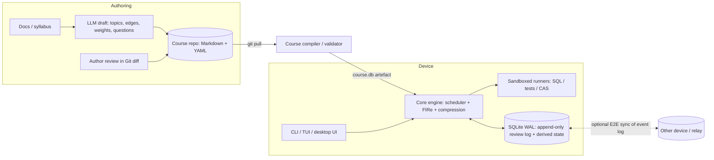

# Local-first адаптивная платформа на графах знаний: сводка исследования и дизайн

Основа: 5 отчётов в `docs/research/` (trane, math-academy, knowledge-spaces, remnote, mochi), прочитанных по первоисточникам. Метки: `[НЕ ПОДТВЕРЖДЕНО]` — источник не найден; `[ВЫВОД]` / `[ГИПОТЕЗА]` — наше умозаключение, не факт из источника.

---

## 0. Поправки к исходному тезису (проверено по источникам)

Исходный текст в нескольких местах расходится с тем, что реально есть в источниках. Дизайн ниже строится на проверенных фактах.

| Утверждение в тезисе | Что показала проверка | Источник |
|---|---|---|
| Формулы `repNum`/`memory` из Math Academy | **Подтверждены структурно** (дословно в посте Skycak). Числовые функции `decay`, `speed`, `rawDelta`, `interval(repNum)`, порог due **не опубликованы**; реализация проприетарна | `math-academy.md` §4.4 |
| Vanderbilt: QUERY + Kahn/Tarjan + транзитивная редукция + синтез диагностических пулов | В репо: циклы ищет **обычный DFS**; хранится **транзитивное замыкание** (Warshall), а не редукция; «QUERY» — LLM играет эксперта, а не оригинальная процедура; **пула нет**, вопросы и оценка ответов делаются LLM на лету (LLM-as-judge); нет SRS; `relation_type` игнорируется; 3 коммита, 0 тестов, нет примера графа; заявленные 15–25 вопросов — из README, единственный проверенный пример ALEKS: 24 вопроса на 57 147 состояний | `knowledge-spaces.md` §9 |
| Trane: «байесовские оценки успешности» | Скорер — `PowerLawScorer`, эвристика «inspired by FSRS», **stateless** (пересчёт по истории проб), параметры не обучаются. Верификация — только самооценка. В документации лицензия указана и как AGPL, и как GPLv3 | `trane.md` §9 |
| Obsidian/FSRS-плагины не используют граф | Не перепроверялось (вне списка источников) | — |
| RemNote — «модифицированный FSRS» | По умолчанию **Anki SM-2**; FSRS v6 встроен, помечен **beta**. Формальных prerequisites нет | `remnote.md` §9 |
| Mochi | Нет prerequisites вообще; бинарная оценка; sync только Pro, без E2E | `mochi.md` §10 |

**Вывод:** готового open-source референса «граф + FIRe + детерминированная проверка + local-first» не существует. Ближайший — Trane (граф, encompassing, local-first, но только самооценка и нет sync). Vanderbilt — образец **схемы и аудита LLM-выводов**, не образец валидатора.

---

## 1. Сравнение источников

| Аспект | Trane | Math Academy | Vanderbilt KS | RemNote | Mochi |
|---|---|---|---|---|---|
| Хранение | Файлы JSON/MD + `.trane` SQLite | Облако, закрыто | JSON в репо (контент+state вместе) | Проприетарное облако + офлайн-кэш | Локальная БД, ZIP `.mochi` (EDN/JSON) |
| Граф | DAG: dependency / encompassed(вес) / superseded | Prerequisite DAG + отдельный encompassing-граф с весами | Surmise relation, рёбра с confidence/rationale/source | Дерево + симметричные references; **нет prereq** | Wiki-ссылки; **нет prereq** |
| Планировщик | Mastery windows + relearn pile, FIRe-подобное распространение наград | HSRS + FIRe + Repetition Compression | Нет (только BLIM-диагностика) | SM-2 / FSRS v6 (beta), 5 приоритетов, exam scheduler | Проприетарный / опц. FSRS, бинарная оценка |
| Верификация | Самооценка | Детерминированные генераторы/банк вопросов | LLM-as-judge | Самооценка (+ AI-grading) | Самооценка / string-match |
| Sync | Нет; SQLite в Git = конфликты | Серверное состояние | Нет; конфликт параллельной записи JSON | Облачный, merge не документирован | Pro-only, не документирован, не E2E |
| Git-дружелюбие | Контент — да | Нет | Да (JSON) | Нет | Нет |
| Лицензия/цена | AGPL/GPLv3 (неоднозначно) | $49/мес на главной, $499/год в книге; `/pricing` 404 | MIT | Freemium, ключевое за paywall | Free / Pro $5 |
| Зрелость | Один мейнтейнер, контент замер с 2023 | Продукт, «Beta» годами | 3 коммита, 28★ | Продукт | Продукт |

---

## 2. Что доказано полезным (переносим в дизайн)

1. **Два разных графа** (Math Academy, Trane): `requires` (что можно учить) и `encompasses` (вес 0..1: сколько простого практикуется внутри сложного). Trane даёт дешёвый default: `encompassed = dependencies`, вес 1.0, явный `0.0` для отключения.
2. **FIRe как слой над FSRS**, не замена: FSRS-состояние (stability/difficulty) на тему + fractional credit вниз по `encompasses` + penalty вверх. Структура формул опубликована; **калибровку придётся создавать и валидировать самим**.
3. **Repetition Compression** как задача выбора (покрыть due-темы минимумом задач) — жадный set-cover по весам encompassing [ВЫВОД]. Прямой ответ на «цунами повторений».
4. **Точечная ремедиация** через `key_prerequisites` на уровне knowledge point, а не темы (Math Academy).
5. **Мягкий gate** (Trane): `min_score` + `min_avg_trials` + `dead_end`-обход вместо бинарного «освоено» → меньше remediation burnout. Плюс `Need-to-Learn` очередь (RemNote) и «остановить урок при провале, вернуться позже с другими вопросами» (Math Academy).
6. **Stateless-скоринг по журналу проб** (Trane) → журнал review append-only решает и тестирование, и sync (см. §5) [ВЫВОД].
7. **Схема узла и рёбер с provenance** (Vanderbilt): Bloom × Webb DOK, `confidence`, `rationale`, `source`, порог `<0.4` не включать / `<0.6` на ревью; протокол слияния expert vs data-derived.
8. **Inline-разметка карточек** (RemNote: `Q >> A`, `Term :: def`, `{{cloze}}`) + breadcrumb-контекст из иерархии заголовков — низкое трение авторинга.
9. **Приоритеты/режимы** (RemNote): Exam / Studying / Maintaining / Paused (часы забывания идут), exam scheduler как режим «дедлайн до целевого узла».
10. **Fringes** (KST): outer fringe = «готов учить», inner = «куда откатываться» — считать **напрямую по DAG**, без перечисления $2^n$ состояний.
11. **Диагностика на сжатом графе** (Math Academy: ~20–60 вопросов вместо 500+; вес ответа снижается при медленном ответе) — детерминированно, без LLM.

## 3. Чего избегать

| Антипаттерн | Где встретился | Наша альтернатива |
|---|---|---|
| Только самооценка как источник истины | Trane, RemNote, Mochi | Исполняемые проверки — основной источник; самооценка только для процедурных навыков |
| LLM-as-judge для scheduling-сигнала | Vanderbilt | LLM только на этапе авторинга; в петле обучения — детерминированные раннеры |
| Хранить транзитивное замыкание в исходниках | Vanderbilt | Хранить минимальные рёбра (reduction); замыкание считать при загрузке |
| Контент + student state в одном файле | Vanderbilt | Контент — Git; state — SQLite |
| SQLite/прогресс в Git | Trane | Журнал событий + merge вне Git |
| Ручная расстановка всех encompassing-весов одним экспертом (~250 ч на 1500 тем у MA) | Math Academy | LLM предлагает → валидатор проверяет → калибровка по данным `[ГИПОТЕЗА]` |
| Закрытый sync без экспорта, без E2E, lock-in | RemNote, Mochi | Открытый формат, экспорт всей истории, E2E по умолчанию |
| Три манифеста на юнит, serde-tagged enum | Trane | Один Markdown-файл на тему, YAML frontmatter, явные ID |
| Обещание «4×» и универсальности | Math Academy (сам Skycak признаёт отсутствие рецензируемых исследований) | Измерять долю encompassing-рёбер по домену до включения FIRe |
| XP-геймификация как ядро | Math Academy | Опция; честный сигнал обеспечивается механикой (тайм-квизы, разные вопросы при retry) |
| Неоднозначная лицензия, один мейнтейнер | Trane | Выбрать лицензию до первого коммита; см. §9 |

---

## 4. Requirements

**Функциональные (ядро):**
- F1. Курс = Markdown-репозиторий: темы с prerequisites, encompassing-весами, вопросами и исполняемыми проверками.
- F2. Компилятор курса: валидация → бинарный/SQLite-артефакт.
- F3. Диагностика (вход-тест) на сжатом графе → начальное состояние.
- F4. Дневной план: новые темы на knowledge frontier + due-повторения + repetition compression + interleaving.
- F5. Верификация ответа локальным раннером (SQL / тесты / CAS).
- F6. Точечная ремедиация по `key_prerequisites`.
- F7. Мульти-устройство без облачного сервера (sync вне Git).

> **Реализация F1–F7 в engine-ts (2026-09-29):** трассировка «F → FR → API → веха → приёмка» — `engine-ts/design/engine-ts.md` §1.1; решения и числа спайков — §6a и `engine-ts/research/report-{compiler,diagnostic,fire-plan,sql-runner,journal-sync}.md`. Итог спайков: F1, F2, F5, F7 реализуемы и проверены на прототипах; F3 и F4 проверены только на синтетических (круговых) учениках; F6 спайка не имеет. Артефакт F2 — JSON (`.engine/compiled.json`), не SQLite и не бинарный.

**Нефункциональные:**
- Работа полностью офлайн; sync опционален.
- Приватность: данные учащегося не покидают устройство без явного действия.
- Воспроизводимость: то же состояние + тот же журнал → то же расписание (нужно для тестов).
- Открытые форматы, экспорт полной истории.

**Вне области (v1):** универсальные дисциплины без детерминированной проверки (гуманитарные, «проектирование систем»), геймификация/лиги, веб-SaaS, обучение параметров FSRS на глобальной популяции, LLM-судья.

**Предположения:** одиночный пользователь на устройство; курсы 300–3000 тем [ГИПОТЕЗА, ориентир: MA — порядка 1500 тем в математике; в отчёте по MA ~250 ч ручной работы на веса].

## 5. Оценка масштаба (все числа — допущения, единицы указаны)

| Величина | Допущение | Результат | Что следует |
|---|---|---|---|
| Тем в курсе | 300–3000 | рёбер prereq ≈ 2–4 на тему → до ~12 000 | Граф целиком в памяти; вся топология-логика тривиальна по CPU |
| Review-событий | 100–300/день/пользователь | 3.6·10⁴–1.1·10⁵/год | Порядка единиц–десятков МБ/год при ~100 Б/событие |
| Пересчёт FIRe-распространения | глубина DAG ≤ ~20, вес отсекается ниже порога | O(рёбер) на событие | Достаточно инкрементально; полный replay журнала за год — миллисекунды–секунды `[ГИПОТЕЗА, замерить]` |
| KST-состояния | $2^n$ теоретически; лимит Vanderbilt 10 000 при доменах ALEKS ~57 000 | — | **Не** перечислять пространство состояний; fringes и байесовский апдейт по темам, а не по состояниям |
| Content-репо | 1 файл/тема, ≤ ~10 КБ | до ~30 МБ на курс | Git справляется; конфликты только в контенте |

Узкое место — **не вычисления, а авторинг** (см. §8 и `math-academy.md` §9).

---

## 6. Архитектура высокого уровня



Компоненты и обоснование:

| Компонент | Зачем (требование) |
|---|---|
| Course repo (Markdown + frontmatter) | F1, Git-дружелюбие; диффы читаемы человеком |
| Compiler/validator | Убирает главный класс LLM-ошибок (циклы, избыточность, пропуски проверок) до попадания к учащемуся |
| Core engine (Rust, по образцу Trane) | F4; воспроизводимость; скорость; стек Trane/fsrs-rs — переиспользуем код `[ВЫВОД: решение по лицензии — §9]` |
| Runners | F5; убирает шум LLM-судьи из входа FSRS/FIRe |
| SQLite WAL + журнал | F7; транзакционность при частых записях |
| Sync (опционально) | F7; вне Git |

## 7. Формат данных

### 7.1 Тема (один файл на тему) — эскиз, `[ВЫВОД]` объединяет схемы Trane, Vanderbilt, Math Academy

```markdown
---
id: sql.window-functions.rank
title: RANK() и DENSE_RANK()
bloom: apply
dok: 2
requires: [sql.select.order-by, sql.window-functions.over]
encompasses:
  - {id: sql.select.order-by, weight: 0.8}
edges_meta:
  sql.window-functions.over: {confidence: 0.9, source: expert-llm, review: approved}
knowledge_points:
  - id: partition-vs-order
    key_prereqs: [sql.window-functions.over]
checks:
  - {type: sql, fixture: fixtures/emp.sql, expected: checks/rank-1.csv}
---
Текст урока…

## Card
Чем RANK отличается от DENSE_RANK? >> …
```

Правила: явные стабильные ID (в RemNote карточка неявно производна от bullet — ломает историю при правках); `requires` хранится **без** транзитивных рёбер; `encompasses` по умолчанию = `requires` с весом 1.0 (как в Trane); `related` (симметричные, как references в RemNote) **не влияют** на расписание.

### 7.2 Learner state (SQLite)

- `review_event(event_id ULID/UUIDv7, device_id, topic_id, kp_id, ts, grade, latency_ms, source: run|self, course_hash)` — **append-only**.
- `topic_state(topic_id, stability, difficulty, memory, rep_num, speed, due)` — **производное**, перестраивается replay'ем журнала.
- Merge между устройствами = объединение множеств событий по `event_id` + пересчёт состояния. Конфликтов записи нет по построению; CRDT не нужен, т.к. журнал — G-Set `[ВЫВОД]`. Риск: порядок событий для `speed`/`decay` → упорядочивать по `(ts, device_id, event_id)` и принять допуск на рассинхрон часов (см. §10).

---

## 8. Ключевые решения и компромиссы

| Решение | Решает | Ухудшает | Пересмотреть, когда |
|---|---|---|---|
| Граф `requires` + отдельный `encompasses` с весами | Точная ремедиация и снижение объёма повторений | Двойной труд авторинга, риск неверных весов | Доля encompassing-рёбер в домене мала → FIRe даёт мало (проверить до внедрения) |
| FSRS + FIRe-слой, а не собственный планировщик с нуля | Проверенная модель памяти | Калибровка FIRe-функций — наша ответственность, у MA не опубликована | Есть данные (≥ порога повторов на оптимизацию) → оптимизировать `speed/decay` |
| Детерминированные раннеры как основа mastery | Чистый сигнал для FSRS | Ограничивает домены (SQL, код, формальная логика, CAS-математика) | Появится надёжный метод оценки открытого ответа с измеренной точностью |
| Append-only журнал + производное состояние | Sync без конфликтов, тестируемость | Размер журнала растёт, пересчёт при смене параметров | Replay > секунд → снапшоты состояния |
| Контент в Git, state в SQLite | Разделение медленно/быстро меняющегося | Два источника, нужна привязка `course_hash` | Курс переименовывает темы → нужна миграция ID (`superseded`, как в Trane) |
| LLM только в авторинге + локальный валидатор | Убирает галлюцинации рёбер из рантайма | Человеческий ревью остаётся узким местом | Метрики качества (pass rate по KP) подтвердят автономность |
| Fringes напрямую по DAG | Нет $2^n$ | Теряем вероятностную диагностику BLIM | Нужна точная диагностика с шумом → BLIM per-topic как опция |
| Мягкий gate + `dead_end` + Need-to-Learn | Меньше выгорания | Слабее гарантия mastery | Метрики показывают пробелы у «прошедших» |

**Точка слома дизайна:** если домен не имеет плотных `encompasses` или детерминированной проверки, ценность падает до «Anki с зависимостями» — поэтому v1 ограничен доменами с проверкой.

## 9. Стратегия и рынок (из тезиса + подтверждённое отчётами)

- **Аудитории:** инженеры/DevOps/Data (естественный fit: CLI, Git, тесты как проверка); STEM-студенты; PKM-пользователи (Obsidian/Logseq). Численность и готовность платить — `[НЕ ПОДТВЕРЖДЕНО]` в источниках.
- **Ценовые ориентиры:** Mochi Pro $5/мес; Math Academy $49/мес (главная) — вилка; данные о платящей аудитории open-source-альтернатив отсутствуют.
- **Пробелы рынка (подтверждены отчётами):** ни один инструмент не сочетает prerequisites + encompassing-повторения + исполняемую проверку + local-first + открытый формат.
- **Риски:** authoring friction; качество open-репо (нужны метрики по вопросам/KP и статус ревью рёбер в Git); ремедиационное выгорание; одиночный мейнтейнер (урок Trane).
- **Лицензия — блокирующий вопрос до выбора стека:** Trane заявлен и как AGPL-3.0, и как GPLv3 в документации; уточнить у мейнтейнера/файла LICENSE перед форком или встраиванием ядра. Альтернатива — писать ядро с нуля, заимствуя *идеи* (не код).

## 10. Отказы и деградация

| Сбой | Поведение |
|---|---|
| Раннер недоступен (нет Docker/Wasm) | Тема помечается «нужна самооценка»; вес такого события снижается `[ВЫВОД]`, чтобы не загрязнять `speed` |
| Курс обновился (граф изменён) | `course_hash` в событиях; топологические изменения → ре-валидация и пересчёт `topic_state`; удалённые темы — `superseded` |
| Повреждение SQLite | Восстановление replay'ем журнала из бэкапа/пира; журнал экспортируется как JSONL |
| Часы устройств расходятся | Порядок событий `(ts, device_id, event_id)`; клэмпинг «будущих» ts; риск искажения `decay`/`interval` — ограничить ретро-влияние |
| Огромный бэклог после перерыва | Режим Paused/re-diagnosis (не ручное редактирование профиля), Need-to-Learn очередь, лимит новых в день |
| LLM-черновик курса содержит цикл / избыточные рёбра | Компилятор блокирует сборку и печатает компоненту сильной связности (Tarjan SCC); избыточные рёбра удаляются reduction |
| Циклическая/битая `encompasses` | Проверка весов ∈ [0,1], ссылки существуют; non-ancestor — только с явным флагом |

## 11. Эволюция

1. **MVP:** один домен с детерминированной проверкой (SQL), CLI, валидатор, FSRS без FIRe, журнал в SQLite. Метрика успеха: время авторинга темы, доля пройденных проверок.
2. **+FIRe и compression:** включать только если доля encompassing-рёбер измерена и достаточна.
3. **+Sync и диагностика.**
4. **+Второй домен** (код с тестами), затем CAS-математика.
5. **Метрики качества контента** (pass rate/время по вопросу и KP) → автоматические сигналы ревьюерам; замыкание петли «данные → пересмотр рёбер» (IITA-подобно, идея Vanderbilt).

## 12. Открытые вопросы

1. Лицензия Trane и допустимость форка (§9).
2. Достаточна ли плотность `encompasses` в SQL/программировании для выигрыша FIRe? (в источниках только гипотеза Skycak о зависимости от плотности).
3. Какие числовые функции `decay`/`speed`/`rawDelta` взять? Не опубликованы — нужны эксперименты.
4. Как ранжировать события с ненадёжными часами при merge?
5. Формат раннера: Wasm vs контейнер (переносимость vs полнота окружения).
6. Целевая платформа UI (CLI/TUI vs desktop).
7. Кто ревьюит рёбра в публичных репозиториях и как отображается статус доверия.

## 13. Проверка (gate из шаблона)

- [x] Каждое решение в §8 имеет «Ухудшает» и условие пересмотра.
- [x] Оценки §5 — с единицами и допущениями; не измерены (`[ГИПОТЕЗА]`).
- [x] §10 — путь деградации для каждой критичной зависимости.
- [x] Компоненты §6 привязаны к F1–F7.
- [ ] Coverage sweep: **logs/SLO/observability** и **search** отложены (single-user local app; не требуются в v1). IDs — ULID/UUIDv7 (§7.2). Media — рядом с контентом (Git LFS не оценивался).

**Слабейшее измерение:** обоснованность FIRe-калибровки (нет опубликованных функций, нет данных). Поднимет: эксперимент на синтетическом/собственном журнале + измерение плотности encompassing на реальном курсе.

## Связанные отчёты
`docs/research/trane.md`, `math-academy.md`, `knowledge-spaces.md`, `remnote.md`, `mochi.md`.
