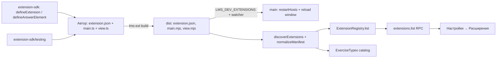

> Исторический документ. Не источник требований.

# Удобство автора расширений

Живой документ, пока `status` — `draft` или `active`: `Progress`, `Surprises & Discoveries`, `Decision Log` обновляются вместе с кодом. По завершении фичи переносится в `specs/archive/` и не меняется. Правила — скилл `spec-workflow`.

## Цель

Написать, собрать, проверить и запустить своё расширение (вид задания) может любой разработчик за минуты: минимальный манифест, короткий код на SDK без ручной проводки, сборка и проверка одной командой, запуск с перезагрузкой при правке файлов, понятное сообщение, если расширение не загрузилось. Установка (по адресу репозитория, из архива, каталог-маркетплейс) — следующая спека; здесь только то, что нужно автору до публикации.

Основание: `docs/research/extension-systems.md` (раздел «Пересмотр»): приоритет — простота разработки и установки, безопасность вторична; образец формы плагина — Obsidian, ядро (хост в отдельном процессе) остаётся.

## Не цели

- Установка, обновление, удаление расширений из приложения, каталог (маркетплейс), `versions.json`, `minAppVersion` — следующая спека.
- Права (`permissions`), ворота для сторонних расширений, изоляция интерфейса (iframe): безопасность сознательно вторична (см. ADR 0001).
- Новые точки вклада (темы, рендереры содержимого, политика оценки, команды, панели, импорт, экспорт).
- Замена custom element на компонент Vue или другой фреймворк в приложении: элемент ввода остаётся веб-стандартом, SDK лишь упрощает его написание.

## Требования

Наблюдаемое поведение, не реализация. У каждого требования есть проверка.

- R1. Минимальный манифест: `id`, `version`, `apiVersion`, `contributes.exerciseTypes[{ id, specSchema, answerSchema }]`. Не заданные `main`, `renderer`, `element` получают умолчания `./main.mjs`, `./view.mjs`, `<id без точек>-answer` (`lms.sql` → `lms-sql-answer`); `specSchema` и `answerSchema` можно писать объектом прямо в манифесте или путём к файлу. Проверка: `manifest.test.ts`, `discover.test.ts`; e2e-расширение `acme.echo` использует минимальный манифест.
- R2. `@lms/extension-sdk`: `defineExtension({ exerciseTypes })` возвращает готовый модуль расширения без ручного `registerExerciseType`; `defineAnswerElement(tag, mount)` определяет custom element с shadow DOM, свойствами `view/value/disabled/verdict`, событиями `lms-answer-change`/`lms-answer-submit` и `aria-label` без ручной проводки. `lms.sql` и `lms.choice` переписаны на SDK. Проверка: тесты SDK; `pnpm smoke` и e2e проходят без изменения сценариев.
- R3. `@lms/extension-sdk/testing`: автор запускает `project`/`grade`/`referenceAnswer` своего модуля и проверку `spec` и ответа по собственным схемам без приложения. Проверка: тесты `ext-choice` и `ext-sql` используют эти помощники.
- R4. `lms-ext build` собирает каталог расширения (`dist`) из TypeScript-исходников одной командой; `lms-ext validate <каталог>` печатает те же диагностики манифеста, что показывает приложение, и завершается кодом 1 при ошибке. Проверка: тесты `extension-tools`; `ext-sql` и `ext-choice` собираются через `lms-ext build`.
- R5. Настройки → «Расширения» показывает установленные расширения (id, версия, источник: поставка / пользовательское / разработка, виды заданий) и для каждого не загрузившегося — причину. Проверка: тест сервиса `extensions.list`, e2e: сломанное пользовательское расширение видно с причиной.
- R6. Режим разработчика: при `LMS_DEV_EXTENSIONS=<каталог>` этот каталог — корень `dev` с приоритетом выше пользовательского; правка файла в нём перезапускает хосты и перезагружает окно (с задержкой на серию изменений); ошибки видны в «Расширениях». Проверка: unit (наблюдатель, задержка, перезапуск без учёта как падения); e2e: правка `main.mjs` меняет вердикт без перезапуска приложения.
- R7. `create-extension <каталог>` создаёт работающий проект (TypeScript, SDK, сборка, тест, пример элемента); в CI сгенерированный проект собирается и проходит свой тест. Проверка: тест генератора во временном каталоге.
- R8. `docs/design/extensions.md` содержит раздел «Как написать расширение»: минимальный пример, SDK, сборка, тест, режим разработчика. Проверка: ревью; пример из раздела совпадает с сгенерированным шаблоном (тест R7 сверяет файлы).

## Решения

**Pattern Decisions (уровень ARCHITECTURAL, скилл `patterns-and-refactoring`).**

1. Сила: автору мешает церемония манифеста; варьируются детали, которые почти всегда одинаковы. Решение: convention over configuration — чистая функция `normalizeManifest` применяет умолчания после разбора; формат один. Отвергнуто: второй, «упрощённый» формат манифеста (два формата — две ветки поддержки).
2. Сила: код расширения повторяет проводку (регистрация, события, `aria-label`), а автор хочет описать только поведение. Решение: Facade поверх `ExtensionContext` в виде фабрик `defineExtension` и `defineAnswerElement` — замыкания и композиция, без наследования (`js-gof`, `js-conventions`). Отвергнуто: базовый класс `Plugin` как у Obsidian — наследование, сложнее тестировать, привязывает автора к иерархии.
3. Сила: авторы используют разные средства для UI (чистый DOM, lit, Vue, Svelte). Решение: Adapter — контракт «свойства и события элемента» превращается в `mount(root, api) → { update, destroy }`; фреймворк остаётся выбором автора. Отвергнуто: обязательный шаблонизатор.
4. Сила: сборка и проверка манифеста должны быть одинаковыми у авторов и у нас. Решение: одна библиотека `extension-tools` (вызывает `parseManifest` и `discoverExtensions` из `extension-host`) и её CLI; `ext-sql` и `ext-choice` используют её же — dogfooding. Отвергнуто: скрипты сборки в каждом пакете.
5. Сила: правка файла расширения должна быть видна сразу, а custom element с одним именем нельзя определить дважды. Решение: Command `restartHosts` (перезапуск хоста движка и хоста расширений без учёта как падения) + перезагрузка окна, запускаемая Observer'ом файловой системы с задержкой (debounce). Отвергнуто: горячая подмена модулей — кэш модулей Node и повторное определение тегов делают её хрупкой.
6. Сила: приложение должно объяснять, почему расширение не загрузилось, и это же понадобится установщику. Решение: порт `ExtensionRegistry` (чтение: `list()`), реализуемый по результату `discoverExtensions` (Hexagonal); сервис `extensions.list` в `LearningEngine`. Отвергнуто: чтение диагностик renderer'ом из логов.

**Порядок работ (по этапам, каждый заканчивается зелёной проверкой и коммитом):** (1) манифест: умолчания и встроенные схемы; (2) SDK и тестовые помощники; (3) `extension-tools` и перевод `ext-sql`/`ext-choice` на SDK и `lms-ext build`; (4) `extensions.list` и раздел «Расширения»; (5) режим разработчика; (6) шаблон `create-extension` и документация; (7) закрытие.

Пакеты: `@lms/extension-sdk`, `@lms/extension-tools`, `@lms/create-extension` (новые). Затронуты контракт `@lms/engine-contract` (сервис `extensions`, DTO) и схема RPC; схема БД не меняется.

## Progress

- [x] 2026-09-30 этап 1: манифест — умолчания, встроенные схемы
- [x] 2026-09-30 этап 2: `@lms/extension-sdk` (`defineExtension`, `defineAnswerElement`, `testing`)
- [x] 2026-09-30 этап 3: `@lms/extension-tools` (`lms-ext build`, `validate`); `ext-sql` и `ext-choice` на SDK и инструментах
- [x] 2026-09-30 этап 4: `extensions.list` (контракт v3, RPC, движок) и раздел «Расширения» в настройках
- [x] 2026-09-30 этап 5: режим разработчика (`LMS_DEV_EXTENSIONS`, наблюдатель, перезапуск)
- [x] 2026-09-30 этап 6: `create-extension` и раздел «Как написать расширение»
- [x] 2026-09-30 этап 7: закрытие — документация, ADR 0002, архив

## Surprises & Discoveries

- Сборка расширений: результат — `dist-ext/<id>/`, а не плоский `dist-ext/`: корень вывода сразу годится как корень обнаружения и как значение `LMS_DEV_EXTENSIONS`.
- Элемент ввода после сборки на SDK применяет `value` только когда изменилось само свойство: приложение не возвращает введённый ответ элементу, иначе смена `disabled` стирала бы выбор.
- e2e-помощник `fillAnswer` оставлял отмеченными флажки после неверной попытки: если первым в сессии шло упражнение с множественным выбором, верный ответ дополнял неверный и тест падал примерно раз в пять запусков. Исправлено очисткой флажков перед вводом; 6 подряд зелёных прогонов.
- Генератор: пакеты `@lms/extension-sdk` и `@lms/extension-tools` не опубликованы, поэтому проект ставится с `--local <корень репозитория>` (`link:`); сквозной тест генератора подменяет зависимости симлинками на инструменты репозитория. Публикация пакетов — отдельная работа (скилл `npm-publish`).
- `tsc` в сгенерированном проекте требует `@types/node` (SDK/testing использует `Buffer`): добавлено в шаблон.
- Перезапуск хоста движка в режиме разработчика — `SIGKILL` (как `kill`), а не `shutdown`; журнал SQLite это переносит, но это стоит учесть при установке.

## Decision Log

- 2026-09-30. Первая спека после `extension-host` — удобство автора, а не установка. Причина: авторская лёгкость определяет, будут ли писать расширения; установка и каталог опираются на уже готовый формат каталога расширения.
- 2026-09-30. Формат манифеста один, умолчания применяются нормализацией. Причина: прозрачность для авторов и один путь кода.
- 2026-09-30. Каталог обнаружения для разработки — `dev`-корень с высшим приоритетом, значение — `LMS_DEV_EXTENSIONS`. Причина: простейший способ подключить результат `lms-ext build --watch` без настроек и без UI.
- 2026-09-30. Контракт поднят до версии 3 (новый сервис `extensions`). Причина: клиент со старым контрактом не должен принимать хост с новым сервисом молча.
- 2026-09-30. Безопасность не усиливается: сторонний код по-прежнему исполняется с правами пользователя, интерфейс — в общем контексте. Причина: решение владельца продукта (приоритет простоты разработки и установки).

## Outcomes

Сделано R1–R8. Автор расширения получает: минимальный манифест с умолчаниями и встроенными схемами; `@lms/extension-sdk` (`defineExtension`, `defineExerciseType`, `defineAnswerElement`, `testing`); `@lms/extension-tools` (`lms-ext build|validate`, `--watch`); раздел «Настройки → Расширения» с причинами, по которым расширение не загрузилось (`extensions.list`, контракт v3); режим разработчика (`LMS_DEV_EXTENSIONS`, перезапуск хостов и перезагрузка окна); генератор проекта (`create-lms-extension`) и руководство в `docs/design/extensions.md`. `lms.sql` и `lms.choice` переведены на SDK и собираются тем же `lms-ext build`.

Проверено: `pnpm typecheck`, `pnpm lint`, `pnpm test` (178 файлов, 3107 тестов), `pnpm check:tests` (60/60), `pnpm smoke` и `pnpm smoke:packaged` (basic, sql, choice, renderer, crash), `pnpm -F @lms/desktop e2e` (15 сценариев: расширения, настройки «Расширения», режим разработчика), сквозной тест генератора (проект собирается, валидируется и проходит свои тесты).

Отличия от плана: результат сборки лежит в `dist-ext/<id>/` (корень вывода годится как корень обнаружения и как `LMS_DEV_EXTENSIONS`); у `overridden`-записи `extensions.list` пустой список видов; диагностика несовпадения имени каталога и id называет каталог.

Осталось (новые спеки): установка и обновление расширений (по адресу репозитория, из архива, `minAppVersion`/`versions.json`, каталог), права и изоляция для сторонних расширений (см. ADR 0002), точки вклада «темы», «рендереры содержимого», «политика оценки», команды и панели, публикация `@lms/extension-sdk`/`@lms/extension-tools`/`@lms/create-extension`.
