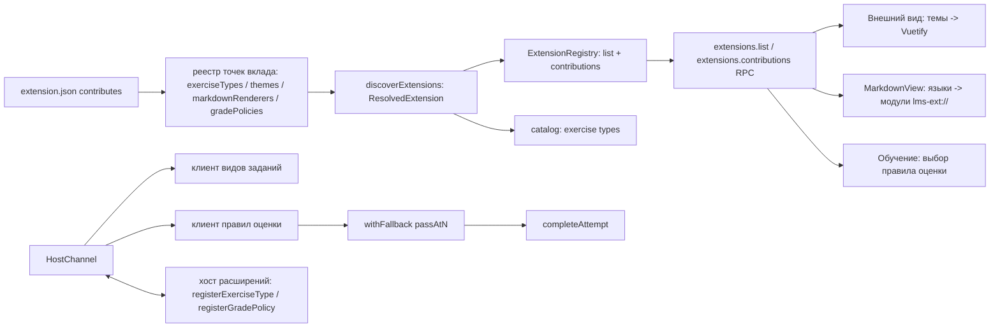

# Точки вклада расширений: темы, рендереры содержимого, политика оценки

Живой документ, пока `status` — `draft` или `active`: `Progress`, `Surprises & Discoveries`, `Decision Log` обновляются вместе с кодом. По завершении фичи переносится в `specs/archive/` и не меняется. Правила — скилл `spec-workflow`.

## Цель

Расширение умеет не только добавлять вид задания. Оно может добавить **тему оформления** (только данные, без кода), **рендерер содержимого** (например, формулы ` ```math ` в материалах и заданиях; диаграммы — тот же механизм) и **правило оценки** (как вердикты превращаются в оценку 1–5). Для автора это ещё три ключа `contributes` и по одной функции на SDK; для пользователя — новые пункты в «Настройки → Внешний вид» и «Настройки → Обучение».

Основание: `docs/research/extension-systems.md`, ADR 0001 и 0002 (простота автора важнее изоляции).

## Не цели

- Права и изоляция сторонних расширений: следующая спека (`extension-isolation`), здесь всё исполняется с теми же правами, что сейчас.
- Команды, меню, панели и страницы; импорт и экспорт; влияние на планировщик и модель памяти.
- Установка и обновление расширений.
- Горячая подмена вкладов без перезагрузки окна (в режиме разработчика окно уже перезагружается).
- Редактор тем в интерфейсе.
- Выставление оценки FSRS расширением напрямую: расширение получает вердикты и возвращает оценку 1–5 или `null`, запись в журнал делает ядро.

## Требования

Наблюдаемое поведение, не реализация. У каждого требования есть проверка.

- R1. `contributes` принимает любые из ключей `exerciseTypes`, `themes`, `markdownRenderers`, `gradePolicies` (хотя бы один). Код (`main`) нужен только расширению с `exerciseTypes` или `gradePolicies`; расширение только с темами загружается без единого файла кода. Ключи описываются реестром точек вклада: новая точка — один модуль. Проверка: тесты манифеста и обнаружения (расширение из одного `extension.json`; неизвестный ключ отклоняется).
- R2. `extensions.list` возвращает по каждому расширению вклады по точкам (`contributes: { exerciseTypes, themes, markdownRenderers, gradePolicies }` — списки id); `extensions.contributions()` отдаёт данные для окна: темы с цветами, рендереры с адресом модуля, правила оценки (включая встроенное `passAtN`). «Настройки → Расширения» показывает вклады. Контракт версии 4. Проверка: тесты сервиса и RPC, e2e экрана «Расширения».
- R3. Тема: расширение с `themes: [{ id, label, dark, colors }]` добавляет плитку в «Настройки → Внешний вид»; выбор применяется сразу и сохраняется в `engine.db`, после перезапуска тема та же; если расширение пропало — интерфейс открывается в теме «Системная». Цвета проверяются по списку допустимых ключей и формату; плохая тема отбрасывается с причиной в «Расширениях». Проверка: unit (проверка темы, откат на системную), e2e (выбор, перезапуск, удаление расширения).
- R4. Рендерер содержимого: блок ` ```<язык> ` с языком, объявленным расширением, выводится его модулем в материале урока, формулировке и ответе; остальные блоки — как раньше; сырой HTML по-прежнему не допускается; ошибка рендерера показывает исходный текст блока и не ломает страницу. Расширение по умолчанию `lms.math` рисует формулы (` ```math `). Проверка: unit (замена блоков, ошибка рендерера), e2e (формула в упражнении, неизвестный язык остаётся кодом).
- R5. Правило оценки: расширение регистрирует `gradePolicies: { id, label }` и функцию `({ verdicts, gaveUp }) → 1..5 | null`; «Настройки → Обучение» даёт выбор правила (по умолчанию `passAtN`), выбор хранится в `engine.db`; `completeAttempt` использует выбранное правило. Сбой правила (хост недоступен, дедлайн, исключение, результат не 1–5 и не `null`, пропавшее расширение) не блокирует запись попытки: используется `passAtN` и в лог пишется предупреждение. Проверка: unit движка (выбор, откат при каждом виде сбоя), тесты хоста, e2e (выбор правила меняет оценку в журнале).
- R6. SDK и документация: `defineExtension({ gradePolicies })`, `defineMarkdownRenderer`, `loadGradePolicy` в `@lms/extension-sdk/testing`; раздел «Точки вклада» в `docs/design/extensions.md`; в генераторе `create-lms-extension` без изменений. Проверка: тесты SDK; пример темы, рендерера и правила оценки из документации собирается и проходит `lms-ext validate`.

## Решения

**Pattern Decisions (уровень ARCHITECTURAL, скилл `patterns-and-refactoring`).**

1. Сила: точки вклада будут появляться и дальше (команды, импорт…), каждая со своей схемой, разбором и требованием кода; ядро манифеста не должно меняться. Решение: реестр точек вклада — Strategy через lookup по ключу: модуль точки экспортирует `{ key, schema, needsMain, resolve }`, манифест и обнаружение обходят реестр. Отвергнуто: `switch` по ключам в `manifest.ts` — каждая точка правила в трёх местах.
2. Сила: два независимых клиента (виды заданий и правила оценки) ходят в один хост расширений с дедлайнами и обработкой падений. Решение: общий канал `HostChannel` (Facade над endpoint: ожидание подключения, ожидающие запросы, дедлайн, закрытие), два тонких клиента поверх него; один порт от main, одна логика отказов. Отвергнуто: второй порт и второй клиент копированием — две копии дедлайнов и очередей.
3. Сила: правило оценки не должно блокировать запись учебной попытки при любом сбое расширения. Решение: композиция `withFallback(remotePolicy, passAtN)`: сбой → встроенное правило + предупреждение (Decorator как обычная функция). Отвергнуто: пробрасывать ошибку в окно — ученик потеряет попытку из-за чужого кода.
4. Сила: окну нужны данные вкладов (темы, рендереры, правила) до монтирования. Решение: один запрос-модель `extensions.contributions()` (CQRS-запрос, только чтение), перезагрузка окна обновляет данные. Отвергнуто: событийная подписка — горячая подмена в цели не входит.
5. Сила: содержимое рендерится строкой (`markdown-it`, `html: false`), а модуль рендерера загружается асинхронно и работает с DOM. Решение: правило fence `markdown-it` подставляет безопасный контейнер-заглушку с `data-language` и исходным текстом (экранированным), после монтирования представление находит заглушки и вызывает модуль языка (Adapter между строковым и DOM-рендерингом). Отвергнуто: плагины `markdown-it` из расширений — код пришлось бы выполнять синхронно внутри `render()`.



**Порядок работ (по этапам):** (A) фундамент: реестр точек, манифест, обнаружение, DTO, `extensions.contributions`, экран «Расширения»; затем параллельно (B) темы, (C) рендереры содержимого и `lms.math`, (D) правила оценки; (E) документация, SDK-примеры и закрытие.

Пакеты: новый `@lms/ext-math` (расширение по умолчанию `lms.math`, MathJax → SVG: CSS и шрифты не нужны). Затронуты контракт `@lms/engine-contract` (v4: `contributes` в `ExtensionInfoDto`, `extensions.contributions`, `UiSettingsDto.theme` — строка, настройка правила оценки), схема RPC и хранилище настроек (`engine.db`, порт `SettingsStore`).

## Progress

- [ ] этап A: реестр точек вклада, манифест, обнаружение, DTO и `extensions.contributions`, экран «Расширения»
- [ ] этап B: темы расширений
- [ ] этап C: рендереры содержимого и `@lms/ext-math`
- [ ] этап D: правила оценки (`HostChannel`, порт, настройка, откат на `passAtN`)
- [ ] этап E: SDK, документация «Точки вклада», закрытие

## Surprises & Discoveries

Пусто, пока нет.

## Decision Log

- 2026-09-30. Точки вклада сначала (эта спека), права и изоляция — следующая. Причина: порядок, заданный владельцем продукта; изоляция станет проще, когда точки вклада уже определены и видно, какие вызовы разрешать.
- 2026-09-30. Формулы в `lms.math` рендерит MathJax (`mathjax-full` v3, вывод SVG, вход TeX), целиком внутри расширения, без CDN. Причина: SVG выглядит одинаково на macOS, Windows и Linux и не требует шрифтов и CSS (MathML Chromium зависит от установленных математических шрифтов, KaTeX-HTML требует CSS и шрифтов, которые протокол `lms-ext` не отдаёт); MathJax в браузере ещё и чистый TeX-парсер, тесты идут через `liteAdaptor` без DOM.
- 2026-09-30. `latex2js` / `@latex2js/vue` (Mathapedia) не берём в `lms.math`: они догружают MathJax с CDN (блокируется CSP `script-src 'self' lms-ext:` и не работает офлайн), тянут Vue внутрь рендерера, малоподдерживаемы (20–145 загрузок в неделю, лицензия «SEE LICENSE IN LICENSE»). Их единственное отличие — диаграммы PSTricks; это кандидат в отдельное стороннее расширение `lms.pstricks` поверх той же точки `markdownRenderers` (язык ` ```pstricks `), а не часть формул.
- 2026-09-30. Тема хранится строкой (`UiSettingsDto.theme`): `system`, `light`, `dark` или id темы расширения. Причина: расширение может пропасть, движок не проверяет существование темы при сохранении, окно откатывается на `system`.

## Outcomes

<Заполняется при закрытии.>
