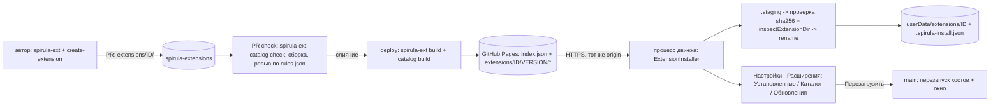

# Установка расширений и каталог

Живой документ, пока `status` — `draft` или `active`: `Progress`, `Surprises & Discoveries`, `Decision Log` обновляются вместе с кодом. По завершении фичи переносится в `specs/archive/` и не меняется. Правила — скилл `spec-workflow`.

## Цель

Пользователь открывает «Настройки → Расширения → Каталог», видит список проверенных расширений, читает описание и запрашиваемые разрешения, нажимает «Установить» и через несколько секунд получает работающее расширение. Приложение при запуске проверяет обновления и сообщает о них; обновить можно одним нажатием. Автор публикует расширение пул-реквестом в отдельный репозиторий каталога: проверки, сборка и публикация автоматические, ревью — человеческое.

Образцы: обзор community plugins и `versions.json` у Obsidian; отдельный репозиторий каталога с исходниками расширений и сборкой в CI у Vicinae (`vicinaehq/extensions`). Основание: `docs/research/extension-systems.md`, ADR 0002 и 0003.

## Не цели

- Свой сервер каталога, поиск на сервере, статистика скачиваний, оценки и комментарии.
- Подпись пакетов ключом автора и проверка издателя (цепочка доверия: ревью PR → сборка в CI → sha256 в индексе; подпись индекса — отдельный ADR при росте каталога).
- Автоматическая замена кода без участия пользователя (автообновление): только уведомление и установка по нажатию.
- Установка по произвольному URL или из архива вне каталога (для разработки остаются копирование каталога и `SPIRULA_DEV_EXTENSIONS`).
- Иконки расширений в каталоге (CSP `img-src 'self' data:`; вместо них значок по виду вклада).
- Платные расширения и лицензирование.
- Горячая подгрузка установленного без перезапуска хостов и перезагрузки окна.
- Точки вклада кроме существующих четырёх.

## Требования

Наблюдаемое поведение, не реализация. У каждого требования есть проверка.

- R1. Метаданные и совместимость. `extension.json` принимает необязательные `name` (человекочитаемое название), `description`, `author` (GitHub-логин), `platforms` (подмножество `darwin`, `linux`, `win32`; нет ключа — любая) и `minAppVersion` (semver `x.y.z`); проверка `spirula-ext catalog check` (R9) требует `name`, `description`, `author`; приложение знает свою версию (`EngineConfig.appVersion`; в несобранном режиме разработки не задана — проверка не выполняется). Расширение с `minAppVersion` новее приложения или с `platforms`, не включающим текущую, не загружается: состояние `invalid` с причиной `requires app >= x.y.z` / `not available on <platform>`. Проверка: тесты манифеста и обнаружения; `spirula-ext validate` печатает ту же ошибку.
- R2. Индекс каталога. Каталог — один JSON (`index.json`, `schemaVersion: 1`) с записями `{ id, name, description, author, source, platforms, contributes: { exerciseTypes, themes, markdownRenderers, gradePolicies } (id/языки), versions: [{ version, apiVersion, minAppVersion, permissions, publishedAt, baseUrl, files: [{ path, size, sha256 }] }] }` и списком отзыва `revoked: [{ id, versions: '<x.y.z', reason }]`. Индекс хранит у каждого расширения не более 5 последних версий (старые остаются в `gh-pages`, но в индекс не попадают), чтобы он не рос без предела. Индекс — надмножество `versions.json` Obsidian: по нему приложение выбирает новейшую совместимую версию (`apiVersion` равен поддерживаемой, `minAppVersion` не выше версии приложения). Схема описана один раз (`@spirula/extension-catalog`) и используется и приложением, и сборщиком. Проверка: тесты разбора (корректный, лишние ключи, плохой sha256, повторяющиеся версии) и выбора версии (последняя совместимая; нет совместимой — причина и ближайшая совместимая более старая).
- R3. Просмотр каталога. «Настройки → Расширения» получает вкладки «Установленные» и «Каталог». В каталоге: поиск по названию, id и описанию (на клиенте: Vicinae грузит до 500 записей целиком и фильтрует так же); расширения, недоступные на текущей платформе, скрыты; фильтр по виду вклада; карточка с названием, автором, описанием, версией, вкладами и разрешениями; для установленного — метка и версия; для несовместимого — причина и кнопка отключена. Индекс кэшируется (ETag/If-None-Match), при отсутствии сети показываются последний кэш и сообщение «Нет связи с каталогом»; установленные расширения работают всегда. Проверка: e2e с локальным сервером каталога (`SPIRULA_EXTENSION_CATALOG_URL`), тесты кэша и офлайн-режима.
- R4. Установка одним нажатием. Перед установкой диалог показывает название, версию, автора, вклады, `permissions` и фразу, что расширение будет работать в изоляции (ADR 0003); по «Установить» приложение скачивает файлы версии, проверяет размер и sha256 каждого файла, проверяет каталог как обычное расширение (`inspectExtensionDir`: id и версия равны записи индекса, разрешения и вклады совпадают с индексом) и ставит его в `<userData>/extensions/<id>` заменой каталога с откатом: прежний каталог переименовывается в `.trash/`, новый — на его место, при сбое второго шага прежний возвращается (у Vicinae `remove_all` и `rename` идут подряд без отката: сбой между ними оставляет пользователя без расширения). Любая ошибка оставляет прежнее состояние нетронутым. После успеха пользователь может применить изменение кнопкой «Перезагрузить»: перезапускаются хосты и окно. Лимиты: не более 50 файлов и 10 МБ на версию, допустимые расширения файлов — `json`, `js`, `mjs`, `md`, `txt`; пути без `..`, `\`, абсолютных и скрытых сегментов. Проверка: unit (каждый отказ: плохой sha256, размер, путь, чужой хост, чужой id, несовпадение манифеста, обрыв загрузки), e2e (установка, работа расширения после перезагрузки, откат при сбое).
- R5. Источники загрузки. Приложение ходит только на адрес каталога (`EngineConfig.extensionCatalogUrl`, по умолчанию официальный) и на адреса файлов с тем же origin; редиректы на другой origin отклоняются; таймаут запроса 15 с, общий потолок скачивания 10 МБ; запросы идут с `User-Agent: spirula/<версия приложения>`. Сеть — только из процесса движка, не из окна (CSP окна не меняется). Проверка: unit (чужой origin, редирект, таймаут).
- R6. Обновления. При запуске (не чаще раза в 24 часа, не блокируя запуск) приложение сравнивает установленные из каталога расширения с индексом. Экран «Расширения» показывает число доступных обновлений и кнопку «Обновить» у каждого и «Обновить все»; обновление идёт по тому же пути, что установка. Настройка «Проверять обновления расширений» хранится в `engine.db` (по умолчанию включена). Обновления не устанавливаются без нажатия. Проверка: тесты сервиса (интервал, выключенная настройка, несовместимое обновление не предлагается), e2e.
- R7. Удаление и источники. Установленные из каталога расширения хранят рядом `<id>/.spirula-install.json` (`{ catalogUrl, version, installedAt }`); вручную скопированные — нет и обновлений не получают. «Удалить» доступно для расширений с origin `user` (перемещает каталог в `.trash/`, очистка при следующем запуске); расширения из поставки и из режима разработчика удалить нельзя. Проверка: unit и e2e.
- R8. Отзыв. Если установленная версия попала под `revoked`, расширение получает состояние `disabled` с причиной из записи, в «Установленных» показывается предупреждение, включить его нельзя до обновления. Проверка: unit (диапазоны, отсутствие совпадения) и e2e.
- R9. Репозиторий каталога (`Tinkerbells/spirula-extensions`). Структура: `extensions/<id>/` — исходники проекта `spirula-ext`; `rules/rules.json` и `skills/extension-reviewer/SKILL.md` — правила ревью; CI (как у Vicinae: обнаружение изменённых расширений по путям `extensions/<id>/**`, матрица по расширениям, `fail-fast: false`): на PR — `spirula-ext catalog check` (манифест и обязательные `name`/`description`/`author`, id = имя каталога, версия больше опубликованной, `author` — существующий GitHub-пользователь, `package-lock`, запрет `postinstall`-скриптов, лимиты, обязательный `README.md`) и сборка; семантическое ревью по `rules.json` — отдельный необязательный шаг (разделение как у Vicinae: детерминированное проверяет CI, смысловое — ревьюер); на слияние в `main` — сборка изменённых расширений, добавление каталога версии в ветку `gh-pages` (коммитом; только это задание имеет `contents: write`) и пересборка `index.json` (`spirula-ext catalog build`). Pages отдаёт ветку `gh-pages`: история версий сохраняется, публикация инкрементальна. Установка зависимостей — с `--ignore-scripts` (у Vicinae `npm ci` выполняет скрипты пакетов, в том числе на публикации), на PR — без секретов и без прав записи. Проверка: тесты `spirula-ext catalog check|build` на фикстурном каталоге (в основном репозитории); в репозитории каталога — прогон workflow на первом расширении.
- R10. Документация: раздел «Установка и каталог» в `docs/design/extensions.md`, руководство «Опубликовать расширение» (путь автора: форк → `extensions/<id>` → PR), ADR 0004 (каталог как репозиторий с CI-сборкой, цепочка доверия и её пределы). Проверка: тест примеров в документации.

## Решения

**Что взято у Vicinae и Obsidian и почему.** Исходник расширения лежит в репозитории каталога, а не в релизе автора; артефакт собирает CI из проверенного кода. В отличие от Obsidian (релиз собирает сам автор, ревьюится только ссылка), публикуется ровно то, что было в PR; sha256 в индексе подтверждает, что приложение получило то, что собрал CI. Отличие от Vicinae: у нас нет собственного сервера — публикация это статические файлы на GitHub Pages, а не вызов API магазина.

**Pattern Decisions (уровень ARCHITECTURAL, скилл `patterns-and-refactoring`).**

1. Сила: разбор индекса, выбор версии и проверка совместимости нужны и приложению, и сборщику каталога, и нельзя допустить расхождения. Решение: пакет `@spirula/extension-catalog` без Node-зависимостей — схема zod, `resolveVersion`, `compareSemver`, `isRevoked`; остальные пакеты его импортируют. Отвергнуто: копия схемы в сборщике — две версии формата.
2. Сила: установка должна быть безопасной к сбоям (обрыв сети, закрытие приложения) и не оставлять полуустановленного. Решение: стейджинг + переименование (Memento-образный откат): скачивание в `<userData>/extensions/.staging/<id>-<rand>/`, проверка, затем `rename` прежнего каталога в `.trash/` и `rename` стейджинга в `<id>`; при сбое второго шага прежний возвращается. Отвергнуто: запись поверх существующего каталога — частично обновлённое расширение не загрузится.
3. Сила: сетевой код и файловая система должны быть заменяемы в тестах. Решение: Ports & Adapters: порт `ExtensionInstaller` в движке (`catalog()`, `install(id, version?)`, `uninstall(id)`, `checkUpdates()`), адаптер `createExtensionInstaller({ fetch, fs, clock, ... })` в `@spirula/extension-install`; `fetch` и файловые операции внедряются. Фейк в testkit. Отвергнуто: прямой `fetch` внутри сервиса движка — тесты зависели бы от сети.
4. Сила: у нас уже есть механизм «перезапустить хосты и перезагрузить окно» (режим разработчика). Решение: переиспользовать его как «применить изменения расширений»: одно сообщение main-процессу, окно вызывает его после успешной установки по кнопке. Отвергнуто: горячая подмена реестра в движке — вклады читаются при запуске (см. `extension-contributions`), цена подмены выше пользы.
5. Сила: индекс большой и может меняться часто, а запуск должен быть быстрым и работать офлайн. Решение: кэш индекса на диске (`<userData>/extensions/.catalog/index.json` + ETag); запуск проверки обновлений — фоновый, с интервалом в 24 часа (метка времени в `engine.db`); ошибки сети логируются и не показываются как сбой приложения. Отвергнуто: загрузка индекса на старте синхронно.
6. Сила: каталог растёт, а проверка новых правил должна добавляться без переписывания CI. Решение: правила ревью — данные (`rules.json`) + детерминированные проверки в `spirula-ext catalog check` (Strategy через lookup по идентификатору правила), семантическое ревью — отдельный необязательный шаг CI. Отвергнуто: правила в коде workflow.

**Формат публикации (Pages).**
```
<pages>/index.json
<pages>/extensions/<id>/<version>/extension.json
<pages>/extensions/<id>/<version>/main.mjs ...
```
Файлы версии — то, что выдаёт `spirula-ext build` (`dist-ext/<id>/`), плюс `README.md`. Индекс хранит `baseUrl` и `files[]` с sha256 каждого файла; приложение собирает URL как `baseUrl + path`. Выбор «набор файлов» вместо архива — решение владельца продукта (как релиз у Obsidian): не нужна библиотека распаковки, проверка — по каждому файлу.



**Порядок работ:** (A) `@spirula/extension-catalog` и совместимость (R1, R2); (B) установщик, сервис, контракт v7, применение изменений, отзыв (R4, R5, R7, R8); (C) интерфейс и обновления, e2e с локальным каталогом (R3, R6); (D) сборщик и проверки каталога в `extension-tools`, репозиторий каталога (R9); (E) документация, ADR 0004, закрытие (R10).

**Открытые вопросы (требуют решения владельца до этапа D).**
- Где публиковать `@spirula/extension-sdk` и `@spirula/extension-tools`: проекты авторов вне монорепозитория зависят от них, а сейчас они не опубликованы. Нужен npm-scope (`@spirula` может быть занят). Без публикации CI каталога придётся собирать их из подменённого checkout основного репозитория; это рабочий, но хрупкий обход.
- Имя и владелец репозитория каталога (по умолчанию `Tinkerbells/spirula-extensions`); создание публичного репозитория — внешнее действие, будет выполнено только после подтверждения.

**Разбор кода Vicinae (2026-10-01) и что из него взято.**
- Клиент (`services/extension-store/vicinae-store.cpp`, `services/extension-registry/extension-registry.cpp`): список и поиск через серверный API, `downloadUrl` + `checksum` в записи, скачивание zip, распаковка в `.staging-<id>` (`stripComponents = 1`), проверка `package.json`, `remove_all` + `rename`, затем сигнал «расширения изменились»; каталог расширений под `QFileSystemWatcher` с 100 мс дебаунсом, поэтому установленное подхватывается без перезапуска; каталоги с точкой в имени пропускаются; удаление делается только из приложения (чистит каталог расширения, его каталог поддержки и пространство `LocalStorage`); при совпадении имён побеждает каталог более высокого приоритета; записи для чужой платформы отфильтровываются.
- Каталог (`scripts/validate-extension.ts`, `deploy-extension.ts`, `.github/workflows/*`, `skills/extension-reviewer`): детектор изменённых расширений, матрица validate → build → deploy, проверка существования GitHub-пользователей из `author`/`contributors`, обязательный `package-lock.json`, имя в `package.json` равно имени каталога, артефакт — zip, загружаемый на API магазина; правила ревью — `rules.json` версии 3 (идентификатор, заголовок, серьёзность `blocking`/`warning`/`suggestion`, указания), рядом `SKILL.md` с порядком ревью и разделением: CI проверяет детерминированное, ревьюер — смысловое.
- Взято: каталог-репозиторий с исходниками и CI-сборкой; матрица по изменённым расширениям; `rules.json` + `SKILL.md` и разделение CI/ревью; проверка существования автора; каталоги с точкой в имени не считаются расширениями (у нас `.staging`, `.trash`); клиентский поиск по целому индексу; фильтр по платформе; `User-Agent` с версией приложения; метаданные `name`/`description`/`author` в манифесте.
- Не взято: серверный API, пагинация и счётчик скачиваний (у нас статические файлы Pages); zip (выбор владельца — набор файлов с sha256); горячая подгрузка при установке (вклады читаются при запуске, цена подмены реестра выше пользы; Vicinae может, потому что его реестр — один список манифестов, см. `Decision Log`); иконки по HTTP (CSP окна).
- Сделано иначе: откат при замене каталога; проверка sha256 каждого файла (их `checksum` лежит в записи, а проверка в показанном коде установки не видна — [INFERENCE] она может быть в другом месте); `--ignore-scripts` в CI; публикация инкрементальным коммитом в `gh-pages`, а не загрузкой на сервер.

## Progress

- [ ] этап A: `@spirula/extension-catalog`, `minAppVersion` и совместимость
- [ ] этап B: установщик, сервис и контракт v7, применение изменений, отзыв
- [ ] этап C: интерфейс каталога и обновлений, e2e с локальным каталогом
- [ ] этап D: `spirula-ext catalog`, репозиторий каталога
- [ ] этап E: документация, ADR 0004, закрытие

## Surprises & Discoveries

Пусто, пока нет.

## Decision Log

- 2026-10-01. Каталог читается целиком и фильтруется на клиенте: Vicinae при запросе `limit=500` делает то же; порог пересмотра — индекс больше ~1 МБ или 1000 расширений (тогда пагинация или сегментированный индекс).
- 2026-10-01. Установка не подгружается «на лету»: после установки — кнопка «Перезагрузить». Причина: наш движок строит каталог видов, схемы и реестр вкладов при запуске (изолированный процесс расширений держит активации), горячая пересборка потребует перестройки всех этих структур и окна; Vicinae может подхватывать на лету потому, что у него реестр — список манифестов. Вернуться к вопросу, если установка будет частой операцией.
- 2026-10-01. Публикация в ветку `gh-pages` коммитом (а не артефактом `actions/deploy-pages`): Pages-артефакт заменяет сайт целиком и потребовал бы пересобирать все версии из исходников, которых для старых версий уже нет в `main`.
- 2026-10-01. В манифест добавлены метаданные `name`/`description`/`author`/`platforms`: без них индекс не из чего строить (сейчас в `extension.json` только id, версия и вклады); для локальной разработки они необязательны, для публикации — обязательны (проверка `catalog check`).

- 2026-10-01. Каталог — JSON-индекс в GitHub (Pages), без сервера. Выбор владельца продукта; цена — нет поиска и статистики на сервере.
- 2026-10-01. Единица установки — набор файлов с sha256 на каждый файл (как релиз у Obsidian), не архив. Выбор владельца продукта.
- 2026-10-01. Доверие: ревью PR + sha256 в индексе, без подписи автора. Выбор владельца продукта. Усилено решением ниже.
- 2026-10-01. Обновления: проверка при запуске, уведомление, установка по нажатию; автообновления нет. Выбор владельца продукта.
- 2026-10-01. Исходники расширений живут в репозитории каталога, артефакты собирает CI (подход `vicinaehq/extensions`). Причина: публикуется ровно проверенный код, автору не нужно настраивать релизы; цена — репозиторий каталога растёт, и CI исполняет сборки чужого кода (поэтому `--ignore-scripts`, без секретов на PR).
- 2026-10-01. Индекс включает `apiVersion`, `minAppVersion` и `permissions` каждой версии (надмножество `versions.json`). Причина: приложение выбирает версию и показывает разрешения без скачивания.

## Outcomes

<Заполняется при закрытии.>
